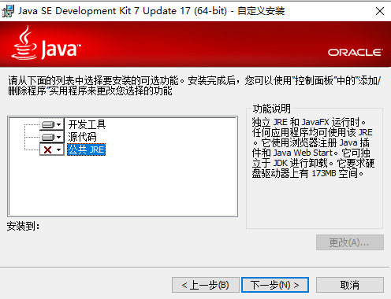
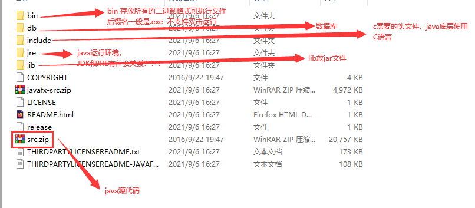
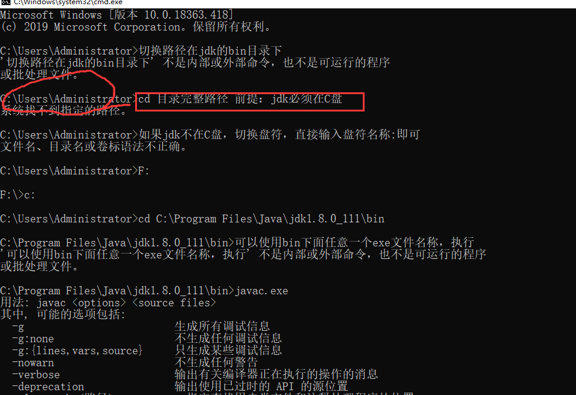
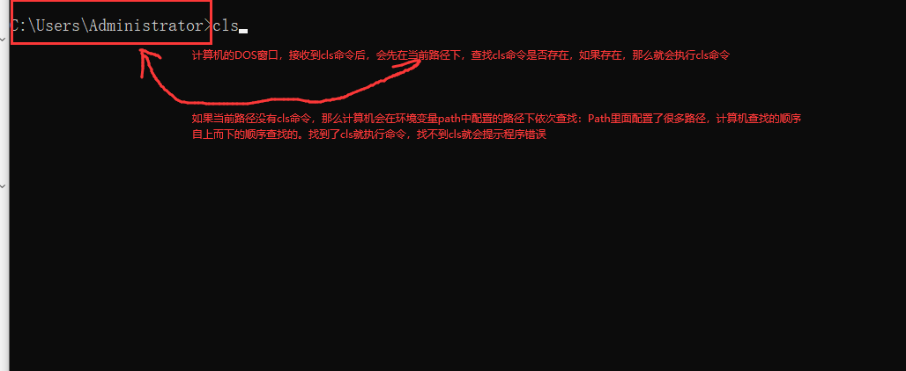
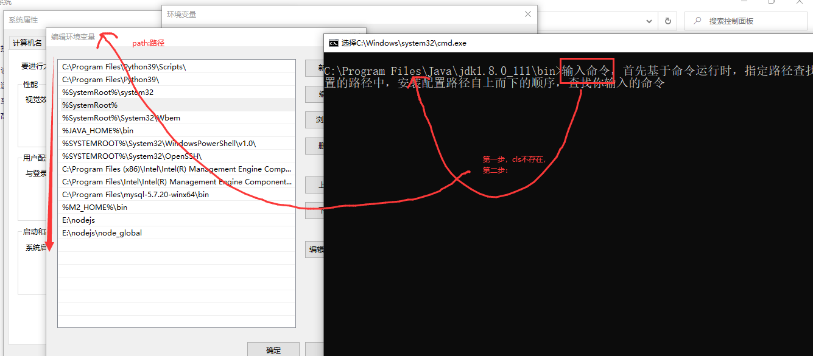
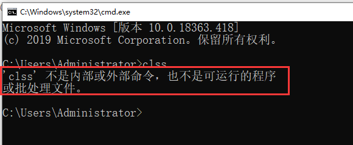
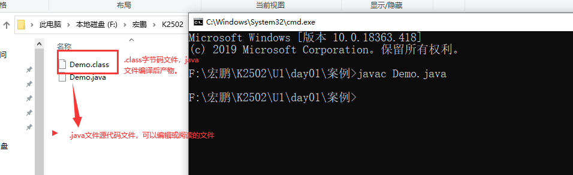
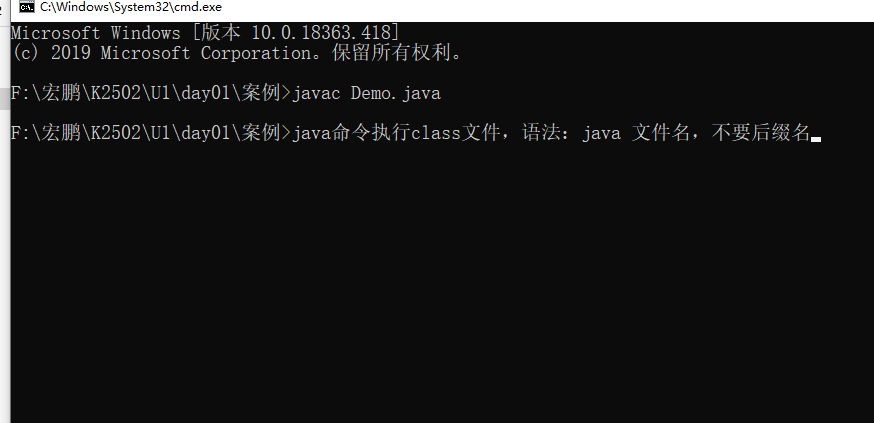
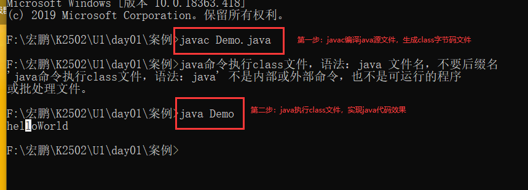

# 准备工作

1 晨测（晨考）  笔和本

2 作业安排：

# 课程目标

## 1 搭建java开发环境 =========== 掌握

## 2 记事本完成helloWorld的案例 ===== 掌握

## 3 IDEA使用步骤 === 掌握

## 4 java开发规则 === 理解

# 课程实施

## 1 搭建java的开发环境

### 1-1 java是什么，

  ```java
java是一门面向对象的高级编程语言。特点：write once， run anywhere 跨平台
   计算机安装系统：window  mac linux 
    
    编程语言：C VB C# PHP python....

java之父是谁？詹姆斯高斯林  SUN公司 java最开始时候Okay语言
    
    
    JAVA：爪哇  1995公布JDK1.0  SUN公司，被Oracle收购
    JDK有名版本：
    ideal 2021.1.3 2021.3.2 2021.8.9  2018 
    JDK1.2 JDK1.3 JDK1.4 
    JDK5.0(JDK1.5 重要的意义)
    JDK1.7  JDK1.8(授课环境) 企业环境+稳定性
    JDK1.10 JDK1.13
    找java相关的资源，WWW.SUN.COM 官网：www.oracle.com
    Oracle数据库 收购了java的语言，收购mysql数据库
  ```

### 1-2 能做什么

```java
JAVA主要应用场景：
    1.JAVASE：历史称呼J2SE。定义java最基础的语法、流程、编程思想。java基础
    
    2.JAVAME：J2ME 手持设备的一些项目。提供 窗口编程模式。不主流

    3.JAVAEE：J2EE，企业级开发。JSP SERVLET
    场景：管理系统  电商网站  游戏开发  
    
    
JDK
```

### 1-3 JDK  JRE JVM=======了解

```html
java语言高级语言：先编译、再执行，才能看到效果
编译需要借助专业的编译：JRE

JAVA代码使用很多java关键字、基于java提供的工具包，开发java程序的电脑：必须按照有支持java关键字的工具包：JDK (Java  Developement  Kits)
JDK包含了JRE（Java Runtime Environment）
、
思考：安装给其他用户使用，用户电脑是否需要安装JDK?? 只需要安装JRE即可

为什么需要安装JRE？如何实现不同的操作系统还能执行同一套java代码，原因：JRE核心的执行组件：JVM（Java Virtual Machine  java虚拟机）

JVM：实现了java的跨平台。


html语言：浏览器一边解析一边执行。环境比较简单
```

### 1-4 找资源（环境搭建需要的安装软件）

```html
下载JDK的网址：
https://www.oracle.com/java/technologies/javase/javase9-archive-downloads.html
```

### 1-5 JDK安装

```html
双击EXE，启动安装文件后下一步下一步安装即可。
提醒：因为JDK中已经包含了JRE，所以安装JDK时，可以不再安装公共的JRE。
注意：JDK不要安装 在含有中文的路径中
```




### 1-6 JDK安装后目录



### 1-7 测试java环境安装是否正确

```html
dos窗口输入java.exe -version 可以查看当前系统使用jdk的版本
```

#### 方案一：

```html
1.win+r启动运行窗口，输入cmd回车

2.dos窗口的执行命令的路径运行路径必须在JDK安装的盘符
如果jdk安装在D。。。  
2-1 输入d:回车，切换盘符
2-2 输入 cd d:/...../bin 进入jdk可执行文件所在的路径

3.测试jdk安装的情况   输入javac.exe -version
显示结果jdk的版本号
```



#### 方案二：

```html
配置java环境变量
简化方案一自己找盘符，自己进入bin安装目录麻烦事。

为什么配置了环境变量以后，就不用自己找bin目录？
见下图分析：
JAVA_HOME：便于切换不同jdk版本。
path:c:..\bin
叮嘱：必须配置JAVA_HOME,U2的tomcat读取JAVA_HOME
```





如果找不到对应的命令，会提示以下错误：



## 2 HelloWorld

```html
java严谨：
  1.单词区分大小写
```

### 2-1 java程序基本结构

```java
public class 文件名称{
    public static void main(String[] args){
        //程序代码,在dos窗口中输出HelloWorld
        System.out.println("HelloWorld");
    }
}
```

### 2-2 java程序执行流程

```html
1.javac.exe 文件名称，必须要带.java后缀

2.java.exe 文件名，不能带.class后缀
```

### 2-3 java程序开发步骤

```html
1.选择一个磁盘目录，创建后缀名是.java的文件
提示：文件名称不能是中文，不能是纯数字

2.使用记事本打开.java文件，将java代码结构输入，保存即可

3.javac.exe 先编译java源代码

4.java.exe 执行java程序


```







## 3 HelloWorld分析代码，理解java代码书写规范

### 3-1 注释

给代码添加解释或说明。以便于程序员之间互相交流。注释jvm是不执行。

```html
单行注释：
    //注释内容
适用场景：变量、常量定义语义说明单行注释文字一般不会太大

多行注释：
/* 注释内容
注释内容
注释内容
注释内容
*/
适用场景：方法逻辑陈述、一篇代码不想使用功能，可以使用多行注释

文本注释（也称为文档注释）：自动生成java代码的API手册  /** */
/**
* 注释内容
* 为了美观
*/
适用场景：类或者方法上面，功能作用的说明
```

### 3-2 HelloWorld代码

```java
/**
* 定义一个类，java是面向对象的语言，java程序必须用class代码的封装
Demo称为类名。一般和文件名称一样的。
特殊情况：没有public，class后面的类名可以不和文件名称一样
*/
public class Demo{
    /*
    jvm执行代码的入口方法
    */
	public static void main(String[] args){
        //System.out.println在DOS窗口上输出一句话：中文
		System.out.println("张三丰");
        System.out.println(23)
	}
    //其他方法

}
```

# 课程总结

1.java开发环境

2.理解JDK JRE JVM

3.掌握java基本代码书写结构，理解System.out.println()意思

4.环境变量的作用


# 课程预习

数据类型 变量  常量

运算符

Scanner使用


