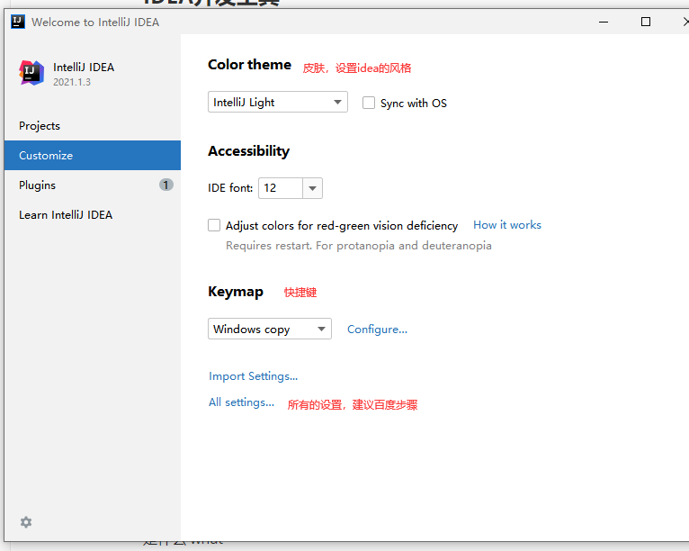
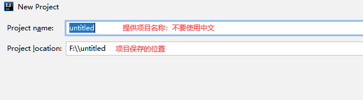
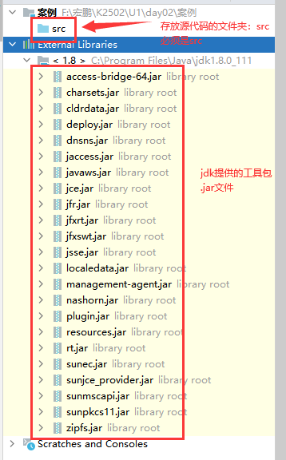
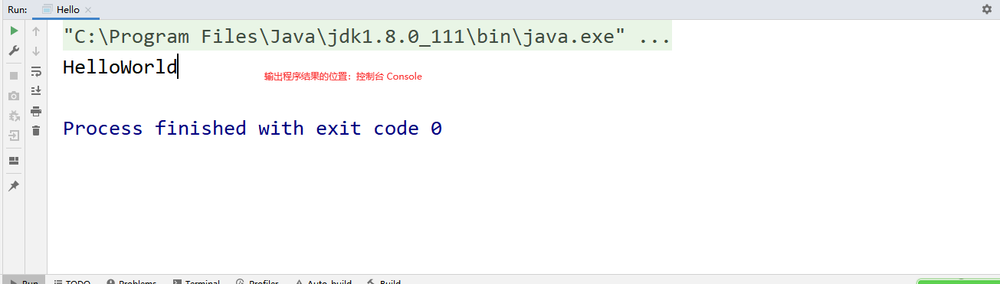
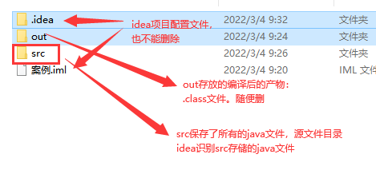

# 课程回顾

## 1 JDK  JRE JVM概念和关系

```html
JDK:java  开发工具包

JRE：java运行时环境

JVM:java虚拟机

JDK包含JRE JRE包含JVM
```

## 2 注释分类

```html
单行注释
//

多行注释
/*  */

文本注释：文档注释
/** */
```

## 3 java程序的执行过程

```html
java代码写好，经历以下几个过程：
1.javac 文件名.java 编译java源代码，生成一个字节码文件.class
2.java 文件名 执行字节码文件
```

# 课程目标

## 1 输出语句  === 掌握

## 2 数据类型  === 掌握

## 3 变量  === 掌握

## 4 常量  === 掌握

## 5 Scanner应用  === 掌握

# 课程实施

## 1 HelloWorld案例

### 遇到问题

```html
1. 忘记写分号
2. 单词记不住 === 
3. 程序存在符号写错了。单词写错，记事本编辑器不能给我提示 错误位置的定位
```

开发工具

记事本   IDEA  Eclipse  MyEclipse

运行工具

JRE JVM

### IDEA开发工具

IDE是什么？Integrated  Development  Environment 集成开发环境

常见集成开发工具：IDEA  Eclipse  MyEclipse

### Idea开发工具

默认工具使用语言：英语

建议：idea不要汉化













## 2 输出语句

```java
System.out.println("内容");//输出完内容后换行
System.out.print("内容");//输出内容，不会换行

转义符：
    "\n":换行符输出换行
    "\t":制表位符，输出tab键
System.out.print("内容\n")和System.out.println("内容");的效果是一样的

```

### 课堂案例

```java
public class Hello {
	//psvm jvm程序入口：public static void main()
	public static void main(String[] args) {
		//sout输出helloworld
		//System.out==>控制台
		//println()输出内容并换行
		//print()输出内容不换行
		//System.out.println("Hello");//控制台输出Hello并换行
		System.out.print("Hello\nHello");//控制台输出Hello不会换行
		System.out.println("World");//控制台输出World并换行

		System.out.print("\n");//等价于System.out.println("")

		System.out.println("姓名\t年纪\t性别");
	}
}
```

### 学生练习

学号         姓名          年纪     

KGC01     张三          21

KGC02     李四          24

#### 分析

```java
方案：
    soutln("学号         姓名          年纪");
soutln("");

方案二：
    sout()
    soutln()
```

## 3 数据类型

java写出一个程序：程序=数据+逻辑（if  while)

### 3-1 概念

数据泛指实际世界上**信息**

大数据：

数据：24800（数学说数字） “KGC01" "孙亮亮"  "410999090909090909X"

### 3-2  数据类型分类

计算机语言：0 1  二进制

所有的正在运行的程序，转换二进制语言。都在内存中运行.程序中数据都会在内存中进行临时存储。

硬盘：数据永久化

java写代码：System.out.print();  JRE编译成.class文件，字节码，二进制文件。JVM执行二进制

根据数据在内存中保存的位置，划分两大类：

基本数据类型：都在栈中

数值：

   整数类型：不含小数点，常见 12 100 1000000

​    byte: -2的7次方-（2的7次方-1）

​    short:-2的15次方-（2的15次方-1）

​    int:-2的31次方-（2的31次方-1）

​    long:-2的63次方-（2的63次方-1）

java所有的整数，没有明确说明的情况，默认按照int类型

   浮点类型（小数类型）

​     float:单精度小数  32个位

​     double:双精度小数  64个位

java所有的小数，没有明确说明的情况，默认按照double类型

字符：char，举例：'*' 'a' '哈' 

   只能表达一个符号，字符类型必须使用''引起来

布尔类型：boolean

   有且只有两个值：true  false


引用类型类型：都在堆中

数组  集合  类  接口

字符串 String 

书写特点：必须使用""引起来

举例："a" "hello"

### 3-3 数据类型的作用

数据类型决定了数据在内存中占用空间的大小

## 4 变量

### 4-1 概念

指内存中一块内存。

### 4-2 作用

保存数据，便于使用  存取数据

### 4-3 如何使用变量

变量定义语法：

```java
数据类型 变量名=值;
```

### 课堂演示案例

```java
/**
 * @Author: lc
 * @Date: 2022/3/4
 * @Description: 变量的使用
 * 变量作用：
 * 存取数据
 * @Version: 1.0
 */
public class Demo3 {
	public static void main(String[] args) {
		//保存学生姓名
		//变量定义语法：数据类型 变量名=值;
		String name="林黛玉";//存入内存

		//输出姓名，取出数据使用
		System.out.println(name);
		System.out.println();
	}
}
```

### 学生练习

```html
保存以下数据：
商品名称：华为P40

单价：5999.99  float double

是否过期：boolean  true-没有过期

产地：'C' 'U'  char

输出商品详细信息：
名称            单价         是否过期          产地
华为P40         5999.99      true            C
```

#### 参考代码

```java
/**
 * @Author: lc
 * @Date: 2022/3/4
 * @Description: PACKAGE_NAME
 * @Version: 1.0
 */
public class ZuoYe {
	public static void main(String[] args) {
		//数据
		//存数据：变量
		//商品名称
		String name="华为P40";
		//所有的小数默认double，占用空间64位
		//float占用32位  F表示float类型。建议大写，便于阅读
		float price=4888.88F;
		//boolean有且只有两个值：true和false
		boolean isOk=false;
		char address='C';
		
		//逻辑：按照代码书写顺序从上往下依次执行  顺序结构
		System.out.println("名称\t\t\t\t产地\t\t\t是否过期\t\t\t单价");
		/*System.out.print(name);//\t表示一个按键：tab键
		System.out.print("\t\t\t\t");
		System.out.print(address);*/
		//+读作：连接符
		System.out.println(name+"\t\t\t"+address+"\t\t\t\t"+isOk+"\t\t\t\t"+price);
	}
}
```

### 4-4 修改变量的值

```java
变量名=值;
```

变量定义变形语法

```java
数据类型 变量名;//定义变量，但是没有赋值

变量名=值;//赋值
```

### 4-5 变量使用细节

```html
1.变量名不能重复
2.变量必须先定义、再赋值、才能使用
3.java所有的关键字不能作为变量名使用
```

## 5 常量

### 定义语法

```html
语法① final 数据类型 常量名=值;

语法②
final 数据类型 常量名;
常量名=值;

命名一般建议：全大写；
```

### 变量和常量的区别

```html
常量一旦定义，就必须赋值。赋值之后不允许再修改。

变量：变量定义之后，赋值，但是可以随时修改变量值
```

### 常量的应用场景

```html
圆周率：3.14
final double PI=3.14;
```

### 课堂案例

```java
/**
 * @Author: lc
 * @Date: 2022/3/4
 * @Description: 常量PI求圆面积
 * @Version: 1.0
 */
public class Demo4 {
	public static void main(String[] args) {
		//1.准备数据
		//圆周率
		final double pi;
		pi=3.14;//初次赋值

		//修改pi的值
		//pi=12.34;//出错，修改
		//计算
		System.out.println("半径为2的圆面积："+2*2*pi);
	}
}
```


## 补充：java常用命名规则

```java
变量名：见词知意
  java命名规则：
    所有标识符都只能有数字、字母、下划线和$组成，不能以数字开始
    举例：2a不对  a  a2  $123 对
    驼峰命名法：
      第一个单词首字母小写，从第二个单词开始，首字母大写，
    举例：studentName kgcStudentName
    适用于：变量名  方法名  属性名
    帕斯卡命名法：
    所有单词首字母都必须大写
    举例：Person   Student   StudentSex
    适用场景：类名  接口名 枚举名称....
```

### 

# 课程总结

## 1 数据类型单词：关键字 必须记住

## 2 变量和常量定义语法

## 3 理解变量和常量作用、区别

## 4 +使用  连接符

## 5 soutln sout不带ln  \t \n应用 ==== 简单


# 预习安排

**运算符**：3W1H

是什么 what

where 使用场景

when 何时使用

why 为什么要学这个知识

how 怎么用


**Scanner应用**：使用步骤！！！


**数据类型转换** ：


