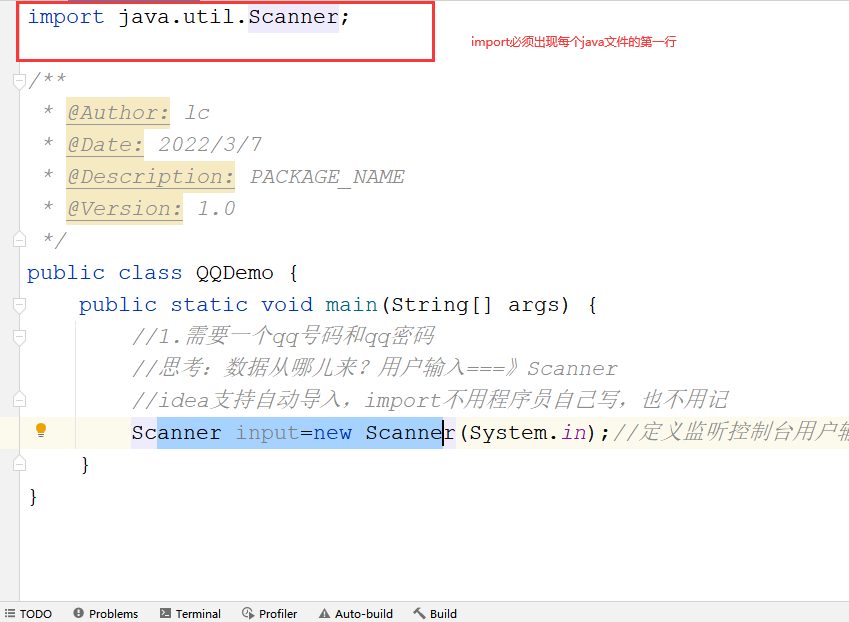
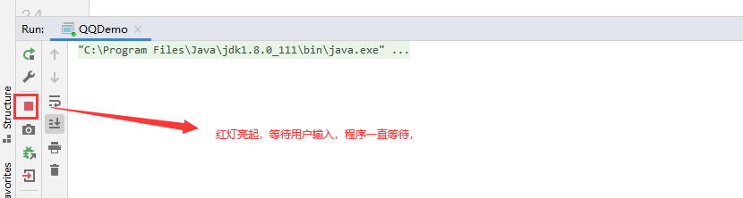
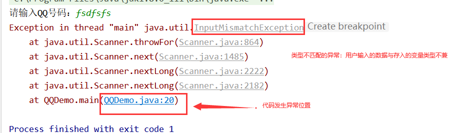

# 课程回顾

## 案例需求：

保存图书相关的信息

```html
1.书名  String
2.出版日期 String
3.库存 int
4.是否清算？ boolean
5.单价 float
6.图书类型：char
'国'  '外'

按照以下格式输出：
书名     日期    库存....
《西游记》
《红楼梦》

```

### 参考代码

```java
/**
 * @Author: lc
 * @Date: 2022/3/7
 * @Description: 描述图书相关的信息
 * @Version: 1.0
 */
public class BookInfo {
	//JVM进入程序执行的入口
	public static void main(String[] args) {
		// 1.数据 容器
		// 书名
		String bookName="游西记1";
		String bookName2="西游记2";
		// 库存
		int count1=200;
		int count2=300;
		// ctrl+/ 出版日期
		String date="2012-12-31";
		//4.是否清算？ boolean
		boolean is=true;
		//5.单价 float
		float price=23.0F;
		//6.图书类型：char
		char type='N';

		//2.处理 输出
		System.out.println("书名\t\t\t出版日期\t\t\t是否清算");
		System.out.println(bookName+"\t\t\t"+date+"\t\t\t"+is);

		//准备第二本图书信息
		bookName="红楼梦";
		System.out.println(bookName+"\t\t\t"+date+"\t\t\t"+is);

	}
}
```

## 反编译工具的使用

常见的反编译工具：

IDEA本身也可以执行反编译，另外也可以使用一些其他的反编译工具，比如教学素材提供：frontEnd


```html
编译：java源代码编译成class文件（字节码文件），jvm可以执行class文件
反编译：将class文件逆向生成源文件过程。

反编译作用：阅读jvm实际执行的代码
使用场景：OOP编程。构造方法

主要用于程序调试。
```

# 课程目标

## 1 Scanner使用 ===== 掌握

## 2 运算符使用 ==== 掌握

## 3 数据类型转换 ======= 理解

# 课程实施

## 1 Scanner

回顾经历：变量和赋值，变量赋值，值从哪儿来的？？

int num=数据？？数据：自己随便写，灵活性差。

优化：用户输入的方式，接收数据

### 1-1 作用

Scanner主要的作用：完成接收用户输入值功能

使用场景：希望用户输入数据的时候。

### 1-2 使用



```html
1.自己的程序中引入jdk提供的Scanner工具
import java.util.Scanner;

2.创建一个Scanner的变量
Scanner 监听器名称=new Scanner(System.in);//System.out控制台  System.in 控制台

3.开始监听：接收用户输入的数据
建议：sout()给出输入值的一些提示信息
3-1 定义变量
int num; //提供给监听器使用
3-2 变量保存监听器监听的数据
num=监听器的名称.nextInt();//监听输入整数int类型
监听器的名称.next();//监听String 
监听器的名称.nextDouble();//监听输入整数Double类型
监听器的名称.nextFloat();//监听输入整数Float类型
监听器的名称.nextByte();//监听输入整数byte类型
监听器的名称.nextShort();//监听输入整数short类型
监听器的名称.nextLong();//监听输入整数long类型
监听器的名称.nextBoolean();//监听输入整数boolean类型
注意事项：Scanner没有提供监听char类型数据的功能：因此不存在：监听器的名称.nextChar();//监听输入整数int类型
```

### 课堂案例：



需求：使用Scanner接收用户输入用户名和密码，分别保存在两个变量

分析：

```html
QQ：long
用户名：String
密码：String
```

#### 参考代码

```java
import java.util.Scanner;

/**
 * @Author: lc
 * @Date: 2022/3/7
 * @Description: PACKAGE_NAME
 * @Version: 1.0
 */
public class QQDemo {
	public static void main(String[] args) {
		//1.需要一个qq号码和qq密码
		//思考：数据从哪儿来？用户输入===》Scanner
		//idea支持自动导入，import不用程序员自己写，也不用记
		Scanner input=new Scanner(System.in);//定义监听控制台用户输入数据的监听器

		//2.监听用户输入的数据
		//2-1 先问
		System.out.print("请输入QQ号码：");
		//2-2 再答
		long qqNum=input.nextLong();


		//3.输出用户输入的qq号码
		System.out.println("您输入的qq号码是："+qqNum);
	}
}
```

### 学生练习:转账

需求：

1.定义两个变量：user1=500  user2=250保存账户现有余额

模拟ATM取款，提示用户1输入转账金额。使用Scanner接收用户输入的取款金额

计算user1和user2的卡内余额

扩展： if

1.转账金额必须是整百

2.转账金额必须小于等于卡内余额

#### 参考代码

```java
import java.util.Scanner;

/**
 * @Author: lc
 * @Date: 2022/3/7
 * @Description: 两个 账户之间转账
 * @Version: 1.0
 */
public class ATM {
	public static void main(String[] args) {
		//1.数据
		int user1=500;//银行卡余额
		int user2=250;//银行卡余额

		//2.模拟ATM输入转账金额
		Scanner input=new Scanner(System.in);
		System.out.print("请输入转账金额：");
		int money = input.nextInt();
		//long l = input.nextLong();//long  ctrl+alt+v自动根据数据值生成变量定义

		//3.处理转账的结果
		//3-1 判断转账金额是否是整百  转账金额是否充足：小于等于卡内余额

		//user1=user1-money;//转出之后的余额
		//user1-=money;
		//= += -= *= /= %=
		//user2=user2+money;//转入后的余额
		//user2+=money;

		//基于整百，余额是否足够
		user1=user1>=money&&money%100==0?user1-money:user1;
		user2=user1>=money&&money%100==0?user2+money:user2;
		//4.输出程序处理结果
		System.out.println("user1卡内余额是："+user1);
		System.out.println("user2卡内余额是："+user2);
	}
}
```

## 2 运算符

### 2-1 概述

1+1=2用数学公式来看，两个1参与数学运算的元素。

### 2-2 分类

分类的依据：根据一个算式参与运算的元素个数，划分成三类

一元运算符  二元运算符  三元运算符

### 一元运算符

```html
+:正数书写格式+12    正号，可以省略
-：负号

++：自增运算符
--：自减运算符
```

#### 课堂案例

```java
/**
 * @Author: lc
 * @Date: 2022/3/7
 * @Description: 演示一元运算符
 * @Version: 1.0
 */
public class Demo1 {
	public static void main(String[] args) {
		//int num=+12;//正数
		//int num2=-90;//负数

		//常用的方式
		//++:在当前参与运算的数据基础上+1
		//--:在当前参与运算的数据基础上-1
		int a=10;
		//++独立使用时，++在前还是后面，效果是一样的
		//a++;//等价于a=a+1
		//++a;//等价于a=a+1
		//++ --放入sout时，++ -- 在变量前或变量后，意义不一样
		//sout(++ --):++ --在变量后，先输出，再运算
		//sout(++ --):++ -- 在变量前，先运算，再输出
		//System.out.println(++a);//10 //1.运算 11  2.11
		//System.out.println(a);//11

		/*System.out.println(a++);//10
		System.out.println(++a);//12
		System.out.println(a--);//12
		System.out.println(a);//11
		System.out.println(--a);//10
		System.out.println(a);//10*/

		System.out.println(a++);
		System.out.println(a++);
		System.out.println(a++);
		System.out.println(a++);
		System.out.println(a++);
		System.out.println(a++);
		System.out.println(a++);
	}
}
```

### 二元运算符 重点

```html
算术运算符：同数学
+ - * / %（读作模）

注意：+ - * /最后的计算结果遵循的原则是：参与运算的元素有小数，计算结果就是小数，都是整数，运算结果就是整数。
%只针对整除求余。小数求余没有意义！！！！

关系运算符：同数学
> >= < <= == !=

赋值运算符：
=（赋值符号）
+= 
-=
*=
/=
%=
+= -= *= /= %=的作用就是在变量的基础上做+ - * / %并将计算结果保存到原变量中

逻辑运算符：
&-与 |-或 !-非，取反  &&-短路与    ||--短路或
重要区分：短路与不短路区别？？
& &&：&&在复杂的逻辑运算表达式中，前面的表达式如果能够得出false的结果，那么&&后面的表达式就会忽略不去计算
| ||：||在复杂的逻辑运算表达式中，前面的表达式如果能够得出true的结果，那么||后面的表达式就会忽略不去计算。所以，短路的&& ||可以优化表达式计算的效率
日常开发使用时，优先使用短路方式if while()
```

#### 课堂演示案例

##### 算术运算符

```java
/**
 * @Author: lc
 * @Date: 2022/3/7
 * @Description: 算术运算符
 * @Version: 1.0
 */
public class Demo2 {
	public static void main(String[] args) {
		//所有的整数类型小于浮点数，整数和小数一起运算，结果一定是小数
		double num1=10;
		int num2=-3;
		//两数进行算术运算，计算结果与参与运算的两个数据中，类型最大的类型为准
		System.out.println(num1+num2);//13
		System.out.println(num1-num2);//7
		System.out.println(num1*num2);//30
		// /除法也是整除吗？？？？
		System.out.println(num1/num2);//3
		//%:模 整除求余数 14/3=4....2  带不带负号，看被除数
		System.out.println(num1%num2);//1
	}
}
```

##### 关系运算符

```java
/**
 * @Author: lc
 * @Date: 2022/3/7
 * @Description: 关系运算符
 * @Version: 1.0
 */
public class Demo3 {
	public static void main(String[] args) {
		//关系运算符计算结果一定是boolean、true false
		//关系运算符连接元素形成一个运算公式，称为boolean表达式
		int num1=12;
		int num2=-100;
		System.out.println(num1>num2);
		System.out.println(num1>=num2);
		System.out.println(num1<num2);
		System.out.println(num1<=num2);
		System.out.println(num1==num2);
		System.out.println(num1!=num2);
	}
}
```

##### 逻辑运算符

```java
/**
 * @Author: lc
 * @Date: 2022/3/7
 * @Description: 逻辑运算符 & | ！ && ||
 * 提示：逻辑运算符前后只能boolean值或boolean表达式
 * 逻辑运算符计算结果也是：boolean值
 * @Version: 1.0
 */
public class Demo4 {
	public static void main(String[] args) {
		boolean b1=true;
		boolean b2=false;
		//& &&前后两个boolean值，同真则真，有假即假
		//false
		System.out.println(b1&b2);//长得美  且  有工作  &表示且关系，同时成立，满足
		System.out.println(b1&&b2);//false

		// | || 前后两个boolean值，有真则真，同假即假
		System.out.println(b1|b2);//长得帅  或  有钱 true
		System.out.println(b1||b2);//  true

		// ! 非，取反  真则假，假则真
		System.out.println(!b1); // false
		System.out.println(!b2); // true

	}
}
```

##### 短路与不短路区别

```java
/**
 * @Author: lc
 * @Date: 2022/3/7
 * @Description: 短路与不短路区别
 * 运算顺序：自增自减>算术运算符>关系运算符>逻辑运算符>赋值运算符
 * 如果改变运算顺序，使用(),永远优先计算()中
 * @Version: 1.0
 */
public class Demo5 {
	public static void main(String[] args) {
		int a=1;
		int b=2;
		//& |:& |第一个表达式已经决定了整个算式结果，没有必要再让jvm帮你执行后面的复杂运算，非常耗时
		//&&:第一个false，第二个公式不去计算
		//||:第一个true，第二个公式不用计算
		boolean result=a>b&&++a==2;//false  died code

		System.out.println(result);

		System.out.println(a);//2
	}
}
```

##### 赋值运算符

```java
import java.util.Scanner;

/**
 * @Author: lc
 * @Date: 2022/3/7
 * @Description: 两个 账户之间转账
 * @Version: 1.0
 */
public class ATM {
	public static void main(String[] args) {
		//1.数据
		int user1=500;//银行卡余额
		int user2=250;//银行卡余额

		//2.模拟ATM输入转账金额
		Scanner input=new Scanner(System.in);
		System.out.print("请输入转账金额：");
		int money = input.nextInt();
		//long l = input.nextLong();//long  ctrl+alt+v自动根据数据值生成变量定义

		//3.处理转账的结果
		//3-1 判断转账金额是否是整百  转账金额是否充足：小于等于卡内余额

		//user1=user1-money;//转出之后的余额
		user1-=money;
		//= += -= *= /= %=
		//user2=user2+money;//转入后的余额
		user2+=money;

		//4.输出程序处理结果
		System.out.println("user1卡内余额是："+user1);
		System.out.println("user2卡内余额是："+user2);
	}
}

```

### 三元运算符

```html
? : 也读作条件运算符
条件boolean表达式? 前面条件成立，给的值:前面条件不成立，给的值
```

#### 课堂案例

```java
/**
 * @Author: lc
 * @Date: 2022/3/7
 * @Description: 条件运算符（即三元运算符）
 * @Version: 1.0
 */
public class Demo6 {
	public static void main(String[] args) {
		int money=550;
		//是整百，得出true不是整百，false
		//12/4=3...0  12/5=2....2
		boolean b=money%100==0;
		System.out.println(b);//false

		String result=b?"转账成功":"转账失败";
		System.out.println(result);
	}
}
```

# 常见的坑点：



# 课程总结

## 1 运算符的顺序

```
运算顺序：自增自减>算术运算符>关系运算符>逻辑运算符>条件运算符>赋值运算符
* 如果改变运算顺序，使用(),永远优先计算()中
```

## 2 Scanner小结：ctrl+alt+v

## 3 运算符的小结

## 4 ?:尝试使用

# 预习安排

流程控制语句：条件语法if

语法、执行流程


***********循环语句：难点*************


