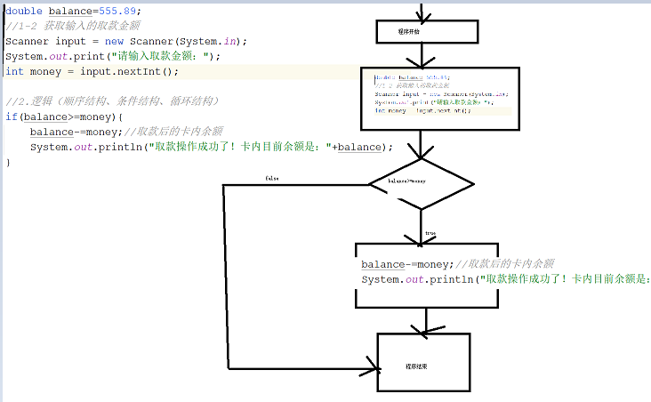
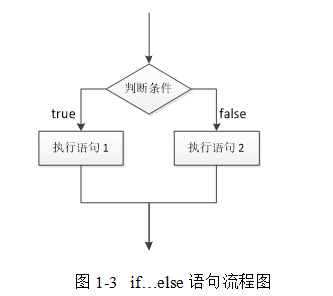
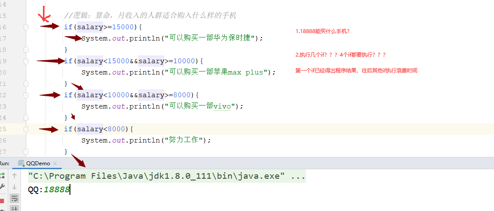
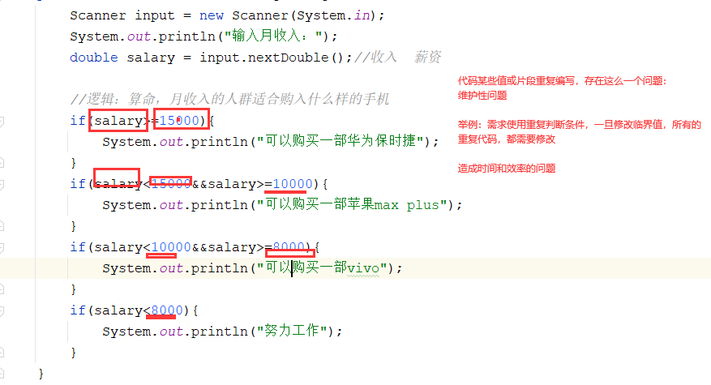
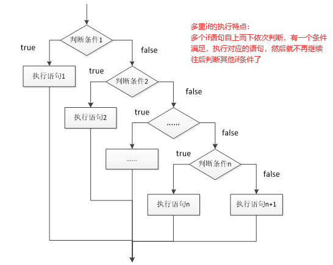
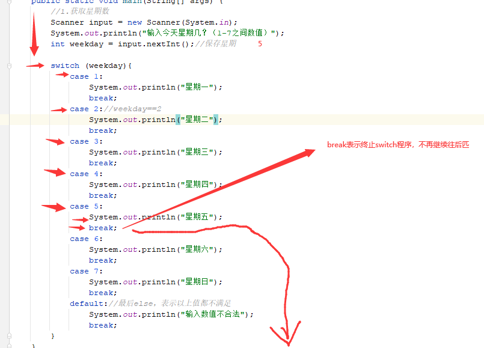
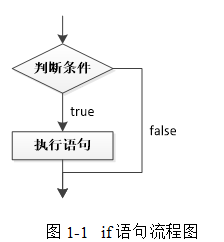
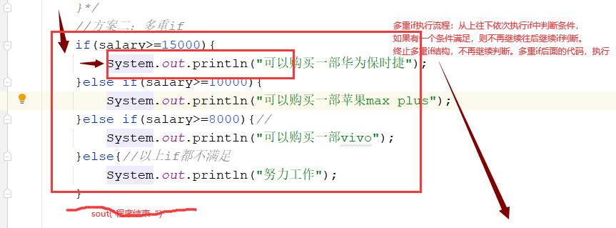
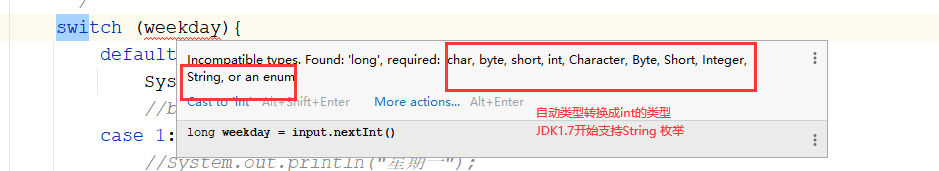

# 课程回顾

## 1 Scanner使用

```html
使用步骤：
1.import...
2.定义监听器
Scanner input=new Scanner(System.in);
3.一问
sout()
一答
input.next数据类型()
String:next()
int/byte/short/long nextInt() nextByte() nextShort() nextLong()
nextDouble nextFloat()
nextBoolean()
没有nextChar()

    
作用：获取用户输入的值
```

## 2 运算符

```html
小结：运算顺序是什么？优先级问题
自增自减 > 算术（先乘除取模  再加减）> 关系运算符（从左向右依次运算）> 逻辑运算符（! && || )>？：>赋值运算符

适当通过（）修改运算顺序
```

## 3 数据类型转换 ***难点

```html
java程序允许兼容数据类型之间互相进行转换：
自动类型转换：不用写代码
发生场景：byte-->int short long float double
 short-->int long float double
int-->long float double
long-->float double
float-->double

反之，java程序提示程序错误：java完成强制类型转换，需要写代码完成：
目标类型  变量=(目标类型)数据;
缺点：有精度丢失
float double--》int long 直接截断小数点后面的哪些数据
99.99--》int 99

常见场景：
byte+byte==>编译器自动将结果转换int

```

# 课程目标

## 1 流程控制语句

## 2 条件结构  ===== 重点

### 2-1 if

### 2-2 if-else

### 2-3 if-else if-else if-...-else 多重if

### 2-4 switch-case

## 3 switch-case变形执行流程

## 4 嵌套if---整合应用

# 课程实施

## 1 流程控制语句

程序=数据+逻辑

逻辑就是流程控制语句的应用。

逻辑是个什么意思？

举例：去银行办理存款业务？

1.取号

2.坐着听叫号

3.办理业务

4.回家

### 顺序结构

自上而下，按照代码的书写顺序依次执行

举例：程序员：买点包子，如果看到西瓜，就买个西瓜

### 选择结构（条件语句）

代码执行与否，根据代码的执行条件是否满足。

举例：吃饺子 10个饺子，重复喂自己吃10次

### 循环结构（特点：重复）

## 2 选择结构

### 2-1 if 语法 

```java
if(boolean表达式条件){
    //代码段
}
```

#### 案例：取款案例

需求：张三卡内目前500元，使用Scanner模拟ATM取款机，输入取款金额

如果取款金额小于或等于卡内余额，计算取款（卡内余额-取走金额）

结果：取款 成功，卡内余额是：？？？

##### 分析

```java
伪代码：
if(取款金额小于或等于卡内余额){
  //卡内余额-取走金额money 
  //sout
}
```

##### 流程图



##### 参考代码

```java
import java.util.Scanner;

/**
 * @Author: lc
 * @Date: 2022/3/8
 * @Description: 基本的条件语句if
 * @Version: 1.0
 */
public class Demo1 {
	public static void main(String[] args) {
		//1.数据
		//1-1 卡内余额
		double balance=555.89;
		//1-2 获取输入的取款金额
		Scanner input = new Scanner(System.in);
		System.out.print("请输入取款金额：");
		int money = input.nextInt();

		//2.逻辑（顺序结构、条件结构、循环结构）
		if(balance>=money){
			balance-=money;//取款后的卡内余额
			System.out.println("取款操作成功了！卡内目前余额是："+balance);
		}
	}
}

```

### if-else语法

```java
if(boolean表达式条件){
    //代码段
}else{
    //if条件不满足时，执行代码块
}
```

#### 课堂案例：模拟qq登录功能

1.定义两个变量保存用户输入：用户名、密码

2.定义两个变量保存程序正确的账号和密码

3.如果用户输入的用户名和密码与正确的账号和密码一致的，提示登录成功，否则“账号或密码输入有误”

##### 分析

```java
//用户名qq号码  
int qq;
int password;
int rigthQQ;
int rightPassword;

if(用户名和密码与正确的账号和密码一致的){
    登录成功
}else{
    账号或密码输入有误
}
```

##### 参考代码

```java
import java.util.Scanner;

/**
 * @Author: lc
 * @Date: 2022/3/8
 * @Description: qq登录功能
 * @Version: 1.0
 */
public class QQDemo {
	public static void main(String[] args) {
		//1.准备数据
		//1-1 正确的信息
		int rightQQ=123456;
		int rightPassword=123456;

		//1-2 获取用户实际输入的账号和密码
		Scanner input = new Scanner(System.in);
		System.out.print("QQ:");
		int userInputQQ = input.nextInt();
		System.out.print("密码:");
		int userInputPassword = input.nextInt();

		//2.逻辑
		if(userInputQQ==rightQQ&&userInputPassword==rightPassword){
			System.out.println("登录成功");
		}else{
			System.out.println("账号或密码输入有误，请重新输入。。。。");
		}

	}
}
```

##### 流程图



### if和if-else整合案例

需求：

1.用户输入月收入，使用变量保存  double

2.如果这个用户输入的月收入大于且等于15000元，sout("可以购买一部华为保时捷")

如果这个用户输入的月收入小于15000元，同时大于等于10000元，sout("可以购买一部苹果max plus")

如果这个用户输入的月收入小于10000元大于等于8000，sout("可以购买一部vivo")

如果这个用户输入的月收入小于8000 sout ("努力工作")

#### 分析

````java
if(月收入大于且等于15000元){
    sout("可以购买一部华为保时捷")
}

if(月收入小于15000元，同时大于等于10000元){
    sout("可以购买一部苹果max plus")
}
if(月收入小于10000元大于等于8000){
    sout("可以购买一部vivo")
}
if(月收入小于8000){
    sout ("努力工作")
}
````





#### 方案一：参考代码

```java
import java.util.Scanner;

/**
 * @Author: lc
 * @Date: 2022/3/8
 * @Description: 根据月收入购买手机的测验小程序
 * @Version: 1.0
 */
public class SalaryDemo {
	public static void main(String[] args) {
		Scanner input = new Scanner(System.in);
		System.out.println("输入月收入：");
		double salary = input.nextDouble();//收入  薪资

		//逻辑：算命，月收入的人群适合购入什么样的手机
		if(salary>=15000){
			System.out.println("可以购买一部华为保时捷");
		}
		if(salary<15000&&salary>=10000){
			System.out.println("可以购买一部苹果max plus");
		}
		if(salary<10000&&salary>=8000){
			System.out.println("可以购买一部vivo");
		}
		if(salary<8000){
			System.out.println("努力工作");
		}
	}
}

```

优化后的方案：使用多重if实现

#### 方案二：参考代码

```java
import java.util.Scanner;

/**
 * @Author: lc
 * @Date: 2022/3/8
 * @Description: 根据月收入购买手机的测验小程序
 * @Version: 1.0
 */
public class SalaryDemo {
	public static void main(String[] args) {
		Scanner input = new Scanner(System.in);
		System.out.println("输入月收入：");
		double salary = input.nextDouble();//收入  薪资

		//逻辑：算命，月收入的人群适合购入什么样的手机
		//方案二：多重if
		if(salary>=15000){
			System.out.println("可以购买一部华为保时捷");
		}else if(salary>=10000){
			System.out.println("可以购买一部苹果max plus");
		}else if(salary>=8000){//
			System.out.println("可以购买一部vivo");
		}else{//以上if都不满足
			System.out.println("努力工作");
		}
    }
}
```

多重if的执行流程：



### 多重if语法

适用场景：多条件范围判断

多条件**等值判断**的场景，多重if语句代码啰嗦，不够美观简洁，java针对多条件等值判断场景，优化一套新的选择的结构语句：switch-case语句，执行流程与多重if完全一样。

所有使用switch-case可以完成的场景，都可以无缝替换多重if。

switch-case就是优化多重if的语法，更加简洁、美观、优雅

```java
if(boolean条件①){
    //条件①成立时，代码块
}else if(boolean条件②){//
   //条件①不成立 ，条件②成立时执行代码
}else if(){//n个else if
    
}else{
    //以上条件都不满足,执行代码
}
```

### 课堂案例

需求：

1.输入一个月份，输出该月对应的天数  12个月

举例：1 31  4  30  2月份，再输入年份，判断闰年还是平年，闰年输出29，平年输出28

#### 分析

```java
1.int month=用户输入的月份;
2.if(month==1 3 5 7 8 10 12){
    sout(31);
}else if(month=4 6 9 11){
    sout(30)
}else if(month==2){
    year=用户输入年份
        //1.能被4整除且不能被100整除（如2004年是闰年，而1900年不是）
		//2.能被400整除（如2000年是闰年）还可以看2月份天数。2月份有29日，则是闰年。
        if((year%4==0&&year%100!=0)||(year%400==0)){//能被4整除 year%4==0
            sout(29)
        }else{
            sout(28)
        }
}else{
    sout("提示信息")
}
```

#### 参考代码

```java
import java.util.Scanner;

/**
 * @Author: lc
 * @Date: 2022/3/8
 * @Description: 根据月份输出对应的月份总天数
 * @Version: 1.0
 */
public class MonthDemo {
	public static void main(String[] args) {
		Scanner input = new Scanner(System.in);
		//1.接收月份
		System.out.print("输入1-12之间的月份数：");
		int month = input.nextInt();

		//2.逻辑判断
		if(month==1||month==3||month==5||month==7||month==8||month==10||month==12){
			//if(month==1||3||5||7||8||10||12)
			System.out.println(31);
		}else if(month==4||month==6||month==9||month==11){
			System.out.println(30);
		}else if(month==2){
			//2.接收年份：只有月份是2，才需要年份 ctrl+shift+↑↓
			System.out.print("输入年份：");
			int year = input.nextInt();
			if(year%4==0&&year%100!=0||year%400==0){
				System.out.println(29);
			}else{
				System.out.println(28);
			}
			//System.out.println(year%4==0&&year%100!=0||year%400==0?29:28);
		}else{
			System.out.println("只能输入1-12之间的数值，请重新输入....");
		}
	}
}
```

### switch-case语法




适用场景：用于等值判断的场景

```java
switch(变量名){//相当于if（变量名)
        case 常量值1：//相当于== 值
            break;
        case 常量2：
        ....
        case 常量n:
        	break;
    default:
        break;
}
```

#### 课堂案例：

需求：输入1-7之间数值，输出对应星期几？

##### 参考代码

```java
import java.util.Scanner;

/**
 * @Author: lc
 * @Date: 2022/3/8
 * @Description: switch-case语法
 * @Version: 1.0
 */
public class Demo2 {
	public static void main(String[] args) {
		//1.获取星期数
		Scanner input = new Scanner(System.in);
		System.out.println("输入今天星期几？（1-7之间数值）");
		int weekday = input.nextInt();//保存星期

		//switch的基本用法
		switch (weekday){
			case 1://case后面只能是常量！！！！！！
				System.out.println("星期一");
				break;
			case 2://weekday==2
				System.out.println("星期二");
				break;                
			case 3:
				System.out.println("星期三");
				break;
			case 4:
				System.out.println("星期四");
				break;
           case 5:
				System.out.println("星期五");
				break;
			case 6:
				System.out.println("星期六");
				break;
            case 7:
				System.out.println("星期日");
				break;
			default://最后else，表示以上值都不满足
				System.out.println("输入数值不合法");
				break;
		}
		System.out.println("程序执行结束");
	}
}

```

变形后的程序执行流程分析：

```java
import java.util.Scanner;

/**
 * @Author: lc
 * @Date: 2022/3/8
 * @Description: switch-case语法
 * @Version: 1.0
 */
public class Demo2 {
	public static void main(String[] args) {
		//1.获取星期数
		Scanner input = new Scanner(System.in);
		System.out.println("输入今天星期几？（1-7之间数值）");
		int weekday = input.nextInt();//保存星期

		final int a=1;
		/**
		 * default位置可以随便放，switch-case，执行流程同多重if
		 * 进入default记得写break，省略break之后，程序就会继续执行后面的代码
		 */
		switch (weekday){
			default://最后else，表示以上值都不满足
				System.out.println("输入数值不合法");
				//break;
			case a://case后面只能是常量！！！！！！
				//System.out.println("星期一");
				//break;
			case 3:
				//System.out.println("星期三");
				//break;
			case 5:
				//System.out.println("星期五");
				//break;
			case 7:
				System.out.println("31");
				break;
			case 2://weekday==2
				System.out.println("星期二");
				break;
			case 4:
				System.out.println("星期四");
				//break;
			case 6:
				System.out.println("星期六");
				break;
		}
		System.out.println("程序执行结束");
	}
}
```


## 3 流程图

分析代码执行过程

流程图使用一些具有特殊意义的图形：

```html
矩形：常规代码段
菱形：条件
带有箭头的直线：代码的走向
```

### if语句的执行流程图




# 课程总结

## 1 if结构

## 2 if-else结构

## 3 if-elseif-elseif...-else结构

多重if执行if次数如何判断？






## 4 switch-case使用细节

1.只能用在等值判断

2.switch后面变量类型：byte short int char  JDK1.7 String enum

3.case后面只能常量

4.break可以省略，省略之后switch执行会有影响

5.default的位置


# 预习安排

循环***难点

嵌套循环


循环执行特点：

循环常用关键字与语法

