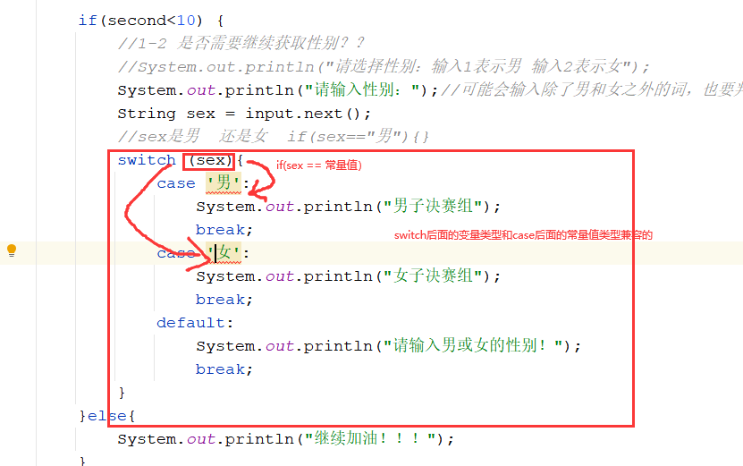
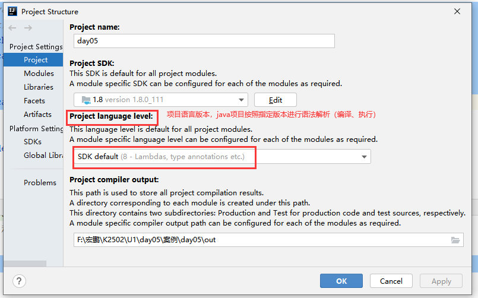
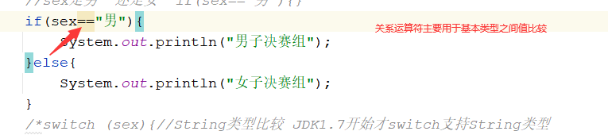
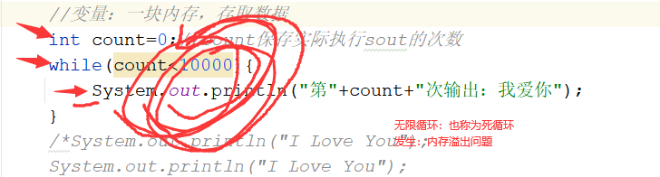
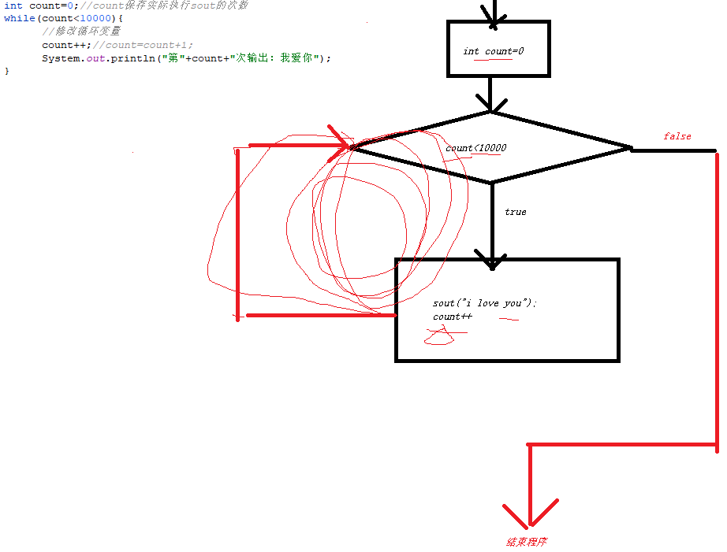

# 课程回顾

## 1 选择结构

```html
if语句
if-else语句
if-else if-else if-...-else 多重if
switch-case语句 ***

嵌套if，if结构整合使用：保证if语句结构完整的。
最多嵌套层级不要超过3层。
提出一些流程控制关键字：return!!!  break continue
if(){
	if(){
		if(){
			switch(){

			}
		}	
	}else{

	}
}
```










## 课后作业第八题

### 分析

```html
伪代码：
If(){//判断选手是否进入决赛
If(){//判断性别，根据性别进行分组
//1.Scanner接收性别：男  女  char类型保存，没有提供nextChar()
//2.String保存性别，String比较字符串是否相等，怎么比？== !=
//3.扩展：优化嵌套级别  return单词使用
```

### 方案一

```java
import java.util.Scanner;

/**
 * @Author: lc
 * @Date: 2022/3/9
 * @Description: 课后作业第八题：嵌套if的使用
 *
 * @Version: 1.0
 */
public class Exercise1 {
	public static void main(String[] args) {
		//1.准备数据  自动导包的快捷键  alt+enter
		Scanner input = new Scanner(System.in);
		//1-1 获取用户比赛成绩：int
		System.out.print("请输入比赛的成绩：（秒）");
		int second = input.nextInt();

		if(second<10) {
			//1-2 是否需要继续获取性别？？
			//System.out.println("请选择性别：输入1表示男 输入2表示女");
			System.out.println("请输入性别：");//可能会输入除了男和女之外的词，也要判断BOY  boy Boy
			String sex = input.next();
			//java中，哪些是常量？final定义  或 所有的字面量
			//sex是男  还是女  if(sex=="男"){}
			if(sex.equals("boy")){//sex字符串的内容是"男",如果是true，否则就是false
				System.out.println("男子决赛组");
			}else if(sex.equals("girl")){
				System.out.println("女子决赛组");
			}else{
				System.out.println();
			}
		}else{
			System.out.println("继续加油！！！");
		}

	}
}
```

### 方案二：

```java
import java.util.Scanner;

/**
 * @Author: lc
 * @Date: 2022/3/9
 * @Description: 课后作业第八题：嵌套if的使用
 *
 * @Version: 1.0
 */
public class Exercise1 {
	public static void main(String[] args) {
		//1.准备数据  自动导包的快捷键  alt+enter
		Scanner input = new Scanner(System.in);
		//1-1 获取用户比赛成绩：int
		System.out.print("请输入比赛的成绩：（秒）");
		int second = input.nextInt();

		if(second<10) {
			//1-2 是否需要继续获取性别？？
			//System.out.println("请选择性别：输入1表示男 输入2表示女");
			System.out.println("请输入性别：");//可能会输入除了男和女之外的词，也要判断BOY  boy Boy
			String sex = input.next();
			//java中，哪些是常量？final定义  或 所有的字面量
			//sex是男  还是女  if(sex=="男"){}
			switch (sex){//String类型比较 JDK1.7开始才switch支持String类型
				case "男":
					System.out.println("男子决赛组");
					break;
				case "女":
					System.out.println("女子决赛组");
					break;
				default:
					System.out.println("请输入男或女的性别！");
					break;
			}
		}else{
			System.out.println("继续加油！！！");
		}

	}
}

```

### 方案三：使用return改良嵌套if

```java
public class ReviewDemo {
	public static void main(String[] args) {
		//1.准备数据  自动导包的快捷键  alt+enter
		Scanner input = new Scanner(System.in);
		//1-1 获取用户比赛成绩：int
		System.out.print("请输入比赛的成绩：（秒）");
		int second = input.nextInt();
		//2 给出不满足继续往后执行代码的条件，终止
		/*if(second<10){
			//进入决赛
		}*/
		if(second>=10){
			//没有进入决赛
			System.out.println("加油！！！");
			return;//一旦执行return，程序停止了
		}
		//继续写代码，什么情况可以执行到这个位置else
		//1-2 是否需要继续获取性别？？
		//System.out.println("请选择性别：输入1表示男 输入2表示女");
		System.out.println("请输入性别：");//可能会输入除了男和女之外的词，也要判断BOY  boy Boy
		String sex = input.next();
		if(sex.equalsIgnoreCase("BOy")){//sex字符串的内容是"男",如果是true，否则就是false
			System.out.println("男子决赛组");
		}else if(sex.equals("girl")){
			System.out.println("女子决赛组");
		}else{
			System.out.println("......");
		}
	}
}
```

# 课程目标

## 1 String比较字符串相等

## 2 return关键字的作用

## 3 while循环 === 掌握

## 4 do-while循环 === 掌握

# 课程实施

## 1 String类型如何比较两个字符串是否一样（即是否相等）

验证：用户名 密码一般区分大小写

### 1-1 区分大小写比较字符串是否相等

```java
字符串2.equals(字符串1) 
：字符串1和字符串2是否相等，equals，哪个字符串在前哪个字符串在后，没有影响
```

验证：验证码不区分大小写

### 1-2 不区分大小写比较两个字符串是否相等

```java
字符串2.equalsIgnoreCase(字符串1) 
    ：字符串1和字符串2是否相等，equals，哪个字符串在前哪个字符串在后，没有影响
```

## 2 return关键字

return:返回

### 作用

终止程序，不再继续往后执行。简单粗暴理解：停止程序执行。jvm不再运行了

### 课堂案例

需求：登录功能：登录成功/用户名或密码不对
#### 分析

```java
if(用户名正确){
  	if(密码输入正确){
 		 ok
  	}else{
  		密码输入有误
  	}
}else{
  	用户名输入有误
}

```

#### 参考代码

```java
import java.util.Scanner;

/**
 * @Author: lc
 * @Date: 2022/3/9
 * @Description:登录
 * @Version: 1.0
 */
public class ReturnDemo {
	public static void main(String[] args) {
		Scanner input = new Scanner(System.in);
		System.out.println("用户名：");
		//next()和nextLine()都可以接受String。next()遇到空格停止接受  nextLine()遇到回车不再继续接收
		String username = input.nextLine();
		System.out.println("密码");
		String pwd = input.next();
		System.out.println("username="+username);
		System.out.println("pwd="+pwd);
		// return挑出不合适、不合法
		//if(username.equals("admin")==false){
		if(!username.equals("admin")){//if(!true)
			System.out.println("用户名输入有误");
			return;
		}
		if(!pwd.equals("admin")){
			System.out.println("密码输入有误！");
			return;
		}
		System.out.println("登录成功！");
	}
}
```


### 练习案例

```html
需求：乘坐公交车
1.首先提示用户输入是否有绿码：true-有  false-没有
接收boolean  String，不区分大小写true
2.如果有绿码，请支付车费：2元，多了不行，少了也不行

3.如果有绿码且能够支付2元车费，sout("一路顺风")。
没有绿码：提示没有绿码，不能乘坐公共交通工具
有绿码，但是不能支付2元车费：提示公共交通工具，不设找零，请支付2元车费
```

#### 分析

```java
if(有绿码){
    if(得有2元钱){
        sout();
    }else{
        sout();
    }
}else{
    sout()
}

//不写嵌套代码结构，也能实现需求

```

#### 参考代码

````java

````

## 3 循环结构

### 3-1 概述

循环：重复做同一件事情

循环案例体现：写代码  做梦

重复说一万次：我爱你

### 3-2 循环使用

实现：sout打印一万次“我爱你”

```java
while(输出次数不足一万次){
   打印 “我爱你”
}
```


如何实现？

方案一：顺序结构

### 3-3 循环结构



#### while循环

```java
while(boolean表达式条件){//当....发生时
    //代码段：循环操作
}
解析：
    boolean条件：循环条件
    循环操作：重复做的那件事情
```

#### 课堂案例：输出一万次我爱你

##### 方案一：顺序结构实现

```java
/**
 * @Author: lc
 * @Date: 2022/3/9
 * @Description: while循环入门案例
 * @Version: 1.0
 */
public class Demo1 {
	public static void main(String[] args) {
		//重复输出一句话：传统顺序结构解决需求，存在问题？？
		//存在代码冗余 重复？中国人  I Love You  维护困难
		System.out.println("I Love You");
		System.out.println("I Love You");
		System.out.println("I Love You");
		System.out.println("我爱你");
		System.out.println("我爱你");
		System.out.println("我爱你");
		System.out.println("我爱你");
		System.out.println("我爱你");
		System.out.println("我爱你");
		System.out.println("我爱你");
		System.out.println("我爱你");
		System.out.println("我爱你");
		System.out.println("我爱你");
		System.out.println("我爱你");
		System.out.println("我爱你");
		System.out.println("我爱你");
        //此处省略N次输出
	}
}

```

方案一存在的代码问题有：

1.代码冗余，造成的代码后期修改困难的问题

##### 方案二：使用循环结构实现

```java
/**
 * @Author: lc
 * @Date: 2022/3/9
 * @Description: while循环入门案例
 * @Version: 1.0
 */
public class Demo1 {
	public static void main(String[] args) {
		//重复输出一句话：传统顺序结构解决需求，存在问题？？
		//存在代码冗余 重复？中国人  I Love You  维护困难
		//循环结构：主要应用于解决重复做同一件事情
		//循环变量
		//变量：一块内存，存取数据
		int count=0;//count保存实际执行sout的次数
		while(count<10000){
			//修改循环变量
			count++;//count=count+1;
			System.out.println("第"+count+"次输出：我爱你");
		}		
	}
}

```

#### 学生练习：

需求：输出1-100之间所有的偶数

```html
循环操作：
sout(偶数)

循环条件：1-100之间

循环变量：int num=1
while(num<=100){
	if(num%2==0){
       sout(num);         
    }
	num++;
}
```

##### 参考代码

```java
/**
 * @Author: lc
 * @Date: 2022/3/9
 * @Description: while循环应用案例一：求1-100之间偶数和
 * @Version: 1.0
 */
public class Demo2 {
	public static void main(String[] args) {
		//1.输出1-100之间所有的数
		//1-1 保存输出次数
		int count=1;
		//1-2 保存1-100之间偶数和
		int sum=0;
		while(count<=100){
			//2.挑出偶数
			if (count%2==0) {//基于条件才能做输出 弹出自动嵌套的代码结构：ctrl+alt+t
				System.out.println(count);
			}
			count++;
		}
	}
}

```

#### while循环执行的流程




#### 课堂案例：求1-100之间偶数和

```java
/**
 * @Author: lc
 * @Date: 2022/3/9
 * @Description: while循环应用案例一：求1-100之间偶数和
 * @Version: 1.0
 */
public class Demo2 {
	public static void main(String[] args) {
		//1.输出1-100之间所有的数
		//1-1 保存输出次数
		int count=1;
		//1-2 保存1-100之间偶数和
		int sum=0;
		while(count<=100){
			//2.挑出偶数
			if (count%2==0) {//基于条件才能做输出 弹出自动嵌套的代码结构：ctrl+alt+t
				//偶数加在一起，存入sum
				/*
				* sum=sum+count 简化sum+=count
				* 当count=2 第一个偶数 sum=sum+2  sum=0+2 2
				* 当count=4 第二个偶数 sum=sum+4  sum=2+4 sum存6
				* 当count=6 第三个偶数 sum=sum+6 sum=6+6 sum存12
				* 当count=8 第四个偶数 sum=sum+8
				 */
				//sum=第一个数+第二个偶数+第三个偶数+....+偶数;
				sum=sum+count;
				System.out.println(count);
			}
			count++;
		}
        System.out.println("1-100之间偶数和："+sum);
	}
}

```

#### 执行流程特点：

while循环基于先判断，再执行。假如循环条件一次也不满足，循环操作就一次也不会执行。

### 循环使用心得

循环三要素

```html
定义控制循环条件的变量
循环条件boolean表达式
循环操作（重复做的事情、修改循环变量）
```

#### 课堂案例

需求：吃饺子

```html
假设餐厅吃饺子，收费方式一个饺子0.9元，老板统计一个人这顿饭该支付多少钱，统计一共吃了多少个饺子。

吃一个饺子，问自己：吃饱了吗？吃饱了，就结束。没有吃饱，接着吃一个饺子，问自己：吃饱了?

伪代码：
String daAn=???;
while(输入答案不是yes){
	//循环操作
    吃饺子
    计数
    sout("吃饱了没有？输入yes吃饱了，输入其他都是没吃饱");
	daAn=input.next();
}
sout("一共吃了个饺子，应该支付的金额是："+（count*0.9))
```

##### 参考代码

```java
import java.util.Scanner;

/**
 * @Author: lc
 * @Date: 2022/3/9
 * @Description: while循环应用案例二：String作为循环的条件。吃饺子案例
 * @Version: 1.0
 */
public class Demo3 {
	public static void main(String[] args) {
		Scanner input = new Scanner(System.in);
		//System.out.println("饿不？输入yes表示饱了，输入其他表示饿了");
		String daAn="yes";//默认值给什么合适？？？
		//保存吃得饺子个数
		int count=0;
		while(true){
			System.out.println("吃一个饺子");
			//计数
			count++;
			System.out.println("饿不？输入yes表示饱了，输入其他表示饿了");
			daAn=input.next();
			if(daAn.equals("yes")) {
				break;//可以
			}
		}
		System.out.println("吃了"+count+"个饺子，支付的钱："+(count*0.9));
	}
}

```

### 学生练习

```html
需求：重复写代码学习
张三判断今天要不要继续写代码，判断依据：作业写完了么？

张三写作业，提交给老师批改，问老师批改的结果，老师说：通过，可以不再继续写作业量，未通过，张三继续写代码，直到老师通知作业通过为止。

三要素：
循环操作： 写作业 改作业   修改循环变量的代码：scanner与老师互动得到的答案
循环条件：老师评价：未通过
循环变量：String 变量=""
```

## 程序调试

bug：称为漏洞 错误。日常英语：臭虫

debug：日常英语：捉臭虫  理解：找漏洞

工具使用，使用步骤：

```html
1.根据经验，锁定臭虫出没大概范围
2.范围这一篇代码的第一行加断点（breakPoint，程序遇到断点会停止）。使用debug模式运行程序
3.程序启动后，遇到断点，就会停下来，此时使用F8单步执行方式，地毯式搜索臭虫
4.监控代码执行过程中，变量、表达式值变化，根据经验拿实际值和预期值对比。找到程序出错的位置、分析代码原因
```

作用：找问题位置！！！

# 预习安排

for循环

嵌套循环

数组：数组定义 循环 数据的操作：添加、删除数据、替换数据、修改数据

吃货联盟在线点餐系统

# 课程总结

## 1 String的比较字符串相等  理解

## 2 return流程控制的关键字

## 3 循环执行流程、三要素

## 4 循环语法


