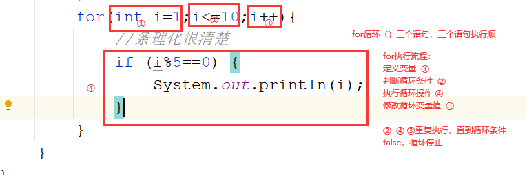
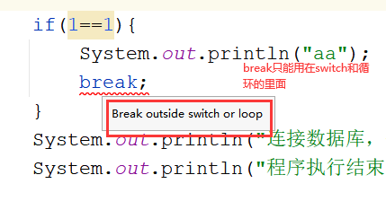
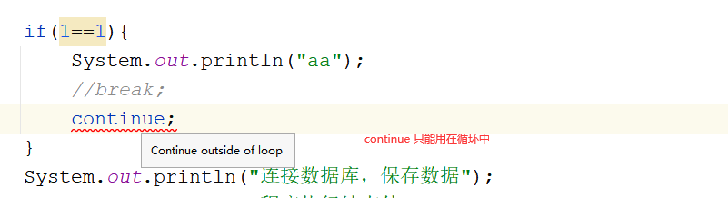
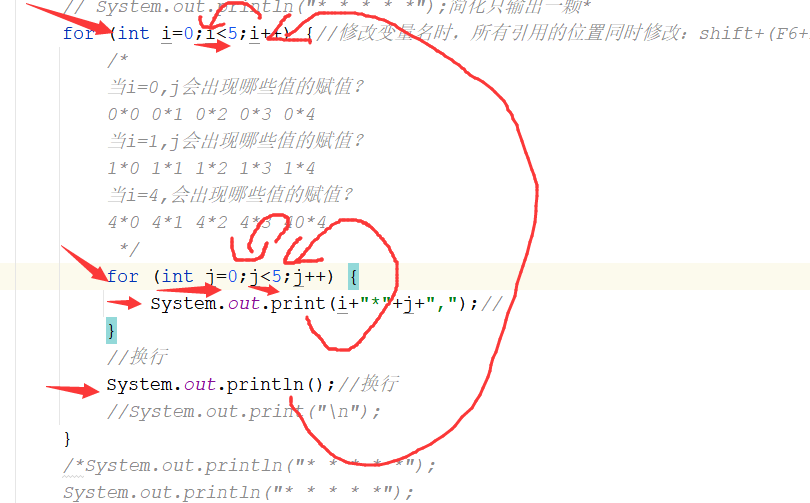
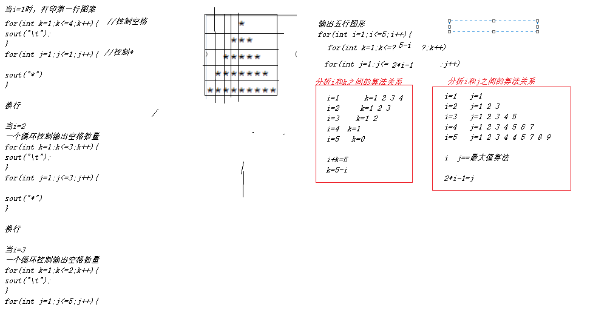
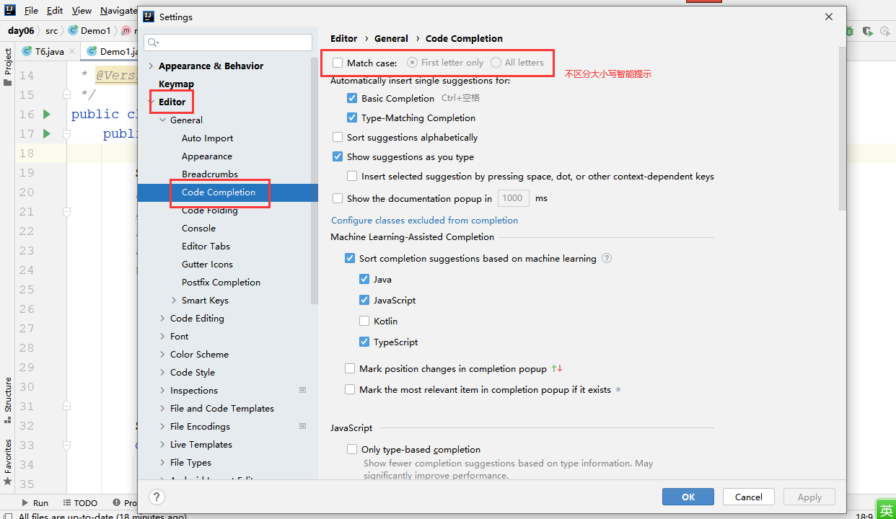
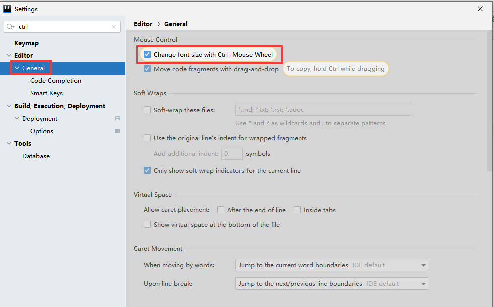

# 课程回顾

## 1 嵌套if结构如何return

扩展：String的功能判断两个字符是否相等

````java
equals():区分大小写判断两个字符串相等
equalsIgonreCase():区分大小写判断两个字符串相等
````

## 2 循环结构

循环概念：重复的做同一件事情

while循环：

流程执行特点：基于先循环条件判断，条件成立，才会执行循环操作。如果条件一次都不成立，循环操作也一次都不会执行。

循环语法：

```java
循环变量;
while(循环条件){
    循环操作;
    
    修改循环变量的值;
}
```

## 3 debug方式


## 课后第六题参考代码

```java
import java.util.Scanner;

/**
 * @Author: lc
 * @Date: 2022/3/11
 * @Description: 课后作业第六题：录入5门课成绩并求平均分
 * @Version: 1.0
 */
public class T6 {
	public static void main(String[] args) {
		Scanner input=new Scanner(System.in);
		//1.输入学生姓名，不是循环操作
		System.out.println("请输入学生姓名");
		String studentName = input.nextLine();

		//2.循环接收用户输入5门课成绩，并求和
		int count=0;
		double sum=0;//保存总分
		String choose="yes";//保存是否继续输入的信号
		while(count<3&&sum<=300&&choose.equals("yes")){
			System.out.println("请输入第"+(count+1)+"门课程的成绩：");
			int score = input.nextInt();//保存学生录入的成绩

			//求和
			sum+=score;//sum=sum+score;
			//修改循环变量的
			count++;
			//给出停止程序的选择
			System.out.println("输入yes表示继续录入"+studentName+"同学的成绩，输入其他停止录入：");
			choose = input.next();//选择是否继续录入成绩,choose作用域不够
		}
		// 输出平均分，不是循环操作
		System.out.println(studentName+"的五门课成绩平均分是："+sum/count);
	}
}
```

# 课程目标

## 1 do-while循环 ==== 掌握

## 2 for循环 ==== 掌握

## 3 嵌套循环 ============== 难点

## 4 break和continue === 掌握

# 课程实施

## 1 do-while循环

### 1-1 语法

```java
do{
    //循环操作
}while(循环条件);

与while语句最大的区别，执行流程发生变化：
先做循环操作，再判断循环条件。如果条件成立，继续执行循环操作。
无论循环条件是否满足，循环操作至少会执行一次。
    
do-while:先做  后判断
while：先判断，再执行 
```

### 1-2 课堂案例

#### while实现看书上机操作题目

```java
import java.util.Scanner;

/**
 * @Author: lc
 * @Date: 2022/3/11
 * @Description: while案例
 * 三要素：
 * 循环操作：上午阅读教材，学习理论部分。下午上机编程，掌握代码部分
 * 修改循环变量值：事情是否合格
 *
 * 循环条件：不合格，一直重复读书+编码
 *
 * 循环变量：y合格   n不合格  String
 * @Version: 1.0
 */
public class Demo1 {
	public static void main(String[] args) {
		Scanner input = new Scanner(System.in);
		//思考：冗余代码   流程有没有优化空间？
		System.out.println("合格了吗？（y/n）");
		//循环变量
		String answer=input.next();
		while(answer.equalsIgnoreCase("n")){

			System.out.println("上午阅读教材！");
			System.out.println("下午上机编程！");

			System.out.println("合格了吗？（y/n）");
			answer = input.next();
		}
		System.out.println("完成学习任务！");
	}
}

```

#### do-while实现

```java
import java.util.Scanner;

/**
 * @Author: lc
 * @Date: 2022/3/11
 * @Description: while案例
 * 三要素：
 * 循环操作：上午阅读教材，学习理论部分。下午上机编程，掌握代码部分
 * 修改循环变量值：事情是否合格
 *
 * 循环条件：不合格，一直重复读书+编码
 *
 * 循环变量：y合格   n不合格  String
 * @Version: 1.0
 */
public class Demo1 {
	public static void main(String[] args) {
		Scanner input = new Scanner(System.in);
		String answer;//未知答案
		do{
			System.out.println("上午阅读教材！");
			System.out.println("下午上机编程！");

			System.out.println("合格了吗？（y/n）");
			answer = input.next();
		}while(answer.equalsIgnoreCase("n"));
		System.out.println("完成学习任务！");
	}
}

```


### 1-3 学生练习

需求：取款

1.取款金额必须整百  

2.取款金额必须小于等于卡内余额

3.循环保证取款操作时，金额是合法的

```html
do{
sout("输入取款金额：")
int money=input.nextInt();

}while(取款金额%100!=0 || 取款金额>卡内余额);

卡内余额-=取款金额;
sout()
```

#### 参考代码

```java
import java.util.Scanner;

/**
 * @Author: lc
 * @Date: 2022/3/11
 * @Description: 控制取款金额的合法性
 * @Version: 1.0
 */
public class Demo2 {
	public static void main(String[] args) {
		Scanner input = new Scanner(System.in);
		//定义变量，表达卡内余额
		double balance=994.88;
		//布尔类型，true  false
		boolean isOk;//isOk表示用户输入的取款金额是合法的
		int money;//取款金额
		do {
			isOk=true;//重置记号
			System.out.print("请输入取款金额：");
			money = input.nextInt();
			//不是整百
			if(money % 100 != 0) {
				System.out.println("取款金额必须是整百");
				isOk = false;
			}
			//取款金额超标
			if(balance <= money) {
				System.out.println("取款金额必须小于或等于卡内余额！卡内余额不足");
				isOk = false;
			}
		}while(!isOk);
		balance-=money;//取款
		System.out.println("取款成功，卡内余额是："+balance);
		//转账
	}
}
```

## 2 for循环

引入案例：1-10所有能被5整除的整数

方案一：while循环

方案二：do-while循环

### 课堂演示案例

#### while实现

```java
/**
 * @Author: lc
 * @Date: 2022/3/11
 * @Description: PACKAGE_NAME
 * @Version: 1.0
 */
public class Demo3 {
	public static void main(String[] args) {
		/*
		while存在的问题：
		1.循环三要素，书写过于分散，程序员很容易遗漏：i++(死循环）
		2.循环变量写在什么位置合适？while语法缺点

		解决方案：for语法，执行流程与while一模一样。for语法紧凑
		for适用场景：循环次数明确的循环
		举例：打印一万次我爱你  获取5门课程的成绩  数组  集合
		 */
		int i=1;
		while(i<=10){
			if (i%5==0) {
				System.out.println(i);
			}
			i++;
		}
	}
}

```

#### for实现

```java
/**
 * @Author: lc
 * @Date: 2022/3/11
 * @Description: PACKAGE_NAME
 * @Version: 1.0
 */
public class Demo3 {
	public static void main(String[] args) {
		//while案例转换for应用场景
		/*for(循环变量定义;循环条件;循环变量++/--){
			//循环操作
		}*/
		for(int i=1;i<=10;i++){
			//条理化很清楚
			if (i%5==0) {
				System.out.println(i);
			}
		}
	}
}

```

### for语法

```java
for(定义循环变量;循环条件;修改循环变量表达式){
    //循环操作
}
```

### for循环执行流程

for循环其实就是while循环，执行流程与while循环一模一样。如下图所示



### 学生练习

需求：找出所有水仙花数

水仙花：三位数。个位 十位 百位各个数字立方和=数字本身

```java
int num=234;
if(2*2*2+3*3*3+4*4*4=234){
    
}

for(100,i<1000;i++){
    geWei=..
    if(2*2*2+3*3*3+4*4*4=234){
    	sout(i)
	}
}
```

#### 参考代码

```java
/**
 * @Author: lc
 * @Date: 2022/3/11
 * @Description: PACKAGE_NAME
 * @Version: 1.0
 */
public class Demo4 {
	public static void main(String[] args) {
		for(int num=100;num<1000;num++){
			//个位  十位  百位
			//123/100=1...23
			int baiWei=num/100;
			//23/10==2...3
			int shiWei=num%100/10;
			int geWei=num%100%10;
			if (Math.pow(baiWei,3)+Math.pow(shiWei, 3)+Math.pow(geWei, 3)==num) {//Math.pow(a,b)表示a的b次幂方
				System.out.println(num);//输出100-1000之间所有的整数
			}
		}
	}
}
```

## 3 流程控制关键字

### 3-1 break

break作用：用在循环中，用来终止循环，break后面的代码将不再继续执行


### 3-2 continue 

continue作用：继续 。终止本次循环，使循环进入下一次


### 3-4 break continue和return的区别

break:终止循环



continue：结束一次循环，循环还得进入下一次



return：停止程序，让程序不再继续执行。理解：jvm停止

return可以使用在if或循环或switch，但是，return一旦出现，程序就停止啦。请谨慎。

### 学生练习

需求：

1.Scanner提示用户输入5个学生成绩。当用户输入的成绩>120分，提示重新输入本次成绩

2.计算平均分

#### 需求分析：

```html
请输入第一门课成绩：
999
成绩只能是0-120之间，输入数据不合法
请输入第一门课成绩：
456
成绩只能是0-120之间，输入数据不合法
请输入第一门课成绩：
90
第二门
第三门

伪代码：
for(int i=1;i<=5;i++){
    请输入第一门课成绩：
     成绩=用户输入的值;

     if(成绩>120){
         sout(成绩只能是0-120之间，输入数据不合法);
    	 continue;
     }
    sum+=成绩
}
while()

```

#### 参考代码

```java
import java.util.Scanner;

/**
 * @Author: lc
 * @Date: 2022/3/11
 * @Description: continue使用场景
 * @Version: 1.0
 */
public class Demo7 {
	public static void main(String[] args) {
		Scanner input = new Scanner(System.in);
		double sum=0;
		for(int i=1;i<=3;i++){
			System.out.println("请输入第"+i+"门课程的成绩：");
			int score = input.nextInt();
			//是否求和，判断分输入是否对，合法
			/*if (score<=120 && score>=0) {
				sum+=score;

			}else{
				System.out.println("输入的成绩不合法，请输入0-120之间数据。");
				i--;
			}*/
			//排除不合法，剩下都是合法
			if(score>120||score<0){
				System.out.println("输入的成绩不合法，请输入0-120之间数据。");
				i--;
				//break;//遇到不合法，停止输入
				//continue;//循环进入下一次，后面代码跳过不执行
			}
			sum+=score;
		}
		System.out.println("五门课程平均分："+sum/3);//sum/0 除数不能为零
	}
}
```

## 4 嵌套循环

### 4-1 嵌套概念

```java
while(){
    for(){
        
    }
}

for(){
    for(){
        
    }
}

do{
    while(){
        
    }
    for(){
        
    }
}while();
嵌套层级不要超过3层
```

### 4-2 嵌套循环执行流程****

#### 流程图绘制，理解执行流程

外层循环执行一次，内层循环执行一轮（即：外层循环变量变化一次，内层循环变量从最小值到最大值变化一轮）

参考如下案例分析：



### 4-3 案例

#### 矩形图案

```html
* * * * *
* * * * *
* * * * *
* * * * *
* * * * *
* * * * *
* * * * *
```

##### 分析：

##### 参考代码   方案一：顺序结构

```java
/**
 * @Author: lc
 * @Date: 2022/3/11
 * @Description: 打印矩形图案：打印5行，每行5颗*
 * @Version: 1.0
 */
public class Demo8 {
	public static void main(String[] args) {
		System.out.println("* * * * *");简化只输出一颗*
		System.out.println("* * * * *");
		System.out.println("* * * * *");
		System.out.println("* * * * *");
		System.out.println("* * * * *");
	}
}
```

##### 参考代码  方案二：循环结构while  do-while  for

```java
/**
 * @Author: lc
 * @Date: 2022/3/11
 * @Description: 打印矩形图案：打印5行，每行5颗*
 * @Version: 1.0
 */
public class Demo8 {
	public static void main(String[] args) {
		// System.out.println("* * * * *");简化只输出一颗*
		for (int i=0;i<5;i++) {//修改变量名时，所有引用的位置同时修改：shift+(F6+FN)
			/*
			当i=0,j会出现哪些值的赋值？
			0*0 0*1 0*2 0*3 0*4
			当i=1,j会出现哪些值的赋值？
			1*0 1*1 1*2 1*3 1*4
			当i=4,会出现哪些值的赋值？
			4*0 4*1 4*2 4*3 40*4
			 */
			for (int j=0;j<5;j++) {
				System.out.print(i+"*"+j+",");//
			}
			//换行
			System.out.println();//换行
			//System.out.print("\n");
		}
		/*System.out.println("* * * * *");
		System.out.println("* * * * *");
		System.out.println("* * * * *");
		System.out.println("* * * * *");*/
	}
}
```

#### 九九乘法表

```html
1*1=1
2*1=2 2*2=4
3*1=3 3*2=6 3*3=9
。。。。。。
9*1=9 9*2=18.。。。。。。。。。。9*9=81
```

##### 分析

```java
for(int i=1;i<10;i++){
    /* 当i=1,输出第一行的数据 j循环几次？1 j=1 j<=1
    * 当i=2 输出第二行，j循环几次？2次 j=1 j<=2
    * 当i=3 输出第三行，j循环三次？3次 j=1 j<=3
    。。。 j<=i
    */
    for(int j=1;j<=i;j++){
       sout(i+"*"+j+"="+i*j); 
    }
    sout();//换行
}
```

##### 参考代码

```java
public class Exercise04 {
    public static void main(String[] args) {
        for (int i = 1;i < 10;i++) {
          for (int j = 1;j <= i;j++) {
              System.out.print(i+"*"+j+"="+i*j+"\t");
          }
            System.out.println();
        }
    }
}
```

#### 等腰三角形



##### 参考代码

```java
/**
 * @Author: lc
 * @Date: 2022/3/11
 * @Description: PACKAGE_NAME
 * @Version: 1.0
 */
public class Demo9 {
	public static void main(String[] args) {
		System.out.println("请输入打印图形的总行数：");
		for(int i=1;i<=5;i++){//控制打印图形总行数
			for(int k=1;k<=5-i;k++){ //控制空格
				System.out.print("\t");
			}
			for(int j=1;j<=2*i-1;j++){ //控制*
				System.out.print("*\t");
			}
			System.out.println();
		}
	}
}
```

# 课程总结

## 1 do-while

## 2 for适用场景和语法执行

## 3 break continue return

## 4 for(){for()}嵌套（嵌套循环执行流程：）

# 补充

## 1 idea常用配置





# 预习安排

数组：定义 循环数组  下标控制数据存取