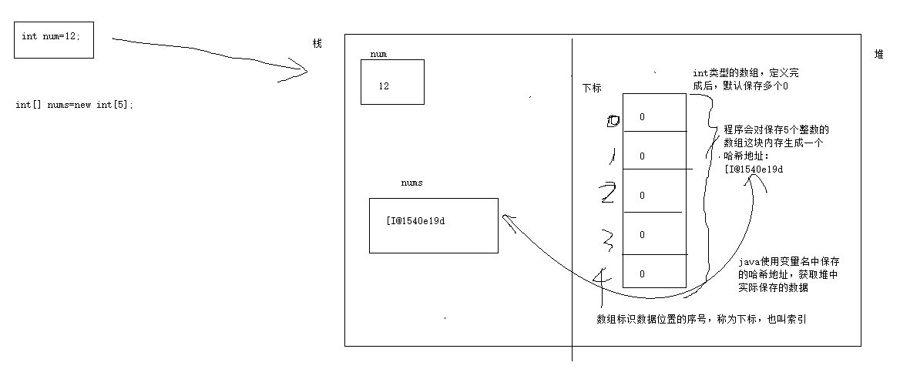
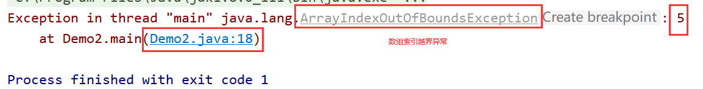

# 课程回顾

## 1. while do-while for循环执行流程

## 2. return break continue优化

## 3.扩展练习--菱形的输出方式

```java
import java.util.Scanner;

/**
 * @Author: lc
 * @Date: 2022/3/12
 * @Description: 打印菱形
 * @Version: 1.0
 */
public class Demo {
	public static void main(String[] args) {
		Scanner input = new Scanner(System.in);
		int rows;
		do {
			do {
				System.out.println("请输入要打印的菱形行数：（总行数只能是奇数）");
				rows = input.nextInt();
				if(rows%2!=0){
					break;
				}
			} while (true);

			for(int i=-rows/2;i<=rows/2;i++){ //控制图形的总行数
				for(int k=0;k<Math.abs(i);k++){//控制空格的输出
					System.out.print(" ");
				}

				for(int j=0;j<rows-2*Math.abs(i);j++){//控制*的输出
					System.out.print("*");
				}
				System.out.println();//换行
			}
		} while (true);
	}
}
```

# 课程目标

## 1 数组定义

## 2 数组元素存取

## 3 数组循环（遍历数组）

## 4 数组应用

### 4-1 求和、求平均值、求最值

### 4-2 数组查找、添加、修改、删除

# 课程实施

## 1 数组

### 数组概念

数组其实还是java的数据类型。和int、double的作用一样。用来在内存开辟空间，保存数据。

### 数组作用

数组一次性保存多个具有相同数据类型的数据。简化重复的同类型变量的定义和引用。

案例：保存一件商品名称、单价、库存、生成日期....

实际开发中，保存30件商品的信息。

如何实现？

使用传统的变量定义保存30件商品的信息，变量的个数是非常惊人的！！！


一个变量可以一次性保存N个信息？数组  集合

#### 需求：使用变量保存30件商品的名称

##### 方案一：定义30个String的变量，保存

##### 方案二：定义一个数组类型的变量。

### 数组定义

```java
//动态赋值：jvm执行时候，由jvm存入默认值
数据类型[] 变量名=new 数据类型[实际存入数据个数];
解析：
  数据类型数组保存数据的公共类型类型  
    
//变形方式一：静态赋值
数据类型[] 变量名={数据1,数据2,.....,数据n};  
细节：定义和赋值必须一行代码完成，不能先定义数组，再赋值。
    
    
//变形方式二:静态赋值
数据类型[] 变量名=new 数据类型[]{数据1,数据2,.....,数据n}; 
优点：可以先定义。再赋值，分两行写
注意实现：new 数据类型[长度]，此处长度一定不能写！！！
```

#### 课堂案例：演示三种数据定义并赋值的方式

```java
/**
 * @Author: lc
 * @Date: 2022/3/12
 * @Description: 数组定义
 * @Version: 1.0
 */
public class Demo3 {
	public static void main(String[] args) {
        //语法一：定义数组并动态赋值
		int[] arr1_1=new int[3];//定义数组，并赋值3个0
		//先定义数组
		int[] arr1_2;//定义数组
		//再赋值
		arr1_2=new int[3];//数组存入3个0


		//语法二：定义数组并静态赋值
		int[] arr2_1={23,56,90};//定义数组，并存入23 56  90，没有默认值0
		//存在问题：语法不能拆分
		int[] arr2_2;
		arr2_2={23,56,90};
		
        //语法三：定义数组并静态赋值
		int[] arr3_1=new int[]{3,4,5,6,9};

		int[] arr3_2;
		arr3_2=new int[]{3,4,5,6,9};
	}
}

```

#### 细节：数组一旦定义，并指明长度后数组每一个下标位置都有默认值，默认值的规律如下所示

```java
int byte short long   0
float double          0.0
char                  '\u0000'其实就是一个空白
String                null ================
boolean               false
```

### 数组数据的存和取

```java
//存
数组名[下标]=值;

//取
数组名[下标]
```

### 如何获取数组保存的数据个数

```java
数组名.length //获取数组存储数据个数
```

### 遍历数组语法

```java
for(int i=0;i<数组名.length;i++){
    数组名[下标]=值;
    sout(数组名[下标]);
}
```

### 数组在内存的存储示意图



### 课堂案例:使用数组保存5个学生的身高

```java
/**
 * @Author: lc
 * @Date: 2022/3/12
 * @Description: 数组的循环
 * @Version: 1.0
 */
public class Demo2 {
	public static void main(String[] args) {
		//1.数组 数组一旦定义，并且，内存每个空间都有一个默认值 0.0
		float[] heights=new float[5];//保存5个浮点类型的值

		//1-2 分别对5个内存赋值
		heights[0]=1.81F;
		heights[1]=1.65F;
		heights[2]=1.78F;
		heights[3]=1.88F;
		heights[4]=1.90F;
		//heights[5]=2.12F;下标越界，运行时会出现异常

		//2.输出看看
		System.out.println(heights);//变量名中存地址

		System.out.println(heights[0]);//下标：[0,5) 正常输出
		System.out.println(heights[1]);//下标：[0,5) 正常输出
		System.out.println(heights[2]);//下标：[0,5) 正常输出
		System.out.println(heights[3]);//下标：[0,5) 正常输出
		System.out.println(heights[4]);//下标：[0,5) 正常输出
		//System.out.println(heights[5]);//下标：[0,5)下标越界，运行时会出现异常
	}
}
```

## 2 数组的使用

### 2-1 求和求平均值

```java
/**
 * @Author: lc
 * @Date: 2022/3/12
 * @Description: 数组找最值
 * @Version: 1.0
 */
public class Demo3 {
	public static void main(String[] args) {
		int[] arr;
		arr=new int[]{3,4,5,6,9};
		double sum=0;//保存和
		for(int i=0;i<arr.length;i++){
			sum+=arr[i];
			System.out.println(arr[i]);
		}
		//求平均值  求和/个数
		System.out.println(sum/arr.length);
	}
}

```

### 2-2 输出数组数据，格式形如：123,456,89,34

```java
import java.util.Scanner;

/**
 * @Author: lc
 * @Date: 2022/3/12
 * @Description: 求最值 N个学生的身高，平均身高  最高  最矮
 * @Version: 1.0
 */
public class GetMaxAndMin {
	public static void main(String[] args) {
		Scanner input = new Scanner(System.in);

		//保存N个学生身高
		System.out.println("请输入要统计的身高学生人数：");
		int n=input.nextInt();//人数
		//动态：jvm给默认值  保存N个0.0
		double[] heights=new double[n];

		//提示输入每个学生的身高且存入数组中。
		//经验：一个for循环只做一件事  for赋值数据获取  for求和  for 求最值
		for(int i=0;i<heights.length;i++){
			//heights[下标]=实际录入的学生的身高;
			System.out.println("请输入第"+(i+1)+"个学生的身高：");
			heights[i]=input.nextDouble();
		}

		//身高表打印,使用一行输出所有的数据，格式：1.78,1.91,1,56
		for (int i=0;i<heights.length;i++){
			System.out.print(heights[i]);
			if (i==heights.length-1) {
				break;
			}
			System.out.print("，");
		}
	}
}

```

### 2-3 求最大值和最小值

```java
import java.util.Scanner;

/**
 * @Author: lc
 * @Date: 2022/3/12
 * @Description: 求最值 N个学生的身高，平均身高  最高  最矮
 * @Version: 1.0
 */
public class GetMaxAndMin {
	public static void main(String[] args) {
		Scanner input = new Scanner(System.in);

		//保存N个学生身高
		System.out.println("请输入要统计的身高学生人数：");
		int n=input.nextInt();//人数
		//动态：jvm给默认值  保存N个0.0
		double[] heights=new double[n];

		//提示输入每个学生的身高且存入数组中。
		//经验：一个for循环只做一件事  for赋值数据获取  for求和  for 求最值
		for(int i=0;i<heights.length;i++){
			//heights[下标]=实际录入的学生的身高;
			System.out.println("请输入第"+(i+1)+"个学生的身高：");
			heights[i]=input.nextDouble();
		}
		//找最大值和最小值
		double max=heights[0];//不能给0，那给多少？真正的Double.MIN_VALUE   数组任意跳一个数据给他
		double min=heights[0];//假设
		//max和数组每一个数据进行一次比赛，赢了就是最厉害
		for(int i=1;i<heights.length;i++){
			if(max < heights[i]){//数组每一个数据
				max=heights[i];
			}
			if(min>heights[i]){
				min=heights[i];
			}
		}
		System.out.println("最高的身高是："+max);
	}
}

```

### 2-4 从数组查找指定的元素

需求：使用变量保存一个班级的学生姓名。

scanner提示用户输入要查找的学生姓名，找到的话，输出学生姓名对应的下标。找不到：查无此人

```java
/**
 * @Author: lc
 * @Date: 2022/3/12
 * @Description: 数组元素的查找
 * @Version: 1.0
 */
public class Demo4 {
	public static void main(String[] args) {
		//1.静态赋值，数组定义
		String[] names={"张三丰","赵敏","谢逊","张无忌"};
		//2.定义要找的学生姓名
		String findName="张无忌";
		//3.查找的功能
		int findIndex=-1;//不能给0
		for(int i=0;i<names.length;i++){
			if(findName.equals(names[i])){//找到了/没找到
				//找到了
				findIndex=i;//[0,N)
				break;
			}
			//System.out.println(findName+"查无此人");
		}

		//4.输出执行结果
		if(findIndex>=0) {
			System.out.println(findName + "存在，位置是：" +findIndex);
		}else {
			System.out.println(findName + "查无此人");
		}
		//基于查找的数据，实现删除或修改
	}
}
```

## 常见的数组应用的异常

### 1 下标越界



# 课程总结

## 1 数组是一种用来保存多个具有相同数据类型的数据，引用数据

## 2 数组三种定义方式、数据获取单个数据、数组循环 基础！！！

## 3 数组求和、求最值、查找指定的数据

# 课后作业

迷你DVD系统可以练习写写，体会数组的定义、存入数据、遍历显示数据以及数组中查找数据、操作数据。


# 预习安排

数组：

排序  

查找（二分查找法） 

二维数组  Arrays工具类常用功能

