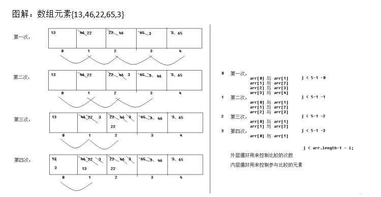
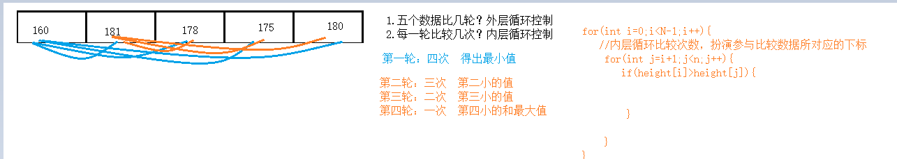

# 课程回顾

## 1 数组应用场景 *****

```html
1-1 数据多，不止一个
1-2 具有相同的数据类型
举例说明：
课表：时间   老师名称   星期
学生信息：40个学生姓名   商品的价格
```

## 2 数组应用

```java
2-1 数组三种定义方式
动态赋值：JVM给数组默认值
数据类型[] 数组名=new 数据类型[长度]
常用的数据类型的默认值有哪些？
整数类型     0
浮点类型     0.0
String类型   null ---------空指针异常
boolean类型  false
char类型     '\u0000'

静态赋值：JVM不给数组默认值，程序员自己定义自己赋值
数据类型[] 数组名={值1,...,值n}
特点：定义和赋值不能分开进行。需要一行代码书写完毕

数据类型[] 数组名=new 数据类型[]{值1,...,值n}
特点：不能指明数组的长度，jvm由程序给定的默认值自己计算出来。

2-2 数组如何循环，怎么存入  获取 下标
for(int i=0;i<数组名.length;i++){
	数组名[i]=赋值;
}

2-3 找指定内容、求最值
    落实代码
```

## 课后作业第七题参考代码

```java
/**
 * @Author: lc
 * @Date: 2022/3/14
 * @Description: PACKAGE_NAME
 * @Version: 1.0
 */
public class T7 {
	public static void main(String[] args) {
		//原来的数组
		int[] array=new int[]{1,3,-1,5,-2};

		//把原数组中的数据按照逆序的顺序存入新数组
		//思考：默认值？？？有，默认值0
		//如何控制原数组逆序？？
		int[] newArray=new int[array.length];//{0,5,0,3,1};
		//处理数据：[0,N)
		/*int j=0;
		for(int i=array.length-1;i>=0;i++){
			newArray[j]=array[i];
			j++;
		}*/
		for(int i=array.length-1;i>=0;i--){
			/*
			 * i=4  array.length-1-i=5-1-i=4-4=0
			 * i=3  array.length-1-i=5-1-i=4-3=1
			 */
			if(array[i]<0){
				continue;
			}
			//if (array[i]>=0) {
			newArray[array.length-1-i]=array[i];
			//}
		}
		System.out.println("逆序存入新数组的数据，依次是：");
		for(int i=0;i<newArray.length;i++){
			System.out.println(newArray[i]);
		}
	}
}

```

# 课程目标

## 1 排序（冒泡&选择）==== 理解

## 2 查找（二分查找法）==== 理解

## 3 Arrays常用功能 ===== 掌握

## 4 二维数组 ========= 掌握

# 课程实施

## 1 排序

### 1-1 排序

数据量比较多的情况下，能够更好地展示数据

### 1-2 如何实现排序

数据库：SQL可以快速查询数据并排序

java、c、JavaScript支持排序。怎么排？算法！！！数据结构

入门级的排序算法：冒泡排序   选择排序

### 准备工作：实现两个数据的交换

#### 方案一：

```java
		//a-可乐  b-白酒,希望实现功能：a存b的值，b里面存入a的值 考点：变量的概念
		//c-空容器  a或b任意一个东西倒入c
		int a=100;
		int b=-100;
		// 如何交换
		int c;//空的
		c=a;//c保存100，a里面存的多少？100
		a=b;//-100 b里面存的依然是-100
		b=c;//100;
```

#### 方案二：

```java
		//能量守恒
		int c=a+b;//求和 0
		a=c-a;//0-100=-100
		b=c-a; //c-(-100)=100
		System.out.println(a);//-100
		System.out.println(b);//100
```


### 1-3 冒泡排序

冒泡排序有一个口诀：

N个数据来排序，相邻数据要比较，前面数据大，后面数据小，两个数据要交换



#### 冒泡排序的实现代码

```java
package day08;

/**
 * @Author: lc
 * @Date: 2022/3/14
 * @Description: day08
 * @Version: 1.0
 */
public class Demo1 {
	public static void main(String[] args) {
		//1.定义数组
		int[] height={170,180,178,181,165};
		System.out.println("排序前，数据如下所示：");
		//for(数组单个数据类型定义的变量:要循环的数组名称){
		//for看不到下标，增强for只适用于数组集合数据获取及显示
		for(int a:height){//a直接获取每个下标位置的数据
			System.out.print(a+"\t\t");
		}
		//2.冒泡排序
		for(int i=0;i<height.length-1;i++){//外层循环控制比较几轮？
			for(int j=0;j<height.length-1-i;j++){//内层循环控制每轮比较几次
				if(height[j] > height[j+1]){
					//交换？？
					int temp=height[j];//前面的数据放入temp
					height[j]=height[j+1];
					height[j+1]=temp;
				}
			}
		}
		//数组必须for，拿到所有的数据 增强for   lamda表达式
		System.out.println("排序后，数据如下所示：");
		for(int a:height){//a直接获取每个下标位置的数据
			System.out.print(a+"\t\t");
		}
	}
}
```

### 1-4 选择排序



与冒泡排序的区别是：

N个数据来排序，使用每一个下标位置的数据与后面其他数据一一进行比较，前面数据大，后面数据小，两个数据要交换

#### 选择排序的代码实现

```java

```


## 2 Arrays常用功能

封装：将常用的功能代码写好。只需要调用即可。

### 好处

降低开发难度！！

Scanner也是工具类：获取用户输入数据

Arrays也是工具类：处理数组常用功能（比如：排序、数据移动、查找、逆序.....)

### 如何学习工具类？

优先建议：手册

### 常用功能

- sort(数组)：对给定数组排序（默认升序）
- toString(数组): 数组以[数据1,数据2,....,数据n]格式转换。不用再循环数组
- copyOf(数组)：快速实现两个数组之间数据复制
- fill(数组，值)：用指定值填充指定数组
- binarySearch(): 底层基于二分法

### 演示案例

- toString() & sort()

```java
package day08;

import java.util.Arrays;

/**
 * @Author: lc
 * @Date: 2022/3/14
 * @Description: 数组排序のArrays
 * @Version: 1.0
 */
public class Demo3 {
	public static void main(String[] args) {
		//1.定义数组
		int[] height={170,180,178,181,165};
		System.out.println("排序前输出：");
		//toString()：以指定格式显示数组的数据，不要循环。格式固定！！！
		System.out.println(Arrays.toString(height));

		//排序
		Arrays.sort(height);
		System.out.println();
		System.out.println("排序后输出：");
		//toString()：以指定格式显示数组的数据，不要循环。格式固定！！！
		System.out.println(Arrays.toString(height));

	}
}
```

- fill() & copyOf()

```java
package day08;

import java.util.Arrays;

/**
 * @Author: lc
 * @Date: 2022/3/14
 * @Description: 数组排序の二分查找法
 * @Version: 1.0
 */
public class Demo4 {
	public static void main(String[] args) {
		//定义数组,长度一旦定义，长度不能修改
		int[] arr=new int[100];//默认100个0
		//2.快速的arr数组填充100个非0的值
		Arrays.fill(arr,100);
		//3.填充的效果
		System.out.println(Arrays.toString(arr));

		//2 数组复制
		int[] newArray=Arrays.copyOf(arr,101);
		System.out.println(arr.length);//100
		System.out.println(newArray.length);//101 100个100,101默认值0
		System.out.println(Arrays.toString(newArray));
	}
}
```

- binarySearch()

```java
public class Demo5 {
	public static void main(String[] args) {
		//二分法实现的前提：数组必须升序！！！！
		int[] arr={-90,120,8,99,12,88,90};
		//1.排序
		Arrays.sort(arr);//arr升序

		//int 接收查找的结果=Arrays.binarySearch(arr,120);
		/**
		 * findIndex保存找的数据在排序后的数组对应的下标
		 * 找不到，-插入点-1 查找的数据按照升序插入到数组的下标3 ，取反-3-1
		 *
		 */
		int findIndex=Arrays.binarySearch(arr,20);
		System.out.println(findIndex>=0?"找到了":"找不到");
		System.out.println("findIndex="+findIndex);
    }
}
```


## 3 查询

### 3-1 查询实现方式区别

#### 传统方式：

拿要找的数据与数组每一个数据一一对比，如果有相等的。找到了。

缺点：海量数据，数组循环次数也会增多。查找的速度降低。

#### 二分查找法：

特点：数据量足够大！！！，提升速度

### 3-2 二分法的实现

**二分法实现的前提是：数组必须升序**

```java
package day08;

import java.util.Arrays;

/**
 * @Author: lc
 * @Date: 2022/3/14
 * @Description: 数组排序の二分查找法
 * @Version: 1.0
 */
public class Demo5 {
	public static void main(String[] args) {
		//二分法实现的前提：数组必须升序！！！！
		int[] arr={-90,120,8,99,12,88,90};
		//1.排序
		Arrays.sort(arr);//arr升序

		//2.二分查找
		//2-1 明确找哪个数据
		int find=120;
		//2-2 开始找
		int minIndex=0;//最小下标
		int maxIndex=arr.length-1;//最大下标
		int findIndex=-1;//存找到数据所在的位置的下标
		while (minIndex<=maxIndex) {
			int midIndex=(minIndex+maxIndex)/2;//计算中间位置

			int midNum = arr[midIndex];//获取中间位置对应的数据
			if(midNum==find){
				//找到了
				findIndex=midIndex;
				break;
			}
			if(midNum<find){
				//向midIndex后面找
				//确定查找范围最大下标和最小下标，接着算中间位置下标
				minIndex=midIndex+1;
			}
			if(midNum>find){
				//向midIndex前面找
				//确定查找范围最大下标和最小下标，接着算中间位置下标
				maxIndex=midIndex-1;
			}
		}
		//找到没有？
		if(findIndex>=0) {
			System.out.println("找到了"+findIndex);//排序后数据所在的下标
		}else {
			System.out.println("没找到");
		}
	}
}
```

## 4 增强for的循环方式

```java
for(数组单个数据类型定义的变量:要循环的数组名称){
      变量在循环过程中，就保存了每一个下标位置对应的值;   
}
```

### 参考代码

```java
		//1.定义数组
		int[] height={170,180,178,181,165};
		System.out.println("数组中的数据如下所示：");		
		for(int a:height){//a直接获取每个下标位置的数据
			System.out.print(a+"\t\t");
		}
```

### 增强for的应用场景

适用于数组或集合的数据获取使用

# 课程总结

## 1 理解：冒泡  选择  二分法

## 2 掌握：Arrays提供 sort()  binarySearch()

## 3 DVD系统

# 预习

吃货联盟

项目答辩

# 基础课：

掌握：数据类型  变量和常量 运算符  if  循环结构  数组***

难点：嵌套循环- 算法   

