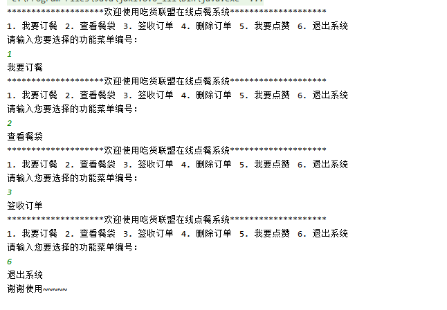
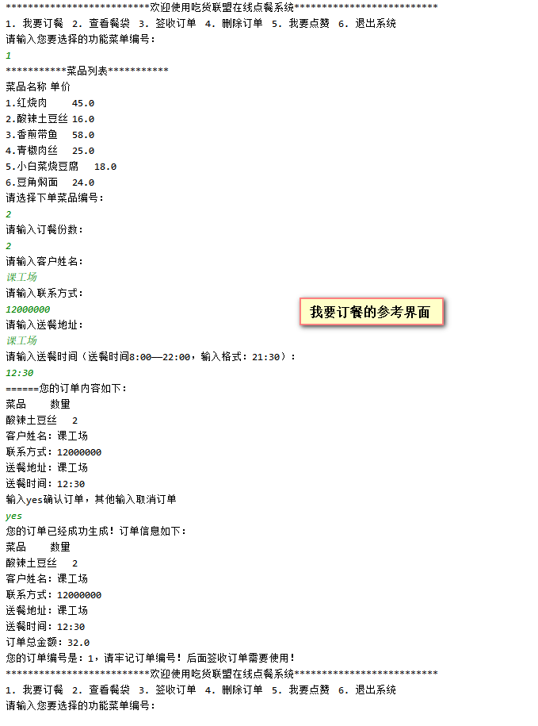

# 吃货联盟在线点餐系统的需求分析

## 1 构建点餐系统的功能菜单操作模式



```java
       // 1.输出点餐系统的欢迎界面
        do {
            //1-1 *****欢迎xxx****
            for(int i=0;i<20;i++){
                System.out.print("*");
            }
            System.out.print("欢迎使用吃货联盟在线点餐系统");
            for(int i=0;i<20;i++){
                System.out.print("*");
            }
            System.out.println();
            //1-2 提供项目的功能
            String[] menus = { "我要订餐", "查看餐袋", "签收订单", "删除订单", "我要点赞", "退出系统" };
            for (int i = 0; i < menus.length; i++) {
                System.out.print((i + 1) + ". " + menus[i] + "\t");
            }
            System.out.println();
            //获取用户输入
            Scanner input = new Scanner(System.in);
            //提示输入
            System.out.println("请输入您要选择的功能菜单编号：");
            int menuId = input.nextInt();
            //让用户知道自己在做什么功能！！！
            System.out.println(menus[menuId-1]);
            switch (menuId){
                case 1:
                    break;
                case 2:
                    break;
                case 3:
                    break;
                case 4:
                    break;
                case 5:
                    break;
                case 6://退出系统
                    System.out.println("谢谢使用~~~~~");
                    System.exit(0);//退出系统
                    //return;//return只是有jvm不再继续执行的现象，但是内存jvm没有停止
                    //break;
                default:
                    System.out.println("请升级系统！！");
                    break;
            }
            //System.out.println("输入over退出系统");
        } while (true);
```

## 2 退出系统的功能的实现

```java
 System.exit(0);//强制停止jvm，实现程序终止不再执行的效果
```

## 3 我要订餐功能的实现



```java
import java.util.Scanner;

/**
 * 实现点餐系统
 */
public class Main {
    //系统数据初始化，全局变量
    static String[] caiPin={"红烧肉"};
    static double[] price={};
    static int[] goods={};

    //保存订单信息的数据，全是数组，这些数组数据订单过程中，一边提示用户输入，一边填充
    /**
     * 保存用户订单
     */
    //订单菜品名称
    private static  String[] orderingDishes=new String[10];
    //订单菜品数量
    private static  int[] orderingDishesCount=new int[10];
    //送餐时间
    private static  String[] times=new String[10];
    //客户姓名
    private static  String[] userNames=new String[10];
    //联系方式
    private static  String[] phones=new String[10];
    //送餐地址
    private static  String[] addresses=new String[10];
    //订单金额
    private static  double[] prices=new double[10];
    //订单状态(true:已完成，false:未完成)
    private static boolean[] status=new boolean[10];
    public static void main(String[] args) {
        //订单个数计数器
        int num = 0;
	 // 1.输出点餐系统的欢迎界面
        do {
            //1-1 *****欢迎xxx****
            for(int i=0;i<20;i++){
                System.out.print("*");
            }
            System.out.print("欢迎使用吃货联盟在线点餐系统");
            for(int i=0;i<20;i++){
                System.out.print("*");
            }
            System.out.println();
            //1-2 提供项目的功能
            String[] menus = { "我要订餐", "查看餐袋", "签收订单", "删除订单", "我要点赞", "退出系统" };
            for (int i = 0; i < menus.length; i++) {
                System.out.print((i + 1) + ". " + menus[i] + "\t");
            }
            System.out.println();
            //获取用户输入
            Scanner input = new Scanner(System.in);
            //提示输入
            System.out.println("请输入您要选择的功能菜单编号：");
            int menuId = input.nextInt();
            //让用户知道自己在做什么功能！！！
            System.out.println(menus[menuId-1]);
            switch (menuId){
                case 1: //我要订餐
                    /**
                     * 1.输出系统提供的可以选择的菜品列表
                     */
                    System.out.println("***********菜品列表***********");
                    System.out.println("菜品名称\t单价\t");
                    for (int i = 0; i < caiPin.length; i++) {
                        System.out.println((i + 1) + "." + caiPin[i] + "\t" + caiPin[i]);
                    }
                    /**
                     * 2.提示用户输入自己要选择的菜品编号
                     */
                    System.out.println("请选择下单菜品编号：");
                    int dishNo = Integer.parseInt(input.nextLine());//菜品编号
                    System.out.println("请输入订餐份数：");
                    int count = Integer.parseInt(input.nextLine());//订餐份数
                    System.out.println("请输入客户姓名：");
                    String userName = input.nextLine();
                    System.out.println("请输入联系方式：");
                    String phone = input.nextLine();
                    System.out.println("请输入送餐地址：");
                    String address = input.nextLine();
                    System.out.println("请输入送餐时间（送餐时间8:00——22:00，输入格式：21:30）：");
                    String time = input.nextLine();
                    /**
                     * 将用户输入的信息打印出来，提示用户确认，如果确认信息无误，则保存订单，否则取消下单
                     */
                    System.out.println("======您的订单内容如下：");
                    System.out.println("菜品\t数量");
                    System.out.println(caiPin[dishNo - 1] + "\t" + count);
                    System.out.println("客户姓名：" + userName);
                    System.out.println("联系方式：" + phone);
                    System.out.println("送餐地址：" + address);
                    System.out.println("送餐时间：" + time);
                    System.out.println("输入yes确认订单，其他输入取消订单");
                    String answer = input.nextLine();
                    /**
                     * 3.下单
                     * 思路：保存用户下单信息：使用数据类型？数组，长度有限：10个订单
                     */
                    if (answer.equalsIgnoreCase("yes")) {
                        double orderPrice=price[dishNo - 1] * count;//订单金额
                        //保存订单
                        orderingDishes[num] = caiPin[dishNo - 1];
                        orderingDishesCount[num] = count;
                        userNames[num] = userName;
                        phones[num] = phone;
                        addresses[num] = address;
                        times[num] = time;
                        prices[num]=orderPrice;
                        num++;//计数订单个数
                        System.out.println("您的订单已经成功生成！订单信息如下：");
                        System.out.println("菜品\t数量");
                        System.out.println(caiPin[dishNo - 1] + "\t" + count);
                        System.out.println("客户姓名：" + userName);
                        System.out.println("联系方式：" + phone);
                        System.out.println("送餐地址：" + address);
                        System.out.println("送餐时间：" + time);
                        System.out.println("订单总金额：" + orderPrice);
                        System.out.println("您的订单编号是：" + num + "，请牢记订单编号！后面签收订单需要使用！");
                    } else {
                        System.out.println("您的信息已经取消。。");
                    }
                    break;
                case 2://输出订单信息
                    break;
                case 3:
                    break;
                case 4:
                    break;
                case 5:
                    break;
                case 6://退出系统
                    System.out.println("谢谢使用~~~~~");
                    System.exit(0);//退出系统
                    //return;//return只是有jvm不再继续执行的现象，但是内存jvm没有停止
                    //break;
                default:
                    System.out.println("请升级系统！！");
                    break;
            }
            //System.out.println("输入over退出系统");
        } while (true);
    }
}

```

