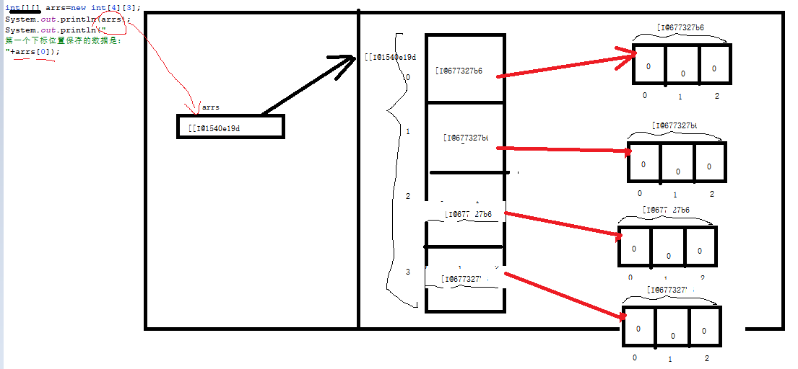
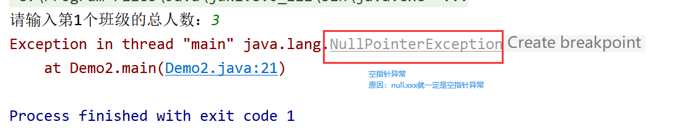

# 课程回顾

## 1 排序和查找方案

```html
*** 冒泡 ****
选择

二分法：实现二分法前提：数组必须升序排序
```

## 2 Arrays常用功能

```java
sort(数组)
// index:找到的话，排序后数组所在的位置   找不到：-插入点-1
int index=binarySearch(数组,找什么);
插入点：
   保证数组升序不变，将查找数据放置到的位置。
    
    进行查找的数组：0 10 89 123
    查找-100
    插入点：0-1===》-1
    
    查找333
    插入点：-4-1==》-5
```

## 回顾案例：冒泡排序实现升序和降序两种方式

```java
import java.util.Arrays;
import java.util.Collections;
import java.util.List;

/**
 * @Author: lc
 * @Date: 2022/3/15
 * @Description: 冒泡排序
 * @Version: 1.0
 */
public class ReviewDemo {
	/**
	 * 输出数组所有的数据：
	 * 1.for循环
	 * 2.JDK1.5 增强for
	 * 3. Arrays.toString()
	 */
	public static void main(String[] args) {
		int[] arr={-90,23,4,666,-122,88};
		//排序前结果，冒泡排序默认升序。
		//能否实现降序
		System.out.println(Arrays.toString(arr));
		for(int i=0;i<arr.length-1;i++){
			for(int j=0;j<arr.length-1-i;j++){
				if(arr[j] < arr[j+1]){
					int temp=arr[j];
					arr[j]=arr[j+1];
					arr[j+1]=temp;
				}
			}
		}
		System.out.println(Arrays.toString(arr));
	}
}

```

# 课程目标

## 1 二维数组 =========掌握

## 2 吃货联盟

# 课程实施

## 1 二维数组

### 1-1 概念

二维数组：数组每一个下标位置存储另外一个数组。

嵌套数组：二维数组（二维数组里面还有一种二维数组，可以称为不规则数组）

### 引入案例： 5个班级5个学生年龄？？

分析：1个班级5个学生的年龄，需要定义  int[] ages=new int[5]

那么现在有5个班级，就需要定义5个int[]类型的数组，代码如下所示：

方案一：五个数组，总结：具有相同数据类型，ages的数据类型int[]

```java
int[] ages1=new int[5];

int[] ages2=new int[5];

int[] ages3=new int[5];

int[] ages4=new int[5];

int[] ages5=new int[5];
```

方案一代码写完后，可以发现这么一个现象：五个数组具有相同数据类型，即ages的数据类型都是int[]。所以套用一维数组的数据类型由保存数据的类型决定，所以得出以下代码：

方案二：

```java
int[][] school=new int[5][5];//规则二维数组。表示school保存5个数组，每个数组里面各保存5个int整数
```

### 1-2 定义二维数组

```java
// 静态赋值
数据类型[][]  数组名={{值1,..,值n},{值1,...,值n},...,{值1,...,值n}};

如果数组保存多个数组，长度都不一样，二维数组又称为不规则数组  
   
// 动态赋值
 数据类型[][] 数组名=new 数据类型[保存几个数组][每个数组各自又保存几个值]
```

### 1-3 二维数组的遍历



```java
for(int i=0;i<数组名.length;i++){//控制第几个数组
    for(int j=0;j<数组名[i].length;j++){//控制当前这个数组第几个数组
        sout(数组名[i][j]);
    }
}

输出结果：
    000
    000
    000
    000
```

#### 补充：想要获取数组里面的某一个数据

```java
数组名[i][j];//i表示第几个数组  j表示当前数组里面第几个数据
```

### 1-4 课堂案例

需求：保存3个班级每个班级3个学生年纪

```java
import java.util.Arrays;
import java.util.Scanner;

/**
 * @Author: lc
 * @Date: 2022/3/15
 * @Description: 二维数组
 * @Version: 1.0
 */
public class Demo1 {
	public static void main(String[] args) {
		//1.先定义一个二维数组，jvm给二维数组赋默认值：int 0  小数：0.0 ...
		int[][] arrs=new int[3][3];//arrs一共保存9个数据
		//Scanner接收用户输入各个班级学生的年龄
		Scanner input = new Scanner(System.in);
		for(int i=0;i<arrs.length;i++){
			System.out.print("请输入第"+(i+1)+"个班级：");
			for(int j=0;j<arrs[i].length;j++){
				System.out.print("第"+(j+1)+"个学生的年纪：");
				arrs[i][j]=input.nextInt();//获取用户输入的年纪
			}
		}
		//普通for循环实现二维数组的输出
		for(int i=0;i<arrs.length;i++){//arrs.length:获取保存的数组个数
			for(int j=0;j<arrs[i].length;j++){
				System.out.print(arrs[i][j]+"\t\t");
			}
			//换行
			System.out.println();
		}
		//增强for
		for(int[] temp:arrs){
			System.out.println(temp);//temp输出什么
			for(int age:temp){
				System.out.print(age+"\t");
			}
			System.out.println();
		}
		//Arrays.toString()不能直接输出二维数组，所以必须先循环，拿到每个数组再使用Arrays.toString()
		for (int[] temp:arrs) {
			System.out.println(Arrays.toString(temp));
		}
	}
}

```

### 1-5 学生练习

需求：保存3个班级，N个学生的年龄

```java
int[][] ages=new int[3][];//3个班级各个班级就4个人！！！
for(){//控制班级
    sout("请输入第个班级的总人数：");
    //指定当前下标保存的数组长度！！！
    ages[i]=new int[总人数];
    for(){
        
    }
}
输出结构：
     12 3 4 5 5 ，平均年纪是：23
     12 3 4 5 5 ，平均年纪是：23
     12 3 4 5 5 ，平均年纪是：23
```

#### 参考代码

```java
import java.util.Scanner;

/**
 * @Author: lc
 * @Date: 2022/3/15
 * @Description: 不规则数组实现数据保存和显示
 * @Version: 1.0
 */
public class Demo2 {
	public static void main(String[] args) {
		//二维数组的定义方式
		int[][] ages=new int[3][];//思考：内存示例图，如何存储 因为没有指定内部保存各个数组的长度，jvm无法给出明确的地址

		//获取保存的第一个数组的地址？？null
		//System.out.println("ages[0]输出结果是："+ages[0]);//null
		Scanner input = new Scanner(System.in);
		for(int i=0;i<ages.length;i++){
			System.out.print("请输入第"+(i+1)+"个班级的总人数：");
			int size = input.nextInt();
			//定义保存size大小的int类型数组
			ages[i]=new int[size];//**********
			for(int j=0;j<ages[i].length;j++){//如何处理NullPointerException？？？
				System.out.println("请输入第"+(i+1)+"个班级第"+(j+1)+"个学生的年纪：");
				ages[i][j]=input.nextInt();
			}
		}
		//求和
		for(int[] temp:ages){
			int sum=0;
			for(int age:temp){
				sum+=age;
			}
			System.out.println("平均年纪："+sum/temp.length);
		}
	}
}

```

# 扩展：NULL值带来的程序问题

null:表示内存不存在该值。null因为不存在，因此不会分配哈希地址



# 课程总结

## 1 二维数组

二维数组定义、保存模式！！

二维数组循环方式！！！


## 2 不规则的二维数组和规则的二维数组有何区别？

规则二维数组：jvm创建每一个下标位置保存哈希地址，保存数组实际已经创建出来。

不规则二维数组：jvm创建每一个下标位置保存null。使用下标对应的数据前，必须手动将null覆盖掉。否则，程序提示：NullPointerException


# 课程预习

周六上午实训课：项目答辩