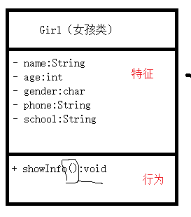
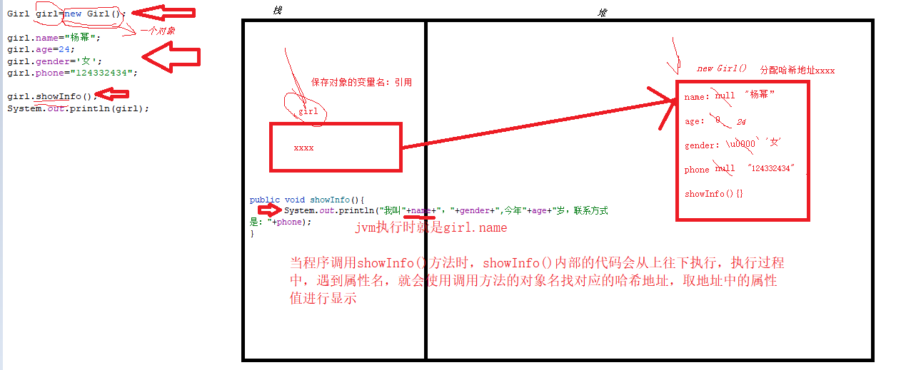
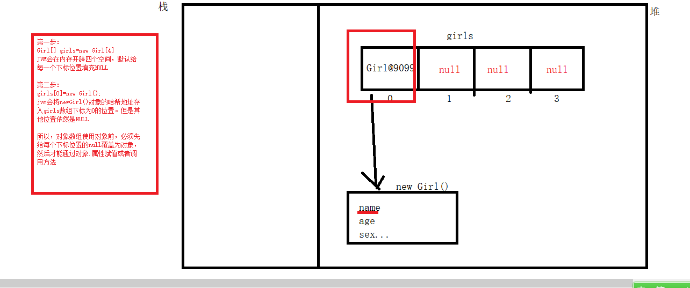
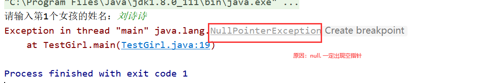

# 课程回顾

## 基础知识：重点

```html
1.变量、常量
2.数据类型
3.运算符
4.流程控制语句：
分支结构（选择结构：if if-else 多重if switch-case）
*** return+if 
循环结构（for循环 嵌套循环 do-while  while）
 排序  二分法

数组（循环数组、数组定义、数组赋值）
排序、查找、删除 逻辑提升

死记硬背  多写多练 业务需求理解能力***

OOP难在理解
提升程序维护性、解耦、
建议：模仿，多写多练
```

# 课程目标

## 1 类和对象概念、关系

## 2 面向对象编程优势

## 3 类和对象定义语法

## 4 对象数组

# 课程实施

## 1 面向对象编程优势

OOP：Object Oriented  Programme

### 1-1 面向过程编码形式

做饭：西红柿炒鸡蛋

解决方案有几种：

第一种：自己做，亲力亲为

````html
1.准备食材，切番茄，打鸡蛋，准备葱姜蒜
2.起锅烧油，炒鸡蛋，炒成金黄色，盛起备用
3.起锅烧油，倒入番茄，炒一会儿，+鸡蛋
4.加调料  盛起来
5.吃
6.自己收拾
````

自己不会做。但是吃上西红柿炒蛋。找准一个对象，提供结果

第二种：女朋友做

```html
不知道。最后吃上了
第一步：找对象（女朋友）
第二步：下命令
第三步：吃饭

```

第三种：点外卖

```html
第一步：打开app
第二步：找一家店
第三步：点餐，下命令
第四步：给钱
第五步：坐等吃饭
第六步：直接扔垃圾
```


编程：程序员**亲力亲为**解决每一个实现步骤

````html
举例：求两数最大值的案例
两数怎么来？
定义两个变量 
int a=12  int b=12

int max=a>b?a:b

sout(max)
````

### 1-2 面向对象编码形式

Scanner提供获取用户输入数据的服务。

可维护性  可扩展性  阅读性

面向对象最重要的一件事：找对象！！！！

编程特点：程序员只要找到方法调用，能够解决需求方案即可，不用自己关注实现过程

```html
举例：求两数最大值的案例
两数怎么来？
定义两个变量 
int a=12  int b=12

sout(Math.max(a,b))
```

## 2 OOP如何实现

找到一个合适的对象！！！

### 2-1 对象概念

```html
对象就是实体！！！
```

"万物皆对象"

**实际存在**的个体！！

举例: 李老师   邱再兴  张健  你的电脑   张晓霞老师的手机  810路公交车  迪丽热巴

女朋友的概念  杯子概念  电脑概念   手机概念  女明星概念

### 2-2 类的概念

```html
类:对现实生活中具有共同的属性(事物的特征)和行为(事物的活动)的事物的统称
```

类：实际不存在！！ 通过对一组具有相同的属性或行为分析，抽取而成一个概念。

类对对象一个统一的称呼

学生类： 邱再兴  张健

教师类：李老师

电器类：你的电脑   张晓霞老师的手机

## 3 OOP实现步骤

### 3-1 女朋友类

```html
1.找到能代表女朋友类的实体（对象）
  林志玲  妲己   刘亦菲  吉克隽逸   杨幂   七仙女中老七
2.具有公共的特征（属性）  公共的能力（行为）分析
  特征（形容词）：姓名 性别  年龄 联系方式  身高  体重  头发颜色  皮肤颜色  爱好 职业  收入  毕业院校...
  能力（动词）：自我介绍   唱歌 演戏  跳舞  

3.根据需求，形成最后类图
健身馆的会员管理系统
需求分析： 
特征（形容词）：姓名 性别  联系方式 年龄  身高  体重   爱好 职业  收入 ...
能力（动词）：自我介绍   唱歌 演戏  跳舞 

学生管理系统
特征（形容词）：姓名  性别 联系方式  年龄  毕业院校...
能力（动词）：自我介绍

4.java代码
```

### 3-2 得出类图



### 3-3 使用java定义类语法转换类图

类由哪几部分？类=属性+方法

```java
public  class  类名{
    //特征 （属性）
    //属性语法就是 变量，属性为了普通变量以示区分，建议属性前面+public
    public 数据类型 属性名;
    public 数据类型 属性名;
    //... 属性名：驼峰命名法
    public 数据类型 属性名;
    
    //行为（方法）
    //方法名：驼峰命名法 ()
    public void 方法名(){
        //行为具体是怎么说，行为实现方式
    }
}
```

### 3-4 对象定义语法

```java
类名 变量名=new 类名();//
```

### 3-5 对象如何给属性赋值

```java
对象名.属性名=值;//值的类型如何确定？看class定义时属性类型，必须兼容的
```

### 3-6 对象如何调用方法

```java
对象名.方法名();
```

### 课堂案例

- Girl类

```java
/**
 * 类的作用：定义女朋友类
 * 描述：属性、 方法
 * @verion:1.0
 * @Date:2022-03-18
 * @author:K0502
 * @package
 * ...
 */
public class Girl {
	//属性
	/**
	 * 姓名
	 */
	public String name;
	/**
	 * 年龄
	 */
	public int age;
	/**
	 * 性别
	 */
	public char gender;
	/**
	 * 联系方式
	 */
	public String phone;

	//方法

	/**
	 * showInfo()自我介绍：
	 * 我叫xx，xx,今年xx岁，，联系方式是：xx
	 * xx地方替换属性名
	 */
	public void showInfo(){
		System.out.println("我叫"+name+"，"+gender+",今年"+age+"岁，联系方式是："+phone);
	}
}
```

- 测试类

```java
/**
 * 测试类：主要作用测试定义类中方法是否正确，属性是否完整
 * 主要特点：没有属性，必须PSVM
 */
public class Main {

    public static void main(String[] args) {
	    // 1.创建对象，对象也是数据，也需要调用
        //类名 变量名=new 类名();
        Girl girl=new Girl();
        //1-1 属性赋值，对象具体化
        girl.name="杨幂";
        girl.age=24;
        girl.gender='女';
        girl.phone="124332434";
        //2.调用方法
        girl.showInfo();
    }
}
```

### 学生练习

需求：宠物类Pet

```html
1. 找对象
   小花猫   大黄狗   小兔子
2. 抽取具有相同的属性和方法 
  属性：nickName-昵称  颜色-color  性别-sex  品种--brand  价格-price
  方法：public void showInfo(){}
3. 筛选，形成类图
 抽取具有相同的属性和方法
  属性：nickName-昵称  颜色-color  性别-sex  品种--brand  价格-price
  方法：public void showInfo(){}
4. 转换java代码

5. 创建宠物对象：

```

#### 需求扩展：创建4个宠物对象

最后四行的：分别调用每个宠物showInfo()显示对象各自的属性信息。

```java
分析：
    1.保存四个数据
    2.四个数据类型都是宠物类型
得出结论：数组！！！！
```

### 3-7  小结

```html
1.类和对象区别
类实际不存在的，只是一个概念
对象实际存在的，具体的属性和方法

2. 类由几部分？类由属性和方法组成
public class 类名{
   //属性
   //方法
}

3.类和对象存在什么关系？
 类是java一种 引用类型 数据类型
 按照变量定义的语法来分析：类是数据类型，对象就是类这种类型的值。
   类 变量=对象！！！！！！！！
所以，类和对象的关系是：
对象是类在实际生活中的体现，类是对象在java中描述数据的类型
```

## 5 对象在内存中分析



### 参考代码

```java
/**
 * 测试类：主要作用测试定义类中方法是否正确，属性是否完整
 * 主要特点：没有属性，必须PSVM
 */
public class Main {
    public static void main(String[] args) {
	    // 1.创建对象，对象也是数据，也需要调用
        //类名 变量名=new 类名();
        Girl girl=new Girl();
        //1-1 属性赋值，对象具体化
        girl.name="杨幂";
        girl.age=24;
        girl.gender='女';
        girl.phone="124332434";
        //2.调用方法
        girl.showInfo();

        //第二个对象
        //new Girl();//匿名对象，有且只能使用一次
        Girl first = new Girl();
        //创建对象，jvm在堆中开辟空间，分配内存地址，并给每一个属性赋予默认值
        Girl second = new Girl();
        //通过变量名second中保存的地址找到对应的对象，并修改该对象的name属性值
        second.name="妲己";
        
		//引用类型的变量中始终保存的堆中值对应的哈希地址，这一点跟数组是一致的
        System.out.println(girl);//Girl@3243ab4
        //对象创建之后，jvm会在内存中填充默认值，默认值与数组的默认值是一致的
        System.out.println(first.name);//null
        //当程序通过对象名保存的地址找到对应的地址赋值后，null就会被新值覆盖
        System.out.println(second.name);//妲己
    }
}
```

## 6 对象数组

数组里面每个下标位置存储的都是一个对象！！！

### 6-1 对象数组定义语法

```java
//动态赋值,JVM对于对象数组，默认值是什么NULL
类名[]  数组名=new 类名[对象个数];

//静态赋值
类名[]  数组名={new 类名(),new 类名(),new 类名(),...,new 类名(),};

结论：引用数据类型定义数组，动态赋值默认值都是NULL 
```

### 6-2 使用对象数组

数组应用没有变

### 课堂案例 使用对象数组保存4个Girl类型的对象



```java
import java.util.Scanner;

/**
 * @Author: lc
 * @Date: 2022/3/18
 * @Description: 创建对象，通过对象给属性赋值，并调用方法
 * @Version: 1.0
 */
public class TestGirl {
	public static void main(String[] args) {
		//1.定义变量，保存14个Girl类型的对象 默认值都是NULL
		Girl[] girls= new Girl[4];//{new Girl(),new Girl(),new Girl(),new Girl()};

		//2.Scanner获取四个Girl对象的基本信息
		Scanner input = new Scanner(System.in);
		for(int i=0;i<girls.length;i++){
			System.out.print("请输入第"+(i+1)+"个女孩的姓名：");
			//girls[i]==>对象.访问里面的属性或方法
			//girls[i]==>null???
			//解决方案二
			girls[i]=new Girl();
			girls[i].name=input.next();//姓名获取到之后，存到哪儿去？？？
			System.out.print("请输入第"+(i+1)+"个女孩的年龄：");
			girls[i].age= input.nextInt();
		}

		//输出四个对象的属性值
		for(Girl girl:girls){
			girl.showInfo();
		}
	}
}
```

#### 如果不使用对象数组，程序需要定义多个Girl对象并使用，会产生大量的重复代码，代码如下

```java
import java.util.Scanner;

/**
 * @Author: lc
 * @Date: 2022/3/18
 * @Description: 创建对象，通过对象给属性赋值，并调用方法
 * @Version: 1.0
 */
public class TestGirl {
	public static void main(String[] args) {
		//创建第一个对象
		Girl g1=new Girl();//内存生成一个哈希地址，jvm地址所有的girl类定义属性赋予默认值
		//使用对象名.属性给属性赋值：对象实际化
		g1.name="杨幂";
		g1.age=24;
		g1.gender='女';
		g1.phone="14335345";

		//创建第二个对象
		Girl g2=new Girl();//????
		g2.name="杨幂";
		g2.age=24;
		g2.gender='女';
		g2.phone="14335345";
        
        //....省略了其他两个对象的创建代码

		g1.showInfo();
		g2.showInfo();
	}
}

```


## 7 对象数组常见的异常



# 课程总结

## 1 掌握 类和对象语法

##  掌握  对象数组

##  掌握对象在其他类中如何调用类里面定义的属性和方法


## 2 理解  类和对象关系、概念  类由属性和方法两部分组成

## 3 模仿  如何通过对象调用属性和方法

```html
对象名. 属性
.称为成员访问符
```


# 预习安排

## 方法：

方法定义语法

不同方法在其他类如何调用

区分 形参和实参