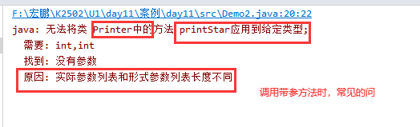

# 课程回顾

## 1 类 对象 存在关系 类由几部分组成

```java
类就是java的一种数据类型
通过类这种类型创建的数据统称为对象    
    
类由属性和方法两部分组成
```

## 2 定义类语法 定义对象

```java
public class 类名{
    //属性，全局变量
    
    //方法，
}

类名  变量名=new 类名();//对象在内存就产生
```

## 3 对象数组

```java
类名[] 数组名=new 类名[长度];
//JVM根据指定数据个数，内存开辟连续N个空间，保存数据。默认值
int:0
double:0.0
    
引用类型定义的数组，看不到new 类名().默认NULL
    
数组[0]=new 类名();//NULL
```

# 课程目标

## 1 方法定义 ======= 掌握

## 2 方法调用 ======= 精通！！

## 3 形参和实参区别 ============= 理解

## 4 全局变量和局部变量区别 ========== 理解

# 课程实施

## 1 方法

### 1-1 方法概念

  解决问题的方案

### 1-2 作用

团队开发中，实现同一个功能的复用，而不用反复编写程序处理方案。

### 1-3 方法定义

```java
访问修饰符 返回值类型 方法名(形参列表){
    //解决方案
    
    return 值;
}
语法说明：
访问修饰符：public
返回值类型：
    1 解决方案后面出现return这个单词，返回值类型可以java任意一种数据类型（int double  数组  类  接口...)
    2 解决方案后面没有出现return这个单词，返回值类型一定是void
方法名：驼峰命名 ，见词知意
形参列表：变量定义
```

### 1-4 使用场景

#### 1-4-1 无参无返回值

```java
public void 方法名(){
    //方法体：解决方案
}
```

##### 调用方式

```java
对象.方法名();
```

#### 练习：

```html
* * *
* * *
* * *
OOP思想套路：
1.创建一个类 Printer
2.方法 print(){打印图形的解决办法}

3.测试类：psvm
3-1 对象.print()
```

##### 参考代码

- 定义类，提供打印图形的方法

```java
/**
 * @Author: lc
 * @Date: 2022/3/19
 * @Description: 打印图形类
 * @Version: 1.0
 */
public class Printer {
	/**
	 * 输出3行，每行3个*
	 */
	public void printStar(){
		//处理打印图形的办法
		for(int i=0;i<3;i++){
			for(int j=0;j<3;j++){
				System.out.print("*");
			}
			System.out.println();
		}
	}
}

```

- 创建测试类，调用方法测试代码

```java
/**
 * @Author: lc
 * @Date: 2022/3/19
 * @Description: PACKAGE_NAME
 * @Version: 1.0
 */
public class Demo {
	public static void main(String[] args) {
		//1.找对象
		Printer p = new Printer();
		//2.通过对象执行对应的printStar
		p.printStar();
	}
}
```

#### 1-4-2 有参无返回值

```java
public void 方法名(形式参数列表，一般简称为形参列表){
    //方法体：解决方案
}

void:方法没有返回值
```

##### 方法调用语法

```java
对象.方法名(实际参数列表，一般简称实参列表)

实参和形参必须遵循以下使用原则：
    实参与形参列表类型一致、个数一致、顺序一致的值
```

#### 课堂案例：打印图形

- 打印图形的类，提供打印方法

```java
/**
 * @Author: lc
 * @Date: 2022/3/19
 * @Description: 打印图形类
 * @Version: 1.0
 */
public class Printer {
	//属性
	//public int rows;//行数
	//public int cols;//列数，其实就是*个数

	/**
	 * 输出3行，每行3个*
	 * 优化点：定义方法的人，如果可以将行数、每行*个数成：谁调用方法，谁指定
	 * 打印矩形的功能，复用性可能会更好！！
	 *
	 * 发现问题：属性并不能强制要求使用者赋值
	 * 调用方法时，要求使用者不给值，不能用！！！更加符合题目的需求
	 * @param rows 打印图形的总行数
	 * @param cols 每行图形打印*个数
	 */
	public void printStar(int rows,int cols){
		//处理打印图形的办法
		for(int i=0;i<rows;i++){
			for(int j=0;j<cols;j++){
				System.out.print("*");
			}
			System.out.println();
		}
	}
}

```

- 创建测试类，调用打印图形的方法

```java
/**
 * @Author: lc
 * @Date: 2022/3/19
 * @Description: 测试类
 * @Version: 1.0
 */
public class Demo {
	public static void main(String[] args) {
		//1.找对象
		Printer p = new Printer();
		//2.通过对象执行对应的printStar
		p.printStar(5,5);

	}
}
```

#### 学生练习：

需求：定义计算器类。实现求两个整数和的方法

##### 参考代码

- 定义计算器

```java
/**
 * @Author: lc
 * @Date: 2022/3/19
 * @Description: 计算器类
 * @Version: 1.0
 */
public class Calculator {
	/**
	 * 实现两个整数求和
	 * 抽取方法时，尽可能尝试不要将Scanner定义在某个方法中
	 * Scanner合适位置：测试类
	 * @param num1 参与求和运算的第一个整数
	 * @param num2 参与求和运算的第二个整数
	 */
	public void add(int num1,int num2){
		int sum=num1+num2;
		System.out.println("和是："+sum);
	}
}
```

- 调用计算器的方法

```java
import java.util.Scanner;

/**
 * @Author: lc
 * @Date: 2022/3/19
 * @Description: PACKAGE_NAME
 * @Version: 1.0
 */
public class TestCalculator {
	public static void main(String[] args) {
		Scanner input=new Scanner(System.in);
		System.out.println("请输入第一个数据：");
		int a = input.nextInt();
		System.out.println("请输入第二个数据：");
		int b = input.nextInt();

		//想干啥？？求和，还需要自己亲力亲为吗？不用找对象
		Calculator c=new Calculator();
		c.add(a,b);

		//c.add(int num1=5,int num2=6)

	}
}
```

#### 1-4-3 无参有返回值

```java
public 与返回值类型兼容的数据类型  方法名(){
    //方法体
    
    return 值;
}
```

##### 调用方式

```java
与返回值类型兼容的数据类型 变量名=对象.方法名();
```

#### 1-4-4 有参有返回值

```java
public 与返回值类型兼容的数据类型  方法名(形参列表){
    //方法体
    
    return 值;
}
```

##### 调用方式

```java
与返回值类型兼容的数据类型 变量名=对象.方法名(实参列表);
```

#### 课堂案例

- 定义计算器类，实现两数求和的方法

```java
/**
 * @Author: lc
 * @Date: 2022/3/19
 * @Description: 计算器类
 * @Version: 1.0
 */
public class Calculator {
	/**
	 * 实现两个整数求和
	 * 抽取方法时，尽可能尝试不要将Scanner定义在某个方法中
	 * Scanner合适位置：测试类
	 * @param num1 参与求和运算的第一个整数
	 * @param num2 参与求和运算的第二个整数
	 */
	//public 返回值是什么类型，方法返回值就是该值的兼容类型  add(int num1,int num2){
	public double  add(int num1,int num2){
		int sum=num1+num2;
		//一件事情处理结果已经产生，方法定义人没有办法兼顾所有调用者输出需求，建议计算结果返回给调用人，自行处理
		//System.out.println("和是："+sum);
		//返回给调用的人
		return sum;
	}
}
```

- 创建测试类，调用求和方法，并输出求和结果

```java
import java.util.Scanner;

/**
 * @Author: lc
 * @Date: 2022/3/19
 * @Description: PACKAGE_NAME
 * @Version: 1.0
 */
public class TestCalculator {
	public static void main(String[] args) {
		Scanner input=new Scanner(System.in);
		System.out.println("请输入第一个数据：");
		int a = input.nextInt();
		System.out.println("请输入第二个数据：");
		int b = input.nextInt();

		//想干啥？？求和，还需要自己亲力亲为吗？不用找对象
		Calculator c=new Calculator();
		/*
		* 疑问：调用别人的方法时，方法设定的sout一定是程序需要的输出格式吗？？？
		* 连加运算
		 */
		double sum=c.add(a,b);//前两个数和
		System.out.println(a+"+"+b+"="+sum);
	}
}

```

### 整合：计算器提供两个方法：求三个整数 求N个整数

#### 求三个整数和

- 计算器类

```java
/**
 * @Author: lc
 * @Date: 2022/3/19
 * @Description: 计算器类
 * @Version: 1.0
 */
public class Calculator {
	/**
	 * 实现两个整数求和
	 * 抽取方法时，尽可能尝试不要将Scanner定义在某个方法中
	 * Scanner合适位置：测试类
	 * @param num1 参与求和运算的第一个整数
	 * @param num2 参与求和运算的第二个整数
	 */
	//public 返回值是什么类型，方法返回值就是该值的兼容类型  add(int num1,int num2){
	public double  add(int num1,int num2){
		int sum=num1+num2;
		//一件事情处理结果已经产生，方法定义人没有办法兼顾所有调用者输出需求，建议计算结果返回给调用人，自行处理
		//System.out.println("和是："+sum);
		//返回给调用的人
		return sum;
	}

	public double add(int num1,int num2,int num3){
		return num1+num2+num3;
	}

	public double add(int num1,double num2){
		return num2+num1;
	}
}

```

- 测试类

```java
import java.util.Scanner;

/**
 * @Author: lc
 * @Date: 2022/3/19
 * @Description: PACKAGE_NAME
 * @Version: 1.0
 */
public class TestCalculator {
	public static void main(String[] args) {
		Scanner input=new Scanner(System.in);
		System.out.println("请输入第一个数据：");
		int a = input.nextInt();
		System.out.println("请输入第二个数据：");
		int b = input.nextInt();
        
		System.out.println("请输入第三个数据：");
		int c = input.nextInt();

		//想干啥？？求和，还需要自己亲力亲为吗？不用找对象
		Calculator c=new Calculator();
		
		double sum=c.add(a,b,c);
		System.out.println(a+"+"+b+"+"+c+"="+sum);
	}
}

```

#### 求N个整数和


- 计算器类

```java
/**
 * @Author: lc
 * @Date: 2022/3/19
 * @Description: 计算器类
 * @Version: 1.0
 */
public class Calculator {
	/**
	 * 实现两个整数求和
	 * 抽取方法时，尽可能尝试不要将Scanner定义在某个方法中
	 * Scanner合适位置：测试类
	 * @param num1 参与求和运算的第一个整数
	 * @param num2 参与求和运算的第二个整数
	 */
	//public 返回值是什么类型，方法返回值就是该值的兼容类型  add(int num1,int num2){
	public double  add(int num1,int num2){
		int sum=num1+num2;
		//一件事情处理结果已经产生，方法定义人没有办法兼顾所有调用者输出需求，建议计算结果返回给调用人，自行处理
		//System.out.println("和是："+sum);
		//返回给调用的人
		return sum;
	}

	public double add(int num1,int num2,int num3){
		return num1+num2+num3;
	}

	public double add(int num1,double num2){
		return num2+num1;
	}

	/**
	 * 求N个整数和
	 * 调用者给几个int，数组长度就是几？
	 * int[] numbs方法里面可以直接循环吗？？？why???
	 * jvm在内存执行方法过程：
	 * 1.实参，实参值赋给形参
	 * 2.才开始执行方法中的代码体
	 * @return
	 */
	public double add(int[] numbs){
		double sum=0;
		for(int a:numbs){
			sum+=a;
		}
		return sum;
	}
}
```

- 测试类

```java
/**
 * @Author: lc
 * @Date: 2022/3/19
 * @Description: 测试数组作为参数的方法，如何实现调用
 * @Version: 1.0
 */
public class TestCalculator2 {
	public static void main(String[] args) {
		// 找对象
		Calculator c = new Calculator();
		// 干啥
		/*int[] temp={1,2,3,5,5};
		c.add(temp);//int[] numb*/

		//jvm执行到这行时，就会将new int[]{1,2,3,5,5}赋给形参int[] numbs
		//所以add(){}方法体循环时，数组的长度就已经确定了
		c.add(new int[]{1,2,3,5,5});

	}
}
```

## 2 形参和实参的区别


```html
定义位置：
形参：方法定义时
实参：方法调用时

赋值问题
形参：形参不需要赋值，只需要指明数据类型
实参：必须赋值。

形参和实参存在一定关系：
形参和实参必须保证：类型一致、顺序一致、个数一致
```

## 3 重载

### 3-1 概念

```html
同一个类中，出现方法名称相同，形参列表不同。
形参不同体现在哪些方面：
1.参数个数不一样
2.形参顺序不一样
3.形参类型不一样
方法重载与方法的返回值没有任何关系！！！
不能以方法返回值是否一样，来判断方法是否重载
```

### 3-2 作用

```html
简化调用者记忆方法名称的负担。简化方法定义人命名方法负担
实现同一个方法不同的实现，增强代码的灵活性！！！
```

### 3-3 如何区分调用的是重载后的哪一个方法呢？

```html
jvm根据实参的类型、个数、顺序匹配具体执行的方法及方法体
```

## 常见的程序问题

### 1 方法调用时，形参和实参类型、个数、顺序不一致造成的错误



# 课程总结

## 1 无参无返回值  无参有返回值  有参无返回值  有参有返回值

定义和调用语法整理！！！！！

## 2 无参无返回值方法：抽取掉Scanner  sout。剩下的代码报错。


## 3 重载！！！ 

3W1H: what  why where  how

## 封装 

## 如何实现封装  

## 访问修饰符  

## 构造方法


