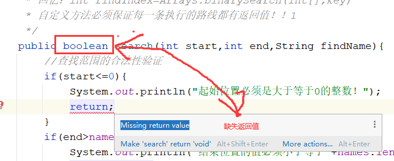

疑问：

1.创建类  定义方法（形参、返回值）

2.java实现非常复杂功能，SUN提供的jdk、找第三方的工具来实现

3.开发工作，面临自己的写方法

# 课程回顾

## 1 方法定义语法和调用语法*******

```java
public void 方法名(){
    
}
调用：对象.方法名()
    
public void 方法名(形参列表){
    
}
调用：对象.方法名(实参列表)
    
public 与返回值类型兼容的java数据类型 方法名(形参列表){
    return 值;//将方法执行的结果返回给方法调用人
}
调用：与返回值类型兼容的java数据类型 变量=对象.方法名(实参列表)
    
public 与返回值类型兼容的java数据类型 方法名(){
    return 值;//将方法执行的结果返回给方法调用人
}
调用：与返回值类型兼容的java数据类型 变量=对象.方法名()
```

## 2 重载 **************

```java
同一个类中，方法名一样的，形参列表不一样（个数不一样、数据类型不一样，顺序不一样）

JVM如何区分使用的重载后的哪一个方法？主要看实参列表
```

## 3 形参和实参

```html
出现位置不同
形参 出现定义方法时，
实参 出现方法调用时

赋值时机不同
形参不需要赋值，只需要指明形参的类型，
实参必须赋值，只有赋值的参数才能传递给方法使用

```

## 课后作业第四题

### 第一步：实现学生信息的添加功能

#### 方案一：

- 学生管理类

```java
public class StudentManagement {
	/**
	 * 新增学生
	 */
	public void add(){
        Scanner input = new Scanner(System.in);
        //定义数组保存学生信息
		String[] names=new String[5];
		for(int i=0;i<names.length;i++){
			System.out.println("请输入学生的姓名：");
			names[i]=input.next();
        }
		//输出所有的学生的姓名
		System.out.println("本班所有学生的姓名如下所示：");
		for (String name:names) {
			System.out.print(name+"\t\t");
		}
	}
```

- 测试类

```java
import java.util.Scanner;

/**
 * @Author: lc
 * @Date: 2022/3/21
 * @Description: 测试学生管理类中添加学生信息的方法
 * @Version: 1.0
 */
public class TestStudentManagement {
	public static void main(String[] args) {
		StudentManagement sm = new StudentManagement();
		//提交给学生管理类，新增
		sm.add();
	}
}
```

#### 方案二：

- 学生管理类

```java
/**
 * @Author: lc
 * @Date: 2022/3/21
 * @Description: 学生管理类，主要提供：添加学生和查找学生的功能
 * @Version: 1.0
 */
public class StudentManagement {
	//定义数组，全局变量,属性！！！！
	String[] names=new String[5];
	/**
	 * 新增学生
	 */
	public void add(String studentName){
		for (int i=0;i<names.length;i++) {
			//在数组找空位置，来一个学生，就往空位置存入一个学生
			if (names[i] == null) {
				names[i] = studentName;
				break;
			}
		}
	}

	/**
	 * 显示数组所有的学生信息
	 */
	public void showInfo(){
		//输出所有的学生的姓名
		System.out.println("本班所有学生的姓名如下所示：");
		for (String name:names) {
			System.out.print(name+"\t\t");
		}
	}
}
```

- 测试类

```java
import java.util.Scanner;

/**
 * @Author: lc
 * @Date: 2022/3/21
 * @Description: 测试学生管理类中添加学生信息的方法
 * @Version: 1.0
 */
public class TestStudentManagement {
	public static void main(String[] args) {
		Scanner input = new Scanner(System.in);
		StudentManagement sm = new StudentManagement();
		for(int i=0;i<5;i++){
			System.out.println("请输入学生的姓名：");
			String str=input.next();
			//提交给学生管理类，新增
			sm.add(str);
		}

		//查看存入数据后，数组的所有的数据
		sm.showInfo();
	}
}
```

## 第二步：实现学生信息在指定范围内查找

- 学生管理类

```java
/**
 * @Author: lc
 * @Date: 2022/3/21
 * @Description: 学生管理类，主要提供：添加学生和查找学生的功能
 * @Version: 1.0
 */
public class StudentManagement {
	//定义数组，全局变量,属性！！！！，默认null
	String[] names=new String[5];

	/**
	 * 查找学生
	 * 回忆：int findIndex=Arrays.binarySearch(int[],key)
	 * 自定义方法必须保证每一条执行的路线都有返回值！！1
	 * @param start 开始查找的位置
	 * @param end 结束查找的位置
	 * @param findName 要查找的学生姓名
	 */
	public boolean search(int start,int end,String findName){
		//查找范围的合法性验证
		if(start<=0){
			System.out.println("起始位置必须是大于等于0的整数！");
			return false;
		}
		if(end>names.length){
			System.out.println("结束位置的值必须小于等于"+names.length);
			return false;
		}
		if(end<start){
			System.out.println("结束位置必须大于等于开始位置！");
			return false;
		}
		//定义保存查找到的学生所在位置下标的变量
		int findIndex=-1;

		for(int i=start-1;i<end;i++){
			//避免NullPointerException，建议将明确值的变量放在前面
			if(findName.equals(names[i])){//names[i].equals(findName)
				findIndex=i;
				break;
			}
		}
		return findIndex>-1;//true-找到了  false--未找到
	}
}

```

- 测试类，测试学生查找的功能

```java
import java.util.Scanner;

/**
 * @Author: lc
 * @Date: 2022/3/21
 * @Description: 测试学生管理类中的查找学生信息的方法
 * @Version: 1.0
 */
public class TestStudentManagement {
	public static void main(String[] args) {
		Scanner input = new Scanner(System.in);
		StudentManagement sm = new StudentManagement();

		System.out.println("请输入开始查找的位置：");
		int start = input.nextInt();
		System.out.println("结束查找的位置：");
		int end = input.nextInt();
		System.out.println("请输入要查找的学生姓名：");
		String findName = input.next();
		boolean isOk = sm.search(start, end, findName);
		if(isOk==true){//if(isOk)等价的
			System.out.println("找到了");
		}else{
			System.out.println("未找到");
		}
	}
}

```

# 课程目标

## 1 全局变量和局部变量的区别 ==== 理解

## 2 按值传递和按引用传递区别 ==== 理解

## 3 构造方法 =============重点

# 课程实施

## 1 按值传递和按引用传递

传参是什么意思？调用方法并传入实参过程

### 1-1 传参的形式分为两类

#### 按值传递：

调用方法时，传入的实参类型都是基本类型。String虽然是引用类型，但是参数传递的时候，遵循按值传递的特点

特点：按值传递时，将实参的值复制一份交给形参使用。方法对形参的数据无论做什么操作，跟实参没有任何关系！！

形参的值发生变化，不影响实参。

#### 按引用（即地址）传递

调用方法时，传入的实参类型都是引用类型。

特点：按引用传递时，将实参的地址复制一份交给形参使用。方法对形参地址指向的位置的数据进行操作，实参也地址也是指向当前堆中的数据，堆中的数据变化，所有引用该地址的变量值都会变化

形参的值发生变化，实参同步发生变化

### 1-2 案例分析：按值传递和按引用传递的区别

#### 按值传递

```java
/**
 * @Author: lc
 * @Date: 2022/3/21
 * @Description: PACKAGE_NAME
 * @Version: 1.0
 */
public class Calculator {
	/**
	 * 就是将用户传入的int类型数据进行修改
	 * @param i 用户调用方法时传入的实际值
	 */
	public void changeNum(int i){
		i=100;
	}
}

```

#### 按引用传递

```java
/**
 * @Author: lc
 * @Date: 2022/3/21
 * @Description: PACKAGE_NAME
 * @Version: 1.0
 */
public class Calculator {
	/**
	 * arr数组里面只有一个值
	 * @param arr
	 */
	public void changeNum2(int[] arr){
		arr[0]=100;
	}
}

```

#### 程序测试的结果

```java
/**
 * @Author: lc
 * @Date: 2022/3/21
 * @Description: PACKAGE_NAME
 * @Version: 1.0
 */
public class TestCalculator {
	public static void main(String[] args) {
		Calculator c = new Calculator();
		int num=0;
		//没有起作用！！！？？？按值传递
		c.changeNum(num);
		System.out.println("num="+num);//num=0

		//按引用传递
		int[] temp=new int[1];
		temp[0]=num;
		//技巧：int[] arr=new int[]{0}
		c.changeNum2(temp);
		System.out.println("num="+temp[0]);//num=100
	}
}
```

## 2 全局变量和局部变量

### 2-1 概念

类里面，方法外面定义的变量，统称为全局变量

方法的形参以及方法内部定义变量，统称为局部变量

### 2-2 区别

```html
定义位置不同
全局变量：类里面，方法外面
局部变量：方法形参和方法内部

初始值不同
全局变量：程序员可以不赋值，创建对象时JVM给默认值
局部变量：程序员必须赋值，遵循变量使用规则：先定义、再赋值，才能使用

使用范围不同：
全局变量：类中所有的方法都可以引用全局变量
局部变量：哪个方法定义，只能由该方法使用，其他方法访问不到！！

生命周期不同：
全局变量：随着对象产生而产生，对象销毁内部全局变量也会被销毁  活得时间长
局部变量：随着方法调用而产生，方法弹栈，内部的局部变量就会全部销毁   活得时间短
优先考虑使用局部变量。
一个类中，很多方法使用同一个数据时，考虑使用全局变量

变量内存保存位置不同：
全局变量：都在堆中
局部变量：变量名都在栈中


使用关系：
全局变量和局部变量可以同名。一个方法如果使用了同名变量，如何判断使用的是全局还是局部？就近原则
优先使用局部变量。

如果使用全局变量，解决方案是？this访问全局变量
```

## 3 课后作业第十题

### 3-1 学生类

```java
/**
 * @Author: lc
 * @Date: 2022/3/21
 * @Description: 没有任何功能，仅仅提供学生该有的属性和属性值的输出
 * @Version: 1.0
 */
public class Student {
	/**
	 * 姓名
	 */
	public String name;
	/**
	 * 成绩
	 */
	public int score;

	/**
	 * 输出属性的值
	 */
	public void showInfo(){
		System.out.println(name+"的成绩是："+score);
	}
}
```

### 3-2 学生成绩修改类

```java
/**
 * @Author: lc
 * @Date: 2022/3/21
 * @Description: PACKAGE_NAME
 * @Version: 1.0
 */
public class StudentModifer {
	/**
	 * 修改学生成绩
	 * 条件：有一个学生成绩小于60分，全体+2分
	 * @param students 全班学生的成绩
	 */
	public void changeScore(Student[] students){
		//students数组jvm执行到的时候，一定有值
		//1-1 判断有没有人小于60分
		boolean isAdd=false;//没有人小于60分
		for(int i=0;i<students.length;i++){
			//students[i]:对象数组 里面每一个下标位置对应的都是一个学生对象
			if(students[i].score<60) {
				isAdd=true;//有人小于60
				break;
			}
		}
		//1-2 基于第一步的结果，全体+2分
		if (isAdd) {
			//全体+2
			for (int j=0;j<students.length;j++) {
				students[j].score+=2;
			}
		}

		//2 输出所有学生的成绩
		for(Student s:students){
			s.showInfo();
		}
	}
}
```

### 3-3 测试学生成绩修改类

```java
/**
 * @Author: lc
 * @Date: 2022/3/21
 * @Description: PACKAGE_NAME
 * @Version: 1.0
 */
public class TestStudentModifier {
	public static void main(String[] args) {
		//1.准备一个班的学生数据 对象数组，jvm给的默认值是NULL
		Student[] students=new Student[3];
		//分别对象赋值
		students[0]=new Student();
		students[0].name="张三";
		students[0].score=66;

		students[1]=new Student();
		students[1].name="李三";
		students[1].score=96;

		students[2]=new Student();
		students[2].name="王三";
		students[2].score=86;

		//2.交给对象，实现+2功能
		StudentModifer sm = new StudentModifer();
		//Student[] students=students;
		sm.changeScore(students);// Student[] students=实参
	}
}
```

## 常见的程序问题

### 1 方法因为if没有返回值而报错



# 课程总结

## 1 按值传递和按引用传递

## 2 全局变量和局部变量

## 3


# 预习安排