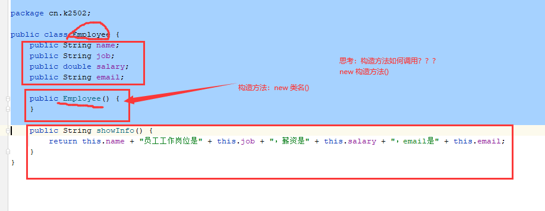
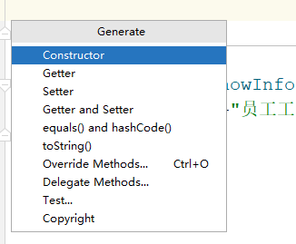
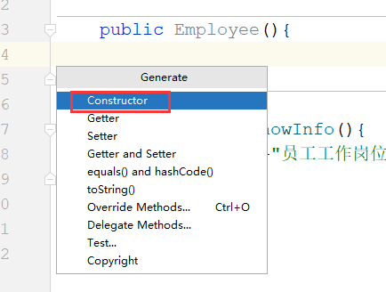
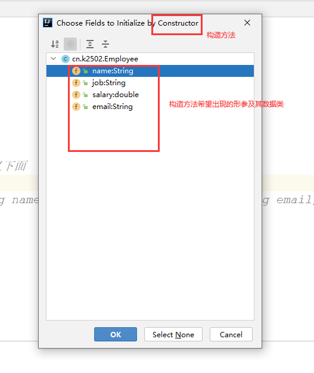
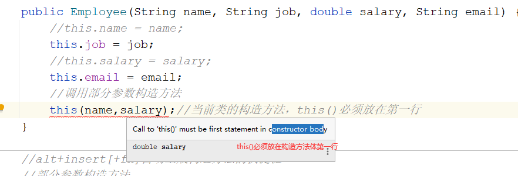

# 课程回顾

全局变量和局部变量的区别

按值传递和按引用类型

# 课程目标

## 1 包的定义和使用 ===掌握

## 2 构造方法 ===掌握

## 3 this和this() ===掌握

## 4 封装 ===掌握

## 5 访问修饰符 ===掌握

# 课程实施

## 1 包的定义和使用

包其实就是一个文件夹。

### 1-1 使用包意义

java中使用包来完成对类的**分门别类**管理。

### 1-2 包命名

包名建议：所有字母都小写

包名：建议使用服务机构，域名反写

举例：www.baidu.com   www.sina.com.cn www.kgc.cn

包名：cn.kgc.java作用名称

举例：cn.kgc.test.所有的测试类  cn.kgc.work.作业

### 1-3 创建包

```java
package 包名第一级.包名第二级.包名第三级;//包名有多个单词，必须将多个单词以.分割，一个单词对应一个文件夹
```

## 课堂练习

需求：创建一个包 cn.k2502.Employee 员工

提供属性：姓名  岗位  薪资  邮箱email

提供方法：public String showInfo(){}

2.创建一个测试类，创建3个员工对象，并输出员工的基本信息

要求：不能使用对象数组。

#### 参考代码

- Employee

```java
package cn.k2502;

/**
 * @Author: lc
 * @Date: 2022/3/22
 * @Description: 描述员工的基本信息
 * @Version: 1.0
 */
public class Employee {
	//属性
	public String name;
	/**
	 * 工作、岗位
	 */
	public String job;
	/**
	 * 薪资，薪酬
	 */
	public double salary;
	public String email;

	//方法
	public String showInfo(){
		return name+"员工工作岗位是"+job+"，薪资是"+salary+"，email是"+email;
	}
}
```

- 测试类

```java
package cn.k2502.test;

import org.junit.Test;

/**
 * @Author: lc
 * @Date: 2022/3/22
 * @Description: 测试类，以后所有的测试代码都放在这个类中
 * @Version: 1.0
 */
public class MyTester {

	//单元测试
	/**
	 * 自定义一个无参无返回值的方法
	 * 单元测试不支持：Scanner
	 */
	//注解 导入使用类所在的包 alt+Enter
	@Test
	public void testEmployee(){

	}
}
```

## 2 构造方法

### 2-1 作用

构造方法创建对象。扩展构造方法的作用：不仅可以创建对象还可以实现属性赋值

### 2-2 特点

一个类一定至少有一个构造方法。程序员不写，编译器自动添加

编译器默认添加构造方法，格式一定如下：

```java
public 类名(){
    //没有方法体
}
//因为默认构造方法里面没有方法体，所以new 类名()只能完成对象创建的工作
```

### 2-3 概念

与类同名，没有返回值类型部分的方法都是构造方法

```java
public 类名(){
    //构造方法方法体
}
```

### 2-4 构造方法调用过程

```java
new 类名();//类名()其实就是构造方法，所以new是调用构造方法的方式
```



### 2-5 程序员添加构造方法时机

当我们需要在构造方法中添加：属性赋值的代码时，就可以考虑自己亲自写构造方法了。

### 2-6 课堂案例

- 员工类

```java
package cn.k2502;

/**
 * @Author: lc
 * @Date: 2022/3/22
 * @Description: 描述员工的基本信息
 * @Version: 1.0
 */
public class Employee {
	//属性，成员变量，全局变量
	public String name;
	/**
	 * 工作、岗位
	 */
	public String job;
	/**
	 * 薪资，薪酬
	 */
	public double salary;
	public String email;

	//构造方法习惯性放在属性定义下面
	public Employee(String name,String job,double salary,String email){
		//属性赋值
		//this.全局变量
		this.name=name;
		this.job=job;
		this.salary=salary;
		this.email=email;
	}

	//方法
	public String showInfo(){
		return name+"员工工作岗位是"+job+"，薪资是"+salary+"，email是"+email;
	}
}
```

- 测试类

```java
package cn.k2502.test;

import cn.k2502.Employee;
import org.junit.Test;

/**
 * @Author: lc
 * @Date: 2022/3/22
 * @Description: 测试类，以后所有的测试代码都放在这个类中
 * @Version: 1.0
 */
public class MyTester {
	@Test
	public void testEmployee2(){
		//1.创建对象自动属性赋值
		Employee e = new Employee("jack","学生",0,"kgc@sina.com");
		//2.输出属性的值
		System.out.println(e.showInfo());

		//所有的对象创建完毕以后，都是一样的属性值，合理吗？？？？
		Employee e2=new Employee("李雷","工程师",8888,"lei.li@hw.com");
		System.out.println(e2.showInfo());
	}
}
```

### 2-7 构造方法的重载

意义是：创建对象时，提供更多属性赋值的形式。方法调用时灵活性更好！

IDEA自动生成构造方法的步骤：

第一步：按下 alt+insert[+FN]，弹出以下框



第二步：选择constructor选项



第三步：选择要生成的构造方法需要的参数个数



## 3 this

### 3-1 this的作用

用来区分全局变量和成员变量。当一个方法中，出现了同名的全局变量和局部变量，我们如果想使用全局变量，就需要在全局变量的前面添加this单词。this后面一定是全局变量。

### 3-2 this是什么？

？？？？？？？？？

## 4 this()

### 4-1 this()语句的作用

用在构造方法中，表示调用其他的构造方法。简化属性赋值的代码

### 4-2 this()是什么

this()就是当前类中某一个构造方法。具体执行哪个，主要实际传入参数个数、类型和顺序

### 4-3 this()使用注意事项

1.只能作用在构造方法中

2.必须位于第一行



## 构造方法整合案例：

需求：Person类（属性：姓名 年龄  性别   方法：public String showInfo())

测试类：分别使用无参构造方法、全参构造方法、部分参数构造方法。

扩展：this()优化属性赋值代码！！

## 课堂演示案例：整合构造方法、构造方法重载以及this()的案例

- Employee

```java
package cn.k2502;

/**
 * @Author: lc
 * @Date: 2022/3/22
 * @Description: 描述员工的基本信息
 * @Version: 1.0
 */
public class Employee {
	//属性，成员变量，全局变量
	public String name;
	/**
	 * 工作、岗位
	 */
	public String job;
	/**
	 * 薪资，薪酬
	 */
	public double salary;
	public String email;

	//构造方法习惯性放在属性定义下面
	//全参构造方法
	public Employee(String name, String job, double salary, String email) {
		//this.name = name;
		//调用部分参数构造方法
		this(name,salary);//当前类的构造方法，this()必须放在第一行
		this.job = job;
		//this.salary = salary;
		this.email = email;

	}

	//alt+insert[+fn]自动生成构造方法的快捷键
	//部分参数构造方法
	public Employee(String name, double salary) {
		this(name);
		//this.name = name;
		//调用name属性赋值构造方法
		this.salary = salary;
	}
	/**
	 * 区分必填项  选填项
	 * @param name
	 */
	public Employee(String name){
		this.name=name;
	}

	//无参构造方法
	public Employee(){

	}
	//方法
	public String showInfo(){
		return name+"员工工作岗位是"+job+"，薪资是"+salary+"，email是"+email;
	}
}
```

- 单元测试

```java
public class MyTester{
	@Test
	public void testEmployee3(){
		//构造方法使用时，必须提供形参一致的实参
		Employee e = new Employee("李思思");
		System.out.println(e.showInfo());
		Employee e2 = new Employee("jack", 9000);
		System.out.println(e2.showInfo());
	}
}
```

## 5 封装

做程序，保存数据，意义是什么？数据整合到一起，做数据分析和挖掘。从而提取有价值的信息

数据有价值！手机号码一定要正确的。

### 5-1 意义

保证数据录入的合法性

安全性

复用性

代码常见封装：

1.方法就是对功能的封装。Arrays.binarySearch()

2.类对属性和方法的封装。创建一个对象，使用属性和方法

### 5-2 概念

封装：java里面一种写代码的方式：隐藏内部的实现细节，提供对外可以访问的公开的方法。

### 5-3 如何实现封装

1.私有化

```java
private 修饰属性
```

2.提供公开的方法，提供对私有化的内容一种访问方式

```java
public void set属性名(与属性同类型同名的形参){
    this.属性名=值;
}

public 与return后面返回的属性同类型作为返回值类型 get属性名(){
    return this.属性名;
}
```

### 5-4 封装的适用场景

```html
总结：
类中不需要对外提供的内容都私有化，包括属性和方法。
以后再描述事物，属性都私有化，并提供setXxx getXxx方法对其进行访问。
也就是说：以后定义类的时候，遇到属性就两步走起：
第一步：private修饰尚需经
第二步：提供public修饰的getter和setter方法

注意：私有仅仅是封装的体现形式而已。
```

### 5-5 课堂案例

- Person类

```java
package cn.k2502;

/**
 * @Author: lc
 * @Date: 2022/3/22
 * @Description: 描述人类的信息
 * @Version: 1.0
 */
public class Person {
	//1.属性
	//public:公开的，公共的  private:私有化
	private String name;

	private int age;
	private char sex;

	//提供对外访问的方式，一个属性配一对方法：setter-赋值   getter--取值
	public void setName(String name){
		//setName:给name属性设置值
		this.name=name;
	}

	public String getName(){
		//需要方法做返回值
		return this.name;
	}

	public int getAge() {
		return age;
	}

	public void setAge(int age) {
		if (age<150 && age>0) {
			this.age = age;
		}else{
			System.out.println("年龄不合法，合法的年龄必须是：0-150之间");
		}
	}

	public char getSex() {
		return sex;
	}

	public void setSex(char sex) {
		if(sex!='男' && sex!='女'){
			System.out.println("合法的性别只能是男或女");
			return;
		}
		this.sex = sex;
	}

	//2.构造方法：idea提供自动生成方式
	public Person(String name, int age, char sex) {
		this.name = name;
		setSex(sex);
		setAge(age);
		//this.age = age;
		//this.sex = sex;
	}
	public Person(String name, int age) {
		this.name = name;
		this.age = age;
	}
	public Person() {
	}
	//3.自定义方法：实例方法或成员方法
	/**
	 * 输出指定对象的属性值
	 * @return 属性拼接字符串
	 */
	public String showInfo(){
		return name+","+age+","+sex;
	}
}
```

- 测试Person类封装后的结果

```java
public class MyTester{
	@Test
	public void testPerson(){
		Person p3 = new Person();//如何属性赋值？？？
		//其他类无法访问私有化的属性
		p3.setName("钱七");
		System.out.println("对象的name="+p3.getName());
		p3.setAge(10000);
		System.out.println("对象的age="+p3.getAge());
		p3.setSex('无');
		System.out.println("对象的sex="+p3.getSex());
	}
}
```

- 测试输出的结果如下：

```html
对象的name=钱七
对象的age=0
对象的sex=   
```

## 扩展：单元测试的使用步骤

```html
第一步：创建测试类，一般建议将测试类放在xx.xx.test下面
第二步：在测试类中，添加一个自定义的无参无返回值的方法
第三步：在方法的上面添加一个@Test的注解（注解就是告知jvm该方法是执行代码的入口）
第四步：如果@Test爆红，则使用alt+Enter导入Test的包org.junit.Test;
```


# 课程总结

## 1 构造方法：程序员不写，编译器自动加。程序员写，编译器不添加

 构造方法什么时候需要程序员写？属性赋值

构造方法概念：构造方法调用方式：this()  new 构造方法()

## 2 封装：

封装步骤！！！

封装概念和意义！！


# 预习安排

## 继承：概念、实现步骤、优点

## abstract抽象方法、抽象类


## Object类常用方法