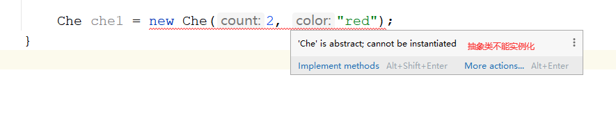
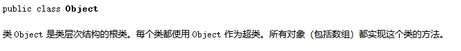
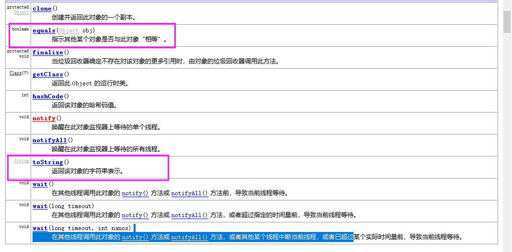
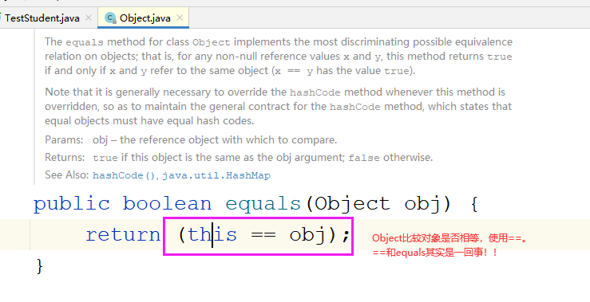
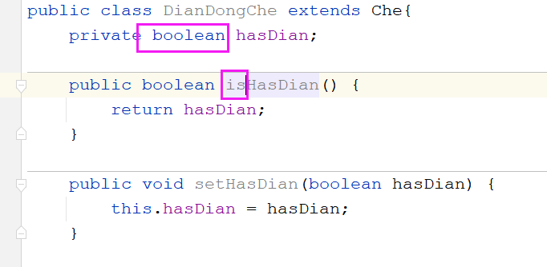
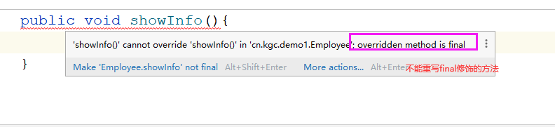
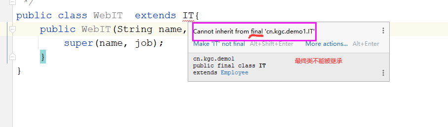

# 课程回顾

## 1 继承：子类沿用父类非私有的属性和方法的一种编码形式

## 2 继承：优化多个类存在的冗余代码

## 3 继承：同名的属性、同名的方法、子类调用父类构造方法

## 课后作业第四题：参考答案

- 父类：Che

```java
package cn.kgc.exercise;

/**
 * @Author: lc
 * @Date: 2022/3/25
 * @Description: 父类
 * @Version: 1.0
 */
public class Che {

	private int count;
	private String color;

	public int getCount() {
		return count;
	}

	public void setCount(int count) {
		if (count>0) {
			this.count = count;
		}else{
			System.out.println("非机动车必须有轮子");
		}
	}

	public String getColor() {
		return color;
	}

	public void setColor(String color) {
		this.color = color;
	}

	public Che(int count, String color) {
		this.count = count;
		this.color = color;
	}

	/**
	 * 跑的行为
	 */
	public void run(){
		System.out.println("蹬着"+getCount()+"个轮子的"+getColor()+"色的自行车跑");
	}
}
```

- 子类：自行车

```java
package cn.kgc.exercise;

/**
 * @Author: lc
 * @Date: 2022/3/25
 * @Description: cn.kgc.exercise
 * @Version: 1.0
 */
public class ZiXingChe extends Che{
	//子类只需要提供特有的属性和行为

	public ZiXingChe(int count, String color) {
		super(count, color);
	}

	@Override
	public void run() {
		//System.out.println("蹬着"+getCount()+"个轮子的"+getColor()+"色的自行车跑");
		super.run();
	}
}
```

- 子类：电动车

```java
package cn.kgc.exercise;

/**
 * @Author: lc
 * @Date: 2022/3/25
 * @Description: cn.kgc.exercise
 * @Version: 1.0
 */
public class DianDongChe extends Che{
	private boolean hasDian;

	public boolean isHasDian() {
		return hasDian;
	}

	public void setHasDian(boolean hasDian) {
		this.hasDian = hasDian;
	}

	public DianDongChe(int count, String color, boolean hasDian) {
		super(count, color);
		this.hasDian = hasDian;
	}

	@Override
	public void run() {
		if (isHasDian()) {
			System.out.println("骑着"+getCount()+"个轮子的"+getColor()+"色的电动车走");
		}else{
			//创建自行车对象时，具体的轮子的个数和颜色应该是从电动车对象里面获取的
			//new ZiXingChe(this.getCount(),this.getColor()).run();
			//System.out.println("蹬着"+getCount()+"个轮子的"+getColor()+"色的自行车跑");
			super.run();
		}
	}
}
```

- 测试类：电动车是否有电

```java
package cn.kgc.exercise;

/**
 * @Author: lc
 * @Date: 2022/3/25
 * @Description: cn.kgc.exercise
 * @Version: 1.0
 */
public class Tester {
	public static void main(String[] args) {
		DianDongChe che = new DianDongChe(2, "黑色", true);
		che.setHasDian(true);//优点
		che.run();

		//修改电池量
		che.setHasDian(false);//没电
		che.run();
		//new DianDongChe(2, "黑色",false).run();
	}
}
```

# 课程目标

## 1 Object类常用的方法 =========== 理解

## 2 抽象类和抽象方法 ========== 掌握

## 3 final关键字的使用 ======== 掌握

## 4 static关键字的使用 ======== 理解

# 课程实施

## 1 抽象类和抽象方法

### 1-1 抽象方法

抽象方法：也是方法。与普通的方法不同之处：没有方法体

```java
访问修饰符 abstract  返回值类型  方法名(形参列表);
```

抽象方法调用没有意义！！！抽象方法所在的类，不允许创建对象。

### 1-2 抽象类

一般来说，抽象方法所在的类一定是抽象类

抽象类特点：不能创建对象通常专业的说成：不能实例化

抽象类一旦被子类继承，子类必须重写父类中所有的抽象方法。

```java
public abstract class 类名{
    
    
}
```



### 1-4 抽象的意义

抽象类一定是父类！！！父类中如果出现了抽象的方法，**强制**子类方法的重写（重写所有的抽象方法）。一个子类继承抽象类，而不重写父类的抽象方法，该子类也只能是抽象类，永远不能创建对象！！！

抽象更多编程思想！！

### 1-5 小结

抽象方法一定在抽象类中！！  子类继承抽象类后，必须重写父类所有的抽象方法。否则子类不能实例化！！

思考：

  抽象类中一定有抽象方法吗？？不一定。

 抽象类中没有抽象方法时，定义抽象类的目的，希望拿子类继承！！


### 1-3 课堂案例

需求：

父类：员工类（姓名  岗位  方法：

工作（方案一：输出：是人就要工作。方案二：抽象方法））

子类：

   程序员类：姓名  岗位   方法：工作 (输出：java程序员李四在写代码)

   教师类：姓名 岗位       方法：工作（输出：java教员王五在备课）

#### 参考代码

- 父类

```java
package cn.kgc.demo1;

/**
 * @Author: lc
 * @Date: 2022/3/25
 * @Description: 案例一：父类--员工类
 * @Version: 1.0
 */
public abstract class Employee {
	private String name;
	private String job;

	public String getName() {
		return name;
	}

	public void setName(String name) {
		this.name = name;
	}

	public String getJob() {
		return job;
	}

	public void setJob(String job) {
		this.job = job;
	}

	public Employee(String name, String job) {
		this.name = name;
		this.job = job;
	}

	/**
	 * 抽象方法
	 */
	public abstract   void work();
}
```

- 子类：程序员

```java
package cn.kgc.demo1;

/**
 * @Author: lc
 * @Date: 2022/3/25
 * @Description: Employee的子类：IT程序员
 * @Version: 1.0
 */
public class IT extends Employee{//继承：子类可以无条件拥有父类非私有的属性和方法
	public IT(String name, String job) {
		super(name, job);
	}
	//work()是否可以视而不见，不重写，程序也不会出错？？抽象方法在子类中必须重写！！！
	@Override
	public void work() {
		System.out.println(getJob()+getName()+"写代码");
	}
}
```

- 子类：教师类

```java
package cn.kgc.demo1;

/**
 * @Author: lc
 * @Date: 2022/3/25
 * @Description: 员工类子类の教师
 * @Version: 1.0
 */
public class Teacher extends Employee{
	public Teacher(String name, String job) {
		super(name, job);
	}

	@Override
	public void work() {
		System.out.println(getJob()+getName()+"在备课");
	}
}
```

- 测试类：测试工作方法

```java
package cn.kgc.demo1;

/**
 * @Author: lc
 * @Date: 2022/3/25
 * @Description: cn.kgc.demo1
 * @Version: 1.0
 */
public class Tester {
	public static void main(String[] args) {
		//1.创建对象
		IT it = new IT("张三丰", "java开发工程师");
		//2.对象.方法名
		it.work();//先找自己的，没有再找父类的

        //创建老师对象并调用work()方法
		Teacher tea = new Teacher("老王", "java教员");
		tea.work();
	}
}
//执行后，输出的结果是
java开发工程师张三丰写代码
java教员老王在备课
```

## 2 final的使用

最终的，最后的

### 2-1 修饰变量

final修饰的变量称为：常量

常量的特点是：一旦赋值，就不能再修改

```java
final 变量===》常量
final 数据类型 常量名=值;
```

### 2-2 修饰方法

final修饰的方法称为：最终方法

最终方法的特点：子类不能重写

final和abstract不能同时使用

```java
public final 返回值类型 方法名(形参列表){
    //方法体
}
```

### 2-3 修饰类

final修饰的类称为：最终类

最终类的特点是：不能被其他类继承

```java
public final class 类名{
    //属性
    
    //方法
}
```

## 3 Object类

Object：对象

OOP:Object  Oriented Pramgramme

java中所有的类直接或者间接的继承Object类。

万物皆对象。 所有的类  is a Object 一种

### 3-1 Object的意义

java定义所有的类，都拥有Object提供的非私有的属性和方法！！！！



### 3-2 Object学习方法

API文档！！Java 的API（API: **A**pplication(应用) **P**rogramming(程序) **I**nterface(接口)）

### 3-3 Object的方法



### 3-5 toString()方法


作用：原本父类Object设计toString()是为了获取一个字符串  类名@哈希码 。

toString()怎么调用？？sout(对象)自动调用，程序员不用写调用代码sout(对象.toString())

在自己的程序里面，一般建议重写toString()，希望sout(对象名)不是输出哈希地址，而是直接输出对象的属性值

#### 参考案例

- Student类

```java
package cn.kgc.demo2;

/**
 * @Author: lc
 * @Date: 2022/3/25
 * @Description: cn.kgc.demo2
 * @Version: 1.0
 */
public class Student {
	public String name;
	public int age;
	public char sex;
	//重写：改造父类的不合适的方法体！！让方法变得更适合子类使用
	//alt+insert
	@Override
	public String toString() {
		return "Student{" +
				"name='" + name + '\'' +
				", age=" + age +
				", sex=" + sex +
				'}';
	}
}
```

- Tester类

````java
package cn.kgc.demo2;

import org.junit.Test;

/**
 * @Author: lc
 * @Date: 2022/3/25
 * @Description: cn.kgc.demo2
 * @Version: 1.0
 */
public class TestStudent {
	@Test
	public void testToString(){
		Student student = new Student();
		student.name="jack";
		System.out.println(student.toString());//jack$$$$$$
		//Object提供的toString()
		//String s=student.toString();
		//输出toString()执行的结果
		//System.out.println(s);//s是toString()执行的结果
		//System.out.println("========================================");
		//cn.kgc.demo2.Student@17d10166
		//System.out.println(student.toString());//student是对象的哈希地址
		//sout(对象名)实际上jvm执行时，靠对象.toString()获取输出结果
		//思考：toString()什么时候会调用？？sout(对象)就会自己调用toString()
		//toString()是父类Object的?父类提供的输出哈希码，子类使用有没有用？没用
		//改造toString():sout(对象）想看到对象所有的属性值，不用再自己写showInfo()
		//结论：toString()就是showInfo()真身！！
	}
}
````

### 3-6 重点！！！equals()方法*******************************


作用：Object提供equals()比较两个对象内存地址是否相等

程序员在自己的类中重写equals()原因是：希望比较对象时，不比较地址，而是比较两个对象的属性值是否一样！！！！



- Student类

```java
package cn.kgc.demo2;

/**
 * @Author: lc
 * @Date: 2022/3/25
 * @Description: cn.kgc.demo2
 * @Version: 1.0
 */
public class Student {
	public String name;
	public int age;
	public char sex;

	public Student(String name, int age, char sex) {
		this.name = name;
		this.age = age;
		this.sex = sex;
	}

	//判断两个对象是否相等？？？
	//判断两个学生对象是否相等？true---是同一个对象   false---不是同一个对象
	//什么同一个对象？内存地址是一样的！！  Object提供equals()判断依据哈希地址，==比较对象是就是比地址

	//日常开发，判断两个对象是否一样，客户看值还是看内存地址？？？？
	//重写：改造父类的不合适的方法体！！让方法变得更适合子类使用
	//alt+insert自动生成的！！
	@Override
	public boolean equals(Object o) {
		if (this == o) return true;
		if (o == null || getClass() != o.getClass()) return false;

		Student student = (Student) o;

		if (age != student.age) return false;
		if (sex != student.sex) return false;
		return name != null ? name.equals(student.name) : student.name == null;
	}

	@Override
	public int hashCode() {
		int result = name != null ? name.hashCode() : 0;
		result = 31 * result + age;
		result = 31 * result + (int) sex;
		return result;
	}

	//alt+insert
	@Override
	public String toString() {
		return "Student{" +
				"name='" + name + '\'' +
				", age=" + age +
				", sex=" + sex +
				'}';
	}
}
```

- Tester测试类

```java
public class TestStudent {
    @Test
	public void testEquals(){
		//内存什么时候分配哈希地址
		Student s1 = new Student("张无忌",21,'男');
		Student s2 = new Student("张无忌",21,'男');
		//如果两个人连身份证号码都一样？人类认定是一个人！！
		//Student不重写equals()就是比较两个对象的内存地址。Student重写equals()后就按照重写的方案比较对象
		System.out.println("s1和s2是同一个对象吗？"+s1.equals(s2));//true 
		//==判断两个值是否相等
		System.out.println("s1和s2是同一个对象吗？"+(s1==s2));//false ==永远比地址！！！！
	}
}
```

#### 课堂练习：

需求：Person类（属性：身份证号码ID--String  姓名--String   性别-char）

​           全参构造方法

​           重写toString()

​           重写equals和hashCode(),比较依据：ID

​           测试类：创建两个对象，只要对象ID一样，对象就是相等。

##### 参考代码：

- Person类

```java
package cn.kgc.exercise;

/**
 * @Author: lc
 * @Date: 2022/3/25
 * @Description: cn.kgc.exercise
 * @Version: 1.0
 */
public class Person {
	private String ID;
	private String name;
	private char sex;

	public String getID() {
		return ID;
	}

	public void setID(String ID) {
		this.ID = ID;
	}

	public String getName() {
		return name;
	}

	public void setName(String name) {
		this.name = name;
	}

	public char getSex() {
		//可以流程控制语句！！
		return sex;
	}

	public void setSex(char sex) {
		if (sex=='男' || sex=='女') {
			this.sex = sex;
		}else{
			System.out.println("性别只能是男或女");
		}
	}

	public Person() {
	}

	public Person(String ID, String name, char sex) {
		this.ID = ID;
		this.name = name;
		this.sex = sex;
	}

	//一个类通常都会重写toString()

	@Override
	public String toString() {
		return "Person{" +
				"ID='" + ID + '\'' +
				", name='" + name + '\'' +
				", sex=" + sex +
				'}';
	}
	//是否需要重写equals():比较对象，且比对象的属性

	@Override
	public boolean equals(Object o) {
		if (this == o) return true;
		if (o == null || getClass() != o.getClass()) return false;

		Person person = (Person) o;

		return ID != null ? ID.equals(person.ID) : person.ID == null;
	}

	@Override
	public int hashCode() {
		return ID != null ? ID.hashCode() : 0;
	}
}
```

- 测试类

```java
package cn.kgc.exercise;

/**
 * @Author: lc
 * @Date: 2022/3/25
 * @Description: cn.kgc.exercise
 * @Version: 1.0
 */
public class TestPerson {
	//单元测试里面不能加Scanner
	public static void main(String[] args) {
		Person p1 = new Person("123", "jack", '男');

		Person p2 = new Person("123", "jack34324535", '男');
		System.out.println(p1);//自动调用toString()
		System.out.println(p2);//自定调用toString()

		System.out.println("p1和p2是同一个哈希地址："+(p1==p2));
		System.out.println("p1和p2内容是否一样："+p1.equals(p2));
	}
}
//测试结果如下所示：
Person{ID='123', name='jack', sex=男}
Person{ID='123', name='jack', sex=男}
p1和p2是同一个哈希地址：false
p1和p2内容是否一样：true
```

## 4 static关键字的使用


### 当属性是boolean类型时，生成的取值方法是以is开始，而不是get开始




### 最终方法不能被子类重写



### 最终类不能被重写



# 课程总结

OOP梳理！！

抽象！！方法  类

final关键字的作用

Object面试

# 作业安排

《汽车租赁系统》实现各种车租赁方法


# 预习安排

## 多态：

  向上转型  向下转型代码体现方式

  instanceof运算符有什么作用？

  父类作为形参和父类作为返回值


接口


