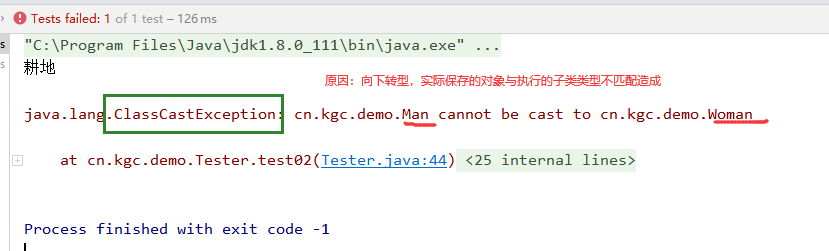
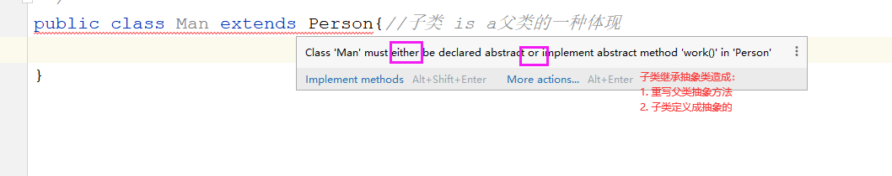

# 课程回顾

## 1 java.lang.Object提供的toString()  equals()和hashCode()

```java
时机：toString()替换程序showInfo(),toString()重写时机：一个类中出现属性，重写toString()
    
时机：equals()对象与对象希望通过属性值判断是否相等，而不是通过地址判断！！！
     == 比地址
```

## 2 abstract关键字

```java
抽象方法：没有方法体  必须在子类重写 修饰符+abstract  
抽象类：不能实例化对象  可以出现抽象方法 修饰符+abstract 只能做父类
    
普通方法：有方法体，可以重写也可以不重写
普通类：一定不能出现抽象方法 可以是父类也可以子类
    
细节：子类继承抽象类，要么重写父类所有的抽象方法，要么也定义成抽象的
     final和abstract不能一起使用
    
    final修饰变量，常量
    final修饰方法，最终方法，不能重写
    final修饰类，最终类，不能被继承
```

# 课程目标

## 1 多态======= 理解

## 2 向上转型 ======= 掌握

## 3 向下转型 ======= 掌握

## 4 instanceof运算符 ======= 掌握

## 5 父类做形参和父类做返回值======= 理解

# 课程实施

## 1 多态

### 1-1 多态概念

多种形态：比如：水--液态  气态   固态    人--婴幼儿形态    青少年   中年人  老年人 

多态概念：一种类型不同的对象体现方式！！！

举例：

```html
类 变量=对象;

Person p=new Person();
多态：
Person p=new Person();
Person p=new Student();
```

### 1-3 多态实现前提

```java
类与类之间，必须存在继承关系！！
固态的水是水的一种体现
子类  is  a  父类的一种体现
```

### 1-4 课堂案例

需求：

抽象类父类：人类

属性：name    age

方法：toString()           工作-- 抽象的


男人类：

属性：name    age

方法：工作-耕地


女人类：属性：name    age

方法：工作--纺织


测试：创建对象，并使用工作方法

#### 参考代码

- 父类

```java
package cn.kgc.demo;

/**
 * @Author: lc
 * @Date: 2022/3/26
 * @Description: 父类
 * @Version: 1.0
 */
public abstract class Person {
	private String name;
	private int age;

	public String getName() {
		return name;
	}

	public void setName(String name) {
		this.name = name;
	}

	public int getAge() {
		return age;
	}

	public void setAge(int age) {
		this.age = age;
	}

	public Person() {
	}

	public Person(String name, int age) {
		this.name = name;
		this.age = age;
	}

	@Override
	public String toString() {
		return "Person{" +
				"name='" + name + '\'' +
				", age=" + age +
				'}';
	}

	/**
	 * 工作
	 */
	public abstract void work();
}
```

- 男人类

```java
package cn.kgc.demo;

/**
 * @Author: lc
 * @Date: 2022/3/26
 * @Description: Person的子类男人类
 * @Version: 1.0
 */
public class Man extends Person{//子类 is a父类的一种体现
	public Man(String name, int age) {
		super(name, age);
	}

	@Override
	public void work() {
		System.out.println("耕地");
	}

	/**
	 * 抽烟
	 */
	public void smoking(){
		System.out.println(getAge()+"岁数的"+getName()+"在抽烟");
	}

}
```

- 女人类

```java
package cn.kgc.demo;

/**
 * @Author: lc
 * @Date: 2022/3/26
 * @Description: Person的子类女人类
 * @Version: 1.0
 */
public class Woman extends Person{
	public Woman(String name, int age) {
		super(name, age);
	}

	@Override
	public void work() {
		System.out.println("纺织");
	}

	/**
	 * 购物
	 */
	public void buy(){
		System.out.println(getAge()+"岁的"+getName()+"在购物...");
	}
}
```

- 测试类

```java
package cn.kgc.demo;

import org.junit.Test;

/**
 * @Author: lc
 * @Date: 2022/3/26
 * @Description: 测试类
 * @Version: 1.0
 */
public class Tester {
	/**
	 * 单元测试自定义：无参无返回值就可以
	 * @Test手动导入Test所在的包
	 */
	@Test
	public void test01(){
		//1.Man类型的对象  多态の向上转型
		Person man = new Man("王宝强", 35);
		//man.work();//可以正常调用？？？？
		//父类类型存储子类对象时，父类定义的变量无法直接使用子类特有的方法
		/*
		* 原因：man变量所属的类型所在的java代码里面提供的代码解析出来
		* java代码一旦写完，自动编译，直接执行
		* 编译期间发生的代码错误：man所属的实际的类型Person，Person里面没有smoking
		* 程序员需要显式告知编译期man实际保存的对象就是Man对象，拥有smoking
		 */
		man.work();
		//向下转型：不是必须的。出现仅仅是为了解决多态在向上转型时无法正常调用子类个性化方法的bug
		((Man)man).smoking();//不可以正常使用？？？？

		//1.Woman类型的对象
		Person woman = new Woman("马蓉", 30);
		woman.work();//可以正常调用？？？？
		((Woman)woman).buy();//不可以正常使用？？？？
	}
}
```

### 1-5 多态在代码中有两种体现的形式

- 向上转型

- 向下转型

### 1-6 多态意义

替换性，提升程序扩展性、维护性！！！！

## 2 向上转型

概念：父类的变量保存子类对象。

专业术语：**父类的引用指向子类的对象**

引用：通常把保存哈希地址的变量名称为引用

### 3-1 向上转型语法

```java
父类类名  变量名=new  子类类名();

变量名.父类和子类同时存在的方法();
```

## 3 向下转型

概念：将父类类型的变量名，强制指定为子类的类型

### 3-1 时机

只有当父类的变量无法正常调用子类特有的方法时，为了解决程序错误，不得不选择向下转型

### 3-2 语法

```java
(子类类名)父类定义的变量名
```

### 3-3 发生向下转型的前提是

之前有向上转型


## 4 instanceof运算符

### 4-1 作用

判断对象所属的类型

### 4-2 语法

```html
引用名（即保存对象的变量名) instanceof  目标类型（即向下转型时指明的类型）

注意：目标类型可以是父类，也可以是子类，具体是什么类的类名，就看你要向下转型时()中指定的类型
```

### 4-3 使用时机

```html
通常只有在向下转型时，为了避免程序出现ClassCastException，需要在向下转型前，通过if语句判断后，再进行转型。
```

### 4-4 课堂案例

```java
@Test
	public void test02(){
		//向上转型的A类
		Person p=new Man("吴三桂",54);
		//......此处省略1000行代码
		//p保存的对象调用方法
		p.work();
		//为了保证向下转型时，转型的类型是匹配的，建议转型前对于p保存的对象类型进行判断
		//if( p instanceof 目标类名){//避免ClassCastException
		if(p instanceof  Woman){//true：p是woman的对象  false：p不是woman的对象
			((Woman) p).buy();//没有执行：p保存的对象，不是女人的对象！！
		}else if(p instanceof Man){
			((Man)p).smoking();
		}else{
			System.out.println("。。。。。。");
		}
	}
```

#### 思考：如果不添加if判断，直接运行代码，idea中会提示如下错误



## 5 整合案例

### 5-1 对象数组

对象数组每一个下标位置保存的是一个对象！

```java
类名[] 数组名=new 类名[长度];
// 类就是java的数据类型，实际保存的对象所属的类的类名

// 举例：5个Student的对象  Student[] students =new Student[5];
// students[0]=new student(); students[0].name="jack";
// 。。。。构造方法
//students[0]=new Student("jack");
//..... 继承、多态
//students[0]=new kgcStudent("张三丰"); 不会出错！！！！
```

#### 案例代码参考：使用对象数组保存不同的子类对象

```java
    @Test
	public void test03(){
		//保存三个男人对象
		//定义数组：等同于空教室 提供3个座位，上面没人！！null
		Man[] men=new Man[3];//保存男人对象的数组
		//下标给每一个座位存入一个对象 new 才能创建对象
		men[0]=new Man("王嘉毅",18);
		//存入第二个男人对象
		men[1]=new Man("肖述林",18);
		men[2]=new Man("李诗豪",19);

		//调用work()方法
		/*men[0].work();
		men[1].work();
		men[2].work();*/
		for(int i=0;i<men.length;i++){
			//i=0 men[0].work();
			//i=1 men[1].work();
			men[i].work();
		}
		//for(数组类型  变量名:数组名)
		for(Man a :men){//Man a=men[0]   Man a=men[1] Man a=men[2]
			a.work();
		}

		// 三个女人对象
		//Woman[] women=new Woman[3];//保存女人对象的数组
		Person[] people=new Person[6];
		//Person p=new Man("王嘉毅",18);
		people[0]=new Man("王嘉毅",18);
		//Person p=new Woman("aa",12);
		people[3]=new Woman("范冰冰",18);
	}

	@Test
	public void test04(){
		Person[] people={new Man("张三",21 ),new Woman("李四",45)};//思考：数组能存哪些类型的对象？可以存自己、子类的对象
		for(Person p :people){
			p.work();
		}
	}
```

### 5-2 父类做形参

需求：company定义招聘的方法

```java
/**
* 表示招聘的功能，别人给我一个人，我就用这个人的功能实现工作的方法
*/
public void getPerson(人对象){
	人对象.work();
}
```

#### 参考代码

- Person类

```java
package cn.kgc.demo;

/**
 * @Author: lc
 * @Date: 2022/3/26
 * @Description: 父类
 * @Version: 1.0
 */
public abstract class Person {
	private String name;
	private int age;

	public String getName() {
		return name;
	}

	public void setName(String name) {
		this.name = name;
	}

	public int getAge() {
		return age;
	}

	public void setAge(int age) {
		this.age = age;
	}

	public Person() {
	}

	public Person(String name, int age) {
		this.name = name;
		this.age = age;
	}

	@Override
	public String toString() {
		return "Person{" +
				"name='" + name + '\'' +
				", age=" + age +
				'}';
	}

	/**
	 * 工作
	 */
	public abstract void work();
}
```

- Woman类

```java
package cn.kgc.demo;

/**
 * @Author: lc
 * @Date: 2022/3/26
 * @Description: Person的子类女人类
 * @Version: 1.0
 */
public class Woman extends Person{
	public Woman(String name, int age) {
		super(name, age);
	}

	@Override
	public void work() {
		System.out.println("纺织");
	}

	/**
	 * 购物
	 */
	public void buy(){
		System.out.println(getAge()+"岁的"+getName()+"在购物...");
	}
}
```

- Man类

```java
package cn.kgc.demo;

/**
 * @Author: lc
 * @Date: 2022/3/26
 * @Description: Person的子类男人类
 * @Version: 1.0
 */
public class Man extends Person{//子类 is a父类的一种体现
	public Man(String name, int age) {
		super(name, age);
	}

	@Override
	public void work() {
		System.out.println("耕地");
	}

	/**
	 * 抽烟
	 */
	public void smoking(){
		System.out.println(getAge()+"岁的"+getName()+"在抽烟");
	}
}
```

- 机器人类

```java
package cn.kgc.demo;

/**
 * @Author: lc
 * @Date: 2022/3/26
 * @Description: 机器人也是人的一种体现
 * @Version: 1.0
 */
public class JiQiRen extends Person{
	@Override
	public void work() {
		System.out.println("机器人快速工作，完成工作任务");
	}
}
```

- 公司类

```java
package cn.kgc.demo;

/**
 * @Author: lc
 * @Date: 2022/3/26
 * @Description: 公司
 * @Version: 1.0
 */
public class company {
	/**
	 * 招聘：调用的人给我一个对象，就是用这个对象.work()
	 */
	/*public void getPerson(Woman w){
		w.work();
	}
	public void getPerson(Man w){
		w.work();
	}
	public void getPerson(JiQiRen w){
		w.work();
	}
	public void getPerson(KeLongRen w){
		w.work();
	}*/

	/**
	 * 多态体现：形参类型=实参其实是各个子类的对象
	 * 原本为了让getPerson()的方法可以接受用户传入男人对象、女人对象和机器人对象，需要定义N个方法，但是使用父类做形参后，只需要定义一个方法，可以应对不同类型的执行需求！！
	 * 就是因为父类作为形参，可以传入不同的子类对象。实参值的类型替换性更强，代码的扩展性就会更好。后面不管程序新增什么类型，只要继承Person类，都可以交给Company来管理
	 * @param person 招聘的对象
	 */
	public void getPerson(Person person){
		person.work();
	}
}

```

- 测试类

```java
public class Tester{
    @Test
	public void test05(){
		company company = new company();
		//getPerson()只支持传入Woman对象
		Woman w=new Woman("花木兰",26);
		company.getPerson(w);//Wowan w=实参值
		Man m=new Man("阿三",34);
		company.getPerson(m);//？形参=实参

		JiQiRen jqr=new JiQiRen();
		company.getPerson(jqr);

		KeLongRen klr=new KeLongRen();
		company.getPerson(klr);

		company.getPerson(new WaiXingRen());
	}
}
```

### 5-3 父类做返回值

#### 需求：

```html
被管理类：男人类、女人类、人类
管理类：公司类 Company
public ????  findPerson(String name){//name是要找人的名字
	//对象数组代码
	//循环数组

	return 找到的人对象;
}
测试类：???  变量名=new Company().findPerson("张三");
难点：instanceof   向下转型
是男的：调用work  smoking
是女的:调用work  buy
```

#### 参考代码

- 管理人的类 公司类Company

```java
package cn.kgc.demo;

/**
 * @Author: lc
 * @Date: 2022/3/26
 * @Description: 公司
 * @Version: 1.0
 */
public class company {
	/**
	 * 找合适的人，返回给用户使用
	 * @param age  数组里面找对应年龄的人，返回给用户使用
	 *   举例：findPerson(21)   ===>张三  男的
	 *        findPerson(45)   ===>李四   女的
	 */
	public Person findPerson(int age){
		Person[] people={new Man("张三",21 ),
				new Woman("李四",45)};
		for(Person p:people){
			if(p.getAge()==age){
				return p;
			}
		}
		return  null;//没有
	}

	/*public Woman findPerson(int age){
		Person[] people={new Man("张三",21 ),
				new Woman("李四",45)};
		for(Person p:people){
			if(p.getAge()==age){
				return p;
			}
		}
		return  null;
	}*/
}

```

- 测试类

```java
@Test
	public void test04(){
		company com = new company();
		Person p=com.findPerson(21);
		p.work();

		Person p2=com.findPerson(45);
		p2.work();
	}
```

## 6 整理常见的程序错误

### 1 子类继承父类，因为抽象方法重写问题提示的程序错误



### 2 向下转型时，因为指明的转型类型与对象实际类型不匹配造成的程序错误


# 课程总结

## 1 掌握多态的体现：向上转型和向下转型

## 2 理解 向下转型的原因，以及掌握向下转型的实现方式

## 3 理解 instanceof 添加的原因及掌握instanceof的操作方式

## 4 通过父类做形参和返回值理解多态的意义：增强程序面临类型增加时的可扩展性

# 预习安排

接口：如果一个类中全都是抽象方法，这个类就是接口

接口和抽象类的区别？！！！

