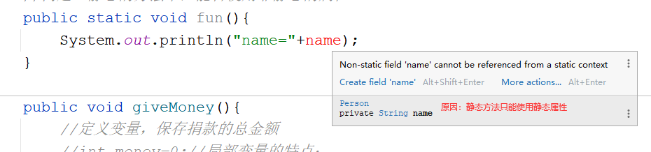
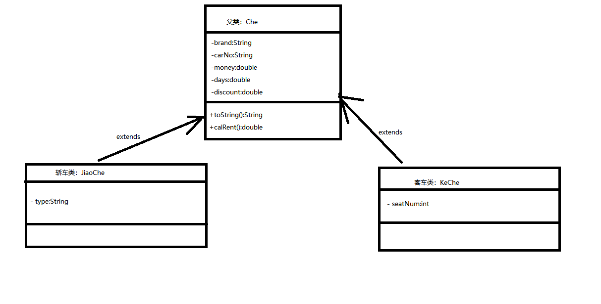
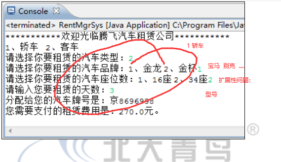
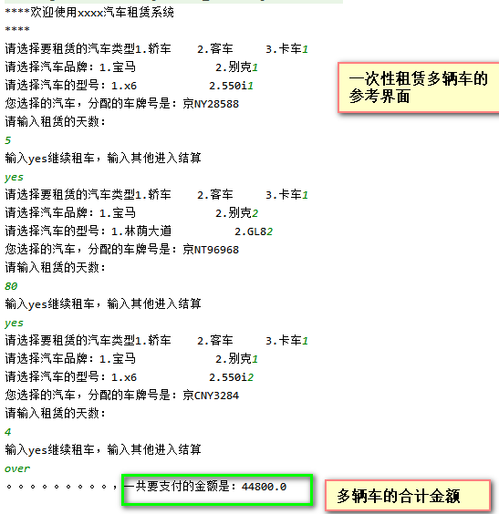

# 1 课程回顾

## 1 类 对象  面向对象编程思想（测试类：new 对象，对象.属性或方法）

## 2 掌握：封装、继承、多态

```html
封装：private修饰属性，getter和setter
继承：子类  extends  父类{  哪些属性和方法  构造方法调用顺序！   }
多态：向上转型  向下转型  instanceof转型验证判断
抽象：abstract抽象方法  抽象类
```

## 3 其他

```html
this this()  super super()  final
构造方法概念，如何编写
重载和重写

全局变量和局部变量
按值传递和按引用传递
形参和实参

********对象数组************
掌握：对象数组定义、赋值、循环遍历
```

# 课程目标

## 1 static关键字 ====== 理解

## 2 汽车租赁系统业务需求分析

# 课程实施

## 1 static关键字

静态的

### 1-1 修饰属性

```java
public static 数据类型  属性名;//静态变量 静态属性
```

### 1-2 修饰方法

```java
public static 返回值类型  方法名(形参列表){
    //方法体
    return 值;
}
```

### 1-3 静态和非静态区别

```java
java中，调用类中static修饰的属性或方法，用法是一样，语法如下：
    类名.属性   类名.方法
    
提醒：
    对象.属性   成员属性或实例属性   对象.方法 成员方法或实例方法
    
    类名.属性  静态属性   类名.方法 静态属性
```

### 1-4 静态修饰属性的意义！！

共享！！！

需求：

```html
定义类：Person 提供方法：捐款(使用输出模拟一个人捐款1元钱，输出语句输出捐款总金额)

```

#### 参考代码

- 捐款人类 Person

```java
/**
 * @Author: lc
 * @Date: 2022/3/28
 * @Description: 模拟捐款的功能
 * @Version: 1.0
 */
public class Person {
	private String name;//捐款人的姓名

	public String getName() {
		return name;
	}

	public void setName(String name) {
		this.name = name;
	}

	//定义变量，保存捐款的总金额
	static int money=0;//全局变量的特点：随着对象生死
	public void giveMoney(){
		//定义变量，保存捐款的总金额
		//int money=0;//局部变量的特点：
		System.out.println("捐了一元钱！！");
		Person.money=Person.money+1;
		System.out.println("目前捐款的总金额是："+Person.money);
	}
}
```

- 测试捐款方法Tester类

```java
/**
 * @Author: lc
 * @Date: 2022/3/28
 * @Description: PACKAGE_NAME
 * @Version: 1.0
 */
public class TestPerson {
	public static void main(String[] args) {
		//来一个人
		Person p1=new Person();//
		//报错：name是私有的，其他类不能访问
		//解决方案：
		p1.setName("吴永长");
		//p1
		p1.giveMoney();//money=1 money就销毁

		Person p2=new Person();
		p2.setName("宁延彬");
		//方法中使用全局变量，默认就是当前对象的属性，p2
		p2.giveMoney();//money=1 money就销毁

		Person p3=new Person();
		p3.setName("鲍超飞");
		p3.giveMoney();//3
	}
}
```

**static修饰的属性随着类产生，而产生的，随着类销毁而销毁。所以static修饰的属性生命周期非常长！！**




### 1-5 静态适用场景

```html
static修饰属性：常量！！！！
原因：常量一旦赋值，值不能修改
常量定义：
public static final 数据类型 常量名=值;


static修饰方法：工具类里面方法通常都是静态.static修饰方法，没有特殊说明，一般不建议使用！！
原因： Arrays工具类  Math工具类
Arrays.sort();
```

### 1-6 静态细节

```html
1.静态的属性和方法产生的时机都比非静态的资源早。静态方法不能使用非静态的属性。非静态的方法可以使用静态的属性

2.类.属性  类.方法。优先使用方式
```

### 1-7 学生练习

需求：

1.使用static定义常量PI=3.14

2.使用静态定义方法，求圆面积.

```java
public ...返回值的方法.. getArea(double r){
    //return 圆面积;
}
```

3.测试类，Scanner提示用户输入半径，输出计算结果：

#### 参考代码

- 工具类求圆面积

```java
package cn.kgc.utils;

/**
 * @Author: lc
 * @Date: 2022/3/28
 * @Description: cn.kgc.utils
 * @Version: 1.0
 */
public class CircleUtil {
	//求圆面积和求圆的周长，都得使用PI，常量，共享的
	public static final double PI=3.14;

	/*private double r;//r表示半径，每个圆半径不是，所以，创建CircleUtil对象时，不同的对象可以提供不同的r

	public double getR() {
		return r;
	}

	public void setR(double r) {
		if (r>0) {
			this.r = r;
		}else{
			//设置默认值，一般sout()提示
			this.r=1;
		}
	}*/

	public static double  getArea(double r){
		return PI*r*r;
	}

	public static double getLength(double r){
		return PI*2*r;
	}
}
```

- 测试圆面积的方法编写是否正确

```java
public class TestPerson {
	static String[] caiPin={};
	public static void main(String[] args) {
		//Arrays.sort();//Arrays是工具类，里面针对数组的操作都是静态方法实现的，所以看看底层源代码如何实现的数组排序
		System.out.println("半径为2的圆面积是："+ CircleUtil.getArea(2));
    }
}
```

## 2 汽车租赁系统

### 2-1 系统中需要使用的技术分析

```html
1.保存多个汽车信息，需要使用数组
2.OOP
```

### 2-2 系统中常用类的分析



### 2-3 优化类继承关系的属性

根据每种不同类的车，计算折扣的方式都不一样，在系统设计父子类的属性关系时，优化了折扣的计算方式。具体代码如下所示

#### 父类：Che

```java
package cn.kgc.car;

/**
 * @Author: lc
 * @Date: 2022/3/28
 * @Description: 汽车租赁系统所有的车的父类
 * @Version: 1.0
 */
public abstract class Che {
	/**
	 * 品牌
	 */
	private String brand;
	/**
	 * 车牌号
	 */
	private String carNo;
	/**
	 * 日租金
	 */
	private double money;
	/**
	 * 租赁天数
	 */
	private double days;
	/**
	 * 折扣
	 */
	private double discount;

	public String getBrand() {
		return brand;
	}

	public void setBrand(String brand) {
		this.brand = brand;
	}

	public String getCarNo() {
		return carNo;
	}

	public void setCarNo(String carNo) {
		this.carNo = carNo;
	}

	public double getMoney() {
		return money;
	}

	public void setMoney(double money) {
		this.money = money;
	}

	public double getDays() {
		return days;
	}

	public void setDays(double days) {
		this.days = days;
	}

	/**
	 * 获取折扣的算法 只读属性？值怎么办？？
	 * @return
	 */
	public abstract double getDiscount();

	/**
	 * 设置折扣：用户通过调用方法，设置一个折扣值
	 * @param discount
	 */
	/*public void setDiscount(double discount) {
		this.discount = discount;
	}*/

	/**
	 * 全参构造方法
	 * @param brand 品牌
	 * @param carNo 车牌号
	 * @param money 日租金
	 * @param days 租赁天数 构建对象时，一开始就知道租赁的天数？？不清楚！！
	 * @param discount 折扣
	 */
	public Che(String brand, String carNo, double money, double days, double discount) {
		this.brand = brand;
		this.carNo = carNo;
		this.money = money;
		this.days = days;
		this.discount = discount;
	}

	/**
	 * 部分参数构造方法
	 * @param brand
	 * @param carNo
	 * @param money
	 */
	public Che(String brand, String carNo, double money) {
		this.brand = brand;
		this.carNo = carNo;
		this.money = money;
		this.days = days;
		this.discount = discount;
	}

	public Che() {
	}

	/**
	 * 计算租金的方法
	 * 思考：抽象使用时机：各个子类实现同一个方法时，方法体不一样，父类定义方法抽象的
	 * 轿车如何计算租金：日租金*折扣*天数
	 * 客车如何计算租金：日租金*折扣*天数
	 * 卡车计算租金：日租金*折扣*天数
	 * @return
	 */
	public double calRent(){
		return getMoney()*getDays()*getDiscount();
	}
	@Override
	public String toString() {
		return "brand='" + brand + '\'' +
				", carNo='" + carNo + '\'' +
				", money=" + money +
				", days=" + days +
				", discount=" + discount ;
	}
}
```

#### 子类一：JiaoChe

```java
package cn.kgc.car;

/**
 * @Author: lc
 * @Date: 2022/3/28
 * @Description: 轿车类
 * @Version: 1.0
 */
public class JiaoChe extends Che {
	//1.特有的属性
	/**
	 * 型号
	 */
	private String type;

	public String getType() {
		return type;
	}

	public void setType(String type) {
		this.type = type;
	}

	//2.提供属性的赋值的构造方法
	public JiaoChe(String brand, String carNo, double money, String type) {
		super(brand, carNo, money);
		this.type = type;
	}

	//3.重写父类抽象方法
	/**
	 * 计算轿车的折扣算法
	 * @return
	 */
	@Override
	public double getDiscount() {
		if(getDays()>150){//300
			return 0.7;
		}else if(getDays()>30){
			return 0.8;
		}else if(getDays()>7){
			return 0.9;
		}else{
			return 1.0;//不打折，原价*100%
		}
	}
	//4.toString()是否需要基于父类再次重写

	@Override
	public String toString() {
		return "JiaoChe{" +super.toString()+
				"type='" + type + '\'' +
				'}';
	}
}
```

#### 子类二：KeChe

```java
package cn.kgc.car;

/**
 * @Author: lc
 * @Date: 2022/3/28
 * @Description: 客车类
 * @Version: 1.0
 */
public class KeChe extends Che{
	/**
	 * 座位数
	 */
	private int seatNum;

	public int getSeatNum() {
		return seatNum;
	}

	public void setSeatNum(int seatNum) {
		this.seatNum = seatNum;
	}

	public KeChe(String brand, String carNo, double money, int seatNum) {
		super(brand, carNo, money);
		this.seatNum = seatNum;
	}

	public KeChe() {
	}

	@Override
	public double getDiscount() {
		if(getDays()>=150){
			return 0.6;
		}else if(getDays()>=30){
			return 0.7;
		}else if(getDays()>=7){
			return 0.8;
		}else if(getDays()>=3){
			return 0.9;
		}
		return 1.0;
	}

	@Override
	public String toString() {
		return "KeChe{" +super.toString()+
				"seatNum=" + seatNum +
				'}';
	}
}

```

### 2-4 测试计算租金的算法

```java
public class Tester {
	@Test
	public  void test01(){
		//1.构建宝马车
		JiaoChe jc=new JiaoChe("宝马","鄂A345678",800,"X6");
		//2.给定租赁的天数
		jc.setDays(10);
		//3.显示10给出折扣
		System.out.println("租赁10天，享受的折扣是："+jc.getDiscount());//0.9
		//4.支付租金 jc.calRent()是谁的方法？？
		System.out.println("租赁10天，应该支付的总金额是："+jc.calRent());//800*10*0.9==>7200
	}
}
```

### 2-5 创建汽车业务类，完成租赁业务

#### 初始化系统数据

数组实例化：创建数组并赋值

```java
package cn.kgc.car;

/**
 * @Author: lc
 * @Date: 2022/3/28
 * @Description: 提供所有的可以租赁的汽车信息，以及根据用户租赁的需求查找对应的车的信息
 * @Version: 1.0
 */
public class CheService {
	//车库 既要停放轿车、客车、卡车
	private Che[] ches=new Che[10];//停车场只能停放10辆，null
	public void init(){//初始化
		//购买并存入数组
		ches[0]=new JiaoChe("宝马","京NY28588",800,"X6");
		ches[1]=new JiaoChe("宝马","京CNY3284",600,"550I");
		ches[2]=new JiaoChe("别克","京NT37465",300,"林荫大道");
		ches[3]=new JiaoChe("别克","京NT96968",600,"GL8");
		ches[4]=new KeChe("金杯","京6566754",800,16);
		ches[5]=new KeChe("金杯","京8696997",1500,34);
		ches[6]=new KeChe("金龙","京9696996",800,16);
		ches[7]=new KeChe("金龙","京8696998",1500,34);
		//ches[7]=new KaChe();
	}
}
```

#### 实现根据用户输入的信息找车

##### 方案一：使用if语句判断各个值是否相等的思路完成

```java
package cn.kgc.car;

/**
 * @Author: lc
 * @Date: 2022/3/28
 * @Description: 提供所有的可以租赁的汽车信息，以及根据用户租赁的需求查找对应的车的信息
 * @Version: 1.0
 */
public class CheService {
	//车库 既要停放轿车、客车、卡车
	private Che[] ches=new Che[10];//停车场只能停放10辆，null
	public void init(){//初始化
		//购买并存入数组
		ches[0]=new JiaoChe("宝马","京NY28588",800,"X6");
		ches[1]=new JiaoChe("宝马","京CNY3284",600,"550I");
		ches[2]=new JiaoChe("别克","京NT37465",300,"林荫大道");
		ches[3]=new JiaoChe("别克","京NT96968",600,"GL8");
		ches[4]=new KeChe("金杯","京6566754",800,16);
		ches[5]=new KeChe("金杯","京8696997",1500,34);
		ches[6]=new KeChe("金龙","京9696996",800,16);
		ches[7]=new KeChe("金龙","京8696998",1500,34);
		//ches[7]=new KaChe();
	}

	/**
	 * 根据用户输入的找车条件，实现要租赁汽车的信息查找
	 * 1.找轿车 brand+type
	 * 2.找客车 brand+seatNum
	 * 3.找卡车 brand+weight
	 */
	public Che findChe(String brand,String type,int seatNum){//找车
		//数组找对象
		for(Che  che :ches){//ches保存8辆车前面四辆是轿车，后面四辆客车
			if(type!=null){//找轿车
				if(!(che instanceof JiaoChe)){
					break;//不是轿车就结束循环
				}
				if(che instanceof JiaoChe){
					if(che.getBrand().equals(brand)&&((JiaoChe)che).getType().equalsIgnoreCase(type)){
						return che;
					}
				}
			}else if(seatNum!=0){//找客车
				if(che instanceof KeChe){
					.......
				}
			}else if(.....){//找卡车
                .......
            }
		}
		return null;
	}

	/*public KeChe findChe(String brand,int seatNum){//找客车

	}

	public KaChe findChe(String brand,int weight){//找卡车

	}*/
}

```

##### 方案二：重写各种车的equals()实现找车

- JiaoChe重写equals()和hashCode()

```java
/**
* Object提供equals()内存地址判断
* 重写equals()，修改成比较两个对象属性是否相等
* 思考：用户找车：轿车的品牌  轿车的型号  JiaoChe jc=new JiaoChe(品牌，型号)
* 数组每一个对象使用equals(jc)
* 难点：子类重写equals()使用brand定义在父类中，自动生成方式可能代码不如人意！！！ hashCode()改造
*/
package cn.kgc.car;

/**
 * @Author: lc
 * @Date: 2022/3/28
 * @Description: 轿车类
 * @Version: 1.0
 */
public class JiaoChe extends Che {
	//1.特有的属性
	/**
	 * 型号
	 */
	private String type;

	public String getType() {
		return type;
	}

	public void setType(String type) {
		this.type = type;
	}

	//2.提供属性的赋值的构造方法
	public JiaoChe(String brand, String carNo, double money, String type) {
		super(brand, carNo, money);
		this.type = type;
	}

	public JiaoChe() {
	}
	public JiaoChe(String brand,String type){
		setBrand(brand);
		this.type=type;
	}
	//3.重写父类抽象方法
	/**
	 * 计算轿车的折扣算法
	 * @return
	 */
	@Override
	public double getDiscount() {
		if(getDays()>150){//300
			return 0.7;
		}else if(getDays()>30){
			return 0.8;
		}else if(getDays()>7){
			return 0.9;
		}else{
			return 1.0;//不打折，原价*100%
		}
	}
	//4.toString()是否需要基于父类再次重写

	@Override
	public String toString() {
		return "JiaoChe{" +super.toString()+
				"type='" + type + '\'' +
				'}';
	}
	//重写equals():依据品牌+型号
	@Override
	public boolean equals(Object o) {
		if (this == o) return true;
		//传入对象的类型校验，必须是同一个类，
		if (o == null || getClass() != o.getClass()) return false;

		JiaoChe jiaoChe = (JiaoChe) o;
		//自己动手改造idea生成结果
		if(this.getBrand()!=null && !this.getBrand().equals(jiaoChe.getBrand())){
			return false;
		}
		return type != null ? type.equalsIgnoreCase(jiaoChe.type) : jiaoChe.type == null;
	}

	@Override
	public int hashCode() {
		int result = getBrand() != null ? getBrand().hashCode() : 0;
		result = 31 * result + getType()!=null?getType().hashCode():0;
		return result;
	}
}
```

- 修改findChe的方法

```java
	/**
	 * 通过重写各种汽车对象的equals完成查找汽车功能
	 * @param brand
	 * @param type
	 * @param seatNum
	 * @return
	 */
	public Che findCheX(String brand,String type,int seatNum) {//找车
		for(Che che:ches){
			//if(数组中每一个che对象与用户给定的要找的che对象equals()比较){
			//che实际类型jiaoche，调用equals()
			//che执行equals()一定是jiaoche的equals()??不一定
			//避免NullPointerException，调用equals时，将非空对象放在equals前面
			if(new JiaoChe(brand,type).equals(che)){
				return che;
			}
			/*else if(che.equals(new KeChe(brand,seatNum))){
				return che;
			}*/
		}
		return null;
	}
```

### 2-6 创建租赁交互界面



#### 参考代码：

```java
package cn.kgc.car;

import java.util.Scanner;

/**
 * @Author: lc
 * @Date: 2022/3/28
 * @Description: 系统的交互界面
 * @Version: 1.0
 */
public class CarManagement {
	public static void main(String[] args) {
		//定义监听器
		Scanner input = new Scanner(System.in);
		CheService service = new CheService();
		//初始化数据！！！CheService所有的方法，不调用，就没有作用！！！
		service.init();
		//1.欢迎界面
		System.out.print("****");
		System.out.print("欢迎使用xxxx汽车租赁系统");
		System.out.print("****");
		System.out.println();

		//2.提供可租赁的汽车类型
		System.out.println("1.轿车    2.客车     3.卡车");
		int cheType = input.nextInt();//汽车类型
		//获取汽车类型之后，获取选择车的条件：品牌 型号或座位数或吨位
		//变量作用范围
		String brand=null;//保存用户实际选择的汽车品牌
		String type=null;//保存用户实际选择的型号
		int seatNum=0;//保存用户实际选择的客车座位数
		int weight=0;//保存用户实际选择的卡车吨位
		switch (cheType){
			case 1: //轿车
				System.out.print("请选择汽车品牌：");
				System.out.print("1.宝马\t\t\t 2.别克");
				//获取用户选择的轿车的品牌
				int brandId = input.nextInt();//品牌ID
				System.out.print("请选择汽车的型号：");
				if(brandId==1){
					brand="宝马";
					System.out.println("1.x6\t\t\t2.550i");
					type=input.nextInt()==1?"X6":"550i";
				}else if(brandId==2){
					brand="别克";
					System.out.println("1.林荫大道\t\t\t2.GL8");
					type=input.nextInt()==1?"林荫大道":"GL8";
				}else{
					System.out.println("暂时没有提供该品牌");
				}
				break;
			case 2:
				break;
			case 3:
				break;
			default:
				System.out.println("暂未提供该服务");
				break;
		}

		//开始找车了！！！
		//1.找轿车 brand+type
		//2.找客车 brand+seatNum
		//3.找卡车 brand+weight
		Che che = service.findChe(brand, type, seatNum);
		if(che==null){
			System.out.println("没有找到您要租赁的汽车");
			return;
		}
		System.out.println("您选择的汽车，分配的车牌号是："+che.getCarNo());
		System.out.println("请输入租赁的天数：");
		che.setDays(input.nextInt());//没有租赁天数，就算不出来折扣
		double totalMoney = che.calRent();
		System.out.println("。。。。。。。。。，一共要支付的金额是："+totalMoney);
	}
}

```

#### 目前实现互动界面的缺点：

1 租赁汽车的类型、品牌、型号的选择内容都是使用硬性编码完成的。所以如果汽车数组中汽车的类型变多，品牌更丰富，系统互动界面的数据扩展性比较差。

2 租赁汽车时，跟用户的交互没有使用循环控制，所以，目前实现的租车业务只能租一辆车，程序就停止了。所以为了迎合更高的用户要求，可以将正常租赁一辆车的代码放到do{}while()循环中处理。

### 2-7 扩展：实现租赁金额的计算功能

一个用户一次性租赁多辆不同的车型，计算租金



#### 参考代码

```java
package cn.kgc.car;

import java.util.Scanner;

/**
 * @Author: lc
 * @Date: 2022/3/28
 * @Description: 汽车租赁系统的优化方案参考代码
 * @Version: 1.0
 */
public class CarManagementX {
	public static void main(String[] args) {
		//定义监听器
		Scanner input = new Scanner(System.in);
		CheService service = new CheService();
		//初始化数据！！！CheService所有的方法，不调用，就没有作用！！！
		service.init();
		//1.欢迎界面
		System.out.print("****");
		System.out.println("欢迎使用xxxx汽车租赁系统");
		System.out.print("****");
		System.out.println();
		Che[] realChes=new Che[10];//保存用户实际租赁的汽车对象
		int count=0;//实际租赁的汽车辆数
		do {
			//2.提供可租赁的汽车类型
			System.out.print("请选择要租赁的汽车类型");
			System.out.print("1.轿车    2.客车     3.卡车");
			int cheType = input.nextInt();//汽车类型
			//获取汽车类型之后，获取选择车的条件：品牌 型号或座位数或吨位
			//变量作用范围
			String brand=null;//保存用户实际选择的汽车品牌
			String type=null;//保存用户实际选择的型号
			int seatNum=0;//保存用户实际选择的客车座位数
			int weight=0;//保存用户实际选择的卡车吨位
			switch (cheType){
				case 1: //轿车
					System.out.print("请选择汽车品牌：");
					System.out.print("1.宝马\t\t\t 2.别克");
					//获取用户选择的轿车的品牌
					int brandId = input.nextInt();//品牌ID
					System.out.print("请选择汽车的型号：");
					if(brandId==1){
						brand="宝马";
						System.out.print("1.x6\t\t\t2.550i");
						type=input.nextInt()==1?"X6":"550i";
					}else if(brandId==2){
						brand="别克";
						System.out.print("1.林荫大道\t\t\t2.GL8");
						type=input.nextInt()==1?"林荫大道":"GL8";
					}else{
						System.out.println("暂时没有提供该品牌");
					}


					break;
				case 2:
					break;
				case 3:
					break;
				default:
					System.out.println("暂未提供该服务");
					break;
			}

			//开始找车了！！！

			//1.找轿车 brand+type

			//2.找客车 brand+seatNum

			//3.找卡车 brand+weight
			Che che = service.findChe(brand, type, seatNum);
			if(che==null){
				System.out.println("没有找到您要租赁的汽车");
				return;
			}
			realChes[count]=che;

			System.out.println("您选择的汽车，分配的车牌号是："+che.getCarNo());
			System.out.println("请输入租赁的天数：");
			che.setDays(input.nextInt());//没有租赁天数，就算不出来折扣
			System.out.println("输入yes继续租车，输入其他进入结算");
			if(!input.next().equalsIgnoreCase("yes")){
				break;
			}
			count++;//为下一次租赁做准备
		} while (true);

		double totalMoney=0;
		for(Che c:realChes) {
			if(c==null){
				continue;
			}
			totalMoney+=c.calRent();
		}
		System.out.println("。。。。。。。。。，一共要支付的金额是："+totalMoney);
	}
}

```

属性：封装

java中属性通过封装之后，属性根据是否有getter 是否有setter分为三类

```html
可读写属性：属性获取  属性设置  具备getter  setter
中读属性：只能获取属性，不允许对属性值进行设置，只有getter
只写属性：只能设置属性，不允许对属性值进行获取，只有setter
```


# 预习安排

周二：

  接口

周三：OOP应用

异常

周五：

高级实用类：日期类  随机数类  数学函数类

周六：

String    StringBuilder 和StringBuffer


