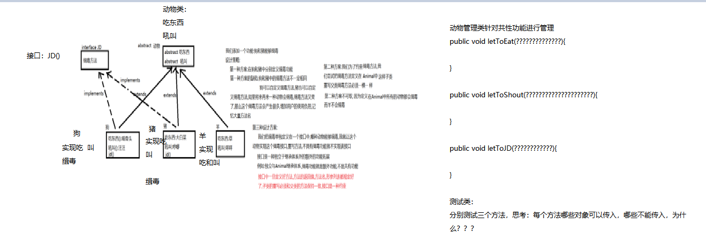
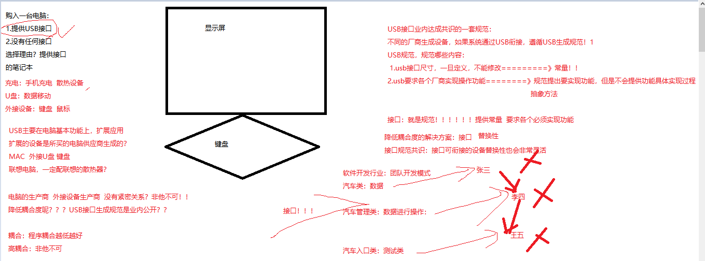
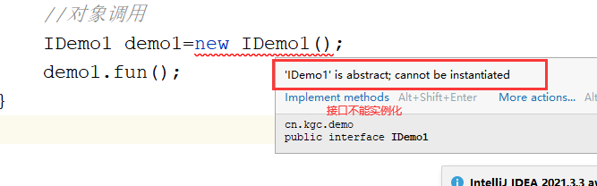

# 课程回顾

## 1 多态两种体现形式

```html
方法形参是父类  方法返回值是父类

父类的引用指向子类对象：向上转型
允许：Father father=new Son();//可以的！！！

子类引用指向父类对象:向下转型  错误的！！！！
//Father fa=new Son();
Son son = new Father();//不能！！！

父类保存子类对象，如果想调用子类自己特有的方法或属性，强制类型转换（向下转型）。为了程序不出现ClassCastException（转型的类型与对象实际的类型不匹配），向下转型前建议：instanceof先做类型判断！！！
```

# 课程目标

## 1 接口基本使用

### 接口定义语法

### 如何实现接口

### 接口和抽象类区别

## 2 解耦理念 ========== 理解

# 课程实施

## 1 接口

### 1-1 接口概念

接口：USB接口。USB接口就是规范、标准

java编程里面，接口：一个内部只有抽象方法的类，定义为接口

### 1-2 接口定义

```java
public interface 接口名{
    //常量
    
    
    //抽象方法
}
```

### 1-3 接口使用细节

```html
1 接口常量可以使用接口名直接访问
2 接口不能实例化对象
3 接口都是抽象方法，所以调用方法没有意义！！！
```

### 1-4 接口使用

子类来**实现**接口！！！

```java
public class 子类 implements 接口名,接口名,....,接口名{
    //提供自己特有的属性
    
    //提供自己特有的方法
    
    //子类必须重写接口中所有的抽象方法，否则子类也必须定义成抽象的
}
```

- 子类可以继承父类同时实现多个接口

```java
public class 子类 extends 父类 implements 接口名,接口名,....,接口名{
    //提供自己特有的属性
    
    //提供自己特有的方法
    
    //子类必须重写接口中所有的抽象方法，否则子类也必须定义成抽象的
}
```

- 接口继承接口，并且多继承

```java
public interface 子接口 extends 父接口1,父接口2,....,父接口n{
    //提供自己特有的常量
    
    //提供自己特有的抽象方法
}
```


### 1-5 接口的作用

**接口作用：突破子类单根继承的局限性**


### 1-6 课堂案例

- 接口1

```java
package cn.kgc.demo;

/**
 * @Author: lc
 * @Date: 2022/3/29
 * @Description: 接口定义之后，如何使用？？必须通过子类来实现接口中所有的抽象方法！！
 * @Version: 1.0
 */
public interface IDemo1 {
	//1常量:public 静态的常量
	//接口默认常量都是公开的静态的
	public static final int NUM=12;


	//2抽象方法
	public abstract void fun1();
}
```

- 接口2

```java
package cn.kgc.demo;

/**
 * @Author: lc
 * @Date: 2022/3/29
 * @Description: cn.kgc.demo
 * @Version: 1.0
 */
public interface IDemo2 {
	public static final String STR="helloWorld";

	public abstract void fun2();
}
```

- 子类同时实现接口1和接口2

```java
package cn.kgc.demo;

/**
 * @Author: lc
 * @Date: 2022/3/29
 * @Description: cn.kgc.demo
 * @Version: 1.0
 */
public class SonDemo implements IDemo1,IDemo2{
	@Override
	public void fun1() {
		System.out.println("fun1.。。。。");
	}

	@Override
	public void fun2() {
		System.out.println("fun2......");
	}
}
```

- 测试类

```java
package cn.kgc.demo;

/**
 * @Author: lc
 * @Date: 2022/3/29
 * @Description: cn.kgc.demo
 * @Version: 1.0
 */
public class Tester {
	public static void main(String[] args) {
		//输出接口中常量NUM
		System.out.println("NUM="+IDemo1.NUM);

		System.out.println("NUM="+SonDemo.NUM);
		System.out.println("STR="+SonDemo.STR);
		//常量不能修改值
		//IDemo1.NUM=34;
		//对象调用
		/*IDemo1 demo1=new IDemo1();
		demo1.fun1();*/

		//调用fun1，如何调用》？？？对象.方法()
		SonDemo sonDemo=new SonDemo();
		sonDemo.fun1();

		//接口目的：更进一步学习多态：必须继承、重写
		//调用fun1，如何调用
		IDemo1 son=new SonDemo();//向上转型
		son.fun1();//正常编译，不会出错

		IDemo2 son2=new SonDemo();//向上转型
		//IDEA一边写，一边编译
		//IDEA怎么知道fun1():向下转型？？？？转换目标类型可以是子类自己、还可以父类、父接口
		if(son2 instanceof SonDemo) {
			((SonDemo) son2).fun1();//编译异常！！！ 实际运行时其实用的都是子类对象，代码按道理说可以正常执行
		}
		//instanceof 向下转型的目标类型（可以自己、父类、父接口）
		if(son2 instanceof IDemo1) {
			((IDemo1) son2).fun1();
		}
	}
}
```


## 面试题

### 1 java中，extends是否只能单根继承？？？

```html
类中：单根继承！！
接口：突破单根继承的局限性。子接口可以同时继承多个父接口。一个子类也可以同时实现多个接口
```

### 2 接口和抽象类有什么区别？

```html
接口和抽象类不同点
抽象类：定义抽象类 abstract class，可以常量、属性、抽象方法、实例方法、静态方法
      构造方法！！！
接口：定义接口 interface，接口只有常量、抽象方法。没有构造方法

类和类之间使用继承，而且单根继承
类和接口是实现，并且可以多实现

设计理念：抽象类对类抽象，同一类事物共性的内容抽取
		接口对行为抽象，对某一种行为的扩展抽取 主要针对类扩展的功能

相同点：
都是为了子类继承或实现。抽象类、接口都不能实例化对象！！

子类继承抽象类、实现接口，必须重写所有的抽象方法！！
```

### 3 类为什么要设计成单根继承的特点，类中如果多继承会有什么弊端？

```html
怎么解决多继承的弊端呢？
弊端：多继承时，当多个父类中有相同功能时，子类调用会产生不确定性。
其实核心原因就是在于多继承父类中功能有主体，而导致调用运行时，不确定运行哪个主体内容。
为什么多实现能解决了呢？
因为接口中的功能都没有方法体，由子类来明确。
```

## 2 接口和抽象类的区别

需求：设计一套学员管理系统

继承，减少代码冗余，抽取父类

KGC学员类：

属性：姓名  性别  年龄  ...

方法：学习


java学员：

属性：姓名  性别  年龄  ...

方法：学习 抽烟


web学员：

属性：姓名  性别  年龄  ...

方法：学习


大数据学员：

属性：姓名  性别  年龄  ...

方法：学习 抽烟


UI学员：

属性：姓名  性别  年龄  ...

方法：学习

**抽烟行为，也是公共的行为，提示思考点：抽烟行为放在哪个类合适？？**

```html
方案一：
  父类：KGC学员类，抽象类
  抽烟是否可以放在KGC学员类中？？？各个子类无条件拥有了父类属性和方法，具有抽烟
不行！！不能在父类放抽烟！！

方案二：
  父类：KGC学员类，不放抽烟
哪个子类有抽烟的行为，就在该子类进行定义！！

缺点？！不便于功能的管理！！！！！

方案三：接口！！！ 强调一个类扩展的行为（在父类的基础上）
体现优势：对于共性方法的抽取，通过多态思想增强程序未来的扩展性、维护性！！
```

### 参考代码

- 父类 

```java
package cn.kgc.demo2;

/**
 * @Author: lc
 * @Date: 2022/3/29
 * @Description: cn.kgc.demo2
 * @Version: 1.0
 */
public abstract class KGCStudent {
	private String name;
	private int age;

	public String getName() {
		return name;
	}

	public void setName(String name) {
		this.name = name;
	}

	public int getAge() {
		return age;
	}

	public void setAge(int age) {
		this.age = age;
	}

	public KGCStudent(String name, int age) {
		this.name = name;
		this.age = age;
	}

	public KGCStudent() {
	}

	@Override
	public String toString() {
		return "KGCStudent{" +
				"name='" + name + '\'' +
				", age=" + age +
				'}';
	}

	//公共的行为 抽象的好处：强制子类重写，是课工场学生必须要学习！！
	public abstract void study();
}
```

- 父接口

```java
package cn.kgc.demo2;

/**
 * @Author: lc
 * @Date: 2022/3/29
 * @Description: cn.kgc.demo2
 * @Version: 1.0
 */
public interface ISmoking {
	public abstract void smoking();
}
```

- 子类のjava学生 

```java
package cn.kgc.demo2;

/**
 * @Author: lc
 * @Date: 2022/3/29
 * @Description: cn.kgc.demo2
 * @Version: 1.0
 */
public class JAVAStudent  extends KGCStudent implements ISmoking{
	@Override
	public void study() {
		System.out.println("天天OOP");
	}

	/**
	 * 抽烟
	 */
	@Override
	public void smoking(){
		System.out.println("找一个空地，聚众抽烟...");
	}
}
```

- 子类のWEB学生

```java
package cn.kgc.demo2;

/**
 * @Author: lc
 * @Date: 2022/3/29
 * @Description: cn.kgc.demo2
 * @Version: 1.0
 */
public class WEBStudent  extends KGCStudent{
	@Override
	public void study() {
		System.out.println("不知道...");
	}
}
```

- 子类のUI学生 

```java
package cn.kgc.demo2;

/**
 * @Author: lc
 * @Date: 2022/3/29
 * @Description: cn.kgc.demo2
 * @Version: 1.0
 */
public class UIStudent extends KGCStudent{
	@Override
	public void study() {
		System.out.println("绘画、上色、设计...");
	}
}
```

- 子类のBigData学生

```java
package cn.kgc.demo2;

/**
 * @Author: lc
 * @Date: 2022/3/29
 * @Description: cn.kgc.demo2
 * @Version: 1.0
 */
public class BigDataStudent extends KGCStudent implements ISmoking{
	@Override
	public void study() {
		System.out.println("好好学习，天天向上");
	}

	@Override
	public void smoking(){
		System.out.println("躲在厕所，偷偷抽...");
	}
}

```

- 管理类

```java
package cn.kgc.demo2;

/**
 * @Author: lc
 * @Date: 2022/3/29
 * @Description: 班主任老师，课工场学生的管理
 * @Version: 1.0
 */
public class KGCStudentService {
	public void doStudy(KGCStudent kgcStudent){//子类 is a 父类的一种
		kgcStudent.study();
	}

	/**
	 * 管理学生抽烟的行为
	 */
	//public void doSmoking(KGCStudent  kgcStudent) {
	public void doSmoking(ISmoking  kgcStudent) {//多态吗？？？？
		kgcStudent.smoking();
	}
}
```

- 测试类 

```java
package cn.kgc.demo2;

/**
 * @Author: lc
 * @Date: 2022/3/29
 * @Description: cn.kgc.demo2
 * @Version: 1.0
 */
public class Tester {
	public static void main(String[] args) {
		//1.班主任
		KGCStudentService service=new KGCStudentService();
		//父类作为形参时，只要传入的实参满足给父类变量赋值就可以
		service.doStudy(new JAVAStudent());//形参父类=实参子类对象
		service.doStudy(new WEBStudent());
		service.doStudy(new BigDataStudent());
		service.doStudy(new UIStudent());
		service.doStudy(new TestStudent());
		//管理抽烟
		//service.doSmoking(new WEBStudent());//报错，因为WEBStudent不是ISmoking的实现类
		service.doSmoking(new JAVAStudent());
		//service.doSmoking(new UIStudent());//报错，因为UIStudent不是ISmoking的实现类
		service.doSmoking(new BigDataStudent());
		service.doSmoking(new TestStudent());


		/*KGCStudent kgcStudent=new JAVAStudent();
		//父类的变量调用了子类特有的方法
		((JAVAStudent)kgcStudent).smoking();

		KGCStudent kgcStudent2=new WEBStudent();
		//web学生没有抽烟行为
		//((WEBStudent)kgcStudent2).smoking();*/
	}
}
```

### 学生练习



## 3 接口意义：解耦

接口概念：接口就是一套规范（约定）

接口：接口涉及数据的问题，就应该明文规定且不允许擅自修改！！！

​           涉及行为的问题，抽象方法？？



### USB接口案例分析接口意义

- USB接口

```java
package cn.kgc.demo4;

/**
 * @Author: lc
 * @Date: 2022/3/29
 * @Description: cn.kgc.demo4
 * @Version: 1.0
 */
public interface IUSB {
	//尺寸
	public static final int WIDTH=12;//宽度
	public static final int LENGTH=22;//长度

	//提供服务的功能
	public abstract void service();
}
```

- 接口的实现类U盘类

```java
package cn.kgc.demo4;

/**
 * @Author: lc
 * @Date: 2022/3/29
 * @Description: u盘
 * @Version: 1.0
 */
public class UDisk implements IUSB{

	@Override
	public void service() {
		//u盘的生产商技术工艺，其他厂商不会做
		System.out.println("接入电脑");
		System.out.println("复制数据");

	}
}
```

- 接口的实现类充电器类

```java
package cn.kgc.demo4;

/**
 * @Author: lc
 * @Date: 2022/3/29
 * @Description: cn.kgc.demo4
 * @Version: 1.0
 */
public class ChongDianQi implements IUSB{
	@Override
	public void service() {
		System.out.println("接入电脑");
		System.out.println("输送电流..");
	}
}
```

- 电脑类

```java
package cn.kgc.demo4;

/**
 * @Author: lc
 * @Date: 2022/3/29
 * @Description: cn.kgc.demo4
 * @Version: 1.0
 */
public class Computer {
	//提供属性
	private String brand;
	private double price;
	private String color;

	//3个USB接口
	private  IUSB   USB1;
	private  IUSB  USB2;
	private  IUSB USB3;
	private UDisk usb4;//usb4接口只能接u盘

	public UDisk getUsb4() {
		return usb4;
	}

	public void setUsb4(UDisk usb4) {
		this.usb4 = usb4;
	}

	public String getBrand() {
		return brand;
	}

	public void setBrand(String brand) {
		this.brand = brand;
	}

	public double getPrice() {
		return price;
	}

	public void setPrice(double price) {
		this.price = price;
	}

	public String getColor() {
		return color;
	}

	public void setColor(String color) {
		this.color = color;
	}

	public IUSB getUSB1() {
		return USB1;
	}

	public void setUSB1(IUSB USB1) {
		this.USB1 = USB1;
	}

	public IUSB getUSB2() {
		return USB2;
	}

	public void setUSB2(IUSB USB2) {
		this.USB2 = USB2;
	}

	public IUSB getUSB3() {
		return USB3;
	}

	public void setUSB3(IUSB USB3) {
		this.USB3 = USB3;
	}

	//方法
	public void open(){
		System.out.println("电脑开机了");
	}
	public void work(){
		//使用USB1上面的设备工作中
		this.getUSB1().service();
	}
	public void close(){
		System.out.println("电脑关机了。。。");
	}

}
```

- 测试类

```java
package cn.kgc.demo4;

/**
 * @Author: lc
 * @Date: 2022/3/29
 * @Description: cn.kgc.demo4
 * @Version: 1.0
 */
public class TestComputer {
	public static void main(String[] args) {
		//1.买一台电脑
		Computer computer=new Computer();
		computer.setBrand("Lenovo");
		computer.setPrice(9999);
		computer.setColor("黑色");
		//测试电脑的功能
		computer.open();
		//使用外接设备，完成一些功能
		//USB1衔接设备，没有设备，电脑无法正常工作
		//为了让电脑能够工作，先买设备：买的设备是USB接口，否则接不进去
		//UDisk iusb=new UDisk();
		//购入充电器
		ChongDianQi cdq=new ChongDianQi();
        //IUSB实现类的对象，因为只有实现IUSB接口的设备，匹配
		computer.setUSB1(cdq);//可以接入任何实现了USB接口的设备 

		//computer.setUsb4(cdq);//代码会报错，以为该USB接口只能用U盘
		computer.work();
		computer.close();
	}
}

```

## 常见异常



# 课程总结

## 理解   接口意义

## 掌握  定义接口  子类如何实现接口  接口引用指向子类对象

## 理解：区分抽象类和接口区别，针对应用场景做技术选型


# 预习安排

API帮助手册

异常！！

Exception继承体系：父类是谁，子类有哪些？

处理方式：

try-catch-finally

throws

throw


Error--- 有什么特点


