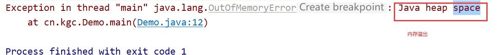
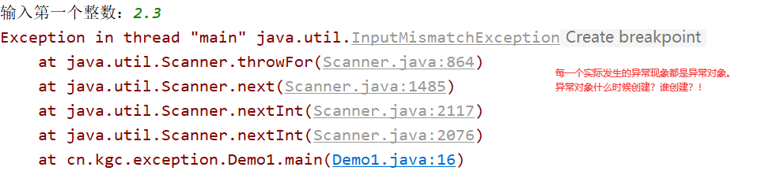
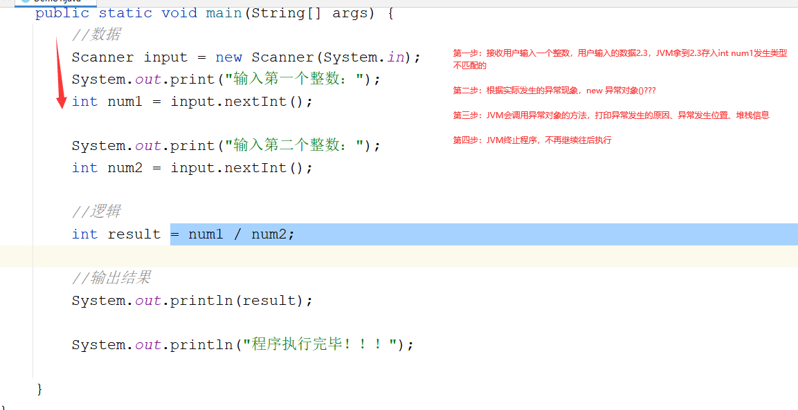
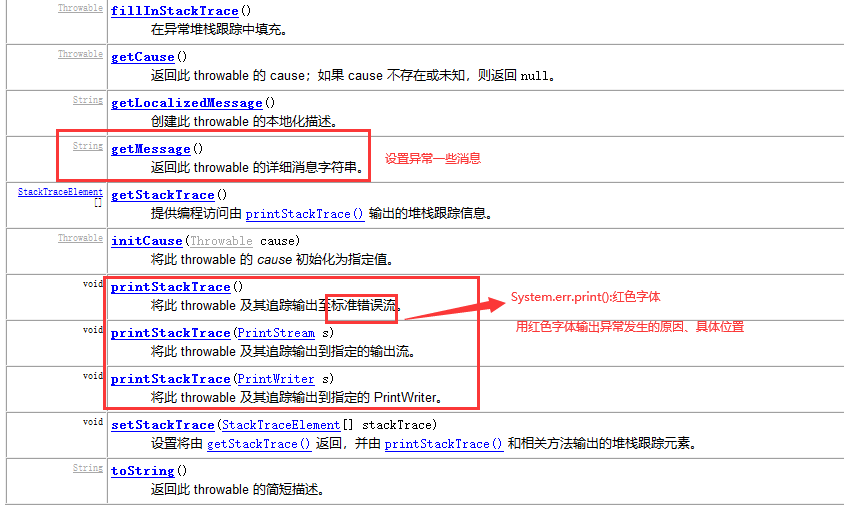
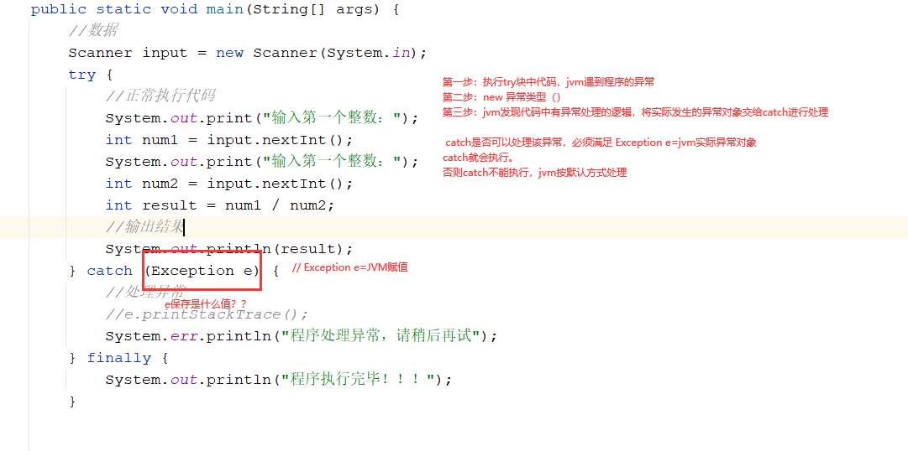
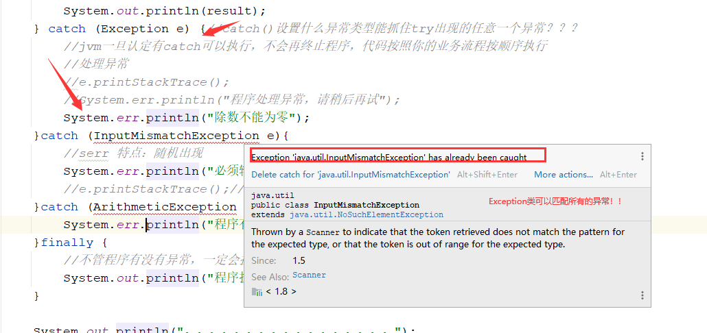
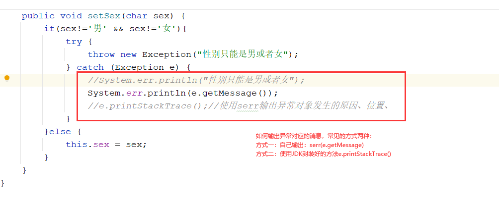

# 课程计划

异常处理机制

高级实用类：Math类  Random类  Date类和Calendar类

​                      字符串String   StringBuilder    StringBuffer

集合框架：单列集合   List   Set

​				   双列集合    Map

IO操作：字节流

​                字符流

线程：线程概念、多线程 、线程同步

学习方式：API手册   尝试面向百度编程

# 课程目标

## 1 异常继承体系 ===== 理解

## 2 异常默认处理机制 ==== 理解

## 3 异常三种处理方式 ====== 掌握

### try-catch-finally

### throws

### throw

# 课程实施

## 1 异常

### 1-1 异常概念

异常：通俗地说 意外 

java程序：我们把程序执行过程中发生的一些意外的现象统称为异常。

### 1-2 异常类型

java根据OO思想设计异常类！！

#### 根据异常是否需要处理，Throwable类分为两类：Exception和Error

Throwable类：Exception类和Error类父类

```html
`Throwable` 类是 Java 语言中所有错误或异常的超类。
```

Exception类：代表了程序里面所有的异常共有特征和行为。程序员主要就是处理Exception

```html
`Exception` 类及其子类是 `Throwable` 的一种形式，它指出了合理的应用程序想要捕获的条件。 
```

#### Exception类根据异常处理的时机：

```html
编译阶段提示异常：编译期异常

运行时提示异常：运行时异常。哪些异常是运行时异常：RuntimeException及其后代
```

Error类：错误！！不能用于Error及其子类。why?Error一旦发生，就是致命的，程序不修正代码，永远都不能执行!

```html
`Error` 是 `Throwable`  的子类，用于指示合理的应用程序不应该试图捕获的严重问题。大多数这样的错误都是异常条件。虽然 `ThreadDeath`  错误是一个“正规”的条件，但它也是 `Error` 的子类，因为大多数应用程序都不应该试图捕获它。 

在执行该方法期间，无需在其 `throws` 子句中声明可能抛出但是未能捕获的 `Error`  的任何子类，因为这些错误可能是再也不会发生的异常条件。 
```

#### Error的代码案例

```java
package cn.kgc;

/**
 * @Author: lc
 * @Date: 2022/3/30
 * @Description: 演示异常Exception和错误Error的区别
 * @Version: 1.0
 */
public class Demo {
	public static void main(String[] args) {
		//异常可以通过异常处理机制处理
		//System.out.println(12/0);//ArithmeticException
		//错误必须修改代码，否则程序一直不能执行
		int[] arr=new int[1000*1000*1024];//OutOfMemoryError
	}
}
```



## 2 JVM默认处理机制

### 2-1 引入案例

```html
1.Scanner获取用户输入两个整数
2.使用int result保存两个整数的商
3.输出计算结果
4.sout("程序到此执行完毕")

测试：
1.输入正常的数值，不用用字符串、小数、不要用0做除数
2.分别测试：输入字符  小数  输入0，你的程序会有什么执行结果？
分析：jvm遇到异常，默认处理？？
```

#### 参考代码

```java
package cn.kgc.exception;

import java.util.Scanner;

/**
 * @Author: lc
 * @Date: 2022/3/30
 * @Description: 引入案例
 * @Version: 1.0
 */
public class Demo1 {
	public static void main(String[] args) {
		//数据
		Scanner input = new Scanner(System.in);
		System.out.print("输入第一个整数：");
		int num1 = 0;
		if (input获取的数据是整数) {
			num1 = input.nextInt();
		}
		System.out.print("输入第二个整数：");
		int num2 = 0;
		if (input获取的数据是整) {
			num2 = input.nextInt();
		}
		//逻辑
		int result = 0;
		if (num2!=0) {
			result = num1 / num2;
		}

		//输出结果
		System.out.println(result);

		System.out.println("程序执行完毕！！！");
	}
}

```



### 2-2 通过案例分析JVM处理异常的默认方式

```html
1.JVM执行代码，遇到异常之后，创建异常对象！！
2.JVM执行代码，遇到异常之后，终止程序不再继续往后执行！！
```



### 2-3 异常类常用方法



发现问题：JVM遇到异常，最终程序不能全部执行完毕！

### 2-4 异常处理意义！！

程序员为了解决异常，不得不选择通过if语句或循环语句限制流程中数据的合法性。

这种处理异常的手段存在很多弊端：

1. 代码层级嵌套会很多，阅读性性差，程序维护性不好
2. 本身业务会因为添加很多额外的if或循环，代码量膨胀！！降低代码的开发效率！！

## 3 try-catch-finally

语法

```java
try{
    //希望jvm执行代码,正常业务流
}catch(异常类型  变量名){
    //异常处理的代码
}finally{
    //程序不管正常还是异常最终都要执行代码
}
```




希望：如果输入数据不合法：提示请输入合法的整数！！！

如果输入除数为零，提示：除数不能为0

使用try-catch-finally优化后的代码如下所示：

```java
package cn.kgc.exception;

import java.util.Scanner;

/**
 * @Author: lc
 * @Date: 2022/3/30
 * @Description: cn.kgc.exception
 * @Version: 1.0
 */
public class Demo2 {
	public static void main(String[] args) {
		//数据
		Scanner input = new Scanner(System.in);
		try {
			//正常执行代码
			System.out.print("输入第一个整数：");
			int num1 = input.nextInt();
			System.out.print("输入第一个整数：");
			int num2 = input.nextInt();
			int result = num1 / num2;
			//输出结果
			System.out.println(result);
		} catch (ArithmeticException e) {//catch()设置什么异常类型能抓住try出现的任意一个异常？？？
			//jvm一旦认定有catch可以执行，不会再终止程序，代码按照你的业务流程按顺序执行
			//处理异常
			//e.printStackTrace();
			System.err.println("程序处理异常，请稍后再试");
		} finally {
			//不管程序有没有异常，一定会执行
			System.out.println("程序执行完毕！！！");
		}
		System.out.println("。。。。。。。。。。。。。。。。。");

	}
}
```

### 多重catch

原理：底层instanceof类型匹配.多重catch的执行流程同多重if，多个catch最终只会执行一个。按照自上而下的顺序匹配。父类必须放在子类下面。why???

```java
try{
    //正常的代码
}catch(异常类型1 变量名){
    //异常类型1处理的方案
}catch(异常类型2 变量名){
    //异常类型1处理的方案
}...catch(异常类型n 变量名){
    //异常类型1处理的方案
}finally{
    
}

```



#### 使用多重catch处理两数相除的问题，参考代码如下：

```java
package cn.kgc.exception;

import java.util.InputMismatchException;
import java.util.Scanner;

/**
 * @Author: lc
 * @Date: 2022/3/30
 * @Description: cn.kgc.exception
 * @Version: 1.0
 */
public class Demo2 {
	public static void main(String[] args) {
		//数据
		Scanner input = new Scanner(System.in);
		try {
			//正常执行代码
			System.out.print("输入第一个整数：");
			int num1 = input.nextInt();
			System.out.print("输入第一个整数：");
			int num2 = input.nextInt();
			int result = num1 / num2;
			//输出结果
			System.out.println(result);
			if(true){
				//return;//return停止代码不再往后执行，但是finally代码不受此影响，依然会正常执行
				System.exit(0);//jvm停止,finally代码将不会再执行
			}
		} catch (ArithmeticException e) {//catch()设置什么异常类型能抓住try出现的任意一个异常？？？
			//jvm一旦认定有catch可以执行，不会再终止程序，代码按照你的业务流程按顺序执行
			//处理异常
			//e.printStackTrace();
			//System.err.println("程序处理异常，请稍后再试");
			System.err.println("除数不能为零");
		}catch (InputMismatchException e){
			//serr 特点：随机出现
			System.err.println("必须输入整数");
			//e.printStackTrace();//默认使用serr输出异常的详细信息、原因、位置
		}catch (Exception e){
			System.err.println("程序有异常，请稍后再试");
		}finally {
			//不管程序有没有异常，一定会执行
			System.out.println("程序执行完毕！！！");
		}
		System.out.println("。。。。。。。。。。。。。。。。。");
	}
}
```

## 4 throws

throws 翻译 声明 异常，给别人处理

### 4-1 throws作用

定义方法时，用throws通知方法调用人：该方法没有处理异常，请你处理！！

### 4-2 throws使用语法

```java
public 返回值类型 方法名(形参列表) throws 异常类型1,....,异常类型n{
    //方法体
}

public abstract 返回值类型 方法名(形参列表) throws 异常类型1,....,异常类型n;
```

### 4-3 课堂演示案例

- 计算器类

```java
package cn.kgc.exception;

/**
 * @Author: lc
 * @Date: 2022/3/30
 * @Description: cn.kgc.exception
 * @Version: 1.0
 */
public class Calculator {
	/**
	 * 求两个整数的商
	 * @param num1 被除数
	 * @param num2 除数
	 * @throws ArithmeticException 除数为0的异常
	 * @return 商
	 */
	public int div(int num1,int num2)throws RuntimeException{//throws编译期异常，调用人一用方法就会爆红。
		int result = num1 / num2;
		return result;
	}
}
```

- 测试类，调用有异常的div方法

```java
package cn.kgc.exception;

/**
 * @Author: lc
 * @Date: 2022/3/30
 * @Description: cn.kgc.exception
 * @Version: 1.0
 */
public class Tester {
	public static void main(String[] args) throws Exception{
		int a=12;
		int b=0;

		//找对象，调方法
		Calculator c = new Calculator();
		//div()可能不是测试人写的，因为程序处理异常，异常归谁处理呢？？？

		//try {
			//有的时候有错误提示，有的时候没有？
			//idea自动编译出现问题：统称为编译期异常，如果不解决，idea不能执行代码
			//throws声明的异常类型有关系：编译期异常   运行时异常RuntimeException
			int r = c.div(a,b);
			System.out.println("计算结果是："+r);
		//} catch (Exception e) {
		//	e.printStackTrace();
		//}
	}
}
```

### 4-4 throws的使用小结

如果调用方法时，遇到方法上使用throws声明了异常，调用者的处理方式有以下两种：

- 可以使用try-catch处理方法声明的异常

- 可以使用throws将方法异常声明给上一级处理

## 5 throw

throw 翻译 抛出

### 5-1 throw的作用

方法体实现过程中，根据业务处理的判断，抛出有针对性的异常对象！！

### 5-2 throw语法

```java
public 返回值类型 方法名(形参列表){
    //方法体
    if(){//不合法，
        throw new 异常类名();//通知JVM异常！！
    }
}
```

### 5-3 课堂案例



- Person类

```java
package cn.kgc.exception;

/**
 * @Author: lc
 * @Date: 2022/3/30
 * @Description: cn.kgc.exception
 * @Version: 1.0
 */
public class Person {
	private String name;
	private int age;
	private char sex;

	public String getName() {
		return name;
	}

	public void setName(String name) {
		this.name = name;
	}

	public int getAge() {
		return age;
	}

	public void setAge(int age) throws RuntimeException {
		if(age<0 || age>150){
			//抛出异常，JVM处理异常：一种：try-catch  二种：默认处理。等价于return
			//try {
			//	throw new Exception();//Exception是编译期，抛出，idea自动编译，立马发现异常
			throw new RuntimeException("人类的年龄只能在0-150岁之间！！！");//RuntimeException运行时，抛出不会出现红色波浪线
			//} catch (Exception e) {
			//	e.printStackTrace();
			//}
		}else {
			this.age = age;
		}
	}

	public char getSex() {
		return sex;
	}

	public void setSex(char sex) {
		if(sex!='男' && sex!='女'){
			try {
				throw new Exception("性别只能是男或者女");
			} catch (Exception e) {
				//System.err.println("性别只能是男或者女");
				System.err.println(e.getMessage());
				//e.printStackTrace();//使用serr输出异常对象发生的原因、位置、
			}
		}else {
			this.sex = sex;
		}
	}
}
```

- 测试类Tester

```java
package cn.kgc.exception;

/**
 * @Author: lc
 * @Date: 2022/3/30
 * @Description: cn.kgc.exception
 * @Version: 1.0
 */
public class TestPerson {
	public static void main(String[] args) {
		Person p=new Person();
		p.setName("张三丰");
		p.setAge(12);//方法定义人没有处理异常！！！
		p.setSex('a');//方法定义人处理异常

		System.out.println("age="+p.getAge());
		System.out.println("sex="+p.getSex());
	}
}
```

### 5-4 throw小结

程序中，一般使用throw根据代码的情况，针对不合法的逻辑，手动抛出异常对象：

- 看到方法抛出异常，方法上声明异常，方法调用人看到声明异常，可以try-catch或throws
- 看到方法抛出异常，方法定义人可以try-catch解决异常

## 6 自定义异常

### 6-1 自定义异常

记住JDK提供的所有的异常类型不现实！实际开发，每个项目根据业务实际情况，做自定义异常处理

### 6-2 自定义异常存放的包名

cn.kgc.exception.自定义异常类

### 6-3 自定义实现步骤

throw new 自定义异常()===>try()catch(Exception e)

```html
1.创建一个类，放在xx.xx.exception包下面
2.将创建的类继承Exception、Throwable、RuntimeException...
3.super()调用父类的构造方法，实现属性赋值即可
```

### 6-4 应用场景

throw或 throws 或catch

### 6-5 课堂案例

- 定义异常类

```java
package cn.kgc.k2502.exception;

/**
 * @Author: lc
 * @Date: 2022/3/30
 * @Description: cn.kgc.k2502.exception
 * @Version: 1.0
 */
public class InvalidAgeRangeException extends RuntimeException {
	public InvalidAgeRangeException() {
	}

	public InvalidAgeRangeException(String message) {
		super(message);
	}

	public InvalidAgeRangeException(String message, Throwable cause) {
		super(message, cause);
	}

	public InvalidAgeRangeException(Throwable cause) {
		super(cause);
	}

	public InvalidAgeRangeException(String message, Throwable cause, boolean enableSuppression, boolean writableStackTrace) {
		super(message, cause, enableSuppression, writableStackTrace);
	}
}
```

- 使用自定义异常

```java
package cn.kgc.exception;

import cn.kgc.k2502.exception.InvalidAgeRangeException;

/**
 * @Author: lc
 * @Date: 2022/3/30
 * @Description: cn.kgc.exception
 * @Version: 1.0
 */
public class Person {
	private String name;
	private int age;
	private char sex;

	public String getName() {
		return name;
	}

	public void setName(String name) {
		this.name = name;
	}

	public int getAge() {
		return age;
	}

	public void setAge(int age) throws RuntimeException {
		if(age<0 || age>150){
			//抛出异常，JVM处理异常：一种：try-catch  二种：默认处理。等价于return
			//try {
			//	throw new Exception();//Exception是编译期，抛出，idea自动编译，立马发现异常
			//throw new RuntimeException("人类的年龄只能在0-150岁之间！！！");//RuntimeException运行时，抛出不会出现红色波浪线
			throw new InvalidAgeRangeException("人类的年龄只能在0-150岁之间！！！");
			//} catch (Exception e) {
			//	e.printStackTrace();
			//}
		}else {
			this.age = age;
		}
	}

	public char getSex() {
		return sex;
	}

	public void setSex(char sex) {
		if(sex!='男' && sex!='女'){
			try {
				throw new Exception("性别只能是男或者女");
			} catch (Exception e) {
				//System.err.println("性别只能是男或者女");
				System.err.println(e.getMessage());
				//e.printStackTrace();//使用serr输出异常对象发生的原因、位置、
			}
		}else {
			this.sex = sex;
		}
	}
}
```


# 课程总结

## 1 try-catch-finally执行流程：掌握

## 2 throws和throw区别！！

## 3 学会自定义异常


# 预习安排

高级实用类：建议：以写为主，整理  方法（形参）返回值

Math类 

Random类  Date类和Calendar类


