# 课程回顾

## 1 异常处理机制

```html
try-catch-finally
细节：try-catch  try-finally  try-catch-finally

多重catch书写格式，执行流程

finally执行时机：释放资源！！

throw：抛出异常对象。程序员根据条件，可以使用throw异常抛出

throws：声明异常类型。throws通知方法调用者处理异常，方法本身没有处理异常

自定义异常步骤：
1.创建类继承任意一个异常父类
2.super()

```

## 2 异常继承体系

```java
throwable
    Exception
        RuntimeException:运行时异常 又称为非检查行异常  UnCheckedException        
		不是RuntimeException及其后代，统称为编译期异常。又称为检查异常 CheckedException
    Error
```

# 课程目标

## 1 Math常用方法 ======= 掌握

## 2 Random ======= 掌握

## 3 Date日期和SimpleDateFormat ======= 掌握

## 4 Calendar日历

## 5 包装类 ========== 理解

## 6 装箱和拆箱 ======= 理解

# 课程实施

## 1 Math类

工具类。提供全部都是static修饰方法。

### 常用方法

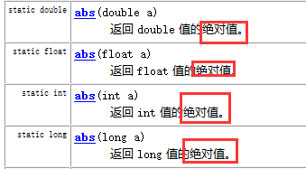

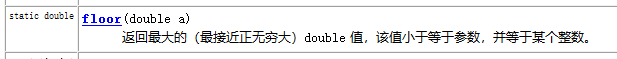

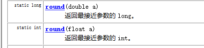

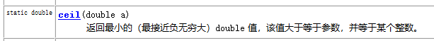

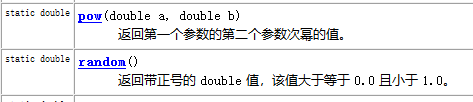

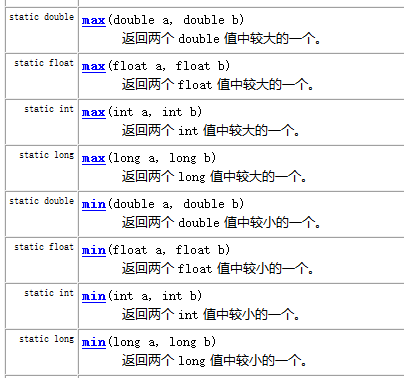

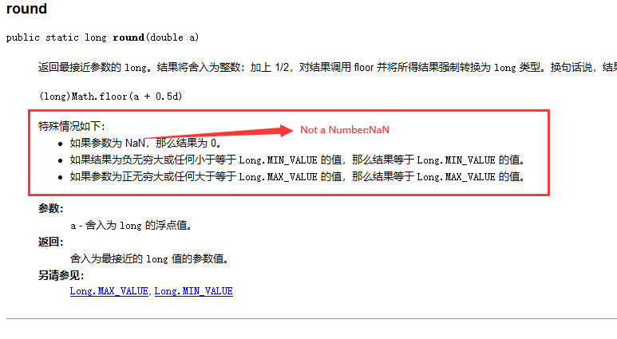

### 课堂案例

```java
package cn.kgc.demo;
//扩展 JDK1.7提供 静态导入,可以省略类名.代码阅读性好
import static java.lang.Math.*;
/**
 * @Author: lc
 * @Date: 2022/3/30
 * @Description: cn.kgc.demo
 * @Version: 1.0
 */
public class Demo1 {
	public static void main(String[] args) {
		System.out.println("12和24中的最大值是："+Math.max(12,24));
		System.out.println("12和24中的最大值是："+min(12,24));
		////四舍五入的功能，round()基于什么原则获取四舍五入的结果呢？
		//底层实现公式：(long)Math.floor(a + 0.5d)
		System.out.println("-12.45四1舍五入的结果："+Math.round(-12.95));//12   -12  -13
		//小数点后面有数据，向前进一位 向上找最小：找12.45大的整数中，最小的整数
		System.out.println("-12.45四1舍五入的结果："+Math.ceil(-12.95));//13    -12  -12
		//小数点后面有数据，舍去小数点 向下找最大：找12.45小的整数中，最大的整数
		System.out.println("-12.45四1舍五入的结果："+Math.floor(-12.95));//12.0   -13   -13
		
		//随机数：随机不重复！！伪随机
		while(true){
			//随机生成0-10之间随机数[0,10)
			//System.out.println((int) (Math.random()*10));//[0,1)  浮点：

			//随机生成0-10之间随机数[1,10)
			System.out.println((int) (random()*9+1));//[0,1)  浮点：
		}

		//随机点名系统
		//需求：数组保存N个学生姓名，随机数生成下标
	}
}

```

## 2 Random类

java用来生成随机数的类

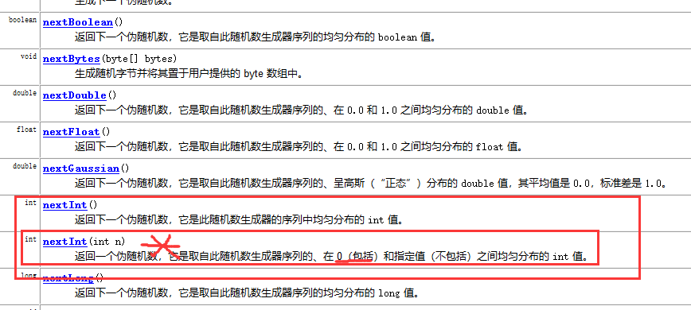

### 2-1 使用步骤

```html
1.import java.util.Random;
2.创建Random对象
3.对象.nextXXX()生成对应的随机数
```

### 2-2 课堂案例

```java
package cn.kgc.demo;

import java.util.Random;

/**
 * @Author: lc
 * @Date: 2022/4/1
 * @Description: cn.kgc.demo
 * @Version: 1.0
 */
public class RandomDemo {
	public static void main(String[] args) {
		Random r = new Random();
		while(true){
			//int范围随机数
			//System.out.println(r.nextInt());
			//int 范围[0,最大值)
			//System.out.println(r.nextInt(100));
			//int 范围[1,最大值)
			System.out.println(r.nextInt(99)+1);
		}
	}
}
```

## 随机数的使用小结

### Math.random()

```html
小结：
1.生成[0,N)之间的随机数，公式是：(int)(Math.random()*N)
2.生成[1,N)之间的随机数，公式是：(int)(Math.random()*(N-1)+1)
```

### Random的nextInt()

```html
小结：
1.生成[0,N)之间的随机数，公式是：r.nextInt(N)
2.生成[1,N)之间的随机数，公式是：r.nextInt(N-1)+1
```

## 3 Date类*****

Date是java中用来定义日期类型的数据类型。

### 3-1 Date类概念

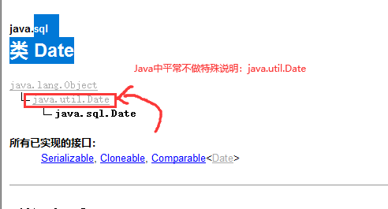

### 3-2 创建Date对象

```java
new Date():获取当前时间！！！

new Date(long date):long指表示时间对象距离1970.1.1 0:0:0毫秒差
```

#### 课堂案例

```java
package cn.kgc.demo;
import java.util.Date;
/**
 * @Author: lc
 * @Date: 2022/4/1
 * @Description: cn.kgc.demo
 * @Version: 1.0
 */
public class DateDemo {
	public static void main(String[] args) {
		//1.创建Date对象
		Date now = new Date();
		System.out.println(now);

		//2.创建Date对象，now的时间
		long l = System.currentTimeMillis();//当前时间毫秒差
		System.out.println(l);
		Date now=new Date(l);
		System.out.println("当前时间是："+now);

		//3.扩展：
		int i=0;
		long start = System.currentTimeMillis();
		while(i<10000000L){
			i++;
		}
		long end = System.currentTimeMillis();
		System.out.println("执行的时间是："+(end-start));
	}
}
```


## 4 SimpleDateFormat类

`SimpleDateFormat` 是一个以与语言环境有关的方式来格式化和解析日期的具体类。它允许进行格式化（日期 ->  文本）、解析（文本 -> 日期）和规范化。 

### 4-1 Date对象的格式化方案

#### 日期格式化步骤：Date类型数据--->String类型

```html
1.创建SimpleDateFormat对象
2.SimpleDateFormat对象调用format(Date 要格式化的日期)
```

#### 课堂案例

```java
package cn.kgc.demo;

import java.text.SimpleDateFormat;
import java.util.Date;

/**
 * @Author: lc
 * @Date: 2022/4/1
 * @Description: cn.kgc.demo
 * @Version: 1.0
 */
public class FormatDateToStringDemo {
	public static void main(String[] args) {
		//1.创建SimpleDateFormat对象
		SimpleDateFormat sdf = new SimpleDateFormat("yyyy-MM/dd日   HH:mm:ss SSS E");
		//2.SimpleDateFormat对象调用format(Date)
		String result=sdf.format(new Date());
		//3.输出格式化后的结果
		//默认格式：22-4-1 上午10:49
		//个性化的日期格式：2022年4月1日  10:49:51 星期
		//2022年4月1日  10:49:51 星期匹配的格式如何写
		//yyyy年MM月dd日   HH:mm:ss SSS E
		//HH-24小时制  hh-12小时制
		System.out.println(result);
	}
}
```

### 4-2 String日期格式转换Date类型方案

#### 解析日期字符串步骤：String类型--->Date类型

```html
1.创建SimpleDateFormat对象
2.SimpleDateFormat对象调用parse(String 要转换的日期字符串)
```

#### 课堂案例

```java
package cn.kgc.demo;

import java.text.SimpleDateFormat;
import java.util.Date;

/**
 * @Author: lc
 * @Date: 2022/4/1
 * @Description: cn.kgc.demo
 * @Version: 1.0
 */
public class ConvertStringToDateDemo {
	public static void main(String[] args) throws Exception {
		//1.定义自己的生日
		String birthdayStr="1999-12-3";
		//2.String-->Date
		SimpleDateFormat sdf=new SimpleDateFormat("yyyy-MM-dd");//默认格式：22-12-3 上午
		Date birthday =sdf.parse(birthdayStr);

		System.out.println(birthday);//输出结果：java默认的格式
	}
}

```

#### parse()日期字符串常见的异常

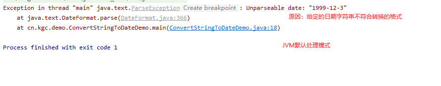

### 练习：输出自己的生日是星期几

```java
package cn.kgc.demo;

import java.text.SimpleDateFormat;
import java.util.Date;

public class ConvertStringToDateDemo {
	public static void main(String[] args) throws Exception {
		//1.定义自己的生日
		String birthdayStr="1999-12-3";
		//2.String-->Date
		SimpleDateFormat sdf=new SimpleDateFormat("yyyy-MM-dd");//默认格式：22-12-3 上午
		Date birthday =sdf.parse(birthdayStr);

		System.out.println(birthday);//输出结果：java默认的格式

		//补充：输出：我的生日是星期五！！
		sdf=new SimpleDateFormat("E");
		System.out.println(birthdayStr+"是"+sdf.format(birthday));
	}
}

```

## 5 Calendar类

### 5-1 Calendar概述

```html
Calendar 类是一个抽象类，它为特定瞬间与一组诸如 YEAR、MONTH、DAY_OF_MONTH、HOUR 等 日历字段之间的转换提供了一些方法，并为操作日历字段（例如获得下星期的日期）提供了一些方法。瞬间可用毫秒值来表示，它是距历元（即格林威治标准时间 1970 年 1 月 1 日的 00:00:00.000，格里高利历）的偏移量。
```

### 5-2 Calendar常用方法

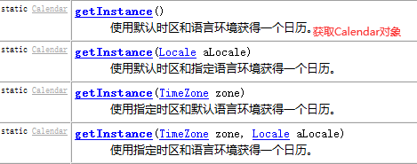

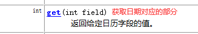

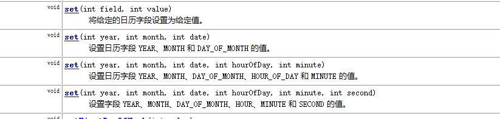


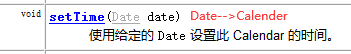


### 5-3 课堂案例

#### 5-3-1 创建Calendar对象

```java
Calendar now=Calendar.getInstance();
```

#### 5-3-2 格式良好的日期格式

```java
get()先获取日期各个部分，再拼接字符串
```

#### 5-3-3 解析日期字符串

```java
Calendar.set(year,month,date,hour,minute,second)
```

#### 案例代码

```java
package cn.kgc.demo;

import java.util.Calendar;
import java.util.Date;

/**
 * @Author: lc
 * @Date: 2022/4/1
 * @Description: cn.kgc.demo
 * @Version: 1.0
 */
public class CalendarDemo {
	public static void main(String[] args) {
		//1.创建Calendar对象，也是获取当前时间
		Calendar now=Calendar.getInstance();
		//设置特定的时间
		now.setLenient(false);//设置日历解析模式为非宽松模式 non-lenient
		now.set(2019, 12-1, 10);
		//2.输出calendar的日期格式
		System.out.println(now);
		//格式化怎么做？
		int year = now.get(Calendar.YEAR);
		int month = now.get(Calendar.MONTH)+1;//从0开始计数，第一个月0 第二个月1 ..
		int date = now.get(Calendar.DAY_OF_MONTH);//Calendar.DATE

		int hour = now.get(Calendar.HOUR);
		int minute = now.get(Calendar.MINUTE);
		int second = now.get(Calendar.SECOND);

		int millionSecond = now.get(Calendar.MILLISECOND);
		int weekday = now.get(Calendar.DAY_OF_WEEK)-1;//星期日1 星期一 2 。。。。星期五6 星期六7
		System.out.println(year+"年"+month+"月"+date+"日 "+hour+":"+minute+":"+second+" "+millionSecond+"  星期"+weekday);
        
		//扩展：格式化，嫌弃麻烦，可以Calendar--->Date-->SimpleDateFormat()
		//Calendar--->Date
		Date time = now.getTime();
		//Date--->Calendar
		now.setTime(time);
	}
}
```

## 6 包装类

### 6-1 概念

包装类：8种基本数据类型对应的引用数据类型。

### 6-2 分类

```html
基本类型                      包装类
byte                         Byte
short                        Short
int                          Integer
long                         Long

float                        Float
double                       Double

char                         Character

boolean                      Boolean
```

## 7 装箱和拆箱

### 7-1 装箱概念

装箱：将基本类型转换为**对应的**包装类类型对象。

#### java分类为：自动装箱和手动装箱

```java
包装类 变量名= 包装类名.valueOf(值)
举例说明：
   Integer i=12;//手动装箱
   Integer i=Integer.valueOf(12);//手动装箱
```

### 7-2 拆箱概念

拆箱：将包装类对象转换为对应的基本类型的值

#### java分类为：自动拆箱和手动拆箱

```java
包装类 变量名= 包装类名.valueOf(值)
    
//手动拆箱
变量名.基本类型value()
举例：
Double d=12.3;//自动装箱
//手动拆箱
double d2=d.doubleValue()
```

### 7-3 课堂演示案例

```java
package cn.kgc.demo;

/**
 * @Author: lc
 * @Date: 2022/4/1
 * @Description: 装箱和拆箱案例
 * @Version: 1.0
 */
public class BoxingDemo {
	public static void main(String[] args) {
		int num=12;//基本类型，不是对象，无法方法调用和处理

		//手动装箱  JDK1.5手动装箱封装之后，以自动装箱模式提供给程序员使用
		//程序员交给编译期编译，套用手动装箱代码
		Integer num2= 12;//12是一个对象  自动装箱

		//Double d=12;//报错！！

		//计算num2.intValue()手动拆箱
		System.out.println(num2+10);//num2-->int int+10求和  自动拆箱，一旦jdk版本降低1.5以前，此行代码会报错
	}
}
```

# 课程总结

## 1 理解：包装类  装箱和拆箱 概念

了解：手动拆箱和手动装箱

## 2 掌握：

##        Math   ceil()  floor() round()  random()

##        Random使用步骤

##        Date创建、格式化日期、解析日期字符串

## 	   Calendar对象创建、get() set  setTime() getTime()


# 预习安排

字符串：String  StringBuilder StringBuffer  区别！！  String常用方法