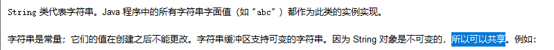

# 课程回顾

## 1 Math  Random Date和SimpleDateFormat Calendar

## 2 包装类

```html
Byte Short Integer Long 
Float Double
Charactor
Boolean
```

## 3 装箱和拆箱

```html
装箱：将基本类型转换为对应的包装类类型
拆箱：将对应的包装类对象转换为基本类型

JDK1.5以前，
手动装箱
方案一：
 Integer  in = Integer(int value) 
方案二：
 Intger in=Integer.valueOf(int value);
 包装类  对象名= 基本类型的值;
手动拆箱
 方案一：
 int 变量名=对象名.intValue();

JDK1.5以后：
自动装箱
包装类  对象名=基本类型的数值;
自动拆箱
基本类型 变量=对象;

小结：JVM执行代码时，走的装箱（valueOf()）和拆箱(基本类型Value())模式都是手动模式。
```

### 课堂案例

```java
package cn.kgc;

/**
 * @Author: lc
 * @Date: 2022/4/2
 * @Description: 装箱和拆箱的使用
 * @Version: 1.0
 */
public class Demo1 {
	public static void main(String[] args) {
		//享元设计模式:Integer装箱-128-127之间的数据，走常量池。其他数据走new Integer(数值)
		//Integer obj1=Integer.valueOf(127);//自动装箱 529 new Integer(529)  12--常量池
		//Integer obj2=new Integer(12);//手动装箱 new一次，内存产生一个新的对象
		//Integer obj2=Integer.valueOf(127);//自动装箱 new Integer(529)  12--常量池

		//Double类型的装箱底层都是走构造方法new Double(数值)
		Double obj1=Double.valueOf(12.34);
		Double obj2=12.34;
		System.out.println(obj1==obj2);//比地址 false  true  false
		System.out.println(obj1.equals(obj2));//true重写，比较两个对象中保存的值是否相等 false

	}
}
```


## 4 String类型和其他8种基本类型转换

```html
String---->基本类型
包装类.parse基本类型(String str);
举例：
Stirng s1="124";
//s1-->int
int num=Integer.parseInt(s1);

Chararter没有提供parseChar()。。。

方案二： 不常用！！
对象=包装类.valueOf(String str)
基本类型=对象

基本类型--->String
String str=基本类型+""
方案二：
String str=String.valueOf(基本类型)
```

# 课程目标

## 1 String

## 2 StringBuilder和StringBuffer 区别

# 课程实施

## 1 String

### 1-1 概念



String用来表示字符串的引用数据类型。String本身其实是一个类。

```java
public final class String extends Objectimplements Serializable, Comparable<String>, CharSequence{
    
}
```

### 1-2 特点

不变性，最大弊端：字符串拼接操作过程中，产生大量的字符串冗余对象

### 1-3 适用场景

一个字符串不用频繁修改，尤其频繁使用(+=)字符串拼接场景，非常不合适。

### 1-4 String构造方法

科普：计算机

.java--->.class(二进制文件：0和1）--->jvm识别0 1

编程常用的几类码表：

ASCII(美国标准信息交换码)：a---65  一个字符对应1个字节(7bit)

ASCII包含英文字母（大小写） 0-9  英文符号

GB2312:国标2312支持大部分汉字（简体汉字） 支持ASCII

GBK:中文码表

ISO8859-1:拉丁文码表，不支持中文！！支持ASCII  一个字符对应1个字节


UTF-8:万国码 支持中文、支持英文、支持拉丁文


#### 1-4-1 String和byte[]转换

##### 解码：将字节码数组转换为对应的字符串


构造方法提供


##### 编码：字符串转换为对应的字节数组


#### 课堂案例

```java
package cn.kgc;

/**
 * @Author: lc
 * @Date: 2022/4/2
 * @Description: cn.kgc
 * @Version: 1.0
 */
public class StringDemo3 {
	public static void main(String[] args)throws Exception {
		//编码
		byte[] bs1 = "hello".getBytes();//idea默认码表
		byte[] bs = "中文".getBytes("UTF-8");
//byte[] bs={-42, -48, -71, -6};//{-28, -72, -83, -27, -101, -67};
		//破解：解码
		String s = new String(bs, "gbk");//码表不区分大小写
		//String s = new String(bs,开始破解位置，破解字节个数);
		//String s = new String(bs,3,3);
		System.out.println(s);
	}
}

```

#### 1-4-2 String和char[]互相转换


#### 课堂案例

```java
public class StringDemo4 {
	public static void main(String[] args) {
        //String-->char[]
		String str="男";
		//性别：char
		char[] cs = str.toCharArray();//String-->char
		char sex=cs[0];
		System.out.println(sex);
		//char[]---->String
		char[] css={'h','e','o','l','l'};
		//String str2=new String(css);
		String str2=new String(css,3,2);
		System.out.println(str2);
    }
}
```

#### 学生练习

需求：Scanner.nextLine()获取字符串 英文+数字+特殊符号

​           统计字符串大写字母个数  小写字母个数  数字个数(0-9) 其他符号个数

```java
package cn.kgc;

import java.util.Scanner;

public class StringDemo5 {
	public static void main(String[] args) {
		Scanner input = new Scanner(System.in);
		System.out.println("请输入一些符号：");
		String str = input.nextLine();//接收用户输入的空格
		//str-->char[]
		char[] cs = str.toCharArray();
		int countUpperCase=0;
		int countLowerCase=0;
		int countNumber=0;
		int countOthers=0;
		for(char c:cs){
			if(c>='a' && c<='z'){
				countLowerCase++;
				//++countLowerCase;
			}else if(c>='0' && c<='9'){
				countNumber++;
			}else if(c>='A' && c<='Z'){
				countUpperCase++;
			}else{
				countOthers++;
			}
		}
		System.out.println("大写字母："+countUpperCase);
		System.out.println("小写字母："+countLowerCase);
		System.out.println("数字："+countNumber);
		System.out.println("特殊符号："+countOthers);
	}
}
```

### 1-5 String类中的转换功能


### 1-6 String类中的判断功能


### 1-7 String类中的获取功能


### 1-8 其他方法


### 1-9 课堂案例

- 字符串判断方法案例

```java
package cn.kgc;

/**
 * @Author: lc
 * @Date: 2022/4/2
 * @Description: cn.kgc
 * @Version: 1.0
 */
public class StringDemo6 {
	public static void main(String[] args) {
		//大小写转换
		String str="hello";
		str=str.toUpperCase();//转换大写 HELLO
		System.out.println(str);
		//str.toLowerCase();//转换小写
		//举例：文件名 名字.jpg 名字.JPG
		//不区分大小写判断文件名是否是jpg格式
		String fileName="12.JPG";
		if(fileName.toLowerCase().endsWith("jpg")){//endsWith区分大小写
			System.out.println(fileName+"是图片");
		}else{
			System.out.println(fileName+"不是图片");
		}
		//举例：判断人是不是姓张
		String name="张某某";
		System.out.println("姓张不?"+name.startsWith("张"));

		//举例：判断字符串是否包含%
		String str_="abc%%abc";
		System.out.println("是否包含%?"+str_.contains("%"));

		String aStr="哈哈哈";
		System.out.println(aStr.length());
		System.out.println(aStr.toCharArray().length);

		//应用场景：NullPointerException
		String bStr=new String();//没有任何字符
		String cStr=null;//null表示对象不存在
		String dStr="";//字面量赋值
		System.out.println(bStr.length());//对象有，对象没有内容
		//System.out.println(cStr.length());//null对象不存在
		System.out.println(dStr.length());//null对象不存在
		//无效空格
		String eStr="           3297 2 8027              ";
		System.out.println(eStr.length());
		//去除首尾空格
		eStr=eStr.trim();
		System.out.println(eStr.length());
		//if(eStr!=null && eStr.length()>0 ){
		if(eStr!=null && !eStr.isEmpty() ){
			//请求数据库操作 要求用户名：6-8  密码：不能少于6个字符
			System.out.println("数据库操作");
		}
		String sss="aaaa";
		System.out.println(sss.isEmpty());
		//小结：
		/**
		 * 1.toUpperCase toLowerCase()
		 * 2.endsWith() startsWith()  contains()--多态
		 * 3.length() null trim()
		 * 4.isEmpty():length()==0吗？true
		 */
	}
}
```

- 字符串截取的案例

```java
package cn.kgc;

/**
 * @Author: lc
 * @Date: 2022/4/2
 * @Description: cn.kgc
 * @Version: 1.0
 */
public class StringDemo7 {
	public static void main(String[] args) {
		String str1="祖fsdfdsf国，我的fsdfdsfd母亲";
		//获取母亲
		String firstStr = str1.substring(5);
		System.out.println(firstStr);

		//，我的截取：从2下标开始，并且包含2对应的符号  截取到5-1位置
		String secondStr = str1.substring(2, 5);
		System.out.println(secondStr);

		//indexOf(要获取下标的符号)  lastIndexOf(要获取下标的符号)
		String email="san.zh.an.g@sina.com";
		System.out.println(".第一次出现的位置"+email.indexOf('%'));//0-N
		System.out.println(".第二次出现的位置"+email.indexOf('.',email.indexOf('.')));
		System.out.println(".最后一次出现的位置"+email.lastIndexOf('.'));

		//indexOf()判断一个字符或字符串是否存在 -1表示不存在  0-n存在


		//获取一个邮箱的服务器地址
		/**
		 * email: san.zhang@sina.com
		 * 问题：ab@qq.com  aaaaaaaaa@163.com
		 */
	}
}
```

# 课程总结

## 1 整理String方法，结合案例整理

## 2 String方法不是用来死记硬背！！！

理解方法的作用、

搞清楚方法的参数和返回值返回值


# 预习安排

集合框架：

继承体系：

ArrayList  LinkedList

HashSet

HashMap 


嵌套集合

Collections工具类

