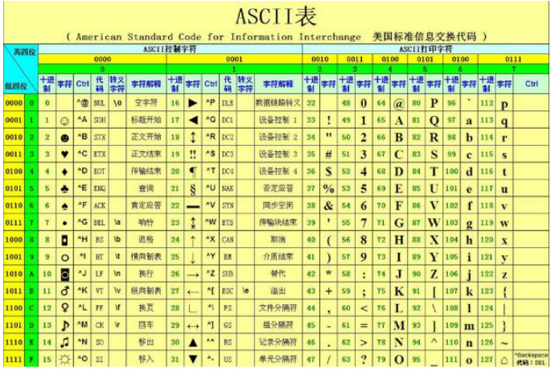

# 课程回顾

## 1 String类型，具有不变性

```html
==:比较两个对象，比较两个对象的内存地址
equals()：String的equals()比较两个字符串内容是否一样。
equalsIgonreCase();String的equals()比较不区分大小写两个字符串内容是否一样。
```

## 2 char和String互相转换

```html
String提供两种转换char的方式
1. toCharArray():char[]
2. charAt(int index):获取指定下标位置对应的字符

char转换String类
1.new String(char[],int start,int count)
2.String.valueOf(char char)
```

## 3 byte和String互相转换

```html
3-1 字符码表：
ASCII:提供英文常用符号（小写字母、大写字母、0-9数字、特殊符号）
GB2312:中文码表一个汉字使用2字节
GBK:中文码表。一个汉字使用2字节

UTF-8:万国表。一个汉字使用3字节

ISO8859-1:拉丁文码表，特点：不支持中文

编码：将字符串转换为字节数组的过程
getBytes():byte[]  根据平台（举例：IDEA）的编码码表，符号转换
getBytes(String charSetName):byte[] 用户指定码表

解码：破解字节 将字节数组转换字符串的过程
new String(byte[]): 根据平台（举例：IDEA）的编码码表，符号转换
new String(byte[],String charsetName):用户指定码表
new String(byte[],int star,int count):部分字节转换
...
```


## 4 课后作业：验证上传文件格式合法性

### 4-1 方案一

```java
package cn.kgc;

import java.util.Scanner;

/**
 * @Author: lc
 * @Date: 2022/4/6
 * @Description: cn.kgc
 * @Version: 1.0
 */
public class StringDemo1 {
	public static void main(String[] args) {
		Scanner input = new Scanner(System.in);
		System.out.println("请输入要上传文件的名称：");
		String fileName = input.nextLine();
		//4-1 获取文件名，输出文件名的字符长度：length()
		//length():获取字符串的字符个数，即长度
		System.out.println("文件名的字符长度："+fileName.length());
		//4-2 调用trim()去除首尾空格，输出文件名的字符长度：length()
		fileName=fileName.trim();
		System.out.println("文件名的字符长度："+fileName.length());
		//4-3 判断去除首尾空格后的文件名是否是空字符串 isEmpty()
		//isEmpty():保证操作的字符串有意义的，有实际意义字符存在true-length()结果0，  false
		System.out.println("fileName去除首尾空格后，是否是空字符串："+fileName.isEmpty());
		//4-4 文件名称不是null，也不是空串的情况下，使用代码逻辑判断该文件是否以
		if(fileName!=null && !fileName.isEmpty()) {
			//校验
			//jpg jpeg gif png bmp结束。满足其中一种格式，则输出文件是合法图片。都不满足的情况下，则输出文件不是图片文件
			//方案一：endsWith():判断字符串是不是以指定的字符串结束
			//比较文件后缀名，要求不区分大小写  toUpperCase():转换大写 toLowerCase()：转换为小写
			String[] rightLastName={"jpg","jpeg","gif","png", "bmp"};
			boolean isImage=false;//不是图片
			for(String lastName:rightLastName){
				if(fileName.toLowerCase().endsWith(lastName)){
					isImage=true;
					break;
				}
			}
			System.out.println("文件格式合法？"+(isImage?"合法":"不合法"));
		}
	}
}
```

### 4-2 方案二

```java
package cn.kgc;

import java.util.Scanner;

/**
 * @Author: lc
 * @Date: 2022/4/6
 * @Description: cn.kgc
 * @Version: 1.0
 */
public class StringDemo1 {
	public static void main(String[] args) {
		Scanner input = new Scanner(System.in);
		System.out.println("请输入要上传文件的名称：");
		String fileName = input.nextLine();
		//4-1 获取文件名，输出文件名的字符长度：length()
		//length():获取字符串的字符个数，即长度
		System.out.println("文件名的字符长度："+fileName.length());
		//4-2 调用trim()去除首尾空格，输出文件名的字符长度：length()
		fileName=fileName.trim();
		System.out.println("文件名的字符长度："+fileName.length());
		//4-3 判断去除首尾空格后的文件名是否是空字符串 isEmpty()
		//isEmpty():保证操作的字符串有意义的，有实际意义字符存在true-length()结果0，  false
		System.out.println("fileName去除首尾空格后，是否是空字符串："+fileName.isEmpty());
		//4-4 文件名称不是null，也不是空串的情况下，使用代码逻辑判断该文件是否以
		if(fileName!=null && !fileName.isEmpty()) {
			//校验
			//jpg jpeg gif png bmp结束。满足其中一种格式，则输出文件是合法图片。都不满足的情况下，则输出文件不是图片文件
			//方案二：subString(int startIndex,int endIndex):截取子字符串
			// indexOf(char ch):获取指定字符第一次出现的下标位置
			// lastIndexOf(char ch):获取指定字符最后一次出现的下标位置
			//举例：aa.bb.cc.jpg
			String imageLastName=fileName.substring(fileName.lastIndexOf('.')+1);//截取用户提供文件名的后缀名.
			for(String lastName:rightLastName){
				if(imageLastName.equalsIgnoreCase(lastName)){
					isImage=true;
					break;
				}
			}
			System.out.println("文件格式合法？"+(isImage?"合法":"不合法"));
		}
	}
}

```

# 课程目标

## 1 String的其他方法的应用

## 2 StringBuilder常用方法

## 3 StringBuilder和StringBuffer区别

## 4 集合继承体系

# 课程实施

## 1 String的其他方法


```html
1. charAt(int index)
2. compareTo() compareToIgorncase()
3. concat()等价于+
```

### 课堂案例1:演示charAt() compareTo() concat()的作用

```java
package cn.kgc;

/**
 * @Author: lc
 * @Date: 2022/4/6
 * @Description: cn.kgc
 * @Version: 1.0
 */
public class StringOtherDemo {
	public static void main(String[] args) {
		//charAt(int index):char 根据下标找字符 toCharAt()
		//indexOf(char char):int
		String strSex="男";
		char sex=strSex.charAt(0);
		System.out.println(sex);
		//比较字符串大小 compareTo():区分大小写，比较两个字符串大小关系
		//字符串排序，排序依据：姓名（字典顺序--A-Z顺序） 阿姨  阿三  赵大大
		String name1="ab";//65
		String name2="AB";//97
		//name1小于name2 a的ASCII-b的ASCII的结果
		//0：两个字符串相等  负数：前面的字符串小于后面的字符串
		// 正数：前面的字符串大于后面字符串 equals() equalsIgnoreCase()
		System.out.println("name1和name2比较大小的关系："+name2.compareTo(name1));
		System.out.println("name1和name2比较大小的关系："+name2.compareToIgnoreCase(name1));

		//concat()等价于+,一般不建议使用：字符串对象具有不变性
		String s1="hello";
		String s2="world";
		String s3=s1+s2;
		System.out.println(s3);
		//concat()
		String s4 = s1.concat(s2);
		System.out.println(s4);
		System.out.println(s3==s4);
		System.out.println(s3.equals(s4));
	}
}
```

### 需求1：

```html
1.定义多个字符串
2.使用concat将多个字符串拼接一个
3.比较拼接后的字符串与字符串常量进行comparTo
举例：Str4.compareTo("abc");
4.charAt()获取拼接字符串第三个字符，并输出即可
```

### 课堂案例2：演示split() replace() replaceFirst() replaceAll() 

```java
public class StringOtherDemo {
	public static void main(String[] args) {
		//replace replaceAll() replaceFirst()
		String str="hel0lo1hello1hel4lo1HELLO16HELLO27H9ELLO8";
		//将str中所有的llo替换 xxx
		//replace和replaceAll()替换所有匹配的字符串或字符
		//String str2 = str.toLowerCase().replace("llo", "xxx");
		//String str2 = str.toLowerCase().replaceAll("llo", "xxx");
		//String str2 = str.toLowerCase().replaceFirst("llo", "xxx");
		//替换所有的数字 了解
		String str2 = str.toLowerCase().replaceAll("\\d", "???");
		System.out.println(str2);

		//split():分割字符串
		String hobby="足球，篮球，羽毛球";
		//获取兴趣爱好的个数
		String[] strs = hobby.split("，");
		System.out.println(strs.length);//数组长度
		for (String h:strs) {
			System.out.println(h);
		}
		//使用$连接到一起？+ concat()
	}
}
```

### 需求2：

```html
1.使用Scanner获取用户输入一个字符串
2.将字符串中所有的空格，替换为$
3.根据$将字符串分割成一个字符数组
4.输出分割后字符数组的长度，并使用循环输出字符数组的内容
```

#### 参考代码

```java
public class StringOtherDemo {
	public static void main(String[] args) {
		Scanner input = new Scanner(System.in);
		String str = input.nextLine();
		if(str.contains(" ")){//没有必要，replace基于存在才替换原理
			String str2 = str.replace(' ', '-');
			System.out.println(str2);
			//以-字符串分割
			String[] arr = str2.split("-");
			String[] arr2 = str2.split("-", 3);
			System.out.println(arr2.length);//数组length是一个属性  String提供length()是方法
			for(String temp:arr2){
				System.out.println(temp);
			}
		}

	}
```

## 2 StringBuilder和StringBuffer的区别

### 2-1 概念

String是字符串的类型。

StringBuffer是带缓冲的字符串的类型。

### 2-2 StringBuilder、StringBuffer和String的区别

String特点：不变性

StringBuilder、StringBuffer特点：可变性。如何体现：通过缓冲池优化

### 2-3 StringBuilder和StringBuffer区别

从 JDK 5 开始，为该类补充了一个单个线程使用的等价类，即 [`StringBuilder`](../../java/lang/StringBuilder.html)。与该类相比，通常应该优先使用  `StringBuilder` 类，因为它支持所有相同的操作，但由于它不执行同步，所以速度更快。 

```html
1.StringBuffer和StringBuilder都是带缓冲的字符串可变序列
2.StringBuffer JDK1.0开始支持  StringBuilder从JDK1.5补充进来
3.多线程，保证线程安全，StringBuffer，可以保证线程安全，但是性能较差（速度不快）
线程不安全，但是速度高的等价类StringBuilder

优先使用StringBuilder，性能好，一般情况下，都是单线程（单线程是不需要考虑线程安全）
```

### 2-4 技术选型

字符串频繁+=拼接，或者字符串需要频繁的对字符串内容进行修改，优先推荐可变字符串（StringBuffer或StringBuilder)

多线程程序，且有线程安全的需求，优先使用StringBuffer，其他情况建议StringBuilder

## 3 StrringBuilder常用方法


trimToSize(): 尝试将底层数组长度缩减为实际存入的字符个数，多余的未占用的内存可以释放


### 课堂案例：底层数组的扩容规律

```java
package cn.kgc;

/**
 * @Author: lc
 * @Date: 2022/4/6
 * @Description: StringBuilder的底层缓冲池容量（char数组长度）变化规律
 * capacity*2+2
 * @Version: 1.0
 */
public class StringBuilderDemo2 {
	public static void main(String[] args) {
		//1.StringBuilder空参数构造方法，默认数组长度16
		//StringBuilder sb=new StringBuilder();//char[] cs=new char[16]
		StringBuilder sb = new StringBuilder("hello");//char[] cs=new char[16+5]
		sb.append("afdsfsad");//8个字符
		//输出一下缓冲池的容量
		System.out.println("容量："+sb.capacity());//16  21
		//输出缓冲池实际存入的字符个数
		System.out.println("长度："+sb.length());//8   8
		sb.trimToSize();//尝试释放多余的缓冲空间，可以在StringBuilder使用完毕之后进行调用
		//输出一下缓冲池的容量
		System.out.println("容量："+sb.capacity());//16  21
		//输出缓冲池实际存入的字符个数
		System.out.println("长度："+sb.length());//8   8
		sb.append("afdsfsad");
		//输出缓冲池容量 容量是不是就是实际存入的字符个数？？？？不一定相等
		//输出一下缓冲池的容量
		System.out.println("容量："+sb.capacity());//16
		//输出缓冲池实际存入的字符个数
		System.out.println("长度："+sb.length());//16
		sb.append("afdsfsad");
		//输出一下缓冲池的容量
		System.out.println("容量："+sb.capacity());//???
		System.out.println(sb.length());//获取实际存入的字符个数24
		sb.append("afdsfsad123");
		//输出一下缓冲池的容量
		System.out.println("容量："+sb.capacity());//???
		System.out.println(sb.length());//获取实际存入的字符个数24
		System.out.println();
		/*//1.数组长度一旦定义，不能修改
		int[] arr=new int[16];

		//存入第11个数字，首先要扩容：定义新的数组
		int[] arr2=new int[17];
		//再将arr的所有数据挪动到arr2来
		arr[10]=12;//下标越界*/

	}
}
```

### 课堂案例2：reverse() delete() insert() append()的使用

```java
package cn.kgc;

/**
 * @Author: lc
 * @Date: 2022/4/6
 * @Description: StringBuilder的delete和insert方法的作用
 * @Version: 1.0
 */
public class StringBuilderDemo4 {
	public static void main(String[] args) {
        StringBuilder sbb=new StringBuilder();
		sbb.append("HELLO");
		sbb.reverse();//反转字符数组
		System.out.println(sbb);
        
		StringBuilder sb=new StringBuilder("acdb@sina.com");
		//插入数据 @前插入123
		sb.insert(sb.indexOf("@"),"123");
		System.out.println(sb);//acdb123@sina.com

		//删除数据 删除123
		int start = sb.indexOf("123");
		System.out.println(start);
		int end=sb.indexOf("123")+"123".length();
		System.out.println(end);
		sb.delete(start,end);//从start开始，到end-1接收
		System.out.println(sb);
		//
		//woaijajajajavavavava!
	}
}

```

### 学生练习：对称字符串

```java
package cn.kgc;

import java.util.Scanner;

/**
 * @Author: lc
 * @Date: 2022/4/6
 * @Description: 顺序  逆序--反转数组
 * @Version: 1.0
 */
public class StringBuilderDemo3 {
	public static void main(String[] args) {
		//对称字符串：顺序和逆序一样的
		// abba   abdba
		//上海自来水来自海上
		//Scanner接收用户输入一个字符串：判断是不是对称字符串
		do {
			Scanner input = new Scanner(System.in);
			System.out.println("请输入一个字符串：");
			String str = input.nextLine();
			StringBuilder sb=new StringBuilder(str);
			sb.reverse();
			sb.trimToSize();
			System.out.println((str.equals(sb.toString())?"是":"不是")+"对称字符串");
		} while (true);
	}
}

```

## 4 StringBuilder不变性的实现原理


每个字符串缓冲区都有一定的容量。只要字符串缓冲区所包含的字符序列的长度没有超出此容量，就无需分配新的内部缓冲区数组。如果内部缓冲区溢出，则此容量自动增大。

```java
package cn.kgc;

/**
 * @Author: lc
 * @Date: 2022/4/6
 * @Description: StringBuilder的具有可变性
 * @Version: 1.0
 */
public class StringBuilderDemo1 {
	public static void main(String[] args) {
		//append():类似于String中concat() 拼接字符串
		StringBuilder sb=new StringBuilder();
		//StringBuilder添加一些数据
		StringBuilder sb2 = sb.append(12);//""+=12
		StringBuilder sb3 = sb.append("abc");//""+=12+="abc"
		sb.append(true);
		System.out.println(sb);//sout(sb.toString())

		//判断内存中有几个StringBuilder对象？！！内存中有且只有一个StringBuilder对象
		System.out.println(sb==sb2);//true
		System.out.println(sb==sb3);//true
		System.out.println(sb2==sb3);//true
	}
}
```

## 附录：ASCII码表



# 课程总结

```html
1.byte[]==String
2.char[]===String
3.判断类型的方法
 startsWith() endsWith() contains()
 equals() compareTo()

4.截取
subString()
charAt()

5.其他
toLowerCase()
toUpperCase()
toCharArray()
length()
isEmpty()
trim()
valueOf()
indexOf()
lastIndexOf()
replace()
split()
```


## 2 StringBuilder

```java
掌握：
    append
    reverse
理解：
    delete insert trimToSize capacity
    
坑点：没有重写equals，底层使用Object中的equals，比较地址
    StringBuilder--》String，使用equals
```


# 预习安排

集合：

ArrayList LinkedList HashSet


HashMap 嵌套集合


IO:

File和递归算法


字节流、字符流

