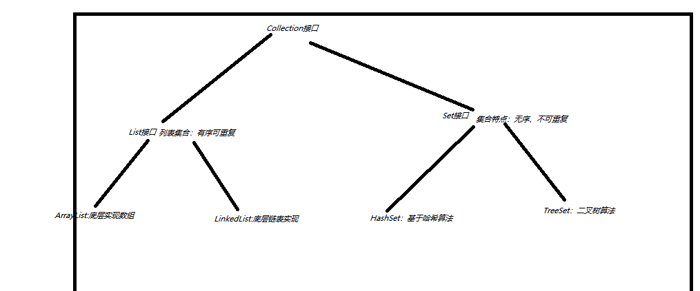
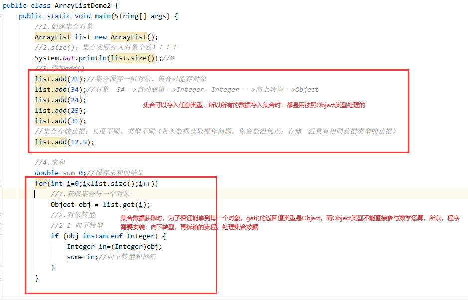
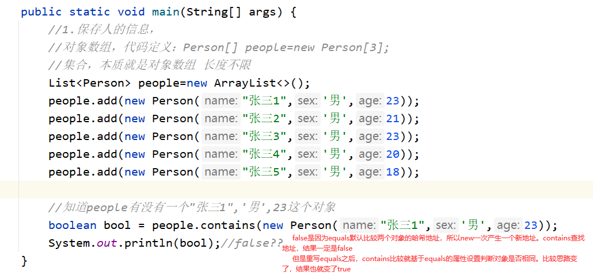
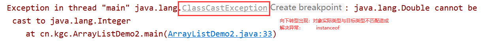
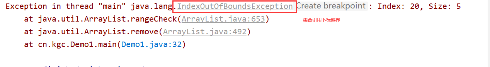

# 课程回顾

## 1 String StringBuffer StringBuilder区别

```html
String:不变性

字符串可变性：
StringBuffer：性能较差，多线程线程安全
****StringBuilder：性能较好，多线程线程不安全*****

可变字符串常用方法：
***append()***
insert()
delete()
reverse()
```

# 课程目标

## 1 集合框架继承体系 ======= 理解

## 2 集合优势 ======= 理解

## 3 单列集合：===========掌握=========

### ArrayList

### LinkedList

### HashSet

## 4 ArrayList和LinkedList区别 ===== 理解

# 课程实施

## 1 集合

### 1-1 集合概念

集合用来保存**一组对象**的数据类型。简而言之，集合本质其实就是对象数组。

元素：通常将集合中的一个对象，称为集合的元素

### 1-2 集合优势

操作一组对象时候，提供**很多便捷方法**。

数组长度一旦定义，不能动态修改。弊端：数据存储的个数发生变化时，数组数据的挪动

集合可以存储**任意长度**一组对象。

引入案例：

需求：

程序中需要保存8个学生信息。

```html
方案一： 对象数组
伪代码：
Student[] student=new Student[8];//jvm数组每一个下标位置存入null
//存入对象
student[下标]=new Student(属性赋值);
//查找：有没有一个叫做张三的学生信息
for(){
   if(){

    }
}

方案二：
伪代码：
集合  students=new 集合();
//存入对象
students.方法(对象);
//查找一个张三
boolean 结果=students.方法(找的对象);
```

### 1-3 集合框架继承体系

单列集合：Collection接口

单列集合特点：一次只能存入一个对象



#### List接口和Set接口实现区别

```html
List接口：有序可重复

Set接口：无序不可重复
```

双列集合：Map接口

双列集合特点：一次只能存入一对对象

### 1-4 List接口使用

#### ArrayList对象

##### 课堂案例:集合元素的添加、修改、删除和插入功能

```java
package cn.kgc;

import java.util.ArrayList;
import java.util.List;

/**
 * @Author: lc
 * @Date: 2022/4/7
 * @Description: List接口常用的方法
 * @Version: 1.0
 */
public class Demo1 {
	public static void main(String[] args) {
		//向上转型 有序体现：添加顺序和输出顺序一致  可重复：对象可以保存多次
		List list=new ArrayList();
		//集合保存一组对象 add(Object obj) 添加集合元素
		list.add(12);//12是一个对象。12默认类型是int 12自动装箱Integer
		list.add(true);//boolean,自动装箱Boolean
		list.add('c');
		list.add(12.34);
		list.add("jack");
		//了解：add(index,插入元素)插入功能
		list.add(1,"张三丰");
		//了解：set(index,修改后元素)修改
		list.set(1,"张翠山");
		list.add(12.34);

		//显示集合中所有的数据：重写toString()，输出对象的属性值
		System.out.println(list);
		System.out.println("没有清空之前，集合中保存几个元素？"+list.size());
		//清空
		list.clear();//删除所有元素
		System.out.println("清空之后，集合中保存几个元素？"+list.size());
		System.out.println("没有保存任何元素的集合，是空集合吗？"+list.isEmpty());

		//显示第三个元素 get(下标) 下标：[0,size()-1]
		Object thirdObj = list.get(2);
		System.out.println(thirdObj);

		//查找：集合有没有一个jack的元素 contains(找的元素)
		System.out.println("jack在集合中存在吗？"+list.contains("jack"));
		//删除12.34 remove(对象)   remove(下标)
		boolean bool = list.remove(120.34);//元素存在，删除成功，不存在，删除失败false
		System.out.println(bool);//true
		//下标保证不越界，否则程序会抛出异常。
		Object removeObject = list.remove(20);
		System.out.println(removeObject);//下标2对应对象，c
	}
}

```

##### 课堂案例：集合元素的获取、循环

```java
package cn.kgc;

import java.util.ArrayList;
import java.util.List;

/**
 * @Author: lc
 * @Date: 2022/4/7
 * @Description: List接口常用的方法
 * @Version: 1.0
 */
public class Demo1 {
	public static void main(String[] args) {
		//向上转型 有序体现：添加顺序和输出顺序一致  可重复：对象可以保存多次
		List list=new ArrayList();
		//集合保存一组对象 add(Object obj) 添加集合元素
		list.add(12);//12是一个对象。12默认类型是int 12自动装箱Integer
		list.add(true);//boolean,自动装箱Boolean
		list.add('c');
		list.add(12.34);
		list.add("jack");
		list.add(12.34);

		//重要的应用功能：集合循环！！！！！！！！！！！！！！！！！！！！！
		//for：
		for(int i=0;i<list.size();i++){
			System.out.println(list.get(i));
		}
		System.out.println("===========================");
		//增强for:推荐
		for(Object obj:list){//obj=list.get(i)
			System.out.println(obj);
		}
	}
}

```

##### 学生练习：使用ArrayList保存8个学生的年龄（求和、求平均值、求最值）

```java
package cn.kgc;

import java.util.ArrayList;

/**
 * @Author: lc
 * @Date: 2022/4/7
 * @Description: cn.kgc
 * @Version: 1.0
 */
public class ArrayListDemo2 {
	public static void main(String[] args) {
		//1.创建集合对象
		ArrayList list=new ArrayList();
		//2.size()：集合实际存入对象个数！！！！
		System.out.println(list.size());//0
		//3.添加add()
		list.add(21);//集合保存一组对象。集合只能存对象
		list.add(34);//对象  34-->自动装箱-->Integer，Integer--->向上转型-->Object
		list.add(24);
		list.add(25);
		list.add(31);
		//集合存储数据：长度不限、类型不限（带来数据获取操作问题，保留数组优点：存储一组具有相同数据类型的数据）
		list.add(12.5);

		//4.求和
		double sum=0;//保存求和的结果
		for(int i=0;i<list.size();i++){
			//1.获取集合每一个对象
			Object obj = list.get(i);
			//2.对象转型
			//2-1 向下转型
			if (obj instanceof Integer) {
				Integer in=(Integer)obj;
				sum+=in;//向下转型和拆箱
			}
		}
        //求最值的方案略
        System.out.println("总分\t\t平均分");
		System.out.println(sum+"\t\t"+sum/list.size());
	}
}
```

### 1-5 普通集合缺点

类型转换的问题，推荐优先使用**“泛型集合”**

普通集合存入对象：数据类型、对象个数没有限制。

普通集合存入数据时，都是按照Object类型保存，所以将集合的元素获取之后，如果需要操作集合元素，不得不使用向下转型处理Object类型的对象。使得程序处理集合的代码因为频繁的向下转型，而变得十分繁琐



## 2 泛型优点

保证集合存入的对象类型是一样的，所以从集合获取元素，不需要再instanceof判断，没有自己写向下代码。

保证数据类型转换的时候，**类型是安全**的！！

扩展：泛型擦除：源代码中有了泛型集合，程序员没有写instanceof+向下转型代码，编译器编译源代码之后，编译器擦除泛型，编译器添加了向下转型的代码。

### 2-1 泛型集合定义语法

```java
集合类型<集合对象的类型>   变量名=new 集合类型<集合对象的类型>();

JDK1.7以后，支持新特性：泛型菱形语法
 集合类型<集合对象的类型>   变量名=new 集合类型<>();   

泛型集合定义时，集合对象的类型必须是引用类型。
```

### 2-2 泛型集合使用与普通集合一模一样的

#### 课堂案例

```java
package cn.kgc;

import java.util.ArrayList;

/**
 * @Author: lc
 * @Date: 2022/4/7
 * @Description: cn.kgc
 * @Version: 1.0
 */
public class ListDemo3 {
	public static void main(String[] args) {
		//1.保存字符串 只能存String，其实就是长度可以灵活变化数组
		ArrayList<String> list=new ArrayList<>();
		//2.存入姓名
		//list.add(String str)保证集合都是String类型
		list.add("jack");
		list.add("tom");
		list.add("jerry");
		//list.add(12);
		//list.add(true);


		//3.如果不使用泛型，获取第二个学生的姓名，get()返回类型是Object
		//Object obj=list.get(1);
		//泛型集合，再使用get()返回类型直接String
		String str = list.get(1);
		//获取o所在的下标是几？
		//if(obj instanceof String) {//classCastException异常 程序健壮性！！
		//	((String)obj).indexOf('o');
		//}
	}
}
```

#### 学生练习：使用泛型集合保存5个学生年龄，求最值

```java
package cn.kgc;

import java.util.ArrayList;
import java.util.List;

/**
 * @Author: lc
 * @Date: 2022/4/7
 * @Description: 泛型集合的基本应用
 * 掌握：泛型集合的定义、泛型集合遍历（循环）
 * @Version: 1.0
 */
public class ArrayListDemo4 {
	public static void main(String[] args) {
		//1定义泛型集合 泛型类型必须是引用类型
		//int的引用类型Integer
		List<Integer> list=new ArrayList<>();

		//2.泛型集合要求：集合只能存入Integer对象
		list.add(12);//自动装箱：基本类型转换为对应的包装类类型过程
		list.add(23);
		list.add(24);

		//3.求和
		double sum=0;
		for(int i=0;i<list.size();i++){//集合，普通for应用场景有限制：必须支持下标
			Integer inObj = list.get(i);
			sum+=inObj;
		}
		System.out.println("平均值："+sum/list.size());//硬编码：写字面量 影响程序后续的扩展性
	}
}
```

## 3 contains方法的底层实现

contains(Object obj):boolean 判断集合存在找的对象 存在：true  不存在：false

contains底层实现依赖集合对象所属类型的equals()。

### 课堂案例

- Person

```java
package com.k2502.domain;

/**
 * @Author: lc
 * @Date: 2022/4/7
 * @Description: Person类主要用作对象的数据类型
 * 通常这种类：只有属性、构造方法、toString
 * @Version: 1.0
 */
public class Person {
	private String name;
	private char sex;
	private int age;

	public String getName() {
		return name;
	}

	public void setName(String name) {
		this.name = name;
	}

	public char getSex() {
		return sex;
	}

	public void setSex(char sex) {
		this.sex = sex;
	}

	public int getAge() {
		return age;
	}

	public void setAge(int age) {
		this.age = age;
	}

	public Person(String name, char sex, int age) {
		this.name = name;
		this.sex = sex;
		this.age = age;
	}

	@Override
	public boolean equals(Object o) {
		if (this == o) return true;
		if (o == null || getClass() != o.getClass()) return false;

		Person person = (Person) o;

		if (sex != person.sex) return false;
		if (age != person.age) return false;
		return name != null ? name.equals(person.name) : person.name == null;
	}

	@Override
	public int hashCode() {
		int result = name != null ? name.hashCode() : 0;
		result = 31 * result + (int) sex;
		result = 31 * result + age;
		return result;
	}

	@Override
	public String toString() {
		final StringBuilder sb = new StringBuilder("Person{");
		sb.append("name='").append(name).append('\'');
		sb.append(", sex=").append(sex);
		sb.append(", age=").append(age);
		sb.append('}');
		return sb.toString();
	}
}
```

- PersonService

```java
package com.k2502.domain;

import java.util.ArrayList;
import java.util.List;

/**
 * @Author: lc
 * @Date: 2022/4/7
 * @Description: xxService提供Person的操作方法
 * 没有属性，只有方法
 * @Version: 1.0
 */
public class PersonService {
	public static void main(String[] args) {
		//1.保存人的信息，
		//对象数组，代码定义：Person[] people=new Person[3];
		//集合，本质就是对象数组 长度不限
		List<Person> people=new ArrayList<>();
		people.add(new Person("张三1",'男',23));
		people.add(new Person("张三2",'男',21));
		people.add(new Person("张三3",'男',23));
		people.add(new Person("张三4",'男',20));
		people.add(new Person("张三5",'男',18));

		//知道people有没有一个"张三1",'男',23这个对象
		boolean bool = people.contains(new Person("张三1",'男',23));
		System.out.println(bool);//false??
	}
}
```



### 学生练习

```html
1.定义Student类型 学号  姓名  联系方式
2.集合存入多个学生对象
3.集合中查找有没有学号为1的学生信息
equals() 学号是否相等
4.扩展：remove(Object ob)
sout(“删除成功”)
```

#### 参考代码

- Student类

```java
package com.k2502.domain;

/**
 * @Author: lc
 * @Date: 2022/4/7
 * @Description: com.k2502.domain
 * @Version: 1.0
 */
public class Student {
	private String id;
	private String name;
	private String telephone;

	public String getId() {
		return id;
	}

	public void setId(String id) {
		this.id = id;
	}

	public String getName() {
		return name;
	}

	public void setName(String name) {
		this.name = name;
	}

	public String getTelephone() {
		return telephone;
	}

	public void setTelephone(String telephone) {
		this.telephone = telephone;
	}

	public Student(String id, String name, String telephone) {
		this.id = id;
		this.name = name;
		this.telephone = telephone;
	}

	public Student() {
	}

	@Override
	public String toString() {
		final StringBuilder sb = new StringBuilder("Student{");
		sb.append("id='").append(id).append('\'');
		sb.append(", name='").append(name).append('\'');
		sb.append(", telephone='").append(telephone).append('\'');
		sb.append('}');
		return sb.toString();
	}

	@Override
	public boolean equals(Object o) {
		if (this == o) return true;
		if (o == null || getClass() != o.getClass()) return false;

		Student student = (Student) o;

		return id != null ? id.equalsIgnoreCase(student.id) : student.id == null;
	}

	@Override
	public int hashCode() {
		return id != null ? id.hashCode() : 0;
	}
}
```

- 操作Student的类

```java
package com.k2502.domain;

import java.util.LinkedList;

/**
 * @Author: lc
 * @Date: 2022/4/7
 * @Description: com.k2502.domain
 * @Version: 1.0
 */
public class LinkedListDemo {
	//LinkedList:历史记录双端操作
	public static void main(String[] args) {
		LinkedList<Student> list = new LinkedList<>();
		list.add(new Student("S001","jack","12343453"));
		list.add(new Student("S002","jack2","1234453"));
		list.add(new Student("S003","jack","123433"));
		list.add(new Student("S004","jack3","123453"));

		//list找对象是什么类的对象呢？学生对象！！
		Student s = new Student();
		s.setId("s001");
		boolean bool = list.contains(s);
		boolean flag = list.remove(s);
		System.out.println(bool+":"+flag);
	}
}

```


## 4 LinkedList集合使用

LinkedList和ArrayList都是List接口的子类。拥有List定义所有的方法

LinkedList与ArrayList不一样的方法

```html
addFirst()
addLast()

getFirst()
getLast()

removeFirst()
removeLast()
```

### 课堂案例

```java
package com.k2502.domain;

import java.util.LinkedList;

/**
 * @Author: lc
 * @Date: 2022/4/7
 * @Description: com.k2502.domain
 * @Version: 1.0
 */
public class LinkedListDemo {
	//LinkedList:历史记录双端操作
	public static void main(String[] args) {
		LinkedList<Student> list = new LinkedList<>();
		list.add(new Student("S001","jack","12343453"));
		list.add(new Student("S002","jack2","1234453"));
		list.add(new Student("S003","jack","123433"));
		list.add(new Student("S004","jack3","123453"));
		//显示list集合所有的学生信息
		System.out.println(list);
		//一头一尾新增两个学生对象
		list.addFirst(new Student("S000","李四","32434543"));
		list.addLast(new Student("S111","张三","35435345"));
		System.out.println(list);

		Student first1 = list.get(0);
		Student first2 = list.getFirst();

		Student last1 = list.get(list.size() - 1);
		Student last2 = list.getLast();

		//一头一尾删除
		list.remove(0);
		list.removeFirst();

		list.removeLast();
	}
}

```


## 程序中常见异常汇总：





# 课程总结

## 1 泛型集合使用步骤

```html
1.定义集合保存对象所属的类型：
public class 类{
 //属性

 //构造方法

 //重写toString()
}
equals()是否重写，考虑集合是否使用与equals相关方法：contains()  remove(Object obj)

2.psvm{
  //2-1 泛型集合
   集合<类名> 变量名=new 集合<>();
       
  //2-2 存入数据
   变量名.add(new 对象());
       
  //2-3 普通for 增强for
    for(类名 变量名 :集合名){
       
       }
 
}
```


# 预习安排

## HashMap === EntrySet循环方式

## Hashtable特点

## 嵌套集合 ======= 难点

## Collections常用方法

