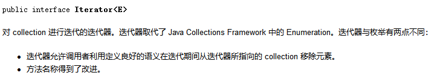
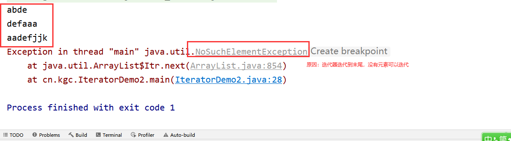
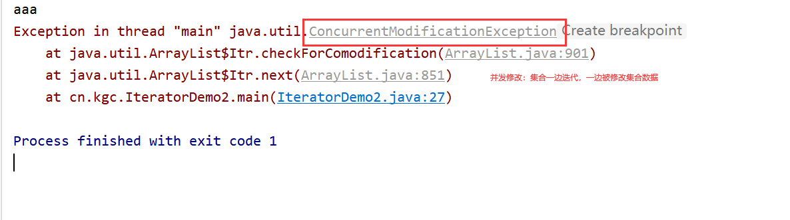
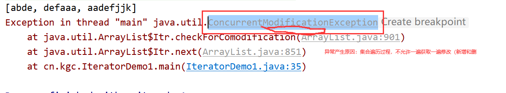
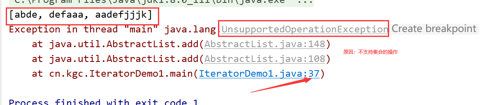
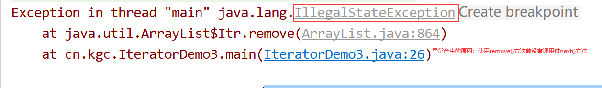

# 课程回顾

## 1 数据添加、集合数据处理、集合遍历（for循环、增强for)

## 2 集合框架继承体系

```html
Collection
有序可重复集合：List接口
   ArrayList
   LinkedList
    特有方法：addFirst()  addLast()  getFirst() getLast() removeFirst() removeLast()
无序不重复集合：Set接口

集合特点：
 保存任意类型的多个对象
 提供很多集合元素操作方法

泛型集合：优化集合元素操作繁琐。
```

## LinkedList和ArrayList区别 ==== 面试题

```html
集合添加数据，集合循环方式
底层实现原理：
ArrayList：底层数组实现方式
LinkedList：底层链表实现方式

ArrayList基于数组实现方式，特点：
ArrayList底层的数组实现，使得集合通过下标获取元素的速度非常快，但是插入和删除数据时，因为需要做数组元素的挪动，故而性能容易受到影响。

ArrayList适用于数据存和取，不适用于频繁增和删除

LinkedList基于链表实现方式，特点：
LinkedList底层的链表实现方式，在通过下标获取数据时，始终需要冲链表的头部按照每个元素标记的下一个元素的位置进行元素的获取，查找速度不高，但是插入和删除数据时不用像数组那样做数据的挪动，所以，链表集合插入和删除数据的性能比ArrayList要高。

LinkedList适用于增删，不适于数据存取
```

### LinkedList优点：频繁插入和删除

需求：历史记录

```html
1.LinkedList保存5个信息（数字、字符串）
sout()
2.向LinkedList添加新的数据进去，
判断集合的元素有没有超过5个，如果超过5个，删除最后一个，在集合头部添加最新的数据
2-1 removeLast()
2-2 addFirst()
sout()
```

#### 参考代码

```java
package cn.kgc;

import java.util.Deque;
import java.util.LinkedList;

/**
 * @Author: lc
 * @Date: 2022/4/8
 * @Description: cn.kgc
 * @Version: 1.0
 */
public class Demo1 {
	public static void main(String[] args) {
		//1.集合数据频繁增删
		//List<String> list=new LinkedList<>();
		Deque<String> list=new LinkedList<>();
		//2.存入数据
		int i=0;
		do {
			if(list.size()>=5){
				//数据移除
				list.removeLast();//移除最后一个
			}
			list.addFirst("新数据"+i);
			System.out.println("第"+(i+1)+"次添加数据后，集合元素有：");
			System.out.println(list);
			i++;
		} while (true);
	}
}
```

# 课程目标

## 1 HashSet的使用 ======= 掌握

## 2 Iterator的使用 ======= 掌握

## 3 HashMap的使用 ======= 掌握

## 4 嵌套集合

## 5 扩展：TreeSet TreeMap

# 课程实施

## 1 HashSet

### 1-1 特点

```html
无序: 存放顺序和获取顺序不一致
不重复：不能保存多个相同的对象
```

### 1-2 循环方式

```html
增强for
```

### 课堂案例

```java
package cn.kgc;

import java.util.HashSet;
import java.util.Set;

/**
 * @Author: lc
 * @Date: 2022/4/8
 * @Description: cn.kgc
 * @Version: 1.0
 */
public class HashSetDemo1 {
	public static void main(String[] args) {
		//1.创建对象
		Set<String> set=new HashSet<>();
		//2.存入数据
		set.add("aaa");
		set.add("aaa");
		set.add("aaa");
		set.add("张三丰");
		set.add("jack");
		set.add("aaa");
		set.add("AAA");
		set.add("1234");
		set.add("李四");

		//3.集合数据
		System.out.println(set);
		//4.删除数据 Set不支持下标，所以一切跟下标相关的方法，set不支持的
		boolean bool = set.remove("1234");
		//System.out.println("第二个元素："+set.get(1));
		//清空数据
		//set.clear();
		//数据个数
		System.out.println(set.size());
		System.out.println(set.isEmpty());

		//增强for
		for(String e :set){
			System.out.println(e);
		}
	}
}
```

### 1-3 Set使用场景:过滤重复数据

需求：

```html
1.Scanner输入一个字符串，内容不限制
2.保留不重复的字符，并输出
举例：
用户：aaaaaaabbbbbbbbbbb            李李李李李李李
输出结果：ab 李

实现思路：
1.过滤重复的字符============Set
2.String===>char[]
3.char[]循环，每一个字符存入set中
4.sout(set)
```

#### 参考代码

```java
package cn.kgc;

import java.util.HashSet;
import java.util.Scanner;
import java.util.Set;

/**
 * @Author: lc
 * @Date: 2022/4/8
 * @Description: 过滤重复字符
 * @Version: 1.0
 */
public class HashSetDemo2 {
	public static void main(String[] args) {
		Scanner input = new Scanner(System.in);
		System.out.println("请输入一段符号：");
		String str = input.nextLine();
		//str控制有哪些字符
		Set<Character> set=new HashSet<>();
		for(int i=0;i<str.length();i++){
			//set.add(字符串每一个字符);
			set.add(str.charAt(i));
		}
		//输出集合元素，sout(set)
		for(Character c:set){
			System.out.print(c+"  ");
		}
	}
}
```

### 1-4 Set保存自定义类型的对象时，如何控制对象的唯一性 ***********

```html
set集合保存对象，控制两个对象是否重复，依靠的底层依然是equals()
set保存自己定义的类对象，判断是否需要重写equals()
```

#### 课堂案例

- Person类

```java
package cn.kgc;

/**
 * @Author: lc
 * @Date: 2022/4/8
 * @Description: cn.kgc
 * @Version: 1.0
 */
public class Person {
	//身份证  姓名
	private String cardId;
	private String name;

	public String getCardId() {
		return cardId;
	}

	public void setCardId(String cardId) {
		this.cardId = cardId;
	}

	public String getName() {
		return name;
	}

	public void setName(String name) {
		this.name = name;
	}

	public Person() {
	}

	public Person(String cardId, String name) {
		this.cardId = cardId;
		this.name = name;
	}

	@Override
	public String toString() {
		final StringBuilder sb = new StringBuilder("Person{");
		sb.append("cardId='").append(cardId).append('\'');
		sb.append(", name='").append(name).append('\'');
		sb.append('}');
		return sb.toString();
	}

	@Override
	public boolean equals(Object o) {
		if (this == o) return true;
		if (o == null || getClass() != o.getClass()) return false;

		Person person = (Person) o;

		return cardId != null ? cardId.equals(person.cardId) : person.cardId == null;
	}

	@Override
	public int hashCode() {
		return cardId != null ? cardId.hashCode() : 0;
	}
}
```

- Person类的使用

```java
package cn.kgc;

import java.util.HashSet;
import java.util.Set;

/**
 * @Author: lc
 * @Date: 2022/4/8
 * @Description: cn.kgc
 * @Version: 1.0
 */
public class HashSetDemo3 {
	public static void main(String[] args) {
		//1.多个身份证号码一样的Person对象，算一个对象
		Set<Person> set=new HashSet<>();
		//伪代码：set具有天性：过滤重复
		//if(set.contains(添加的对象)==false) {//依然依靠equals(),Person没有重写equals(),比较多个person对象的哈希地址
			set.add(new Person("100", "jack"));
		//}else{//set已经包含要添加的对象
			//再一次存入set集合吗？？
		//}
		set.add(new Person("100","xiao jack"));
		set.add(new Person("100","da jack"));
		set.add(new Person("101","jack"));
		set.add(new Person("102","jack"));

		//前提：公安系统 输入100-->一个人
		System.out.println(set);
	}
}
```

## 2 迭代器

### 2-1 迭代器的概述



### 2-2 引入案例

需求

```html
1.集合保存N个字符串
2.判断字符串包含def子字符串，如果有，删除该元素
3.输出删除后的集合剩余对象
```

### 2-3 迭代器作用

迭代器与下标无关，所有的集合都支持迭代器的循环方式

迭代器提供在集合迭代元素期间，对集合数据进行新增或删除。

```html
1.增强for的时候，一边循环集合，一边集合的add或remove
增强for使用场景：适合于集合或数组数据的获取
可能会出现一个异常：并发修改异常

2.普通for，使用场景局限性：只支持有序集合。Set不支持普通for
```

### 2-4 迭代器使用步骤

```html
1.获取迭代器
  Iterator<集合泛型> it=集合.iterator();
2.判断迭代器是否有元素可以迭代
  it.hasNext():boolean  true:迭代器有元素  false:迭代器没有元素
3.获取迭代元素，迭代元素操作
  it.next();//获取元素
  it.remove();//删除迭代器
```

#### 参考代码

```java
package cn.kgc;

import java.util.ArrayList;
import java.util.Iterator;
import java.util.List;

/**
 * @Author: lc
 * @Date: 2022/4/8
 * @Description: 迭代器使用步骤
 * @Version: 1.0
 */
public class IteratorDemo2 {
	public static void main(String[] args) {
		List<String> strs=new ArrayList<>();
		strs.add("aaa");
		strs.add("bbb");
		strs.add("ccc");
		//处理业务：
		//1.获取迭代器
		Iterator<String> it=strs.iterator();

		//获取迭代器中一个元素
		while(it.hasNext()){
			//在while循环，一次循环，只能用一次next()
			String obj = it.next();//游标移动指向aaa
			//获取数据
			System.out.println(obj);//aaa
			//删除每一个元素
			//strs.remove(obj);//删除，迭代器还是使用集合对象删除，并发修改依然会发生
			//迭代器的remove()游标指向哪个对象就删除那个对象
			it.remove();
		}
		System.out.println(strs.size());
		/*if (it.hasNext()) {
			System.out.println(it.next());
		}
		System.out.println(it.next());
		System.out.println(it.next());
		System.out.println(it.next());
		System.out.println(it.next());
		System.out.println(it.next());
		System.out.println(it.next());
		System.out.println(it.next());
		System.out.println(it.next());*/
	}
}
```

### 学生练习：

需求：

```html
1.集合保存一些数据
2.清空（不能使用clear())
方案一：增强for
方案二：迭代器
```

#### 参考代码

```java
package cn.kgc;

import java.util.ArrayList;
import java.util.Iterator;
import java.util.List;

/**
 * @Author: lc
 * @Date: 2022/4/8
 * @Description: 迭代器使用步骤
 * @Version: 1.0
 */
public class IteratorDemo3 {
	public static void main(String[] args) {
		//List Set只是集合数据获取后使用（显示） 优先使用增强for
		//List Set针对循环过程中获取的某一些元素，删除或其他操作 迭代器
		List<Integer> list=new ArrayList<>();
		list.add(12);
		list.add(23);
		list.add(34);
		//list.add(45);

		//迭代器循环
		Iterator<Integer> it = list.iterator();//迭代器的游标位于第一个元素上面
		while(it.hasNext()){//游标下面有元素吗？true  false
			//先调用next
			it.next();
			//再执行remove。如果没有调用next()，就直接使用remove()，程序会抛出IllegalStateException
			it.remove();//删除成功？？remove()删除游标指向的元素IllegalStateException
			//获取游标下面的数据
			//Integer ele = it.next();//获取游标下面那个元素，且移动游标
			//System.out.println(it.next());
		}
		System.out.println(list);
		//出了while，游标位于最后一个元素位置，后面其实没有元素了
		//System.out.println(it.next());//游标下面没有元素可以迭代，程序会抛出异常NoSuchElementException
	}
}
```

### 2-5 使用场景

集合循环过程中，对集合数据进行修改（删除或添加）

## 3 Map集合

HashMap:底层基于Hash算法，存入顺序和取出顺序不一致的

Map双列集合：存入数据存入一对数据。

键值对：Set 键-唯一不重复  Collection 值--可以重复也可以不重复

### 3-1 Map使用

#### Map集合的定义

```java
Map<key的数据类型,value的数据类型> map=new HashMap<>();
```

#### 常用方法

```html
put(key,value):存入键值对
get(key):value  获取方式

containsKey(key)：key是否存在
contansValue(value):value是否存在

size():获取键值对的对数

remove(key):删除key所对应的键值对
```

### 3-2 课堂案例

```java
package cn.kgc;

import java.util.HashMap;
import java.util.Map;

/**
 * @Author: lc
 * @Date: 2022/4/8
 * @Description: Map集合的基本使用
 * @Version: 1.0
 */
public class HashMapDemo1 {
	public static void main(String[] args) {
		//key--value 一一对应的关系
		//存入夫妻关系，Map<key,value>
		Map<String,String> map=new HashMap<>();
		System.out.println("几对夫妻？"+map.size());//0
		//存入数据
		map.put("赵又廷","高圆圆");
		map.put("邓超","孙俪");
		map.put("吴奇隆","刘诗诗");
		map.put("玄彬","孙艺珍");
		System.out.println("几对夫妻？"+map.size());//4

		System.out.println("包含邓超这个键吗？"+map.containsKey("邓超"));
		System.out.println("包含孙艺珍这个值么？"+map.containsValue("孙艺珍"));

		System.out.println("吴奇隆的妻子叫："+map.get("吴奇隆"));
		//get(key),不能用value获取key，但是key获取value
		System.out.println("孙俪的老公叫："+map.get("孙俪"));

		String value = map.remove("邓超");
		System.out.println("移除的键值对是：邓超"+value);
	}
}
```

## 4 常见异常
















# 课程总结

## 1 单列集合：ArrayList LinkedList HashSet

重点掌握：集合对象的泛型定义方式、增强for的循环方式

​                   理解无序集合的控制唯一性理论基础


理解：size() remove() isEmpty()....

## 2 Iterator迭代器

掌握：基本使用步骤

理解：游标的移动特征

​           常见两个异常：NoSuchElementException   IlgelStatusException

# 预习安排

File类

难点：递归