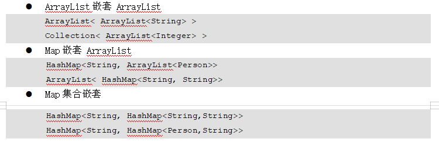
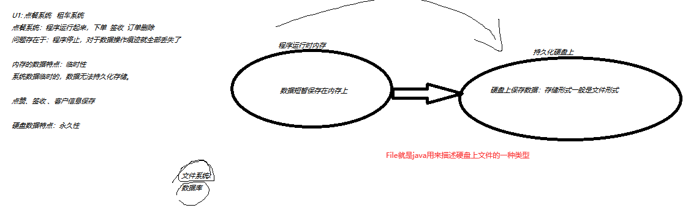
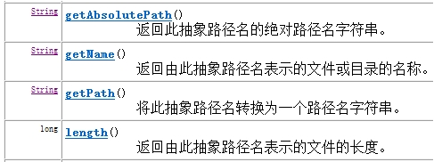
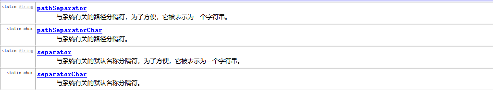

# 课程回顾

## 1 JDK1.5一个新特性：可变参数

```html
可变参数，用来定义方法的形参，作用等价于数组用作形参方式
可变参数带来方法调用好处：
 1.不要求必须使用数组格式
 2.参数没有的话，实参可以省略
要求：
方法中，形参有多个，那么可变参数只能出现一次，且位于形参列表的最后一个位置
public int add(int num,double num2,float... nums){}
```

### 课堂案例

- 计算器类

```java
package cn.kgc;

/**
 * @Author: lc
 * @Date: 2022/4/9
 * @Description: 计算器类
 * @Version: 1.0
 */
public class Calculator {
	/**
	 * 求两个整数求和
	 * @return
	 */
	public int add(int num1,int num2){
		return num1+num2;
	}

	/**
	 * 求N个整数求和
	 * @return
	 */
	/*public int add(int[] num){
		int sum=0;
		for(int n:num){
			sum+=n;
		}
		return sum;
	}*/
	/**
	 * 求N个整数求和
	 * @return
	 */
	public int add(int... num){
		int sum=0;
		for(int n:num){
			sum+=n;
		}
		return sum;
	}
}
```

- 测试类调用可变参数的方法

```java
package cn.kgc;

/**
 * @Author: lc
 * @Date: 2022/4/9
 * @Description: 可变参数
 * @Version: 1.0
 */
public class CollectionsDemo1 {
	public static void main(String[] args) {
		Calculator c = new Calculator();
		/*int sum1 = c.add(1, 1);
		System.out.println(sum1);*/

		//存入int[]，交给add计算
		//可变参数，相较于数组形式传参，优点：1.实参不再要求必须是数组 2.可以接受不传入参数
		//int[] nums={1,4,56};
		//int sum = c.add(nums);//add形参如果是数组，就必须先定义数组、赋值，再作为实参传递给方法使用
		//int sum = c.add(1,4,56);//可变参数可以传入多个实参
		int sum = c.add();//可变参数也可以不传参
		System.out.println(sum);
	}
}
```

# 课程目标

## 1 嵌套集合 ==== 理解

## 2 File类 === 掌握

## 3 递归算法 === 理解

# 课程实施

## 1 嵌套集合

### 1-1 概念

集合嵌套并不是一个新的知识点，仅仅是集合内容又是集合，即集合中保存的每一个对象又是一个集合。

### 1-2 常见的嵌套格式



### 1-3 案例分析

```html
需求：
1.有一个班级，班级五个学生。集合保存五个学生的信息
解决方案：List
2.课工场有十个班级，每个班级有五个学生。
分析需求：10个List
```

#### 参考代码

```java
package cn.kgc;

import java.util.*;

/**
 * @Author: lc
 * @Date: 2022/4/9
 * @Description: 嵌套集合
 * @Version: 1.0
 */
public class CollectionDemo1 {
	public static void main(String[] args) {
		//理论：一般来说，N个对象，考虑使用数组或集合
		/**
		 * 10个班级，每个班级N个学生
		 * 一个班级N个学生，数据存储 List<Student>保存N个学生信息
		 * 10个班级 10个List<> 集合List<List<Student>>保存10个List集合呢？？？
		 * 保存数据时，希望班级编号对应一个班级学生
		 * Map<String,List<Student>>
		 */
		//1.Map集合
		Map<String,List<Student>> school=new HashMap<>();
		//2.集合存入数据
		//2-1 添加第一个班级的信息：
		List<Student> k1501=new ArrayList<>();
		k1501.add(new Student("张三",45));
		k1501.add(new Student("张一",45));
		k1501.add(new Student("张四",65));
		k1501.add(new Student("李四",85));
		k1501.add(new Student("王四",55));

		school.put("k1501",k1501);
		//添加第二个班级的信息
		List<Student> k1502=new ArrayList<>();
		k1502.add(new Student("张三",45));
		k1502.add(new Student("张一",45));
		k1502.add(new Student("张四",65));

		school.put("k1502",k1502);
		//班级编号----班级所有的学生信息
		Set<Map.Entry<String,List<Student>>> entrySet=school.entrySet();//键值集
		for(Map.Entry<String,List<Student>> entry:entrySet){
			String className = entry.getKey();
			List<Student> students = entry.getValue();
			System.out.println(className+"学生信息如下所示：");
			for (Student s:students){
				System.out.println(s.getName()+"::"+s.getScore());
			}
			//每个班级平均分 总分
		}
	}
}

```

### 学生练习

```java
		/*
		* 需求：实现Map集合保存N个班级，每个班级m个学生的信息
		* 最后：输出班级名及班级学生信息。各个班级的总分和平均分
		* k2502:
		*    jack 90
		*    lucy 90
		* 总分：180 平均分：90
		* k2503
		*   lily 90
		*   jerry 90
		* 总分：180 平均分：90
		*/

```

## 2 File类

### 2-1 意义



数据持久化存储。文件形式也是常见的一种形式

### 2-2 File概念

java使用File类描述计算机上面的文件和文件夹的类型。

File的对象体现：电脑中某一个文件或某一个文件夹（文件夹一般称为：目录）

### 2-3 File使用场景

创建文件或创建文件夹、删除文件或删除文件夹、获取文件或文件夹的基本信息

 举例说明：1.文件上传  文件下载  2.IO输出流将数据存入文件中

### 2-4 课堂案例

#### File的构造方法

```html
File(String pathname) :根据指定路径构建File对象
File(File parent,String child):根据parent路径名和child路径名字符串创建一个新File实例。
File(String parent,String child):根据parent路径名和child路径名字符串创建一个新File实例。
```

#### 创建文件或目录

```html
创建文件：createNewFile()：boolean

创建目录：
 mkdir():boolean 创建一级目录（单层文件夹）
 mkdirs():boolean 创建多级目录
```

##### 参考代码

```java
package cn.kgc;

import java.io.File;
import java.io.IOException;

/**
 * @Author: lc
 * @Date: 2022/4/9
 * @Description: 创建文件和目录
 * @Version: 1.0
 */
public class FileDemo1 {
	public static void main(String[] args)throws IOException {
		//myFile是File类的对象？？对象实际存在的！！
		File myFile=new File("f:\\k2502\\test");
		System.out.println("myFile在硬盘上存在吗？"+myFile.exists());
		//1.创建多级目录：k2502/test
		if(myFile.exists()==false){//myFile已经存在
			boolean bool = myFile.mkdirs();
			System.out.println("myFile创建成功了吗？"+bool);
			System.out.println("myFile在硬盘上存在吗？"+myFile.exists());
		}
		//2.创建文件：1.txt
		File txtFile=new File(myFile,"1.txt");
		if(!txtFile.exists()){
			boolean bool = txtFile.createNewFile();
			System.out.println("1.txt创建成功了吗？"+bool);
		}
	}
}
```

#### 获取文件或目录信息



##### 参考代码

```java
package cn.kgc;

import java.io.File;
import java.util.Date;

/**
 * @Author: lc
 * @Date: 2022/4/9
 * @Description: 演示File类获取功能
 * @Version: 1.0
 */
public class FileDemo2 {
	public static void main(String[] args) {
		//1.创建文件对象
		File file=new File("src\\cn\\kgc","Student.java");
		if(file.exists()){
			//getName():获取文件名称
			System.out.println("文件名称："+file.getName());
			//getPath():构造方法传入的路径
			System.out.println("getPath文件路径："+file.getPath());
			//getAbsolutePath():获取绝对路径
			System.out.println("getAbsolutePath文件路径："+file.getAbsolutePath());
			//length():获取文件的大小，单位字节
			System.out.println("文件大小："+file.length()+"字节");
			//lastModified():获取文件最后一次修改时间，单位是毫秒
			System.out.println("文件最后一次修改的时间："+new Date(file.lastModified()));//long
		}
	}
}
```


##### 获取子文件或子目录的参考代码

```java
public class FileDemo4 {
	public static void main(String[] args) {
		//1.定义查看子文件或目录的文件对象 File类型表示硬盘里面一个文件或目录
		File file=new File("F:\\宏鹏\\K2502");
		if(file.exists()){
			//aa是一个文件，文件是不存在下一级
			if(file.isDirectory()){
				//list():String[] 获取当前目录里面所有子文件或目录的名称！！！
				String[] sonFiles = file.list();//aa里面的信息（文件夹+文件）
				for(String f:sonFiles){
					System.out.println(f);
				}
                System.out.println("===================")
				//listFiles():File[] 获取当前目录里面所有的子文件或目录的对象！！！
				File[] files = file.listFiles();
				for(File f:files){
					//System.out.println(f.getName());
					System.out.println(f.getAbsoluteFile());
				}
			}
		}
	}
}
```

#### 删除文件或目录

```html
boolean delete():删除文件或文件夹,如果删除成功返回true,如果删除失败返回false; 
 注意:
    1.delete()删除的文件不走回车 shift+delete
    2.delete()如果删除文件夹,要求这个文件夹必须为空才能删掉
```

##### 参考代码

```java
package cn.kgc;

import java.io.File;

/**
 * @Author: lc
 * @Date: 2022/4/9
 * @Description: 文件夹和文件删除
 * @Version: 1.0
 */
public class FileDemo3 {
	public static void main(String[] args) {
		//删除文件1.txt
		File txtFile=new File("f:\\k2502\\test\\1.txt");
		boolean bool1 = txtFile.delete();
		System.out.println("1.txt删除成功了吗？"+bool1);
		//1.创建文件对象 文件夹为空才能删除成功
		File testFile=new File("f:\\k2502\\test");
		//2.文件目录：test里面有一个文件1.txt
		boolean bool2 = testFile.delete();//删除文件夹，保证文件夹空的，且单级删除
		System.out.println("文件夹删除成功了吗？"+bool2);

		File k2502File=new File("f:\\k2502");
		boolean bool3 = k2502File.delete();
		System.out.println("文件夹删除成功了吗？"+bool3);
	}
}
```

#### 判断功能

```html
boolean exists():测试指定的文件或文件夹在硬盘上是否真的存在,如果存在返true 否则就返回false

boolean isDirectory():判断指定的路径是否是一个目录,如果是返回true,否则返回false

boolean isFile():判断指定的路径是否是文件,如果是返回true,否则返回false 
```

##### 参考代码

```java
package cn.kgc;

import java.io.File;
import java.util.Date;

/**
 * @Author: lc
 * @Date: 2022/4/9
 * @Description: 演示File类判断功能
 * @Version: 1.0
 */
public class FileDemo2 {
	public static void main(String[] args) {
		//1.创建文件对象
		File file=new File("src\\cn\\kgc","Student.java");
		if(file.exists()){
			//File的对象可以是文件，也可以是目录
			System.out.println("是一个文件"+file.isFile());
			System.out.println("是一个目录"+file.isDirectory());
		}
	}
}
```

### 2-5 File常用的静态常量



## 3 绝对路径和相对路径

优先推荐使用相对路径

```html
绝对路径：以磁盘名称开始书写的路径
举例：F:\k2502\test


相对路径：以参考物路径开始书写的路径
参考物路径：
当前项目所在的路径：
  F:\宏鹏\K2502\U1\day24\案例\day24

Student.java文件相对路径：
Student.java绝对路径：F:\宏鹏\K2502\U1\day24\案例\day24\src\cn\kgc\Student.java

Student.java文件相对路径：src\cn\kgc\Student.java

```


## 4 递归算法

### 4-1 概念

```html
递归：方法自己调用自己
举例：
public void fun(){
	fun();
}
弊端：递归没有结束的时机，内存因为方法不断进栈，会出现内存溢出的错误！！！
实现递归算法：保证方法有执行结束的时机！！
```

### 4-2 阶乘案例

```html
阶乘：4！=1*2*3*4
6！=1*2*3*4*5*6

10以内整数和：1+2+3+4+5+。。+9
解决方案：循环
递归：找代码重复特点
0! 1!值都是1
1!=1
2!=1!*2
3!=2!*3
4！=3!*4
6！=5!*6
求num的阶乘，发现num-1的阶乘*num
```

#### 参考代码

- for循环实现求阶乘

```java
package cn.kgc;

/**
 * @Author: lc
 * @Date: 2022/4/9
 * @Description: 阶乘案例
 * @Version: 1.0
 */
public class PlusDemo {
	public static void main(String[] args) {
		System.out.println(getResult(10));
	}

	/**
	 * 求阶乘
	 * @param num 求阶乘的数值
	 * @return
	 */
	public static long getResult(int num){
		long result=1;//为什么不使用0
		for(int i=1;i<=num;i++){
			//num=4 i=1 2 3 4求积
			result*=i;
		}
		return result;
	}
}

```

- 递归求阶乘

```java
package cn.kgc;

/**
 * @Author: lc
 * @Date: 2022/4/9
 * @Description: 阶乘案例
 * @Version: 1.0
 */
public class PlusDemo {
	public static void main(String[] args) {
		System.out.println(jieCheng(4));
	}

	/**
	 * 求阶乘
	 * @param num 求阶乘的数值
	 * @return
	 */
	public static long jieCheng(int num){
		//递归的出口
		if(num==1 ||num==0){
			return 1;
		}
		return jieCheng(num-1)*num;
	}
}

```

## 5 使用递归实现指定目录所有文件的显示

```java
package cn.kgc;

import java.io.File;

/**
 * @Author: lc
 * @Date: 2022/4/9
 * @Description: 获取指定目录的子文件或子目录
 * @Version: 1.0
 */
public class FileDemo4 {
	public static void main(String[] args) {
		//1.定义查看子文件或目录的文件对象 File类型表示硬盘里面一个文件或目录
		File file=new File("F:\\宏鹏\\K2502");
		getAllFileName(file);
		/*if(file.exists()){
			//aa是一个文件，文件是不存在下一级
			if(file.isDirectory()){
				//list():String[] 获取当前目录里面所有子文件或目录的名称！！！
				*//*String[] sonFiles = file.list();//aa里面的信息（文件夹+文件）
				for(String f:sonFiles){
					System.out.println(f);
				}*//*
				//listFiles():File[] 获取当前目录里面所有的子文件或目录的对象！！！
				File[] files = file.listFiles();
				for(File f:files){
					//System.out.println(f.getName());
					System.out.println(f.getAbsoluteFile());
					if(f.isDirectory()){
						File[] sonSonFiles = f.listFiles();
						*//*for(File f:files){
							//System.out.println(f.getName());
							System.out.println(f.getAbsoluteFile());
							if(f.isDirectory()){
								File[] sonSonSonFiles = f.listFiles();

							}
						}*//*
					}
				}
			}
		}*/

	}

	/**
	 * 获取指定目录下面所有的文件名称
	 */
	public static void getAllFileName(File file){
		//1.判断file是不是目录，是目录找文件
		if(file.isDirectory()){
			//获取给定路径的子文件和子目录
			File[] sonFiles = file.listFiles();
			for(File son:sonFiles){
				//son是文件，直接输出文件名称
				if(son.isFile()){
					if (son.getName().toLowerCase().endsWith("txt")) {
						System.out.println(son.getAbsoluteFile());
					}
				}else if(son.isDirectory()){
					getAllFileName(son);
					/**
					 * 调用getAllFileName(son)的意思就是将getAllFileName的代码再执行一次
					 * if(file.isDirectory()){
					 * File[] sonFiles = file.listFiles();
					 * for(File son:sonFiles){
					 * if(son.isFile()){
					 * 					System.out.println(son.getAbsoluteFile());
					 *                                }else if(son.isDirectory()){
					 * 					getAllFileName(son);
					 */
				}
			}
		}
	}
}

```


# 课程总结

## 1 递归===递归实现特点

## 2 掌握File常用的方法

```html
1-1 构造方法
1-2 文件或目录的创建、删除、获取、判断
```

# 预习安排

1. 字节流和字符流概念，继承体系设计
2. 输入流和输出流基本使用步骤

FileInputStream FileOutputStream

FileReader FileWriter

