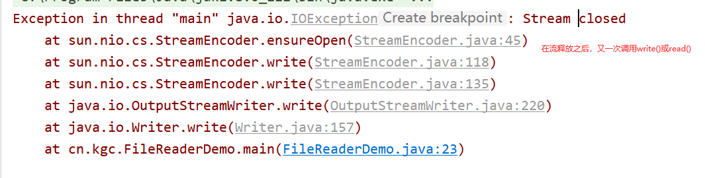
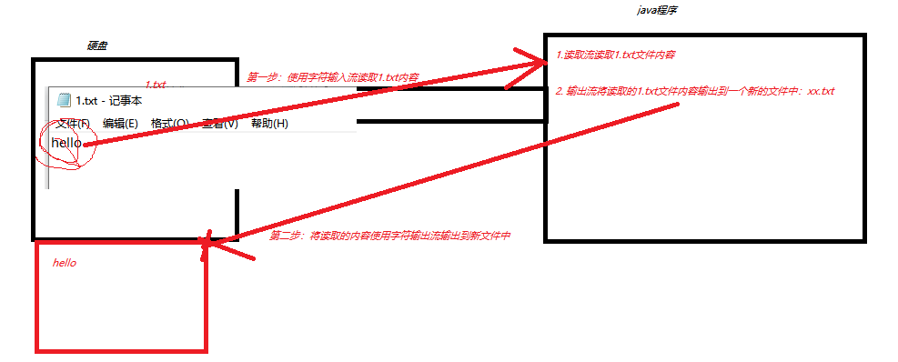

# 课程回顾

## 1 Hashtable和HashMap区别

```html
Hashtable ：线程安全，性能较差
Hashtable特点：不能保存null值和null键

HashMap:线程不安全，性能较好。允许存入null值和null键。null键有且只能存入一个

StringBuilder和StringBuffer：StringBuffer是线程安全
Hashtable和HashMap：Hashtable是线程安全
ArrayList和Vector：Vector是线程安全
```

## 2 File类

```html
路径写法：
  绝对路径：路径以盘符名称：eg:f:\\xx\xx.txt
  相对路径：从当前项目下的路径开始写起
File构造方法

常用方法：
  getName()
  getPath()
  getAbsolutePath()
  length()

递归算法：
 理解：方法自己调用自己
 弊端：方法不断进栈，导致内存溢出问题
```

# 课程目标

## 1 IO流概念 === 理解

## 2 基础字节流使用 === 掌握

## 3 基础字符流使用 === 掌握

## 4 字节流和字符流区别 === 理解

# 课程实施

## 1 IO流

### 1-1 概念

I：Input 输入

O：Output  输出

流：数据传输时的一种形态。

### 1-2 IO根据操作的方向，分两类

输出流：

   根据流传输数据的格式：

字节输出流

字符输出流

输入流：

​    根据流传输数据的格式：

字节输入流

字符输入流

### 1-3 IO流继承体系

```html
抽象类父类：
字节
  输入    InputStream
  输出    OutputStream

字符
  输入   Reader
  输出   Writer

子类实现：
基本字节流
字节
  输入    FileInputStream
  输出    FileOutputStream

字符
  输入   FileReader
  输出   FileWriter

缓冲字节流
字节
  输入    BufferedInputStream
  输出    BufferedOutputStream

字符
  输入   BufferedReader
  输出   BufferedWriter

```

## 2 字符流

### 2-1 FileReader操作步骤

```html
1.创建文件读取流对象，指定文件的所在的位置
2.定义char[] cs=new char[1024]
3.while(len=.read(cs) !=-1){
   //不停的读取文件内容
}
4.释放资源
.close()
```

#### 课堂演示案例

##### 单个字符读取

- 不用循环的实现方式，分析循环条件、循环操作

```java
private static void read() throws IOException {
		//1.读取硬盘上1.txt中的数据
		//Reader reader=new FileReader("读取数据的目的地")
		Reader reader=new FileReader("1.txt");
		//2.调用read(),帮助读取1.txt第一个字符 read()读取到文件末尾，没有数据时，返回值始终是-1
		//while(读取字符不是-1){reader.read()}
		int code = reader.read();
		System.out.println("第一次读取，读到数据是："+code);
		System.out.println("第一次读取，读到数据是："+(char)code);

		code = reader.read();
		System.out.println("第二次读取，读到数据是："+code);
		System.out.println("第二次读取，读到数据是："+(char)code);

		code = reader.read();
		System.out.println("第三次读取，读到数据是："+code);
		System.out.println("第三次读取，读到数据是："+(char)code);

		code = reader.read();
		System.out.println("第四次读取，读到数据是："+code);
		System.out.println("第四次读取，读到数据是："+(char)code);

		code = reader.read();
		System.out.println("第五次读取，读到数据是："+code);
		System.out.println("第五次读取，读到数据是："+(char)code);

		code = reader.read();//读取-1
		System.out.println("第六次读取，读到数据是："+code);
		System.out.println("第六次读取，读到数据是："+(char)code);

		code = reader.read();//读取-1
		System.out.println("第六次读取，读到数据是："+code);
		System.out.println("第六次读取，读到数据是："+(char)code);

		code = reader.read();//读取-1
		System.out.println("第六次读取，读到数据是："+code);
		System.out.println("第六次读取，读到数据是："+(char)code);

		code = reader.read();//读取-1
		System.out.println("第六次读取，读到数据是："+code);
		System.out.println("第六次读取，读到数据是："+(char)code);
		//3.释放资源
		reader.close();
	}

//使用循环优化数据读取

```

- 使用循环优化read()读取过程

```java
	/**
	 * read()一次性读取一个字符，效率低，不推荐使用
	 */
	private static void read1() throws IOException {
		//1.读取硬盘上1.txt中的数据
		//Reader reader=new FileReader("读取数据的目的地")
		Reader reader=new FileReader("1.txt");
		//2.调用read(),帮助读取1.txt第一个字符 read()读取到文件末尾，没有数据时，返回值始终是-1
		//while(读取字符码值不是-1){reader.read()}
		int code;
		while((code= reader.read())!=-1){//循环条件，读取到有意义的意义
			//1.循环操作 读取到的数据在应用程序中使用
			//System.out.println("第一次读取，读到数据是："+code);
			System.out.print((char)code);
		}


		//3.释放资源
		reader.close();
	}
```

##### 字符数组读取方式

```java
public static void main(String[] args) throws IOException {
		//1.读取硬盘上1.txt中的数据
		//Reader reader=new FileReader("读取数据的目的地")
		Reader reader=new FileReader("1.txt");
		//2 读取
		//2-1 定义容器 优化文件读取的效率
		char[] cs=new char[1024];//实际开发中，字符数组长度建议1024*N倍

		//2-2 开始搬运字符
		int len;//实际读取的字符个数
		while ((len = reader.read(cs))!=-1) {
			//new String(char[],开始转换为下标，实际转换的字符个数）
			String str = new String(cs, 0, len);//char[]==>String 实际读取几个字节，就转换几个字符，重复的字符不要再显示
			System.out.print(str);
		}

		//3.释放资源
		reader.close();
}
```

### 2-2 FileWriter操作步骤

```html
1.创建文件输出流对象，指定文件的所在的位置
2.wirte(String)
  write(char[])
  write(char[],int start,int len)
4.释放资源
.close()
```

#### 课堂演示案例

- FileWriter基本操作案例

```java
private static void write() throws IOException {
		//1.定义文件输出的对象
		//FileWriter fw=new FileWriter(文件输出内容的目的地);
		Writer fw =new FileWriter("1.txt");
		//2.输出数据（数据从哪儿来的）
		//2-1 准备输出的数据
		String s1="helloWorld";

		fw.write(s1);

		fw.write("中国人");

		//释放资源：开源节流
		fw.close();

		System.out.println("数据输出完毕");
	}
```

- FileWriter以追加模式输出内容

```java
package cn.kgc;

import java.io.FileWriter;

/**
 * @Author: lc
 * @Date: 2022/4/11
 * @Description: FileWriter输出数据时，如何数据追加模式\
 * FileWriter默认的输出模式：覆盖模式
 * @Version: 1.0
 */
public class FileReaderDemo {
	public static void main(String[] args)throws Exception {
		//字符输出流，对1.txt内容追加
		FileWriter fw=new FileWriter("1.txt",true);
		fw.write("哈哈哈");
		fw.close();
	}
}
```

### 2-3 close()和flush()区别



### 2-4 综合案例：文件复制

需求



```java
package cn.kgc;

import java.io.FileReader;
import java.io.FileWriter;

/**
 * @Author: lc
 * @Date: 2022/4/11
 * @Description: 字符流实现复制
 * @Version: 1.0
 */
public class CopyDemo1 {
	public static void main(String[] args) throws Exception{
		/*
		* 复制文件实现思路：
		* 1.读取要复制文件的内容  G:\\Demo.java
		* 2.将读取的内容输出到一个新文件中  f:\\Demo.java
		 */
		FileReader fr=new FileReader("G:\\Demo.java");
		//负责将读取的内容输出到F:\\Demo.java
		FileWriter fw=new FileWriter("F:\\Demo.java");
		char[] cs=new char[1024];
		//实际读取的字符个数
		int len;
		//复制文件的性能
		long start = System.currentTimeMillis();
		while((len=fr.read(cs))!=-1){
			//cs保存实际读取的有意义的数据
			//这些数据怎么处理？？
			fw.write(cs,0,len);//缓冲池
			fw.flush();
			//fw.close();???
		}
		long end = System.currentTimeMillis();
		//释放资源：先开后关
		fw.close();
		fr.close();

		System.out.println((end-start)+"毫秒文件复制结束！！");
	}
}

```

### 2-5 使用场景

所有的使用记事本能够正常阅读的文件，都可以使用字符流操作！！

像 图片文件 音频 视频 class文件.....二进制格式，都不能使用字符流


## 3 字节流

### 3-1 FileInputStream操作步骤

```html
1.创建文件读取流对象，指定文件的所在的位置
2.定义byte[] cs=new byte[1024]
3.while(len=.read(cs) !=-1){
   //不停的读取文件内容
}
4.释放资源
.close()
```

#### 课堂演示案例

```java
package cn.kgc;

import java.io.FileInputStream;
import java.io.InputStream;

/**
 * @Author: lc
 * @Date: 2022/4/11
 * @Description: 基础字节流读取
 * @Version: 1.0
 */
public class FileInputStreamDemo {
	public static void main(String[] args)throws Exception {
		//1 创建读取字节流对象
		InputStream is=new FileInputStream("2.txt");
		//2. 读取
		//2-1 定义字节数组
		byte[] bs=new byte[1024];
		int len;//保存实际读取的字节个数
		while((len=is.read(bs))!=-1){
			//解码 byte[]==>String
			String s = new String(bs, 0, len);
			System.out.print(s);
		}
		is.close();
	}
}
```

### 3-2 FileOutputStream操作步骤

```html
1.创建文件输出流对象，指定文件的所在的位置
2.wirte(byte[])
  write(int)
  write(byte[],int start,int len)
4.释放资源
.close()
```

#### 课堂演示案例

```java
package cn.kgc;

import java.io.FileOutputStream;
import java.io.IOException;
import java.io.OutputStream;

/**
 * @Author: lc
 * @Date: 2022/4/11
 * @Description: 基础字节流输出
 * 字节流操作一切！！！
 * @Version: 1.0
 */
public class FileOutputStreamDemo {
	public static void main(String[] args) throws IOException {
		//1.创建字节输出流对象
		OutputStream os=new FileOutputStream("2.txt");
		//2.输出数据（字节流传输格式：字节）
		//2-1 编码：字符串--->byte[]
		os.write("hello".getBytes());//直接输出到2.txt
		//os.flush();//没必要使用，字节流没有缓冲！！！
		os.write("world".getBytes());

		//3.释放资源
		os.close();
	}
}
```

### 3-3 整合案例：复制图片

```java
package cn.kgc;

import java.io.*;

/**
 * @Author: lc
 * @Date: 2022/4/11
 * @Description: 字节流实现复制
 * 字节流可以操作所有类型的文件！！
 * @Version: 1.0
 */
public class CopyDemo2 {
	public static void main(String[] args) {
		/*
		 * 复制文件实现思路：
		 * 1.读取要复制文件的内容  G:\\Demo.java
		 * 2.将读取的内容输出到一个新文件中  f:\\Demo.java
		 */
		InputStream fr= null;
		OutputStream fw= null;
		long start = 0;
		long end = 0;
		try {
			//业务流程：复制文件
			fr = new FileInputStream("f:\\500.png");
			//负责将读取的内容输出到F:\\Demo.java
			fw = new FileOutputStream("F:\\500copy.png");
			byte[] cs=new byte[1024];
			//实际读取的字符个数
			int len;
			//复制文件的性能
			start = System.currentTimeMillis();
			while((len=fr.read(cs))!=-1){
				//cs保存实际读取的有意义的数据
				//这些数据怎么处理？？
				fw.write(cs,0,len);//缓冲池
				fw.flush();
				//fw.close();???//不能调用close()，close()之后，流就不能再使用了
			}
			end = System.currentTimeMillis();
			System.out.println((end-start)+"毫秒文件复制结束！！");
		} catch (IOException e) {
			e.printStackTrace();//Exception提供系统方法：输出异常详细信息
		}finally{
			//资源释放必须放在finally
			//释放资源：先开后关(即：先创建的对象后关闭)
			try {
				if (fw!=null) {
					fw.close();//null.方法或属性 NullPointerException
				}
				if (fr!=null) {
					fr.close();
				}
			} catch (IOException e) {
				e.printStackTrace();
			}
		}
	}
}
```

## 4 字节流和字符流的区别


# 课程总结

```html
字符流特点：传输数据格式是char。一般用于操作记事本可以打开的文件
```

字节流特点

```html
字节流特点：传输数据格式byte。一般来说字节流可以操作任意格式的文件
```

#### 面试题：读取一个文本文件时，优先使用字符流还是字节流？

- 字节流读取

```java

```

- 字符流读取

```java

```

## 5 IO操作的异常处理标准代码

- try-catch-finally

```java
package cn.kgc;

import java.io.*;

public class CopyDemo2 {
	public static void main(String[] args) {
		InputStream fr= null;
		OutputStream fw= null;
		long start = 0;
		long end = 0;
		try {
			//业务流程：复制文件
			
		} catch (IOException e) {
			e.printStackTrace();//Exception提供系统方法：输出异常详细信息
		}finally{
			//资源释放必须放在finally
			//释放资源：先开后关(即：先创建的对象后关闭)
			try {
				if (fw!=null) {
					fw.close();//null.方法或属性 NullPointerException
				}
				if (fr!=null) {
					fr.close();
				}
			} catch (IOException e) {
				e.printStackTrace();
			}
		}
	}
}
```

# 课程总结

## 1 掌握：

字符流和字节流的读写操作

异常处理标准方案

文件复制的流程

## 2 理解：

IO流概念

IO分类：

根据数据传输的格式：字节流（字节输入流 字节输出流）  字符流

IO流继承体系：父类  子类

## 3 面试题

close()和flush()之间区别

字节流和字符流应用场景区分（区别）


# 预习安排

## 1 缓冲流（也称为高效流）

## 2 转换流

## 3 序列化流