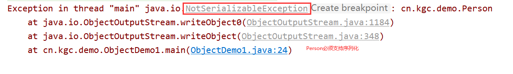

# 课程回顾

预习必要性

听课：记笔记（形式：纸质、文档）

教：保证听懂

学：实训课通过反复作业，达到代码熟练度

模仿，U2 U3 U4(业务分析：参考代码)

## 1 IO概念：输出流 输入流


```html
IO作用：java应用程序和文件之间交互。
输出流：

输入流：

```


## 2 IO操作流程：套路

```html
输出流
1.找对象（new 字节流  字符流）
2.调用write(byte[]/char[]/String)
3.close()

输入流：
1.找对象（new 字节流 字符流）
2.循环读取
while((len=read(字节数组  字符数组))!=-1){
  //数据读取到java程序后，程序想如何处理？？
  sout()

  //输出其他文件
}
3.释放资源
close()
```

# 课程目标

## 1 缓冲流（提升读写效率）=== 掌握

## 2 转换流（解决读写中文乱码问题）=== 掌握

## 3 序列化流（解决对象读写问题）=== 掌握

## 4 字节流和字符流区别

# 课程实施

## 1 字节流和字符流区别

### 1-1 案例分析

#### 字节流读取文本文件

```java
private static void readByStream() throws IOException {
		//1.使用字节流读取文本文件
		InputStream is=new FileInputStream("1.txt");
		//2.读取文件
		byte[] bs=new byte[2];
		int len;//每次实际读取的字节数
		while((len=is.read(bs))!=-1){
			//从文件中读取的数据，想要如何处理？？
			//数据统一保存bs中，sout(bs)
			/**
			 * bs[]保存全部-45 -98
			 * 解码：byte[]==>String
			 * 解码的代码实现：new String(bs,开始解析的位置，解析字节个数）
			 */
			String str=new String(bs,0,len);
			//sout()输出的结果不是程序员，给客户看
			System.out.print(str);
		}
		//3.标准流程 是否资源
		is.close();
	}
```

#### 字符读取文本文件

```java
public static void readByReader(){
		//1.使用字节流读取文本文件
		Reader reader=new FileReader("1.txt");
		//2.读取文件
		char[] bs=new char[2];
		int len;//每次实际读取的字节数
		while((len=reader.read(bs))!=-1){
			//从文件中读取的数据，想要如何处理？？
			//数据统一保存bs中，sout(bs)
			/**
			 * bs[]保存全部-45 -98
			 * 解码：byte[]==>String
			 * 解码的代码实现：new String(bs,开始解析的位置，解析字节个数）
			 */
			String str=new String(bs,0,len);
			//sout()输出的结果不是程序员，给客户看
			System.out.print(str);
		}
		//3.标准流程 是否资源
		reader.close();
	}
```

### 1-2 案例小结

```html
字符流和字节流读取文本文件时的区别
 举例：txt .java .html sql .css 使用记事本打开，文件内容可以正常阅读
 举例：.jpg .gif .doc .ppt .xls .png  mp3 .vedio
 字节流读取文本文件出现乱码的原因：
  字节流处理读取的内容时，一定有解码过程
  byte[]获取时，只拿到一个汉字的部分字节，造成字节转换字符时问题（即乱码问题）
  为了保证读到数据不出现乱码的风险，优先建议按照字符一个一个读
```

## 2 缓冲流

### 2-1 缓冲流概述

优势：提升文件读写的速度

**缓冲流：装饰设计模式**

分两类：

缓冲字节流：

​     BufferedInputStream：缓冲字节输入流

​     BufferedOutputStream：缓冲字节输出流

缓冲字符流：

​     BufferedReader：缓冲字符输入流

​    BufferedWriter：缓冲字符输出流


### 2-2 缓冲流使用

结论：想把一个流改造成读写速度快的对象，解决方案就是：将普通IO流对象通过缓冲流的构造方法进行装饰即可。

```html
新对象=new BufferedReader(提供被装饰的对象)
读写：被装饰的对象方式一样的
释放资源：需要释放几个对象？？
一个：新对象释放即可
```

#### 字节缓冲流

- 输出流使用案例

```java
package cn.kgc.demo;

import java.io.BufferedOutputStream;
import java.io.FileOutputStream;
import java.io.IOException;

/**
 * @Author: lc
 * @Date: 2022/4/12
 * @Description: 字节缓冲流的案例
 * @Version: 1.0
 */
public class BufferedDemo1 {
	//psvm同时处理输出、输入，有没有先后顺序要求？
	/**
	 * 输出：数据从哪儿来
	 * 输入：数据从哪儿来  输入为什么放在输出下面：输入流都是读取输出流执行的结果
	 */
	public static void main(String[] args) {
		//1.缓冲流实现数据输出
		//将java程序中的数据保存到文件中
		//匿名对象：适合用于对象作为参数传递的场景
		//OutputStream os=new FileOutputStream("f:\\bos.txt", true);
		BufferedOutputStream bos= null;
		try {
			//1-1 装饰成一个缓冲流
			bos = new BufferedOutputStream(
							new FileOutputStream("f:\\bos.txt", true)
			);

			//输出操作：os还是bos？？bos才是装饰后的对象，拥有速度快
			bos.write("Hello".getBytes());
			bos.write("中国人".getBytes());
		} catch (IOException e) {
			e.printStackTrace();
		} finally {
			try {
				//释放资源
				if (bos!=null) {
					bos.close();
				}
				//os.close();//没毛病，没必要
			} catch (IOException e) {
				e.printStackTrace();
			}
		}
	}
}
```

- 输入流课堂案例

```java
package cn.kgc.demo;

import java.io.BufferedInputStream;
import java.io.FileInputStream;

/**
 * @Author: lc
 * @Date: 2022/4/12
 * @Description: 字节缓冲流的输入案例
 * @Version: 1.0
 */
public class BufferedDemo2 {
	public static void main(String[] args) throws Exception {
		//1. 找对象
		BufferedInputStream bis=new BufferedInputStream(
				new FileInputStream("f:\\bos.txt")
		);

		//2.如何读取文件
		byte[] bs=new byte[1024];
		int len;//实际读取的字节个数
		while((len=bis.read(bs))!=-1){
			//2-2 处理读取到的数据 sout()
			String str = new String(bs, 0, len);
			System.out.println(str);
		}

		//3.释放资源
		bis.close();
	}
}
```

#### 字符缓冲流

- 输出流使用案例
- newLine()实现换行的输出效果

```java
package cn.kgc.demo;

import java.io.BufferedReader;
import java.io.BufferedWriter;
import java.io.FileReader;
import java.io.FileWriter;

/**
 * @Author: lc
 * @Date: 2022/4/12
 * @Description: 字符缓冲流的读和写
 * 资源释放：先开后关
 * @Version: 1.0
 */
public class BufferedDemo3 {
	public static void main(String[] args) throws Exception{
		//输入
		BufferedReader br=new BufferedReader(
			new FileReader("f:\\bos2.txt")
		);
		//2-1 定义数组
		String content;//实际读取的内容
		while((content=br.readLine())!=null){
			//使用读取的数据？？
			System.out.println(content);
		}
		/*char[] cs=new char[1024];
		int len;
		while((len=br.read(cs))!=-1){//readLine()：String 读取一行
			//使用读取数据
			String str = new String(cs, 0, len);
			System.out.println(str);
		}*/
		//关闭
		br.close();
	}
}

```

- 输入流课堂案例
- readLine():String 一次性读取一行数据

```java
package cn.kgc.demo;

import java.io.BufferedReader;
import java.io.BufferedWriter;
import java.io.FileReader;
import java.io.FileWriter;

/**
 * @Author: lc
 * @Date: 2022/4/12
 * @Description: 字符缓冲流的读和写
 * 资源释放：先开后关
 * @Version: 1.0
 */
public class BufferedDemo3 {
	public static void main(String[] args) throws Exception{
		//输入
		BufferedReader br=new BufferedReader(
			new FileReader("f:\\bos2.txt")
		);
		//2-1 定义数组
		String content;//实际读取的内容
		while((content=br.readLine())!=null){
			//使用读取的数据？？
			System.out.println(content);
		}
		/*char[] cs=new char[1024];
		int len;
		while((len=br.read(cs))!=-1){//readLine()：String 读取一行
			//使用读取数据
			String str = new String(cs, 0, len);
			System.out.println(str);
		}*/
		//关闭
		br.close();
	}
}

```

### 2-3 缓冲流实现文件复制

#### 基础流复制代码

```java
private static void copyBy() throws IOException {
		FileInputStream fis=new FileInputStream("g:\\FlashFXP_v5.4.0.3970.exe");
		FileOutputStream fos=new FileOutputStream("g:\\copy.exe");

		byte[] bs=new byte[1024];
		int len;
		long start = System.currentTimeMillis();
		while((len=fis.read(bs))!=-1){
			//使用
			fos.write(bs,0,len);
			fos.flush();
		}
		long end=new Date().getTime();
		System.out.println("文件复制成功，耗时："+(end-start));
		//释放（先开后关）
		fos.close();
		fis.close();
	}
```

#### 缓冲流

```java
public static void copyByBuffered {
		/**
		 * 复制功能：
		 * 技术选型：字节流
		 */
		FileInputStream fis=new FileInputStream("g:\\FlashFXP_v5.4.0.3970.exe");
		FileOutputStream fos=new FileOutputStream("g:\\copy.exe");

		//创建缓冲流
		BufferedInputStream bis=new BufferedInputStream(fis);
		BufferedOutputStream bos=new BufferedOutputStream(fos);

		byte[] bs=new byte[1024];
		int len;
		long start = System.currentTimeMillis();
		while((len=bis.read(bs))!=-1){
			//使用
			bos.write(bs,0,len);
			bos.flush();
		}
		long end=new Date().getTime();
		System.out.println("文件复制成功，耗时："+(end-start));
		//释放（先开后关）
		fos.close();
		fis.close();
	}
```

## 3 转换流

### 3-1 使用场景

读写文件时，遇到中文出现乱码的情况

**乱码情况：中文出乱码**

```html
ASCII: 一个符号一个字节  7位，按照1个字节
gb2312:支持ASCII   一个汉字两个字节
gbk:支持ASCII 一个汉字两个字节
utf-8:支持ASCII 一个汉字三个字节
iso8859-1:支持ASCII,不支持中文码表  一个符号一个字节 8位 占用1个字节
```

### 3-2 乱码出现原因********************

```html
java开发工具和记事本编码格式不一致造成

解决方案：
1. 记事本格式：utf-8   远程电脑：只给读
2. IDEA:GBK   开发工具：编码格式一旦修改，中文都会乱码
存在问题：可操作性不强

3.流操作，指定字符转换为字节、字节转换为字符使用码表名称
```

### 3-3 使用

```html
隶于：字符流
输入流：InputStreamReader
输出流：OutputStreamWriter
```

#### 课堂案例


##### 转换输出流使用案例

```java
package cn.kgc.demo;

import java.io.*;

/**
 * @Author: lc
 * @Date: 2022/4/12
 * @Description: 转换输出流的案例
 * @Version: 1.0
 */
public class ConvertDemo2 {
	public static void main(String[] args) throws Exception{
		//基础字符流数据输出
		//FileWriter fw=new FileWriter("f:\\gbk.txt",true);
		FileOutputStream fw=new FileOutputStream("f:\\gbk.txt",true);
		//基础流的编码格式明确的指定,编码格式设置与记事本编码格式一致
		OutputStreamWriter isr=new OutputStreamWriter(fw,"gbk");
		//解决中文乱码：记事本格式不让改、idea编码不让改
		isr.write("真可爱");//计算机底层：转换为byte[] 默认形式：IDEA编码格式UTF-8
		isr.close();
	}
}
```

##### 转换输入流使用案例

```java
package cn.kgc.demo;

import java.io.FileInputStream;
import java.io.InputStreamReader;

/**
 * @Author: lc
 * @Date: 2022/4/12
 * @Description: 转换输入流的案例
 * @Version: 1.0
 */
public class ConvertDemo1 {
	public static void main(String[] args) throws Exception{
		//1.读取文件
		FileInputStream fis=new FileInputStream("f:\\gbk.txt");
		//2 转换流  码表单词不区分大小写,设置码表的名称与读取文件码表一致
		InputStreamReader isr=new InputStreamReader(fis,"GBK");
		char[] bs=new char[1024];//存入字节，gbk的编码字节
		int len;
		while((len=isr.read(bs))!=-1){
			//解码：byte[]===>按照特定码表===>符号
			System.out.println(new String(bs,0,len));//安装idea的编码解码
		}
		fis.close();
	}
}
```

## 4 序列化流

### 4-1 概念

```html
序列化：将程序中的对象存入文件的过程。其实就是对象输出流
反序列化：将文件中保存的对象加载到程序中使用过程。其实是对象输入流。
```

### 4-2 使用场景

实现java对象的存取

### 4-3 序列化对象

```java
ObjectOutputStream:序列化流
ObjectInputStream: 反序列流
```

### 4-4 序列化案例



- Person类：**必须实现Serializable接口**

```java
package cn.kgc.demo;

import java.io.Serializable;

/**
 * @Author: lc
 * @Date: 2022/4/12
 * @Description: cn.kgc.demo
 * @Version: 1.0
 */
//Serializable被子类实现，不用实现任何方法，就是表示该类支持序列化
public class Person implements Serializable {
	private String id;
	private String name;

	public String getId() {
		return id;
	}

	public void setId(String id) {
		this.id = id;
	}

	public String getName() {
		return name;
	}

	public void setName(String name) {
		this.name = name;
	}

	public Person(String id, String name) {
		this.id = id;
		this.name = name;
	}

	@Override
	public String toString() {
		final StringBuilder sb = new StringBuilder("Person{");
		sb.append("id='").append(id).append('\'');
		sb.append(", name='").append(name).append('\'');
		sb.append('}');
		return sb.toString();
	}
}
```

- 序列化对象

```java
private static void saveObject() throws IOException {
		//1.序列化：输出
		ObjectOutputStream oos=new ObjectOutputStream(
			new FileOutputStream("obj.txt")
		);

		//1-2 输出对象
		oos.writeBoolean(true);
		oos.writeInt(12);//12就是整型数值
		oos.writeObject(new Person("001","李四"));

		//释放资源
		oos.close();
		//2.字符流
	}
```

### 4-5 反序列化案例

```java
public class ObjectDemo1 {
	public static void main(String[] args) throws Exception{
		//反序列化 输入流
		ObjectInputStream ois=new ObjectInputStream(
				new FileInputStream("obj.txt")
		);
		//while()
		//读取对象时，按照保存顺序加载
		boolean bool = ois.readBoolean();
		System.out.println(bool);
		int num = ois.readInt();
		System.out.println(num);
		Object obj = ois.readObject();
		System.out.println(obj);

		//释放资源
		ois.close();
	}
}
```

### 4-6 序列化小结

```html
一定是先做序列化，文件中有了对象，才能使用反序列化加载文件中的对象使用。
```

# 课程总结

## 1 缓冲流：提速

## 2 转换流：解决中文乱码

## 3 序列化流：读写对象

# 预习

线程！！！

HTML

