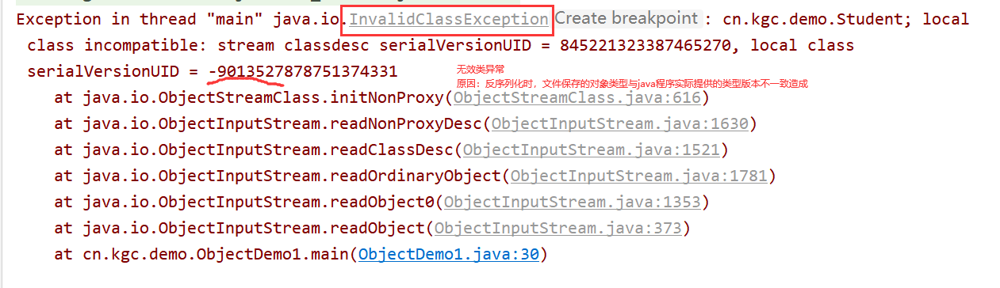
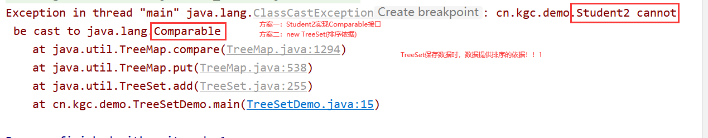
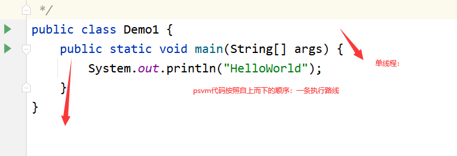
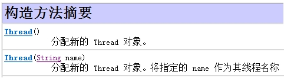
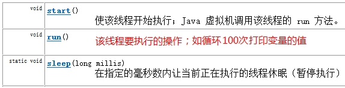
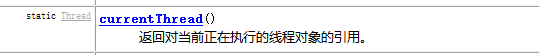
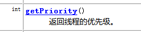
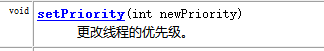
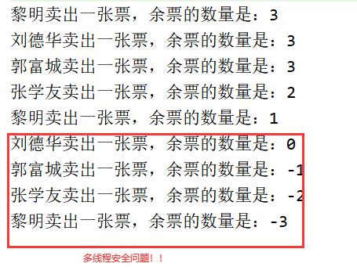
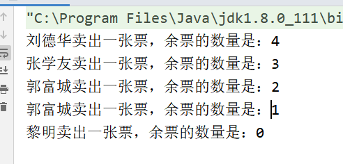

# 课程回顾

## 1 序列化流

```html
技术定位：java程序实现对象的存储

序列化：实现对象存入文件过程。使用ObjectOutputStream
反序列化：加载文件中保存的对象到程序中使用过程。使用ObjectInputStream

编程实现：先有序列化过程，再会使用反序列化过程。
序列化自定义对象（自己创建类生成对象），要求类必须支持序列化（Serializable）
```

### 1-1 序列化多个对象

```html
java程序，保存多个对象，使用什么数据类型存储？
 数组：对象数组
 集合：List  Set

考究问题：集合是否支持序列化

步骤：
1.定义类，要求实现Serializable接口
2.对象一个一个序列化
  对象存入数组或集合，再将数组或集合序列化
3.ObjectOutputStream(流程略)

```

### 1-2 序列化的版本号

```html
保存很多学生对象，Student类属性不断发生改变。学生对象程序是否还可以正常加载并使用？

```



### 1-3 案例演示

- Student类

```java
package cn.kgc.demo;

import java.io.Serializable;

/**
 * @Author: lc
 * @Date: 2022/4/13
 * @Description: 提供给序列化流使用的对象
 * @Version: 1.0
 */
public class Student implements Serializable {
	//添加一个版本号
	//作用：兼容之前序列化文件中的对象
	//要求：序列化之前定义版本号，后期Student其他内容可以改变，但是版本号不要改了
	public static final long serialVersionUID =1L ;
	private String id;
	private String name;
	private int num;


	public int getNum() {
		return num;
	}

	public void setNum(int num) {
		this.num = num;
	}

	//学生成绩
	private int score;

	public String getId() {
		return id;
	}

	public void setId(String id) {
		this.id = id;
	}

	public String getName() {
		return name;
	}

	public void setName(String name) {
		this.name = name;
	}

	public int getScore() {
		return score;
	}

	public void setScore(int score) {
		this.score = score;
	}

	public Student(String id, String name) {
		this.id = id;
		this.name = name;
	}

	public Student(String id, String name, int score) {
		this.id = id;
		this.name = name;
		this.score = score;
	}

	@Override
	public String toString() {
		final StringBuilder sb = new StringBuilder("Student{");
		sb.append("id='").append(id).append('\'');
		sb.append(", name='").append(name).append('\'');
		sb.append('}');
		return sb.toString();
	}
}
```

- 序列化多个对象

```java
package cn.kgc.demo;

import java.io.FileInputStream;
import java.io.FileOutputStream;
import java.io.ObjectInputStream;
import java.io.ObjectOutputStream;
import java.util.ArrayList;

/**
 * @Author: lc
 * @Date: 2022/4/13
 * @Description: 序列化多个对象
 * @Version: 1.0
 */
public class ObjectDemo1 {
	public static void main(String[] args) throws Exception{
		//1.序列化(序列化的对象存储的文件格式是二进制，意味着这个文件使用记事本打开不一定正常阅读的形式）
		ObjectOutputStream oos=new ObjectOutputStream(
				//提供序列化实现的基础流对象
				new FileOutputStream("list.txt")
		);
		//2.实现序列化
		//2-1 使用集合，先保存多个对象，再序列化到文件中
		ArrayList<Student> list=new ArrayList<>();
		list.add(new Student("S002","李四"));
		list.add(new Student("S001","李四"));
		list.add(new Student("S003","李四"));
		list.add(new Student("S004","李四"));
		oos.writeObject(list);
		/* 序列化多个对象的方案一：一个一个存入，反序列化就一个一个取出
		oos.writeObject(new Student("S002","李四"));
		oos.writeObject(new Student("S002","李四"));
		oos.writeObject(new Student("S002","李四"));
		oos.writeObject(new Student("S002","李四"));*/
		//3.是否资源
		oos.close();
		//2 反序列化
		ObjectInputStream ois=new ObjectInputStream(
				new FileInputStream("list.txt")
		);

		Object obj = ois.readObject();
		//2-2 加载文件中保存的对象，使用对象
		//obj实际对应的类型是一个集合，循环遍历
		if(obj instanceof ArrayList) {
			ArrayList<Student> list2 = (ArrayList<Student>) obj;
			//取出反序列化的第二个对象
			System.out.println(list2.get(0));

			for(Student s:list2){
				System.out.println(s);
			}
		}
		//3 释放资源
		ois.close();
	}
}

```

## 2 TreeSet集合

### 2-1 TreeSet的优势

```html
Set:无序、不重复
Set存入不重复的数据，且不能保证数据的顺序。如果想保证Set集合中元素的顺序可以使用TreeSet完成。
```

### 2-2 TreeSet实现集合顺序的实现方式

```html
方案一：
  将TreeSet中存入的对象，实现Comparable接口，并重写compareTo()
方案二：
  在TreeSet构造方法中，传入排序器。
排序器是自定义的，格式如下：
public class 排序器 implements Compartor{
   //重写compare()方法，提供排序依据
}
```

### 2-3 TreeSet集合保存数据常见的异常



### 2-4 Comparable接口的作用

```html
使用集合，保存多个学生信息，根据学生成绩排序！！！
方案一：开源的方式：自己写代码完成排序
   排序：冒泡  选择

方案二：借用第三方提供的方案
  Arrays:sort()
  Collections:sort()
```

### 2-5 实现Comparable接口的步骤

```html
Collections实现自定义对象排序：
1.定义类必须实现Comparable<类名>
2.自定义类中重写
    compareTo(Other){
		 if(this.属性>other.属性值){
    		return 1;
    }
    if(this.属性<other.属性值){
          return -1;
     }
     return 0
                                 
    }
3.Collection.sort(list)
```

### 2-6 课堂案例

#### 方案一：实现Comparable接口的实现方案

- Student类

```java
package cn.kgc.demo;

import java.io.Serializable;

/**
 * @Author: lc
 * @Date: 2022/4/13
 * @Description: 提供给序列化流使用的对象
 * @Version: 1.0
 */
//Comparable<要实现排序类名>:表示Student具有排序的能力
public class Student implements Serializable,Comparable<Student> {
	//添加一个版本号
	//作用：兼容之前序列化文件中的对象
	//要求：序列化之前定义版本号，后期Student其他内容可以改变，但是版本号不要改了
	public static final long serialVersionUID =1L ;
	private String id;
	private String name;
	private int num;


	public int getNum() {
		return num;
	}

	public void setNum(int num) {
		this.num = num;
	}

	//学生成绩
	private int score;

	public String getId() {
		return id;
	}

	public void setId(String id) {
		this.id = id;
	}

	public String getName() {
		return name;
	}

	public void setName(String name) {
		this.name = name;
	}

	public int getScore() {
		return score;
	}

	public void setScore(int score) {
		this.score = score;
	}

	public Student(String id, String name) {
		this.id = id;
		this.name = name;
	}

	public Student(String id, String name, int score) {
		this.id = id;
		this.name = name;
		this.score = score;
	}

	/**
	 * 比较两个对象大小
	 * @param o
	 * @return 0两个对象相等  小于0负数 降序排列  大于0正数 升序排列
	 */
	@Override
	public int compareTo(Student o) {
		return this.getScore() - o.getScore();
		//return -(this.getName().compareTo(o.getName()));
	}

	@Override
	public String toString() {
		final StringBuilder sb = new StringBuilder("Student{");
		sb.append("id='").append(id).append('\'');
		sb.append(", name='").append(name).append('\'');
		sb.append(",score=").append(score);
		sb.append('}');
		return sb.toString();
	}
}
```

- TreeSet使用方式一

```java
package cn.kgc.demo;

import java.util.TreeSet;

/**
 * @Author: lc
 * @Date: 2022/4/13
 * @Description: TreeSet的实现方式一
 */
public class TreeSetDemo {
	public static void main(String[] args) {
		//无序、不重复 对Set集合实现数据排序的方式
		TreeSet<Student2> set=new TreeSet<>();
		set.add(new Student2("1","张健",67));
		set.add(new Student2("2","陶晗",76));
		set.add(new Student2("3","王嘉毅",57));
		set.add(new Student2("4","李诗豪",97));

		System.out.println(set);

        //Collections不提供对set集合的排序
		//Collections.sort(set);
	}
}
```

#### 方案二：提供自定义的排序器

- Student2

```java
package cn.kgc.demo;

import java.io.Serializable;

/**
 * @Author: lc
 * @Date: 2022/4/13
 * @Description: 提供给序列化流使用的对象
 * @Version: 1.0
 */
public class Student2 implements Serializable{
	//添加一个版本号
	//作用：兼容之前序列化文件中的对象
	//要求：序列化之前定义版本号，后期Student其他内容可以改变，但是版本号不要改了
	public static final long serialVersionUID =1L ;
	private String id;
	private String name;
	private int num;


	public int getNum() {
		return num;
	}

	public void setNum(int num) {
		this.num = num;
	}

	//学生成绩
	private int score;

	public String getId() {
		return id;
	}

	public void setId(String id) {
		this.id = id;
	}

	public String getName() {
		return name;
	}

	public void setName(String name) {
		this.name = name;
	}

	public int getScore() {
		return score;
	}

	public void setScore(int score) {
		this.score = score;
	}

	public Student2(String id, String name) {
		this.id = id;
		this.name = name;
	}

	public Student2(String id, String name, int score) {
		this.id = id;
		this.name = name;
		this.score = score;
	}

	@Override
	public String toString() {
		final StringBuilder sb = new StringBuilder("Student{");
		sb.append("id='").append(id).append('\'');
		sb.append(", name='").append(name).append('\'');
		sb.append(",score=").append(score);
		sb.append('}');
		return sb.toString();
	}
}
```

- Student2Compartor自定义排序器

```java
package cn.kgc.demo;

import java.util.Comparator;

/**
 * @Author: lc
 * @Date: 2022/4/13
 * @Description: 为Student2提供的自定义排序器
 * @Version: 1.0
 */
public class Student2Comparetor implements Comparator<Student2> {
	@Override
	public int compare(Student2 o1, Student2 o2) {
		return o1.getScore()-o2.getScore();
	}
}
```

- TreeSet使用方式二

```java
package cn.kgc.demo;

import java.util.TreeSet;

/**
 * @Author: lc
 * @Date: 2022/4/13
 * @Description: cn.kgc.demo
 * @Version: 1.0
 */
public class TreeSetDemo {
	public static void main(String[] args) {
		//无序、不重复 对Set集合实现数据排序的方式
		//TreeSet<Student2> set=new TreeSet<>(实现了Comparetor接口的实现类对象);
		TreeSet<Student2> set=new TreeSet<>(new Student2Comparetor());
		set.add(new Student2("1","张健",67));
		set.add(new Student2("2","陶晗",76));
		set.add(new Student2("3","王嘉毅",57));
		set.add(new Student2("4","李诗豪",97));

		System.out.println(set);

		//Collections.sort(set);
	}
}
```


# 课程目标

## 1 线程和进程概念 === 理解

## 2 Thread类实现多线程  === 掌握

## 3 Runnable接口实现多线程=== 掌握

## 4 线程安全 === 理解

## 5 线程同步=== 掌握

# 课程实施

## 1 进程和线程

```html
一个正在运行的程序就是进程
进程中每一条执行路线称为：线程
```

### 案例分析：单线程（称为main（主）线程）



  

## 2 单线程程序和多线程程序区别

```html
单线程只有一条执行路线，多个功能需要排队执行，CPU利用率低，用户体验度
多线程同时有个多个执行路线，CPU利用率高，用户体验度好
```

## 3 多线程实现

需求：

```html
psvm启动两个线程：
线程1：负责输出奇数
线程2：负责输出偶数
```

### 3-1 继承Thread父类

```html
1.定义一个类extends Thread{
	//重写run():分配的任务
}
2.psvm,创建线程对象
对象.start();//CPU才能看到自定义的线程，随机切换
```

#### 课堂案例

- 定义线程类并为线程分配线程任务

```java
package cn.kgc.thread;

/**
 * @Author: lc
 * @Date: 2022/4/13
 * @Description: 线程类
 * @Version: 1.0
 */
public class MyThread extends Thread{
	//自定义线程分配功能：输出偶数
	@Override
	public void run() {//为自己的线程定义功能的方法
		for(int i=1;i<100;i++){
			if(i%2==0){
				System.out.println("自定义线程输出："+i);
			}
		}
	}
}
```

- 线程2实现奇数输出

```java
package cn.kgc.thread;

/**
 * @Author: lc
 * @Date: 2022/4/13
 * @Description: 线程类
 * @Version: 1.0
 */
public class MyThread2 extends Thread{
	public MyThread2() {
	}

	public MyThread2(String name) {
		super(name);
	}

	//自定义线程分配功能：输出奇数
	@Override
	public void run() {//为自己的线程定义功能的方法
		for(int i=1;i<100;i++){
			if(i%2!=0){
				System.out.println(Thread.currentThread().getName()+"线程输出："+i);
			}
		}
	}
}
```

- 创建线程对象并启动线程

```java
package cn.kgc.thread;

/**
 * @Author: lc
 * @Date: 2022/4/13
 * @Description: 理解线程概念
 * @Version: 1.0
 */
public class Demo1 {
	public static void main(String[] args) throws Exception{
		//启动自定义线程
		MyThread myThread=new MyThread();
		myThread.start();//线程启动

		//输出奇数
		for(int i=1;i<100;i++){
			if(i%2!=0){

				System.out.println("main线程输出："+i);
			}
		}
	}
}
```

### 3-2 实现Runnable接口

```html
优先推荐：使用接口方式实现线程
接口优势：避免单根继承的局限性

使用场景：Runnable实现多个线程执行同一个功能
```

#### 实现线程步骤

```html
1.子类实现Runnable接口
2.重写run() 分配任务
3.new Thread(Runnable子类的对象,"线程名称").start();
```

#### 课堂案例

- 创建子类并实现Runnable接口

```java
package cn.kgc.thread;

/**
 * @Author: lc
 * @Date: 2022/4/13
 * @Description: 分配线程任务
 * 使用两个线程，实现打印1-10之间数字
 * 接口侧重具有什么功能？
 * 使一个任务分配个多个线程执行
 * @Version: 1.0
 */
public class MyRunnable implements Runnable{
	@Override
	public void run() {
		for(int i=1;i<=10;i++){
			System.out.println(Thread.currentThread().getName()+"输出："+i);
		}
	}
}
```

- 创建线程、分配线程任务并启动线程

```java
package cn.kgc.thread;

/**
 * @Author: lc
 * @Date: 2022/4/13
 * @Description: cn.kgc.thread
 * @Version: 1.0
 */
public class Demo2 {
	public static void main(String[] args) {
		//三个线程
		//1.线程要执行的任务创建处理
		MyRunnable runnable=new MyRunnable();
		Thread t1=new Thread(runnable,"张三");
		Thread t2=new Thread(runnable,"李四");
		Thread t3=new Thread(runnable,"王五");

		t1.start();
		t2.start();
		t3.start();
	}
}
```

## 4 Thread类常用方法











### 4-1 线程方法的使用案例

- 获取当期线程

```java
package cn.kgc.thread;

/**
 * @Author: lc
 * @Date: 2022/4/13
 * @Description: 线程类
 * @Version: 1.0
 */
public class MyThread extends Thread{
	public MyThread() {
	}

	public MyThread(String name) {
		super(name);
	}

	//自定义线程分配功能：输出偶数
	@Override
	public void run() {//为自己的线程定义功能的方法
		for(int i=1;i<100;i++){
			if(i%2==0){
				//currentThread获取CPU正在执行的线程对象
				System.out.println(Thread.currentThread().getName()+"线程输出："+i);
			}
		}
	}
}
```

- 设置线程优先级

```java
package cn.kgc.thread;

/**
 * @Author: lc
 * @Date: 2022/4/13
 * @Description: 理解线程概念
 * @Version: 1.0
 */
public class Demo1 {
	public static void main(String[] args) throws Exception{
		//启动自定义线程
		MyThread myThread=new MyThread("孙悟空");
		MyThread2 myThread2=new MyThread2("白骨精");

		//分配优先级
		myThread.setPriority(Thread.MAX_PRIORITY);
		myThread2.setPriority(Thread.MIN_PRIORITY);

		System.out.println("孙悟空："+myThread.getPriority());
		System.out.println("白骨精："+myThread2.getPriority());

		myThread2.start();
		myThread.start();//线程启动

		//输出奇数

	}
}
```

## 5 线程安全必要性

### 需求分析

```html
售票系统：
   使用四个线程一起售卖5张火车票
什么情况会有多线程线程安全的问题？
  多个线程访问同一个数据，并且对数据进行修改
StringBuilder：线程安全不安全。性能好！
StringBuffer：线程安全！！性能较差！！
```

- 定义线程任务：卖票

```java
package cn.kgc.thread;

/**
 * @Author: lc
 * @Date: 2022/4/13
 * @Description: 买票
 * @Version: 1.0
 */
public class MaiPiao implements Runnable{
	//定义车票数量
	private int tickets=5;
	//重写细节：子类重写父类方法，不能比父类声明更多异常
	@Override
	public void run() {
		while(true){
			if(tickets>0){
				//模拟线程等待出票时间
				try {
					Thread.sleep(50);
				} catch (InterruptedException e) {
					e.printStackTrace();
				}
				//卖票
				tickets--;
				System.out.println(Thread.currentThread().getName()+"卖出一张票，余票的数量是："+tickets);
			}
		}
	}
}
```

- 定义多个线程卖票

```java
package cn.kgc.thread;

/**
 * @Author: lc
 * @Date: 2022/4/13
 * @Description: 线程安全的问题
 * @Version: 1.0
 */
public class Demo3 {
	public static void main(String[] args) {
		//定义线程任务
		MaiPiao mp=new MaiPiao();

		//请人做事
		Thread t1=new Thread(mp,"刘德华");
		Thread t2=new Thread(mp,"黎明");
		Thread t3=new Thread(mp,"郭富城");
		Thread t4=new Thread(mp,"张学友");

		//开工
		t1.start();
		t2.start();
		t3.start();
		t4.start();

	}
}
```




## 6 线程同步实现方式

### 6-1 同步代码块

```html
synchronized(锁对象){//多线程锁对象是同一把
	//线程任务
}
```

### 6-2 同步方法

```html
public synchronized void 方法名(){//实例方法，锁对象是this static修饰的方法，锁对象class对象
 //线程任务
}
```

### 6-3 使用同步机制实现卖票的功能

- 售票功能定义

```java
package cn.kgc.thread;

/**
 * @Author: lc
 * @Date: 2022/4/13
 * @Description: 买票
 * @Version: 1.0
 */
public class MaiPiao implements Runnable{
	//定义车票数量
	private int tickets=5;
	//多个线程进来执行，lock必须是一样的
	private  Object lock=new Object();//创建一个对象
	//重写细节：子类重写父类方法，不能比父类声明更多异常
	@Override
	public void run() {
		while(true){
			//synchronized (lock) {//同步代码块
			sell();
			//}
		}
	}

	private synchronized void sell() {//同步方法
		if(tickets>0){
			//模拟线程等待出票时间
			try {
				Thread.sleep(1000);
			} catch (InterruptedException e) {
				e.printStackTrace();
			}
			//卖票
			tickets--;
			System.out.println(Thread.currentThread().getName()+"卖出一张票，余票的数量是："+tickets);
		}
	}
}
```

- 启动多线程

```java
package cn.kgc.thread;

/**
 * @Author: lc
 * @Date: 2022/4/13
 * @Description: 线程安全的问题
 * @Version: 1.0
 */
public class Demo3 {
	public static void main(String[] args) {
		//定义线程任务
		MaiPiao mp=new MaiPiao();

		//请人做事
		Thread t1=new Thread(mp,"刘德华");
		Thread t2=new Thread(mp,"黎明");
		Thread t3=new Thread(mp,"郭富城");
		Thread t4=new Thread(mp,"张学友");

		//开工
		t1.start();
		t2.start();
		t3.start();
		t4.start();

	}
}
```



# 课程总结

## 1 TreeSet提到Comparable接口和Compartor接口

## 2 线程两种实现方式


# U1考试

 选择题

机试题

考点：java基础 oop  高级使用类、集合、IO、File

# 预习安排

前端知识：HTML + CSS（选择器）+ JavaScript  + JQUERY

数据库：MySQL

JAVA操作数据库方式：JDBC

JavaEE：Tomcat   Http协议  Servlet  JSP  AJAX .............


