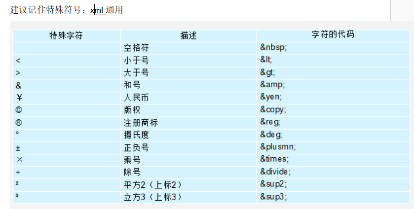
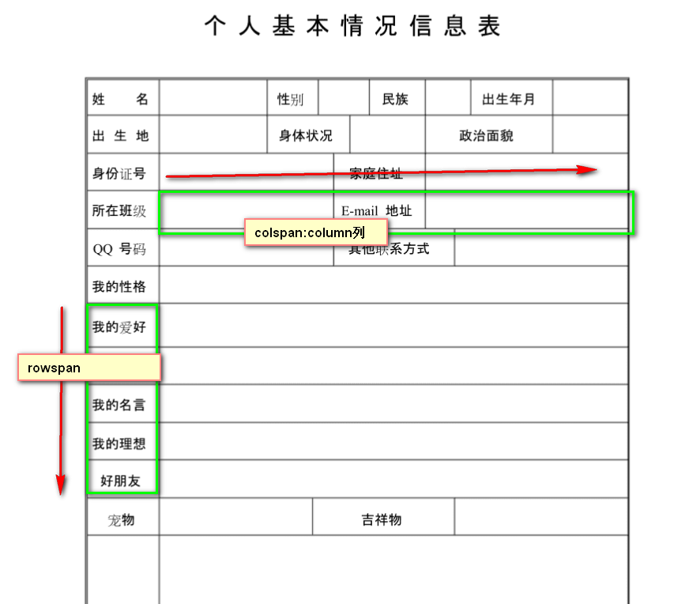
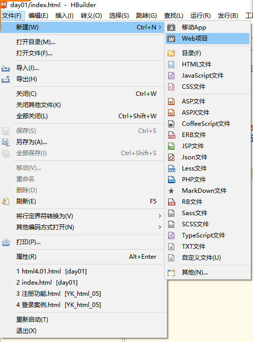
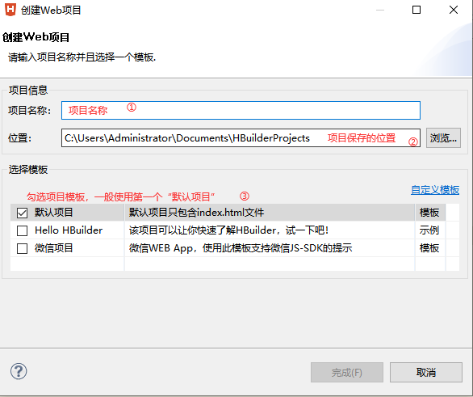
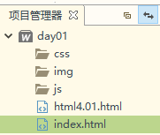
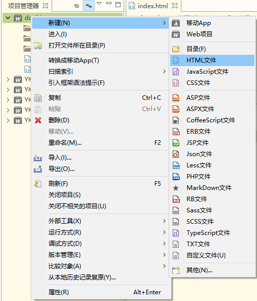
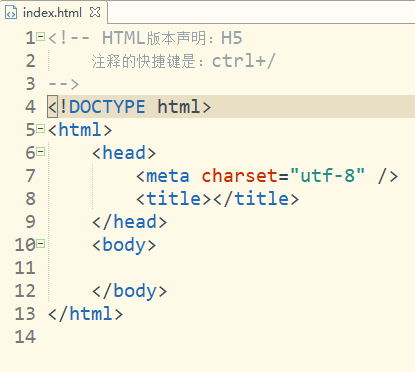

# U2阶段案例

图书管理系统

授课方式：

   先讲后练

   先整理课件、再做作业

# 课程目标

## 1 HTML基础标签 ============== 掌握

### h标签 a标签 段落 列表标签 图片 字体标签 粗体 斜体...

## 2 HTML表格标签 ============== 掌握

### table

## 3 HTML表单标签 ============== 掌握

### 表单

# 课程实施

## 1 HTML基本网页结构

```html
html:Hyper Text Markup Language 超文本标记语言
用于网页的技术。文本、音频、视频、图片、超链接

HTML主要是用于数据显示和获取
CSS（美化网页） + JAVASCRIPT（用户交互）
```

## 2 HTML开发环境

```html
写代码工具：VSCODE HBuilder 记事本 webStorm  Dreamweaver

运行工具：浏览器  火狐  谷歌  IE
```

## 3 HTML入门

### html网页的基本书写要求

```html
1.html中所有的单词不区分大小写。官方建议标签都纯大写。习惯性写法小写
2.每个单词成对出现
3.保存的文件格式后缀名.html  .htm   .xhtml .xhtm
```

### HTML网页代码骨架

```html
<html>
   <head>
       
    </head> 
    <body>
        写自己的代码程序
    </body>
</html>
```

### 课堂案例:HelloWorld案例

```html
<HTML>
	
	<HEAD>
		<title>入门案例</title>
	</HEAD>
	<BODY>
		helloWorld!
	</BODY>
</HTML>
```

## 3 常用基本标签

### 3-1 标签概念及分类

```html
<标签名>
```

### 根据是否需要写闭合标签，标签分为两类：

单标签：标签名，不需要/

```html
<标签名/>
```

双标签：开始标签和闭合标签

```html
<html>
    
</html>
```

### 标签在网页上是否占满一整行，标签分为两类

行内标签：本身无宽无高，主要是有标签内容撑起标签宽度和高度。如果没有内容浏览器上没有显示


块状标签：p hr 自动占满浏览器一整行，首尾自动换行的效果

### 3-2 常用标签

#### 标题标签

```html
<h字号></h字号>

字号：h1--h6
字体随着h后面的数字越大，字体越小
```

#### 字体标签

字体标签主要是用于文字外观的修饰。

```html
<font 属性名=“属性值”></font>
属性：
color:字体颜色
颜色值写法：
   英文单词
   RGB(0-255,0-255,0-255)
   #十六进制的颜色
size:1-7之间，数字越大，字体越大
face:字体名称
提示：字体必须在windows系统支持的

粗体：
<strong></strong>
<b></b>
斜体：
<em>强调引用</em>
<i></i>
```

#### img图片标签

```html

```

#### 超链接

```html
概念：单击文字或图片链接到新网页的标记

<a href="打开新网页的路径" target="设置新网页打开的位置">文字或图片</a>
```

#### 特殊符号



```html
	<!--
			需求：
			浏览器上显示<font color="red" size="7"></font>
		-->
		<p>
			&copy; h<sub>2</sub>o
		&lt;font color="red" size="7"&gt;&lt;/font&gt;
		</p>
```


### 3-3 案例演示

#### 案例一：

```html
<!DOCTYPE html>
<html>

	<head>
		<meta charset="UTF-8">
		<title>演示段落标签</title>
	</head>

	<body>
		<!--标题标签：hn-->
		<h1>春晓</h1>
		<h2>春晓</h2>
		<h3>春晓</h3>
		<h4>春晓</h4>
		<h5>春晓</h5>
		<h6>春晓</h6>
		<!--段落标签：p-->
		<p>春眠不觉晓，处处闻啼鸟。</p>
		<p>夜来风雨声，花落知多少多少</p>
		<!--水平线标签-->
		<hr />
		<!--换行标签：br-->
		悯农<br /> 锄禾日当午，汗滴禾下土。
		<br /> 谁知盘中餐，粒粒皆辛苦。
		<br />
	</body>

</html>
```

#### 案例二：

```html
<!DOCTYPE html>
<html>

	<head>
		<meta charset="UTF-8">
		<title>演示段落标签</title>
	</head>

	<body>
		<!--标题标签：hn-->
		<h1>春晓</h1>
		<h2>春晓</h2>
		<h3>春晓</h3>
		<h4>春晓</h4>
		<h5>春晓</h5>
		<h6>春晓</h6>
		<!--段落标签：p-->
		<p>
			<!--
				font:设置字体的外观、大小、颜色；
				常用属性：
				color:颜色
				size:字体大小
				face:字体名称
			-->
			<font face="楷体" color="red" size="5">春眠</font>不觉晓，处处闻啼鸟。</p>
			<!--
				字体加粗：b标签和strong标签
				字体倾斜：i标签和em标签
			-->
		<p>夜来<strong><font color="deeppink" size="7"><i>风雨</i></font></strong>声，
			花落知<b><em>多少</em></b>多少</p>
		<!--水平线标签-->
		<hr />
		<!--换行标签：br-->
		悯农<br /> 锄禾日当午，汗滴禾下土。
		<br /> 谁知盘中餐，粒粒皆辛苦。
		<br />
	</body>

</html>
```

#### 案例三：

```html
<!DOCTYPE html>
<html>
	<head>
		<meta charset="UTF-8">
		<title></title>
	</head>
	<body>
		<!--
			三种
			绝对路径
		-->
		
		
		
		
		<!--
			参考物路径：F:\宏鹏\K2502\U2\HTML\案例\day01\xx.html
			图片路径：F:\宏鹏\K2502\U2\HTML\案例\day01\img\花.jpg
			..:当前网页上一级目录
			
			如果图片的宽度或高度只设置一个值，图片会按比例缩放，图片不失真
		-->
		
	</body>
</html>

```

#### 案例四：

```html
<!DOCTYPE html>
<html>
	<head>
		<meta charset="UTF-8">
		<title></title>
	</head>
	<body>
		<a href="http://www.baidu.com" target="_blank">百度</a>
		<a href="01【掌握】p标签.html" target="_blank">进入p标签的网页</a>
		<a href="http://www.jd.com">
			
		</a>
	</body>
</html>

```

## 表格标签



```html
<table border="粗细" cellspacing="线与线之间的间距" cellpadding="字与线之间间距" width="" height="" bgcolor="" background="">
    <caption></caption>
    <tr>
    	<th>字体居中、加粗</th>
    </tr>
    <tr>
    	<td></td>
    </tr>
</table>
```

### 课堂案例

- 表格基本应用

```html
<!DOCTYPE html>
<html>
	<head>
		<meta charset="UTF-8">
		<title></title>
	</head>
	<body>
		<!--此处是一个表格
			border:设置表格的边框线
			设置：线粗细 1px 2px
			
			cellspacing:设置线与线之间的间距（空白）0px
			cellpadding:设置列中间内容与边框线之间的间距 xxpx
			width:50% 分辨率1366*0.5
			
			bgcolor:背景色
			background：设置背景图
		-->
		<table border="1px" cellspacing="0px" cellpadding="4px" width="50%" background="img/花.jpg" >
			<!--表格标题-->
			<caption><h1>学生成绩一览表</h1></caption>
			<!--行-->
			<tr bgcolor="pink">
				<!--列-->
				<!--<td>姓名</td>
				<td>年龄</td>
				<td>成绩</td>-->
				<!--
					th通常用作表格的列标题
				-->
				<th>姓名</th>
				<th>年龄</th>
				<th>成绩</th>
			</tr>
			
			<tr>
				<!--列-->
				<td>jack</td>
				<td>21</td>
				<td>90</td>
			</tr>
			
			<tr>
				<!--列-->
				<td>tom</td>
				<td>18</td>
				<td>99</td>
			</tr>
		</table>
	</body>
</html>

```

- 表格合并应用

```html
<!DOCTYPE html>
<html>
	<head>
		<meta charset="UTF-8">
		<title></title>
	</head>
	<body>
		<!--此处是一个表格
			border:设置表格的边框线
			设置：线粗细 1px 2px
			
			cellspacing:设置线与线之间的间距（空白）0px
			cellpadding:设置列中间内容与边框线之间的间距 xxpx
			width:50% 分辨率1366*0.5
			
			bgcolor:背景色
			background：设置背景图
		-->
		<table border="1px" cellspacing="0px" cellpadding="4px" width="50%">
			<!--表格标题-->
			<caption><h1>学生成绩一览表</h1></caption>
			<!--行-->
			<thead>
			<tr>
				<!--列-->
				<!--<td>姓名</td>
				<td>年龄</td>
				<td>成绩</td>-->
				<!--
					th通常用作表格的列标题
				-->
				<th>姓名</th>
				<th>年龄</th>
				<th>成绩</th>
			</tr>
			</thead>
			
			<tbody>
			<tr>
				<!--列
					align:文字水平对齐方式  left center right
				-->
				<td align="right">jack</td>
				<td rowspan="2" align="center">21</td>
				<td>90</td>
			</tr>
			
			<tr>
				<!--列-->
				<td>tom</td>
				<!--<td>18</td>-->
				<td>99</td>
			</tr>
			</tbody>
			<tfoot>
			<tr>
				<!--
					colspan：水平合并的格子数量
				-->
				<td colspan="2">平均分</td>
				<!--<td>ss</td>-->
				<td>94.5</td>
			</tr>
			</tfoot>
		</table>
	</body>
</html>

```


## HTML上面路径写法

### 绝对路径

路径是以盘符名称开始。不推荐使用

```html
f://xxx.jpg
```

网络资源

```html
https://bkimg.cdn.bcebos.com/pic/c2cec3fdfc039245ead2446d8694a4c27d1e2568?x-bce-process=image/watermark,image_d2F0ZXIvYmFpa2U5Mg==,g_7,xp_5,yp_5/format,f_auto
```


### 相对路径

```html
1.参考物路径：当前网页的路径
2.图片必须放在项目中，才可以使用相对路径
```


## HBuilder工具的基本使用

### 第一步：启动HBuilder，然后选择“文件”--->“新建”---->"Web项目"



### 第二步：选择项目模板并命名





### 第三步：项目名称上右键，创建HTML网页，即可开始HTML编程



HBuilder会基于网页基本结构生成html网页代码，代码如下：




# 课程总结

## 1 HTML作用

```html
数据显示  数据收集
```

## 2 HTML标签

```html
p
a
img
hr
h1-h6
br
font
i b em strong
表格
```

## 3 相对路径的写法

# 预习

表单  列表

CSS常用选择器：

id  class  标签选择器  子级选择器  后代选择器