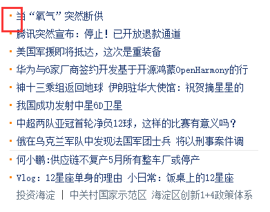
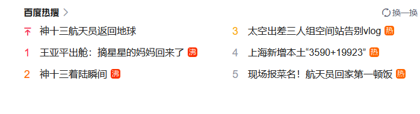
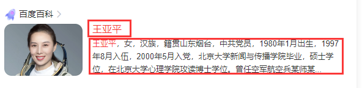
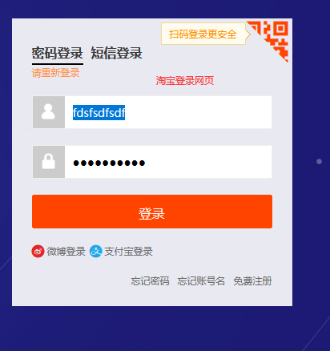
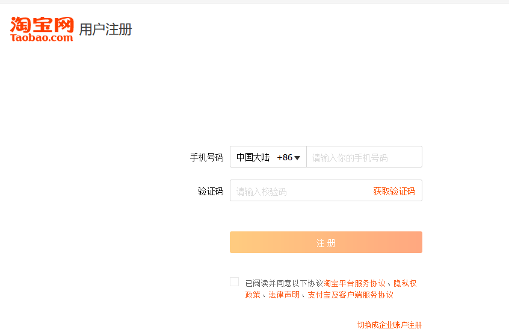
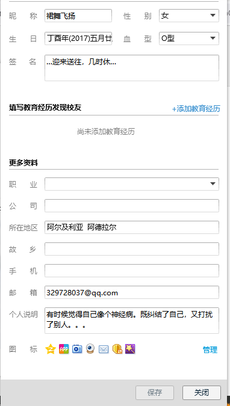
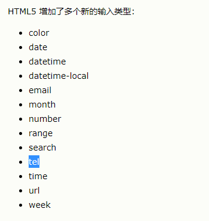
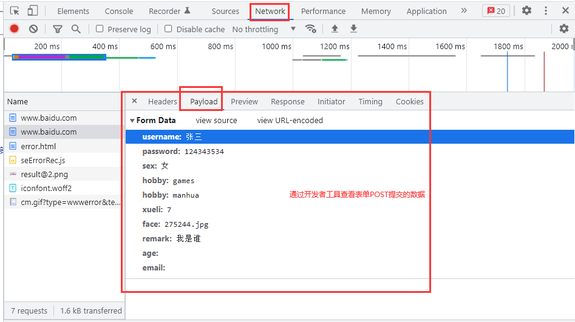

# HTML回顾

```html
p h a img
hr:width  height

表格：
<table border="" cellspacing=""  cellpadding="" bgcolor="" background=""  width="" height="" bordercolor="">
    <caption>表格标题</caption>
    <thead>
    <tr>
    	<th>自动居中、字体加粗</th>
    </tr>
        </thead>
    <tbody>
    <tr>
    	<td colspan="" rowspan=""></td>
    </tr>
        </tbody>
    <tfoot>
    </tfoot>
</table>
```

# 课程目标

## 1 表单 ========== 重点

###   POST和GET区别

## 2 列表标签（无序、有序、自定义列表）

## 3 CSS选择器 ====== 重点

## 4 CSS常用的样式 ============ 掌握

### 文本样式

### 字体样式

### 背景样式

### 鼠标样式

### 伪类样式

# 课程实施

## 1 列表标签

作用：数据显示

### 常见的列表展示数据的案例：








### 无序列表

```html
<ul type="设置列表项前面的符号">
    <li></li>
    <li></li>
</ul>
```

### 有序列表

```html
<ol type="设置列表项前面的序号类型">
    <li></li>
    <li></li>    
</ol>
```

### 自定义列表

```html
<dl>
   <dt>列表标题/图片</dt> 
    <dd>主题信息的描述</dd>
    <dd>对主题描述信息的需求，可以出现多个dd</dd>
    
    <dt></dt>
    <dd></dd>
    <dd></dd>
</dl>
```

### 课堂案例

- 无序列表案例

```<!DOCTYPE html>
<!DOCTYPE html>
<html>
	<head>
		<meta charset="utf-8" />
		<title></title>
	</head>
	<body>
		<!--有序列表
			type：设置序号的外观，格式
			start:设置第一个列表项起始值
		-->
		<ol type="I" start="3">
			<li>张三  90</li>
			<li>李四 87</li>
			<li>王五  78</li>
		</ol>
	</body>
</html>

```

- 有序列表案例

```html
<!DOCTYPE html>
<html>
	<head>
		<meta charset="utf-8" />
		<title></title>
	</head>
	<body>
		<!--
			ul:type设置列表图标符号，但是不支持start
		-->
		<ul type="square">
			<li>俄乌战争</li>
			<li>防疫新闻</li>
			<li>油价上涨</li>
		</ul>
	</body>
</html>

```

- 自定义列表案例

```html
<!DOCTYPE html>
<html>
	<head>
		<meta charset="utf-8" />
		<title></title>
	</head>
	<body>		
		<dl>
			<!--主题-->
			<dt>
				
			</dt>
			<!--描述信息-->
			<dd>单价：￥8999</dd>
			<dd>产地：越南</dd>
			<dd>型号：xxxx</dd>
			<!--
				width:设置hr宽度
				size: 设置hr的粗细 单位px
			-->
			<hr width="120px" align="left" />
			<!--主题-->
			<dt>
				
			</dt>
			<!--描述信息-->
			<dd>单价：￥8999</dd>
			<dd>产地：越南</dd>
			<dd>型号：xxxx</dd>
		</dl>
		
		<dl>
			<dt>标签概念</dt>
			<dd>html中<>引起来的一对单词，称为标签</dd>
			
			<dt>标签分类</dt>
			<dd>单标签 双标签</dd>
			<dd>块状标签 行内标签</dd>
		</dl>
	</body>
</html>

```

## 2 表单

### 2-1 表单的作用

类似U1使用Scanner，主要用作获取用户输入的数据

### 2-2 表单的应用场景

举例：登录网页 

 注册网页  



修改个人信息



### 2-3 表单标签

form很重要，作用：用于数据提交给后台程序

```html
<form action="数据提交的后台所在的路径url" method="数据提交后台的方式">
    
</form>
说明：
action：url地址 
网络写法：http://网址   
相对路径

method:
  POST 
  GET
```

### 2-4 表单里面常用的表单项标签

```html
<input type="类型" name="提交给java后台，后台获取的key" value="默认值"/>
说明：
类型：常见类型
text:单行文本框
password:密码框
radio:单选按钮
checkbox:复选框
submit:提交按钮
reset:重置按钮
button:普通按钮，一般结合js的事件驱动机制
image:图片按钮，作用submit一样
hidden:隐藏域 网页上不会显示，主要提供程序员编程使用
file:文件域

下拉列表的标签名：select
<select>
	<option>一个选项</option>
    <option></option>
</select>
文本域：textarea
<textarea rows="文本域外观高度，几行" cols="宽度，每行几个字符">
</textarea>
```



### 案例演示

```html
<!DOCTYPE html>
<html>
	<head>
		<meta charset="UTF-8">
		<title>表单项标签</title>
	</head>
	<body>
		<!--
			将表单项接收用户输入的数据，提交给action指定的后台程序
		-->
		<form action="http://www.baidu.com" method="get">
			<p>
				用户名：<input type="text" name="username" value="admin"/>
			</p>
			<p>
				<!--
					placeholder:输入框信息提示  用户体验度
					你不输入，显示placeholder的数据，一旦输入，placeholder会自动清空
				-->
				密码：<input type="password" name="password" placeholder="密码必须是6-8为数字" />
			</p>
			<p>
				<!-- 单选按钮
					
					必须提供选项对应的提交给后台的值
					value="当用户选择男的时候，提交给后台"
					单选按钮的name属性必须一样，不能实现互斥的选择效果，
					其他的表单项name不能重复
					
					设置选中项默认值 checked属性值和名一样的，可以省略值
				-->
				性别：
				<input type="radio" name="sex" value="男" checked/>男
				<input type="radio" name="sex" value="女"/>女
			</p>
			<p>
				爱好：
				<!--
					复选框：多选，多个复选框，name属性值也是一样的
					value="后台的值"
				-->
				<input type="checkbox" name="hobby" value="games" />打游戏
				<input type="checkbox" name="hobby" value="manhua" checked="checked"/> 漫画
				<input type="checkbox" name="hobby" value="ball" checked/>篮球
				
			</p>
			<p>
				<!--
					下拉列表：单选效果
					适用于选项较多的场景
				-->
				学历：<select name="xueli">
					<!--选项-->
					<option value="1">文盲</option>
					<option value="2">幼儿园</option>
					<option value="3">小学</option>
					<option value="4">初中</option>
					<option value="5">高中</option>
					<option value="6">大专</option>
					<option value="7">本科</option>
				</select>
			</p>
			<p>
				<!--文件域：name属性值-->
				上传头像：<input type="file" name="face" />
			</p>
			<p>
				<!--隐藏域-->
				<input type="hidden" value="用户看不到，程序员必须提供value值" />
			</p>
			<p>
				备注：
				<textarea name="remark" rows="10" cols="40"></textarea>
			</p>
			<!-- h5 -->
			<p>
				生日：
				<input type="date" />
				<input type="time" />
				<input type="datetime-local" />
				<input type="month" />
				<input type="week" />
			</p>
			<p>
				年龄：
				<input type="number" name="age" min="0" max="60" />
			</p>
			<p>
				email:
				<input type="email" name="email" />
			</p>
			<p>
				<!--
					按钮一般可以不设置name属性，应为按钮的内容不需要提交给后台处理
					value="按钮上显示的值"
				-->
				<input type="submit" value="保存信息" />
				<input type="reset" value="还原" />
				<input type="button" value="没有任何作用" />
				<!--
					src:设置图片按钮的图片来源
				-->
				<input type="image" src="img/sslogo.png" />
			</p>
		</form>
	</body>
</html>
```

- 下拉列表多选的实现效果

```html
		      <!--
					下拉列表：单选效果
					适用于选项较多的场景
					
					multiple:设置下拉列表支持多选
					ctrl:不连续的选择
					shift:连续多项选择
				-->
				学历：<select name="xueli" multiple="multiple">
					<!--选项-->
					<option value="1">文盲</option>
					<option value="2">幼儿园</option>
					<option value="3">小学</option>
					<option value="4">初中</option>
					<option value="5">高中</option>
					<!--
						selected默认选中项
					-->
					<option value="6" selected="selected">大专</option>
					<option value="7">本科</option>
				</select>
```

### 2-5 POST和GET区别

```html
submit按钮将表单项用户选择的或者输入的数据按照指定的method方式提交给action设置的网址
GET方式提交表单数据时，特征：浏览器地址栏中会使用以下的格式显示：
https://www.baidu.com/?username=admin&password=123456&sex=%E7%94%B7&hobby=manhua&hobby=ball&xueli=1&face=&remark=&age=&email=&x=125&y=24

GET提交表单数据，如果数据敏感信息，这种方式不安全
提交的数据收到地址栏长度的局限。数据量有限制：提交数据量较大，可能会有数据丢失的问题
POST方式：地址栏没有显示，数据安全的。理论上，post对于提交数据量没有限制
```

### 2-6 开发者工具

浏览器都有开发者工具功能。快捷键是F12

CSS属性值调整、js、jquery代码调试功能都需要借助开发者工具



## 3 CSS简介

网页技术：

HTML：数据展示和数据收集

CSS：HTML展示的数据进行美化或修饰

### css优势

1.html和css分别完成，实现数据展示的代码、数据修饰的分离。代码量控制

2.html通过font em b标签控制外观，代码复用性较低。代码维护性较差、阅读困哪

css代码复用性、阅读性

3.css提供更加精准的元素美化

#### 课堂案例

```html
<!DOCTYPE html>
<html>
	<head>
		<meta charset="UTF-8">
		<title>CSS优势</title>
	</head>
	<body>
		<!--html控制外观：, .使用粗体、红色、24px字体显示-->
		<h1>出师表</h1>
		<p>
			先帝创业未半而中道崩殂<font color="red" size="7"><b>，</b></font>今天下三分，
			益州疲弊，此诚危急存亡之秋也。然侍卫之臣不懈于内<font color="red" size="7"><b>，</b></font>
			忠志之士忘身于外者，盖追先帝之殊遇，欲报之于陛下也<font color="red" size="7"><b>，</b></font>
			诚宜开张圣听，以光先帝遗德，恢弘志士之气，不宜妄自菲薄<font color="red" size="7"><b>，</b></font>引喻失义，以塞忠谏之路也。
宫中府中，俱为一体，陟罚臧否，不宜异同。若有作奸犯科及为忠善者<font color="red" size="7"><b>，</b></font>宜付有司论其刑赏，以昭陛下平明之理，
不宜偏私，使内外异法也。侍中、侍郎郭攸之、费祎、董允等，此皆良实<font color="red" size="7"><b>，</b></font>志虑忠纯，是以先帝简拔以遗陛下。
愚以为宫中之事，事无大小，悉以咨之，然后施行，必能裨补阙漏，有所广益。
将军向宠，性行淑均，晓畅军事，试用于昔日，先帝称之曰能，是以众议举宠为督。愚以为营中之事，悉以咨之，
必能使行阵和睦，优劣得所。 
		</p>
	</body>
</html>

```

css优化上述案例

```html
<!DOCTYPE html>
<html>
	<head>
		<meta charset="UTF-8">
		<title>CSS引入方式</title>
	</head>
	<style type="text/css">
		.aa{
			color: red;
			font-size: 49px;
			font-weight: bold;
		}
	</style>
	<body>
		<h1>出师表</h1>
		<p>
			先帝创业未半而中道崩殂<xx class="aa">，</xx>今天下三分，益州疲弊，此诚危急存亡之秋也。然侍卫之臣不懈于内，忠志之士忘身于外者，盖追先帝之殊遇，欲报之于陛下也。诚宜开张圣听，以光先帝遗德，恢弘志士之气，不宜妄自菲薄，引喻失义，以塞忠谏之路也。
宫中府中，俱为一体，陟罚臧否，不宜异同。若有作奸犯科及为忠善者，宜付有司论其刑赏，以昭陛下平明之理，不宜偏私，使内外异法也。
侍中、侍郎郭攸之、费祎、董允等，此皆良实，志虑忠纯，是以先帝简拔以遗陛下。愚以为宫中之事，事无大小，悉以咨之，然后施行，必能裨补阙漏，有所广益。
将军向宠，性行淑均，晓畅军事，试用于昔日，先帝称之曰能，是以众议举宠为督。愚以为营中之事，悉以咨之，必能使行阵和睦，优劣得所。 
		</p>
	</body>
</html>

```


## 4 CSS引入方式

需求：

```html
<p>
    出师表
</p>
所有的，。使用粗体显示
```

### 4-1 行内样式表【了解】

适用场景：一个css样式只使用一次

```html
<标签 style="css样式"></标签>
```

#### 课堂案例

```html
<!DOCTYPE html>
<html>
	<head>
		<meta charset="UTF-8">
		<title></title>
	</head>
	<body>
		<!--行内样式
			不能复用！！
		-->
		<p style="color:blue; font-family: 楷体; font-size:34px; font-weight: bolder;">静夜思</p>
		<!---->
		<a style="color:blue;font-family: 楷体;font-size:34px;font-weight: bolder;">百度</a>
	</body>
</html>

```

### 4-2 内嵌样式表[掌握]

```html
<head>
    
</head>
<style type="text/css">
  /*css样式*/
</style>
<body>
    
</body>
```

#### 课堂案例

```html
<!DOCTYPE html>
<html>
	<head>
		<meta charset="UTF-8">
		<title></title>
	</head>
	<!--定义css-->
	<style type="text/css">
	/*所有p的样式*/
		p{
			color:red;
			font-size: 45px;
			font-weight: bolder;
			font-family: arial;
		}
	</style>
	<body>
		<p class="p">静夜思</p>
		<p class="p">出师表</p>
		<p class="p">出师表</p>
		<p class="p">出师表</p>
	
		
		<p class="p">出师表</p>
		<a>百度</a>
	</body>
</html>

```


### 4-3 外部样式表[掌握]

第一步：定义独立的css文件，后缀名.css

第二步：html使用css时，就是用导入语法引用css

```html
<head>
    <!--第一种导入外部样式的方式：最常用-->
    <link rel="" href="css文件的位置"/>
</head>

<!--第二种导入外部样式的方式：了解-->
<head>    
</head>
<style type="text/css">
@import url('地址');
</style>
<body>
    
</body>
```

#### 课堂案例

- import引入方式

```html
<!DOCTYPE html>
<html>
	<head>
		<meta charset="UTF-8">
		<title></title>
	</head>
	<!--导入-->
	<style type="text/css">
	@import url("css/css.css");
	</style>
	<body>
		<p class="p">静夜思</p>
		<p class="p">出师表</p>
		<p class="p">出师表</p>
		<p class="p">出师表</p>
	
		
		<p class="p">出师表</p>
		<a>百度</a>
	</body>
</html>

```

- link引入方式

```html
<!DOCTYPE html>
<html>
	<head>
		<meta charset="UTF-8">
		<title></title>
		<!--导入外部样式-->
		<link rel="stylesheet" href="css/css.css" />
	</head>
	<body>
		<p>啊啊啊</p>
	</body>
</html>
```


```html
https://www.w3school.com.cn/
```


## 标签分类

块状标签: 支持width height

```html
div p hr h form
```

行内标签：无宽无高。不支持width height

```html
a img span 
```

# 课程小结

列表标签：掌握代码

表单标签*************************

form：action  method

input:type name  value提供给后台的数据 placeholder

select radio checkbox:value属性配置方式

radio:checked

checkbox:checked

select: selected

了解：select也可以实现多选效果

```html
multiple
```


reset:将表单的数据还原成默认值


# 预习安排

## JavaScript：基础语法

引入方式

常用数据类型、运算符、流程控制语句

### 事件驱动机制=== 新颖点

