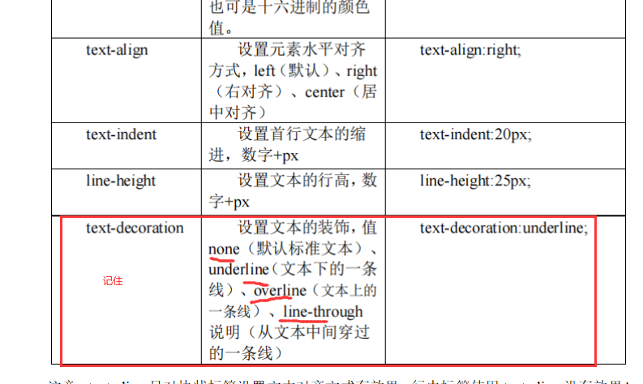

# 课程回顾

```html
引入方式三种：
第一种：行内css
<标签 style="属性：属性值;"></标签>

第二种：内嵌css
<head>
    
</head>
<style type="text/css">
    名称{
        属性：属性值;
    }
</style>
<body>
    
</body>

第三种：外部css
第一步：
创建独立css文件，后缀名.css
第二步：
<head>
    <link rel="stylesheet" href="css文件"/>
</head>

导入外部css文件
<style type="text/css">
	@import url("css路径")
</style>
```

# 课程目标

## 1 基本选择器 =========重点

## 2 高级选择器 =========重点

## 3 字体样式 ======= 读懂  自主应用

## 4 文本样式

## 5 背景样式

## 6 超链接伪类样式

## 7 鼠标样式

## 8 盒子模型

# 课程实施

## 1 选择器

### 1-1 选择器概念

```html
一段css代码起的名称,类似于java中存储数据后，对一块内存命名。
内嵌css：
XX{
 
}
选择器：一般不要使用中文、尽量不使用特殊符号、见词知意
```

### 1-2 CSS语法

```html
css的语法：选择器大小写敏感，内部属性名称大小写不敏感，一般使用小写字母。
选择器{
	属性名:属性值;
	属性名:属性值;
	属性名:属性值;
}
```

### 1-2 CSS分类

- 基本选择器：标签选择器、class选择器、ID选择器、通配符选择器

- 复合选择器：并集选择器、交集选择器、子集选择器、后代选择器、属性选择器【了解】....

## 2 基本选择器

### 2-1 开发步骤

```html
1.html设计出来
2.现有html基础上+css
```

### 2-2 标签选择器

```html
HTML标签{
	属性名:属性值;
}
细节：
1.选择器名称是HTML标签名称，所以不区分大小写
2.标签选择器，通过标签名称套用对应的css样式，标签选择器不需要程序单独调用
```

#### 课堂案例

```html
<!DOCTYPE html>
<html>
	<head>
		<meta charset="UTF-8">
		<title></title>
	</head>
	<style type="text/css">
		P{
			/*作用于p使用*/
			COLOR: red;
			font-size: 48px;
		}
		/*
		 * 字体24px  颜色黑色  文字下划线去掉
		 * */
		a{
			/*去掉下划线*/
			text-decoration: none;
			/*字体*/
			font-size: 24px;
			/*颜色*/
			color: gray;
			
		}
	</style>
	<body>
		<!--
			id选择器：JavaScript控制html标签，通过id获取对应的标签，id重复出现，
		-->
		<p>Hello,Css!!</p>
		<p>你好，层叠样式表!</p>
		<a href="http://www.baidu.com">百度</a>
		<a href="http://www.sina.com.cn">新浪</a>
		<h1>你好</h1>
	</body>
</html>

```




### 2-3 ID选择器

**ID在网页中唯一不重复的，如果页面中存在多个id属性值相同的标签，则ID选择器只会选择第一个使用该ID值的元素。**

```html
#自定义名称{
  属性:属性值;
}
细节：
1 ID选择器的名称第一个符号一定是#
2 ID选择器必须在标签上通过ID属性调用
```

#### 课堂案例

```html
<!DOCTYPE html>
<html>
	<head>
		<meta charset="UTF-8">
		<title></title>
	</head>
	<style type="text/css">
		/*
		 * 字体24px  颜色黑色  文字下划线去掉
		 * */
		#a1{
			/*去掉下划线*/
			text-decoration: none;
			/*字体*/
			font-size: 24px;
			/*颜色*/
			color: gray;
			
		}
		
		#A1{
			/*有删除线*/
			text-decoration: line-through;
			/*字体*/
			font-size: 12px;
			/*颜色*/
			color: black;
		}
	</style>
	<body>
		<!--
			id选择器：JavaScript控制html标签，通过id获取对应的标签，id重复出现，
		-->
		<p id="a1">Hello,Css!!</p>
		<p id="a1">你好，层叠样式表!</p>
		<a id="a1" href="http://www.baidu.com">aaaa</a>
		<a id="A1" href="http://www.sina.com.cn">新浪</a>
		<h1>你好</h1>
	</body>
</html>
```

### 2-4 class选择器

可以在不同的标签使用class属性引用class选择器（也称为类选择器）

#### 语法

```html
.自定义名称{
   属性:属性值;
}
细节：
1. 所有的类选择器的定义必须以.开始
2. 标签上需要使用class属性引用类选择器
```

#### 课堂案例

```html
<!DOCTYPE html>
<html>
	<head>
		<meta charset="UTF-8">
		<title></title>
	</head>
	<style type="text/css">
		/*
		 文字水平居中
		 垂直居中
		 首行缩进:24px
		 字体风格：倾斜
		 
		 边框样式：盒子模型
		 border:边框粗细 风格  颜色
		 * */
		.con{
			/*border-style: solid;*//*实心线*/
			/*border-color: black;*//*边框的颜色*/
			/*border-width: 1px;*//*边框的粗细*/
			border: dashed red 3px;
			/*文字水平居中*/
			/*text-align: center;*/
			
			/*设置宽度*/
			width: 50%;
			height: 400px;
			/*垂直居中*/
			line-height: 400px;/*行高和div高度设置一样*/
			
			/*文本样式*/
			text-indent: 12px;/*首行缩进*/
			font-style: italic;
		}
	</style>
	<body>
		<!--
			html中容器标签，容器标签特点：本身没有任何样式，主要是结合CSS使用
			div：块状标签
		
			span：行内标签
		-->
		<div class="con">
			hellohtml中容器标签，容器标签特点：本身没有任何样式，主要是结合CSS使用
			div：块状标签
		</div>
		<!--
			行内标签本身无宽无高，text-align对行内标签无效！！
		-->
		<span class="con">
			你好
		</span>
	</body>
</html>
```

### 2-5 通配符选择器

特点：一个网页上所有的标签都是用的样式

```html
*{/**表示所有的*/
	属性:属性值;
}
```

#### 课堂案例

```html
<!DOCTYPE html PUBLIC "-//W3C//DTD HTML 4.01//EN"
"http://www.w3.org/TR/html4/strict.dtd">

<html xmlns="http://www.w3.org/1999/xhtml" lang="en">
	<head>
		<meta http-equiv="Content-Type" content="text/html; charset=UTF-8" />
		<title></title>
	</head>
	<style type="text/css">
		*{
			/*鼠标外观：小手pointer*/
			cursor: pointer;
			/*文本下划线*/
			text-decoration: underline;
		}
	</style>
	<body>
		<p>你好</p>
		<h1>哈哈哈</h1>
		<span>中国</span>
	</body>
</html>

```

## 3 复合选择器

将两个或两个以上的基本选择器组合一起，就称为“复合选择器”

### 3-1 交集选择器

#### 语法格式

```html
<style type="text/css">
    标签选择器.类选择器{
        
    }
    标签选择器#id选择器{
        
    }
</style>
```

#### 课堂案例

```html
<!DOCTYPE html>
<html>
	<head>
		<meta charset="UTF-8">
		<title></title>
	</head>
	<style type="text/css">
		.skin{
			color: red;
			font-weight: bolder;
			/*text-decoration: underline;*/
		}
		div.skin{/*如何选择body的标签，使用下划线样式*/
			text-decoration: underline;
		}
		
		p#div2{
			background-color: greenyellow;
		}
	</style>
	<body>
		<div class="skin">
			hello
		</div>
		
		<div id="div2">
			world
		</div>
		
		<div class="skin">
			 你好
		</div>
		
		<div class="skin">
			CSS
		</div>
		
		
		<span class="skin">
			AAAAAAAAAAA
		</span>
		
		<p id="div2" class="skin">
			BBBBBBBBBBBBB
		</p>
	</body>
</html>
```

### 3-2 并集选择器

#### 语法格式

```html
<style type="text/css">
    选择器1,选择器2,选择器3{
        
    }
</style>
```

#### 课堂案例

```html
<!DOCTYPE html>
<html>
	<head>
		<meta charset="UTF-8">
		<title></title>
	</head>
	<style type="text/css">
		/*将类名skin  id是div2的标签,a标签、p标签，border：红色虚线*/
		#div2,.skin,a,p{
			border:dashed red 4px;
		}
	</style>
	<body>
		<p>aaaaa</p>
		<a href="http://www.baidu.com">百度</a>
		<div class="skin">
			hello
		</div>
		
		<div id="div2">
			world
		</div>
		
		<div class="skin">
			 你好
		</div>
		
		<div class="skin">
			CSS
		</div>
		
		
		<span class="skin">
			AAAAAAAAAAA
		</span>
		
		<p id="div2" class="skin">
			BBBBBBBBBBBBB
		</p>
	</body>
</html>

```

### 3-3 后代选择器

说明：侧重分析多个标签嵌套关系：外部标签称为祖先，其内部的所有的标签称为后代

#### 语法格式

```html
祖先选择器 后代选择器{
  属性:属性值;
}
```

#### 课堂案例

```html
<!DOCTYPE html>
<html>
	<head>
		<meta charset="UTF-8">
		<title></title>
	</head>
	<style type="text/css">
		/*id是menu的div，其所有的后代设置如下的样式：
		 * div宽度和高度 120px
		 * div设置边框样式 实心线 1px  black
		 * */
		/*div#father>div{
			width: 120px;
			height: 120px;
			border: solid 1px black;
			color: red;
			font-weight: bold;
		}*/
		div#menu>div>div>div>div{
			width: 120px;
			height: 120px;
			border: solid 1px black;
			color: red;
			font-weight: bold;
		}
	</style>
	<body>
		<!--祖先-->
		<div id="menu">
			<!--子-->
			<div>
				子
				<!--孙-->
				<div>
					孙
					<!--曾孙-->
					<div id="father">
						曾孙
						<!--玄孙-->
						<div>
							玄孙
						</div>
					</div>
				</div>
				
			</div>
		</div>
	</body>
</html>
```

### 3-4 子代选择器

说明：侧重分析多个标签嵌套关系：外部标签称为父，其内部的第一级标签称为子代

#### 语法格式

```html
父选择器>子代选择器{
  属性:属性值;
}
```

#### 课堂案例

```html
<!DOCTYPE html>
<html>
	<head>
		<meta charset="UTF-8">
		<title></title>
	</head>
	<style type="text/css">
		/*id是menu的div，其所有的后代设置如下的样式：
		 * div宽度和高度 120px
		 * div设置边框样式 实心线 1px  black
		 * */
		div#menu div{
			width: 120px;
			height: 120px;
			border: solid 1px black;
			color: red;
			font-weight: bold;
		}
	</style>
	<body>
		<!--祖先-->
		<div id="menu">
			<!--子-->
			<div>
				子
				<!--孙-->
				<div>
					孙
					<!--曾孙-->
					<div>
						曾孙
						<!--玄孙-->
						<div>
							玄孙
						</div>
					</div>
				</div>
				
			</div>
		</div>
	</body>
</html>
```

### 3-5 【理解】属性选择器

说明：选取带有指定属性的元素，或选取带有指定属性和值的元素

#### 语法格式

```html
<style type="text/css">
    /*包含指定属性*/
    基本选择器[属性]{}
  /*包含指定属性且指定值*/
    基本选择器[属性=值]{}
  /*包含指定属性且指定值以什么开头的*/
    基本选择器[属性^=值]{}
   /*包含指定属性且指定属性的值包含某一个值*/
    基本选择器[属性*=值]{}
   /*包含指定属性且指定值以什么结尾的*/
    基本选择器[属性$=值]{}
</style>
```

#### 课堂案例

```html
<!DOCTYPE html>
<html>
	<head>
		<meta charset="UTF-8">
		<title></title>
	</head>
	<style type="text/css">
		a[href]{
			cursor: help;
		}
		/*target，且属性值以n开始的字体变成粗体*/
		a[target^='n']{
			font-weight: bolder;
		}
		/*target,且属性值以f结束*/
		a[target$='f']{
			color: red;
		}
		/*target,包含e*/
		a[target*='e']{
			text-decoration: line-through;
		}
	</style>
	<body>
		<!--
			有href的a变成帮助的鼠标外观
		-->
		<a href="http://www.baidu.com" target="_self">交集选择器</a>
		<!--
			href:设置值，鼠标才会变成小手
		-->
    	<a target="new">并集选择器</a>
	</body>
</html>
```

## 各种样式表优先级

```html
<!DOCTYPE html>
<html>
	<head>
		<meta charset="UTF-8">
		<title></title>
		<!--导入外部css-->
		<link rel="stylesheet" href="css/css.css">
	</head>
	<style type="text/css">
		p{
			color:pink;
		}
	</style>
	<body>
		<!--
			从高及低：行内>内嵌>外部
		-->
		<p style="color: red;">Hello</p>
	</body>
</html>

```

## 基本选择器优先级

```html
<!DOCTYPE html>
<html>
	<head>
		<meta charset="UTF-8">
		<title></title>
		<!--导入外部css-->
		<!--<link rel="stylesheet" href="css/css.css">-->
	</head>
	<style type="text/css">
		p{
			color:pink;
		}
		#pp{
			color: black;
		}
		
		.ppp{
			color: blue;
		}
	</style>
	<body>
		<!--
			id class 标签选择器  从高及低：id>class>标签
		-->
		<p id="pp" class="ppp">Hello</p>
	</body>
</html>

```

## 文本样式

注意：text-align只对块状标签设置文本对齐方式有效果。行内标签使用text-align没有效果！

```html
/*文字水平居中*/
text-align: center;
/*垂直居中*/
line-height: 400px;/*行高和div高度设置一样*/
text-indent: 12px;/*首行缩进*/
color:red;/*字体颜色*/
/*有删除线*/
text-decoration: line-through;
```

## 字体样式

```html
font-style: italic;/*字体风格：斜体*/
/*字体*/
font-size: 12px;
font-family:隶书;/*字体名称*/
font-weight:bolder;/*粗体*/
```

## 鼠标样式

```html
cursor:pointer;
```

## 超链接伪类样式

```html
a:link{/*设置超链接默认效果：没有点击过的*/

}
a:hover{/*鼠标悬浮，但是不点击*/

}
a:active{/*鼠标按下不释放*/

}
a:visited{/*点击过的超链接样式*/

}
```

#### 课堂案例

```html
<!DOCTYPE html>
<html>
	<head>
		<meta charset="UTF-8">
		<title></title>
	</head>
	<style type="text/css">
		/*默认效果：字体灰色 不要下划线 重点*/
		a:link{
			color: gray;
			text-decoration: none;
		}
		/*按下不松手：字体34px 去掉下划线*/
		a:active{
			font-size: 48px;
			text-decoration: none;
		}
		/*悬浮：字体红色  出现下划线*/
		a:hover{
			color: red;
			text-decoration: underline;
		}
		
		/*访问过：出现下划线*/
		a:visited{
			text-decoration: underline;
		}
	</style>
	<body>
		<a href="http://www.baidu.com" target="_blank">百度</a>
	</body>
</html>
```


### CSS精灵 ============== 设计


## 快速生成表格的快捷键

```html
HBuilder中快速生成多行表格的语法：table>tr*行数>td*列数
```

# 课程总结

## 1 属性选择器

## 2 css样式表的优先级 基本选择器优先级

## 3 伪类选择器

## 4 选择器：基本选择器  复合选择器

# 预习安排

JavaScript：

基础语法：数据类型、变量定义、运算符、流程控制语句、数组

***DOM操作：事件和函数***

BOM操作：


