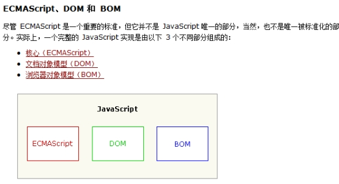
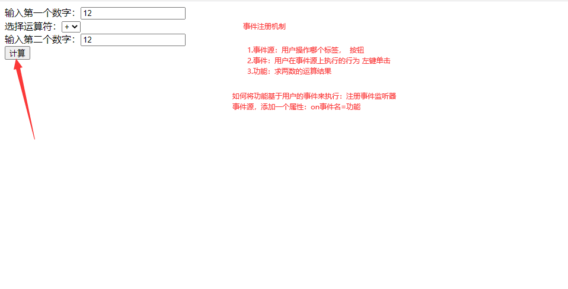
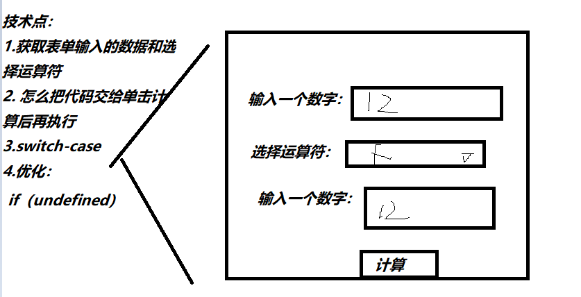
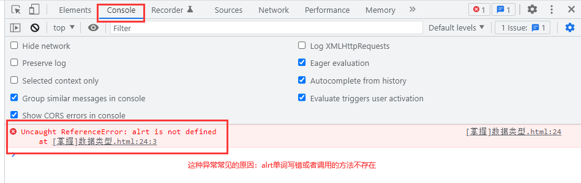
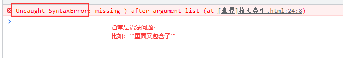
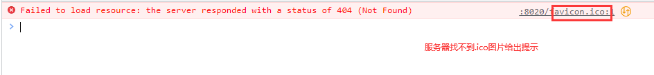

# 课程回顾

## 1 坑点

````html
//目前新版本的FF或Google浏览器，已经不再支持a:visited选择器中提供其他的样式设置，所以可以将a:visited理解成只能提供“对于访问过的链接”进行字体颜色的外观设置
a:visited{
   color:字体颜色
}
````

## 2 css ****

​	#开始选择器称为id选择器

.开始选择器称为class选择器

HTML标签作为选择器名称，称为标签选择器

*：通配符选择器


复合选择器：

标签选择器+其他选择器（id、class选择器） 交集选择器

选择器，选择器... 并集选择器

祖先选择器  后代选择器 后代选择器

祖先选择器>子代选择器 后代选择器

# 课程目标

## 1 JavaScript概念、组成和作用 === 理解

## 2 JavaScript引入方式 ==== 掌握

## 3 数据类型、运算符、变量定义、流程控制语句 === 掌握

## 4 事件注册机制 === 理解

# 课程实施

## 1 JavaScript概述

JavaScript和java没有任何关系：

```html
JavaScript与java不同
a)Netscape公司开发的一种脚本语言，并且可在所有主要的浏览器中运行
i.IE、Firefox、Chorme、Opera
Java是sun公司的，现在是Oracle
b)JavaScript是一种弱类型语言，java是强类型语言。
i.比如java中定义变量：int i=”10” wrong
ii.JavaScript定义变量：var i=”10”  right
c)JavaScript是基于对象的，java是面向对象的。
JavaScript只需要解析就可以执行，而java需要先编译成字节码文件再执行。
结论：
Netscape 发明了 JavaScript
Javascript与java没有任何关系。有些编程思想与java很相似
形同：雷锋和雷峰塔没有关系。
```

### 1-1 JavaScript作用

基于html实现用户交互的功能

### 1-2 JavaScript概念

应用于客户端（指浏览器），基于对象和事件驱动的脚本语言

基于对象：JavaScript提供对象，不用程序员自己创建对象

事件驱动：基于用户的操作，代码才会执行。

### 1-3 JavaScript组成



****ECMAScript：JavaScript基础（数据类型、语法、流程控制语句）

- ECMA: 欧洲计算机协会
- 兼容性问题：同一段代码，在不同的浏览器执行的效果不一样

DOM：文档对象模型（Document Object Model)。重点

- 功能：网页标签的控制能力

- 存在一些兼容性问题，JQuery逐渐解决

BOM: 浏览器对象模型（Browser Object Model)

- BOM研究浏览器，浏览器因为出身不同，存在很多的兼容性问题

## 2 JavaScript嵌入方式

### HelloWorld案例：弹框HelloWorld

### 2-1 行内JavaScript【掌握】

```html
<!DOCTYPE html>
<html>
	<head>
		<meta charset="utf-8" />
		<title></title>
	</head>
	<body>
		<!--行内JavaScript：理解  使用特点：简短的一段代码，只需要使用一次，可以考虑行内-->
		<input type="button" onclick="alert('helloWorld')" value="点我试一试" />
	</body>
</html>
```

### 2-2 内嵌JavaScript【掌握】

```html
<!DOCTYPE html>
<html>
	<head>
		<meta charset="utf-8" />
		<title></title>
	</head>
	<!--内嵌JavaScript-->
	<script type="text/javascript">
		//弹框：helloWorld
//		window.alert("HelloWorld");
//		alert("弹框希望现实的内容");
	</script>
	<body>
		
	</body>
</html>

```

### 2-3 外部JavaScript【掌握】

#### 第一步：创建独立的JavaScript文件，后缀名为.js

```javascript
window.alert("Helloworld");
```

#### 第二步：在html中引入JavaScript

```html
<!DOCTYPE html>
<html>
	<head>
		<meta charset="utf-8" />
		<title></title>
		<!--引入外部js-->
		<!--
			src:引入外部js的路径
			type:建议不要省略，指定引用js在浏览器中语法解析格式
		-->
		<script type="text/javascript" src="js/hello.js" ></script>
	</head>
</html>
```

## 3 ECMAScript的使用

### ECMAScript的语法书写规范：

```html
javascript有以下几个要求：
1.使用JavaScript关键字，严格区分大小写

2.变量定义不需要指明数据类型，js弱类型语言的特点

3.每行代码建议;结束

4.JavaScript注释：
单行：//
多行：/**/
```

### 3-1 数据类型

```html
javascript中基本类型也称为原始类型，一共五种：
number:数值，包含整数、小数

string:文本。包含字符串、字符  要求使用“” 或''引起来
举例：“hello"  'hello'

boolean:布尔类型 true false
注意：JavaScript中所有非0 非null 非undefined 非''都是true

undefined:变量定义没有赋值。
举例：
1.定义变量，伪代码
定义  a;//a没有使用=赋值，a类型划分为undefined

5.null：表示对象是不存在
提示：JavaScript类型设计，设计错误！
```

### 补充：typeof运算符，类似java中instanceof

```html
typeof  变量或常量，typeof执行结果是：实际类型
举例：typeof(12):number
```

### 3-2 变量定义

```javascript
var 变量名=值;//定义变量，JavaScript的变量类型由值确定
说明：变量名
建议：遵循java变量字符组成规则
建议匈牙利命名方式：
 java中 int age=12;
 javascript中 var   dAge=12.5;
              var  objStu=学生对象;
```

#### 课堂案例

```html
<!DOCTYPE html>
<html>
	<head>
		<meta charset="UTF-8">
		<title></title>
	</head>
	<script type="text/javascript">
		//1.定义变量，保存整数
		var iNum=24;
		iNum=34.56;//修改变量的值，JavaScript是弱类型，所以变量可以随意修改，且类型不限制
//		alert("iNum变量中保存的数据类型是："+typeof iNum);//number可以表示整数、小数
//		alert("iNum变量中保存的数据类型是："+typeof(iNum));
		
		var a;//定义变量，没有赋值
//		alert("a变量中保存的数据类型是："+typeof a);//undefined

		var obj=null;//对象不存在，跟java的null是一个意思
//		alert("obj保存的数据类型是："+typeof obj);//object

		var strName='张';
		alert("strName保存的数据类型是："+typeof strName);//string包括字符串和字符
		
		var bool=true;
		alert("bool保存的数据类型是："+typeof bool);//boolean
	</script>
	<body>
	</body>
</html>
```

### 小结：null和undefined有什么区别？

```html
变量定义了未初始化是undefined，
访问对象不存在的属性也是undefined

举例：
var obj=new Object();
obj.name;//name可能存在，也可能不存在。如果obj中没有name属性，obj.name则显示结果undefined

但是如果var obj没有指向任何对象，那么obj访问的对象不存在，就是null
```

### 3-3 运算符

#### 一元运算符

```html
+ -
++
--
```

**++ --放在输出语句或者表达式，++ --前面先运算符后输出   ++ --后面先输出再运算**

#### 输出语句

```html
document.write();//html网页上输出内容，很少用
console.log();//F12开发者工具：控制台输出内容
```

#### 课堂案例

```html
<!DOCTYPE html>
<html>
	<head>
		<meta charset="UTF-8">
		<title></title>
	</head>
	<script type="text/javascript">
		//1.定义变量
		var a=10;
//		document.write(++a);//少用
//		document.write(a++);
		console.log(--a);//9 推荐方式
		console.log(a);//9
		console.log(a--);//9
		console.log(a);//8
	</script>
	<body>
	</body>
</html>
```


#### 二元运算符

```html
算术运算符
  + - * / %(模运算)
细节：
1./ 整除就是整数结果，不能整除就是小数结果  %一定整除求余
2.除了+，其他运算符可以自动将string转换number实现算术运算
3.+ string和number之间使用+，用作连接符号 
4. string提供的字符串不是可以转换的格式，算术运算的结果NaN

关系运算符
  > >= < <= == ===(读作：恒等于) != !==(读作：恒不等)
细节：
===是比较两个变量类型和值。只有类型和值都一样，执行结果才是true
== 比较两个变量的值。只要两个变量值一样，执行结果就是true

逻辑运算符  同java
 && || ！

赋值运算符
=
+= 
-=
*=
/=
%=
```

#### 课堂案例

- 算术运算符

```html
<!DOCTYPE html>
<html>
	<head>
		<meta charset="UTF-8">
		<title></title>
	</head>
	<script type="text/javascript">
//		var iNum1=15;
		var strNum1="十五";//NaN:not a Number
		var iNum2=2;
		//+用在string和数值，连接符号作用
		console.log(strNum1+iNum2);//17
		//- * / %都会将string先转换为number
		// string不是可以转换的字符串，统一用NaN作为结果
		console.log(strNum1-iNum2);//13
		console.log(strNum1*iNum2);//30
		//js中，整除就是整数，不能整除就是小数
		console.log(strNum1/iNum2);//7.5
		//求余数：小数求余没有意义。整除求余
		console.log(strNum1%iNum2);//1
	</script>
	<body>
	</body>
</html>
```

- 关系运算符

```html
<!DOCTYPE html>
<html>
	<head>
		<meta charset="UTF-8">
		<title></title>
	</head>
	<script type="text/javascript">
	var strNum="15";
	var iNum=15;
	//==:只关心两个变量的值一致true，
	console.log(strNum==iNum);//true
	//恒等于：先比较数据类型，类型一致，再比较值，值一样，true。
	console.log(strNum===iNum);//false
	
	console.log(strNum!=iNum);//false
	console.log(strNum!==iNum);//true
	</script>
	<body>
	</body>
</html>

```

#### 三元运算符

```html
?: 同java
```

### 学生练习：给一个四位数，个位、十位、百位、千位

解决技术难点：Scanner

解决方案：prompt("提示语句",如果用户不输入值，可以设置默认值)

实现数据类型转换的内置函数：

- parseInt():实现其他类型转换为整数  
- parseFloat():实现其他类型转换为小数

##### 参考代码

```html
<!DOCTYPE html>
<html>
	<head>
		<meta charset="UTF-8">
		<title></title>
	</head>
	<script type="text/javascript">
//	var cardNo=用户输入;
	var carNo=prompt("请输入一个四位卡号：",1111);//1111是默认值，用户如果没有提供数据，cardNo=1111
        
    var cardNo=1234;
	var qian=cardNo/1000;
	var iQian=parseInt(qian);//parseInt(String,小数)==>整数
	//javascript:整数和小数都是number，小数转换为整数，必须借助js提供内置函数(函数其实就是方法)
	//parseFloat(字符串)：小数
	var bai=parseInt(cardNo%1000/100);
	var shi=parseInt(cardNo%100/10);
	var ge=cardNo%10;
	alert(iQian+","+bai+","+shi+","+ge);
	</script>
	<body>
	</body>
</html>
```

### 3-4 流程控制语句

#### 顺序结构 ===从上往下依次执行

#### 选择结构 === 完全同java

```html
if
if-else
if-else if-else if-..-else
switch-case

```

#### 循环结构 ===完全同java

```html
do-while
while
for

嵌套循环：for{ for(){}}

continue
break
return
```

#### 案例一：判断用户年龄是否大于18岁

- 针对undefined  null  空串 0判断的语句

```html
<!DOCTYPE html>
<html>
	<head>
		<meta charset="UTF-8">
		<title></title>
	</head>
	<script type="text/javascript">
		//获取用户的年龄
		var iAge;
		if(iAge){//非0 非null 非undefined 非'' 统一都可以当做true解析
			alert("学生年龄是："+iAge);
		}else{
			alert("进入false执行，判断条件iAge="+iAge);
		}
	</script>
	<body>
	</body>
</html>
```

- if语句实现

```html
<!DOCTYPE html>
<html>
	<head>
		<meta charset="UTF-8">
		<title></title>
	</head>
	<script type="text/javascript">
		//获取用户的年龄
		var iAge=prompt("请输入学生的年纪：");//prompt()返回string类型
		//0 null undefined  ''都是false，其他都是true
		alert(iAge);//prompt如果没有输入任何数据，iAge=''空字符串
		//iAge不是undefined、不是''，且大于18岁，输出成年
		if(iAge && iAge>=18){//
			alert("成年了");
		}
	</script>
	<body>
	</body>
</html>

```

- 嵌套if实现

```html
<!DOCTYPE html>
<html>
	<head>
		<meta charset="UTF-8">
		<title></title>
	</head>
	<script type="text/javascript">
		//获取用户的年龄
		var iAge=prompt("请输入学生的年纪：");//prompt()返回string类型
		//0 null undefined  ''都是false，其他都是true
		alert(iAge);		
		if(iAge){//true
			if(iAge>=18){
				alert("成年了")
			}
		}		
	</script>
	<body>
	</body>
</html>

```

- if-else实现

```html
<!DOCTYPE html>
<html>
	<head>
		<meta charset="UTF-8">
		<title></title>
	</head>
	<script type="text/javascript">
		//获取用户的年龄
		var iAge=prompt("请输入学生的年纪：");
		//0 null undefined  ''都是false，其他都是true
		alert(iAge);
		//iAge不是undefined，且大于18岁，输出成年
		//undefined本身if(undefined)=等价于=>if(false)
		if(!iAge){//一个变量是不是undefined，不能使用==undefined
			alert("年龄输入不合法！");
		}else{
			if(iAge>=18){
				alert("成年了");
			}
		}
	</script>
	<body>
	</body>
</html>
```

#### 案例：输出1-10之间偶数

```html
<!DOCTYPE html>
<html>
	<head>
		<meta charset="UTF-8">
		<title></title>
	</head>
	<script type="text/javascript">
		for(var i=0;i<=10;i++){
			if(i%2!=0){
				continue;
			}
			document.write(i);
		}
	</script>
	<body>
	</body>
</html>
```

## 4 事件注册机制



### 课堂案例



```html
<!DOCTYPE html>
<html>
	<head>
		<meta charset="UTF-8">
		<title></title>
	</head>
	<script type="text/javascript">
		function getResult(){
			//1.获取两个数据  value获取值都是string
			var num1=document.getElementById("txtNum1").value;//表单获取用户输入的值或选择的值都是value
			var num2=document.getElementById("txtNum2").value;//
			//2.获取运算符
			var op=document.getElementById("selOp").value;//
			//非法值验证
			
			//3.求结果
			switch (op){
				case '+':
					//加法
					alert(parseInt(num1)+parseInt(num2));
					break;
				default:
					break;
			}
		}
	</script>
	<body>
		输入第一个数字：<input id="txtNum1" type="text" /><br />
		选择运算符：<select id="selOp">
			<option>+</option>
		</select><br />
		输入第二个数字：<input id="txtNum2" type="text" /><br />
		<!--
			onClick:称为事件监听器
			在标签上，添加监听器并设置对应功能，称为事件监听机制
		-->
		<input type="button" onclick="getResult()" value="计算" />
	</body>
</html>
```

## 常见异常：









# 课程总结

理解：事件监听机制

重点：

数据类型、变量定义、运算符使用、流程控制语句

js：=== !==   if(undefined){}

# 预习

JavaScript常用对象：

Math  String  Date  Array  Function其实就是java中方法    RegExp（正则表达式）

DOM操作