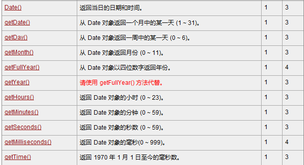

# 课程回顾

## 1 数据类型，变量

## 2 运算符

## 3 流程控制

## 课后作业

#### 计算器：添加了非空验证和非数值格式验证

````html
<!DOCTYPE html>
<html>
	<head>
		<meta charset="UTF-8">
		<title></title>
	</head>
	<script type="text/javascript">
		function getResult(){
			//1.获取两个数据  value获取值都是string
			var num1=document.getElementById("txtNum1").value;//表单获取用户输入的值或选择的值都是value
//			alert(num1.length);//没有任何显示。不是null
			var num2=document.getElementById("txtNum2").value;//
//			alert(num2)
			//2.获取运算符
			var op=document.getElementById("selOp").value;//
			//验证
			//非空验证
//			if(num1==null ||num1=='')
			if(!num1||!num2){
				alert("必须填写数字1和数字2");
				return;
			}
			//验证num1和num2是不是数值 isNaN():boolean true-不是数字  false-是数字  is Not a Number?
//			alert("num1不是数字吗？"+isNaN(num1))
			if(isNaN(num1)||isNaN(num2)){
				alert("必须提供数值才能进行算术运算");
				return;
			}
			//3.求结果
			switch (op){
				case '+':
					//加法
					alert(parseInt(num1)+parseInt(num2));
					break;
				default:
					break;
			}
		}
	</script>
	<body>
		输入第一个数字：<input id="txtNum1" type="text" /><br />
		选择运算符：<select id="selOp">
			<option>+</option>
		</select><br />
		输入第二个数字：<input id="txtNum2" type="text" /><br />
		<!--
			onClick:称为事件监听器
			在标签上，添加监听器并设置对应功能，称为事件监听机制
			
		-->
		<input type="button" onclick="getResult()" value="计算" />
	</body>
</html>
````

#### 打印空心菱形

```html
<!DOCTYPE html>
<html>

	<head>
		<meta charset="UTF-8">
		<title></title>
	</head>
	<script type="text/javascript">
		function gettt() {
			var a = document.getElementById('num').value;//9
			if(a % 2 != 0) {
				for(var i = (parseInt(a/-2)); i <= parseInt(a / 2); i++) {
					for(var j = 1; j<=Math.abs(i); j++) {
						//document.write()向html网页输出数据
						document.write("&nbsp;");
					}
					for(var k = 1; k <= a - 2*Math.abs(i); k++) {
						//如果不是第一个* 且不是最后一个*，不打印*
						if(k!=1 && k!=a - 2*Math.abs(i)){
							document.write("&nbsp;");
							continue;
						}
						document.write("*");
					}
					document.write('<br/>');
				}
			} else {
				prompt('请输入奇数！', 9);
			}

		}
	</script>

	<body>
		你要打一个多大的菱形？
		<input type="text" name="num" id="num" />
		<input type="button" id="right" onclick="gettt()" value="确认" />
		
	</body>

</html>
```

# 课程目标

## 1 Math ==== 掌握

## 2 String ==== 掌握

## 3 Array ==== 掌握

## 4 Function函数 ==== 掌握

## 5 RegExp ==== 掌握

## 6 Date====掌握

## 7 表单验证思路 ==== 掌握

# 课程实施

## 1 Math对象 === java完全一样


### 需求：水仙花

```html
技能点：Math.pow(a,b)
```

#### 参考代码

```html
<!DOCTYPE html>
<html>
	<head>
		<meta charset="UTF-8">
		<title></title>
	</head>
	<script type="text/javascript">
//		Math.pow()+Math.pow()+Math.pow();
		for(var i=100;i<1000;i++){
			with(Math){
				//个位
				var geWei=floor(i%10);//
				//十位
				var shiWei=floor(i%100/10);
				//百位
				var baiWei=floor(i/100);
				if(pow(geWei,3)+pow(shiWei,3)+pow(baiWei,3)===i){
					document.write(i+"&nbsp;");	
				}
			}
			
		}
		/*with(Math){
			pow()
		}*/
	</script>
	<body>
	</body>
</html>
```

### 补充：with()代码块用法


## 2 Date对象======类似java中Calendar对象 

### 2-1 创建日期对象

```html
new Date();//获取当前时间
```

### 2-2 获取和设置日期的方法




### 2-3 日期转换为格式良好的字符串方法


### 2-4 课堂案例

```html
<!DOCTYPE html>
<html>
	<head>
		<meta charset="UTF-8">
		<title></title>
	</head>
	<script type="text/javascript">
	var now=new Date();
	//now==>格式良好的日期格式
	/*var strDate=now.toLocaleString();
	document.write(strDate);*/
	//获取日期的各个部分，自己拼接字符串
	
	with(now){
		//now设置昨天
		//1.setXX
//		now.setDate(19);
		//2.获取当前时间距离1970...的毫秒值
//		var milNum=now.getTime();
//		var yesMilNu=milNum-24*60*60*1000*2;
//		now.setTime(yesMilNu);
		//3.指定时间转换为毫秒值
		var aaa=Date.parse("2022-01-1");
		now.setTime(aaa);
		var year=getFullYear();//年份
		var month=getMonth()+1;//月份（0-11）
		var date=getDate();//日期
		var weekday=getDay();//星期
		var hour=getHours();//时
		var minute=getMinutes();//分
		var seconde=getSeconds();//秒
		var milSecond=getMilliseconds();//毫秒
		
		//switch-case
		document.write(year+"年"+month+"月"+date+"日  星期"+weekday);
	}
	</script>
	<body>
	</body>
</html>
```

## 3 String对象 ========= java大部分方法一样


```html
substr(startIndex,count):startIndex开始截取的字符串下标位置，count：截取字符串的字符个数
substring(startIndex,endIndex):startIndex开始截取的字符串下标位置，endIndex：结束截取下标位置
```

### 课堂案例

```html
var str="helloWorld";
分别使用substr()和substring()两种方式截取 llo
```

#### 参考代码

```html
<!DOCTYPE html>
<html>
	<head>
		<meta charset="UTF-8">
		<title></title>
	</head>
	<script type="text/javascript">
	//substr()和subString()
	//1.定义字符串对象
	var objStr="helloWorld";
	//2.截取lloWo
	//2-1 substring(startIndex,endIndex)
	var result=objStr.substring(objStr.indexOf('l'),objStr.lastIndexOf('o')+1);
	document.write(result);
	
	document.write("<br/>");
	
	//2-2 substr(startIndex,count)
	result=objStr.substr(objStr.indexOf('l'),"lloWo".length);
	document.write(result);
	</script>
	<body>
	</body>
</html>
```

## 4 Array对象=====类似java中的集合，难点

数组：一种用来保存多个数据的类型。

数组：长度可变、类型可以任意的

### 4-1 Array的定义

```html
方式一：
  var arr=[元素1,元素2,...,元素n];//由构造方法中提供的元素决定数组初始长度
方式二：
  var arr2=new Array(长度);//数组初始长度
方式三：
  var arr3=new Array(元素1,元素2,...,元素n);//由构造方法中提供的元素决定数组初始长度
```

### 4-2 获取和设置数据

```html
数组名[下标];//获取下标位置的元素
数组名[下标]=值;//设置下标位置的元素
```

### 4-4 循环方式

```html
普通for
for(var i=0;i<数组名.length;i++){
                               
}

扩展：
for-in语句
foreach()
```

### 4-5 Array提供的方法


### 4-6 课堂案例

- 数组基本用法：定义、赋值、取值、普通for

```html
<!DOCTYPE html>
<html>
	<head>
		<meta charset="UTF-8">
		<title></title>
	</head>
	<script type="text/javascript">
	//长度可变、类型可以不一样
	//定义数组，长度初始值4
	var arr=new Array(4);//数组每一个下标位置对应undefined
	//给下标是99的位置存入数据HelloWorld
	arr[0]=true;
	arr[1]=12;
	arr[2]=45.67;
	//下标的范围[0,N-1]
	arr[99]="helloWorld";
	
	//输出数组长度
//	alert("数组长度是："+arr.length);//100
//	alert("第98个数据是："+arr[97]);//undefined

	//循环for
	for(var i=0;i<arr.length;i++){
		document.write(arr[i]+"&nbsp;")
	}
	</script>
	<body>
	</body>
</html>
```

- 嵌套数组

```html
<!DOCTYPE html>
<html>
	<head>
		<meta charset="UTF-8">
		<title></title>
	</head>
	<script type="text/javascript">
	//1.定义嵌套数组
	var arr=new Array([0,0,0],[1,1,1],[2,2,3,4,5]);
	//2.输出数组所有的数据
	for(var i=0;i<arr.length;i++){
//		var temp=arr[i];//i获取的数据又是数组
		for(var j in arr[i]){
			document.write(arr[i][j]);
		}
		//换行
		document.write("<br/>");
	}
	</script>
	<body>
	</body>
</html>
```

- 数组循环方式の冒泡排序为例

```html
<!DOCTYPE html>
<html>
	<head>
		<meta charset="UTF-8">
		<title></title>
	</head>
	<script type="text/javascript">
		//1.定义数组
		var arr=[7,2,-90,44,89];
	
		//2.排序前输出
		//特点：for-in获取所有的下标
		for(var i in arr){
			document.write(arr[i]+",");
		}
		
		//排序
		for(var i=0;i<arr.length-1;i++){
			for(var j=0;j<arr.length-1-i;j++){
				if(arr[j]>arr[j+1]){
					//交换
					var temp=arr[j];
					arr[j]=arr[j+1];
					arr[j+1]=temp;
				}
			}
		}
		document.write("<br />");
		//3.排序后输出
		/*for(var index in arr){
			document.write(arr[index]+",");
		}*/
		//4.了解
		//element:元素  
		//index:下标
		//arr:要循环的数组变量名
		arr.forEach(function(element,index,arr){
			document.write(index+": "+element+",");
		});
	</script>
	<body>
	</body>
</html>
```

### 补充：


### 4-7 嵌套数组

```html
方式一：
  var arr=[[元素1,元素2],...,[元素n]];//由构造方法中提供的元素决定数组初始长度
方式二：
  var arr2=new Array(长度);//数组初始长度
   arr2[0]=new Array(3);
   arr2[1]=[];
   arr2[2]=new Array(1,3,3,4,4)
方式三：
//  var arr3=new Array([元素1],[元素2],...,元素n);//由构造方法中提供的元素决定数组初始长度

嵌套数组：模拟Map的特点：key--value
```

#### 课堂案例：

```html
使用数组保存一个国家对应的省份、每个省份对应的城市、每个城市对应的县/区
```

##### 参考答案

```html
<!DOCTYPE html>
<html>
	<head>
		<meta charset="UTF-8">
		<title></title>
	</head>
	<script type="text/javascript">
		//定义数组保存所有的省
		var province=["湖北省","河南省","湖南省","河北省"];
		//使用省份名称为key，存入该省对应的市
		province["湖北省"]=["武汉市","黄冈市","襄阳市","荆州市"];
		province["河南省"]=["郑州市","信阳市","洛阳市","驻马店"];
		province["湖南省"]=["长沙市","郴州市","岳阳市","衡阳市"];
		province["河北省"]=["石家庄市","邯郸市","秦皇岛市"];
		//一个格式，实现市和区的对应
		province["武汉市"]=["洪山区","武昌区","汉口区"];
		province["襄阳市"]=["襄州区","宜城市","谷城市"];
		province["长沙市"]=["羊区","人区"];
		
		//输出:
		/*
		 * 湖北省：
		 *    武汉市：洪山区
		 * 	     荆州市：
		 * 河南省：
		 *    郑州市：。。。。。
		 */
		for(var i=0;i<province.length;i++){//province.length：所有的省
			//变量存储
			var provinceStr=province[i];
			document.write(provinceStr+":<br/>");
			//获取该省对应的市
			var cities=province[provinceStr]
			for(var j=0;j<cities.length;j++){//cities.length是一个省所有的市的个数
				var cityStr=cities[j];
				document.write(cityStr+":");
				//获取该市对应的所有的县区
				var regions=province[cityStr];
				for(){
					//
				}
			}
			
		}
	</script>
	<body>
	</body>
</html>
```

### 5-1 定义语法

```html
function 函数名(形参列表){
	//方法体
	return 值;
}
```

### 5-2 方法调用

```html
var 变量名=函数名(实参列表)//有返回值

函数名(实参列表);//无返回值
举例：
 alert()
 prompt():String
 isNaN():boolean
```

### 5-3 课堂案例

```html
<!DOCTYPE html>
<html>
	<head>
		<meta charset="UTF-8">
		<title></title>
	</head>
	
	<body>
		<!--
			设置文本框不能操作：disabled="disabled"
			
		-->
		<input type="text" id="txtSum" disabled="disabled" />
	</body>
	<script type="text/javascript">
		//JavaScript不支持重载的，所以重载模拟的！！
		//如果同一个html网页，出现同名方法，后面的方法会自动覆盖上面的方法
		//求两个整数和
		//形参不需要类型，只需要定义变量名和个数
		function add(a,b){
			//arguments:每个函数中有一个arguments属性，保存实参列表,arguments就是Array！！
//			alert("两个参数方法")
//			var sum=a+b;
			var sum=0;
			for(var i=0;i<arguments.length;i++){
				sum+=arguments[i];
			}
			return sum;
//			document.write(sum);
		}
		/*function add(a,b,c){
			alert("三个参数方法")
			var sum=a+b;
			document.write(sum);
		}*/
		//调用
//		add(12.45,"abc");
		var result=add(12.45,12,3,4,5);
		//获取text 
		var objTxtSum=document.getElementById("txtSum");
		//text.value=计算结果
		objTxtSum.value=result;
//		alert(result);
//		add(12,23,45,89);
	</script>
</html>
```


## 6 RegExp对象


## 7 表单验证思路


# 课程总结

Math  Date String

 Array --数组，类似java集合

Function-- 定义和调用


# 预习安排

DOM: 获取html上标签、操作标签（插入、删除、修改、克隆）

全选 全不选 反选

三级联动