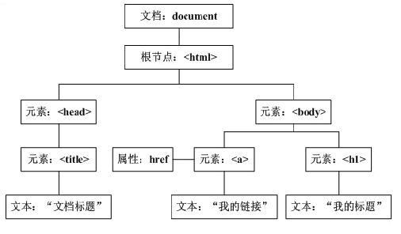
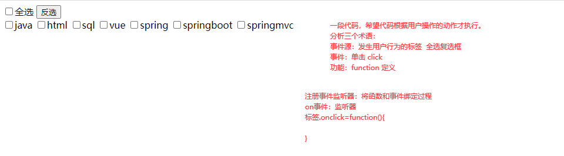
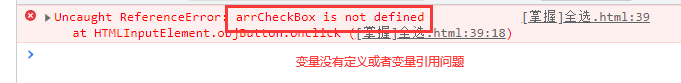

# 课程回顾

## 1 Math+with()

## 2 Date

```html
js提供方法：
toLocalString()
toLocalDateString()
toLocalTimeString()

js提供getter:
getFullYear()
getMonth()
getDate()
getDay()
getHours()
...
```

## 3 String

```html
substr()
subString()
细节：
没有equals()。比较两个字符串是否相等：==
不区分大小写比较两个字符串是否向？？toUpperCase() toLowerCase() 
```

## 4 Array

```html
类似java一样数组使用
循环方式：
普通for
for-in
foreach(fun:Function) ============= 
```

## 5 Function--函数

```html
Function是一种数据类型
function 函数名(形参列表){
	//函数体
	//return 值;
}

调用：
var 变量=函数名(实参列表)
arguments模拟java的重载模式
```

# 课程目标

## 1 Function ==== 掌握

## 2 RegExp ==== 理解

## 3 DOM ==== 掌握 难点

## 4 常用事件 ==== 掌握

# 课程实施

## 1 Function函数

```html
举例：
var arr=new Array(4);
//很少使用
var fun=new Function(“形参列表”，"函数体");
```

### 课堂案例：演示Function类型创建函数以及调用方式

```html
<!DOCTYPE html>
<html>
	<head>
		<meta charset="utf-8" />
		<title></title>
	</head>
	
	<script type="text/javascript">
		//使用Function类型定义函数,缺点：阅读性差
		var add=new Function("alert('hello');");
		//调用Function对象
		add();//调用无参无返回值
		//使用Function类型定义带参有返回值的函数
		var add2=new Function("a,b","return a+b;");
		//调用Function对象
		var sum=add2(12,12);
		alert(sum);
	</script>
	<body>
	</body>	
</html>
```

### 1-1 匿名函数

特点：没有函数名。只能使用一次。

JavaScript中，匿名函数通常和DOM结合使用，完成标签事件的注册。

#### 匿名函数的定义方式

```javascript
function(){
    //函数体
    return 值;
}
```

## 2 事件

### 2-1 概念

事件是指：网页上面，用户发生的行为或动作

### 2-2 常见事件

```html
load:加载，
window.onload表示意思是整个html网页在浏览器完全加载完毕后才会触发的一个事件。
click:单击
focus: 获取焦点 举例：文本框获取鼠标，进入等待输入的状态
change:用户选项发生改变触发。一般用于select使用
```

### 2-3 使用匿名函数给事件指定功能

#### 给window添加onload监听器事件

```html
<!DOCTYPE html>
<html>
	<head>
		<meta charset="utf-8" />
		<title></title>
	</head>
	
	<script type="text/javascript">
		//处理body的onload监听器，alert('')弹框
		//window指html窗口
		//
		window.onload=function(){
			//html网页在浏览器上已经完全加载完毕了
			alert("aaa");
		}
	</script>
	<body>
	</body>
</html>
```

#### 给按钮添加onclick监听器事件

```html
<!DOCTYPE html>
<html>
	<head>
		<meta charset="utf-8" />
		<title></title>
	</head>
	
	<script type="text/javascript">
		//处理body的onload监听器，alert('')弹框
		//window指html窗口
		//
		window.onload=function(){
			//获取id=btn的标签对象
			var aaa=document.getElementById("btn");
			// aaa.onclick=function(){}等价于 onclick="add()"代码的效果
			aaa.onclick=function(){
				//按钮添加功能
				alert("您单击了按钮");
			}
		}
	</script>
	<body>
		<input id="btn" type="button" value="点击我看看"/>
	</body>
	
</html>

```


## 3 DOM操作

### 3-1 DOM概念和作用

```html
DOM: Document  Object  Model  文档对象模型
```

#### DOM作用

```html
操作HTML文档上面所有的对象
```

### 3-2 DOM模型



```html
DOM模型将htlm网页以对象的模式进行管理的结构
```

### 3-4 DOM使用

#### 获取对象的方式

```html
根据标签的id属性获取唯一的一个html标签对象
getElementById(id:string):Element
根据标签的class属性获取一组html标签对象
getElementsByClassName( lassName:string):ElementList
根据标签名称获取一组html标签对象
getElementsByTagName(tagName:string):ElementList
根据name属性获取一组html标签对象
getElementsByName(name:String):ElementList
```

#### 课堂案例：全选/全不选/反选



```html
<!DOCTYPE html>
<html>
	<head>
		<meta charset="UTF-8">
		<title></title>
	</head>
	<script type="text/javascript">
	window.onload=function(){
		//注册事件监听器
		//1 获取事件源 全选按钮
		var objCheckbox=document.getElementById("chkAll");
		//2 注册事件监听器
		objCheckbox.onclick=function(){
			//1.获取全选按钮的checked属性值
//			var strChecked=objCheckbox.checked;//objCheckebox是html上一个标签，每个标签有哪些可以点击出来的属性：
			//2.获取所有的科目，将所有的科目的checked设置成第一步获取的属性值
			//2-1 获取所有的科目
			var arrCheckBox=document.getElementsByName("subject");
			//2-2 设置与全选的checked属性值一样的
			for(var i=0;i<arrCheckBox.length;i++){
				arrCheckBox[i].checked=objCheckbox.checked;
			}
		}
        /**
		 * 反选功能：
		 * 1.获取事件源：用户操作的标签
		 * 2.确定事件：用户发生的行为（动作） 单击 click
		 * 3.注册事件监听器：
		 * 事件源.on事件=function(){
		 * 	
		 * }
		 */
		//document:当前html文档对象
		var objButton=document.getElementById("btnCheck");
		//注册事件监听器
		objButton.onclick=function(){
			//事件处理功能：函数体
			for(var i=0;i<arrCheckBox.length;i++){
				//设置反选
				arrCheckBox[i].checked=!arrCheckBox[i].checked;
			}
		}
	}
	</script>
	<body>
		<input type="checkbox" id="chkAll"/>全选
		<input type="button" value="反选" />
		<br />
		<!--
			选中：checked=true 选中  checked=false 不选
		-->
		<input type="checkbox" name="subject" />java
		<input type="checkbox" name="subject"/>html
		<input type="checkbox" name="subject"/>sql
		<input type="checkbox" name="subject"/>vue
		<input type="checkbox" name="subject"/>spring
		<input type="checkbox" name="subject"/>springboot
		<input type="checkbox" name="subject"/>springmvc
	</body>
</html>
```

#### 使用DOM控制背景色

- 事件：focus
- 背景色控制：style属性对象

```html
<!DOCTYPE html>
<html>
	<head>
		<meta charset="utf-8" />
		<title></title>
	</head>
	<script type="text/javascript">
		window.onload=function(){
			//1.文本注册focus事件，设置文本框的背景色
			var objText=document.getElementById("txt");
			//注册事件监听器
			objText.onfocus=function(){
				//监听器注册的匿名函数中，通常事件源可以使用this指代
				//给文本框设置背景色style="background-color: gray;size:24px" 
				this.style.backgroundColor="#ccc";
//				alert(this);
			}
		}
	</script>
	<body>
		<ul id="girlList">
			<li>闭月</li>
			<li>羞花</li>
			<li>沉鱼</li>
			<li>落雁</li>
		</ul>
		<input type="text" name="txt" id="txt" value="" />
		<input type="button" class="btn" name="" id="btnReAdd" value="尾部追加" />
		<input type="button" class="btn" name="" id="btnAdd" value="前置插入" />
		<input type="button" class="btn" name="" id="btnReplace" value="替换" />
		<input type="button" class="btn" name="btnDel" id="btnDel" value="删除" />
		<input type="button" class="btn" name="" id="btnClone" value="克隆" />
	</body>
</html>

```

#### 新增对象

- appendChild()
- insertBefore()

```html
<!DOCTYPE html>
<html>
	<head>
		<meta charset="utf-8" />
		<title></title>
	</head>
	<script type="text/javascript">
		window.onload=function(){
			//获取所有的案例
			var arrButtons=document.getElementsByClassName("btn");
			//尾部追加
			arrButtons[0].onclick=function(){
				/**
				 * 1.新增：尾部
				 * 1-1 创建一个新的标签li createElement() createText()
				 * 1-2 将新创建的li对象放置到ul的尾部
				 */
				var objNewLi=document.createElement("li");
				
				//设置li内部的文本
				var objText=document.getElementById("txt");
				var strGirl=objText.value;
				
				var objNewText=document.createTextNode(strGirl);
				
				objNewLi.appendChild(objNewText);
				//放到html的ul尾部
				//父节点.添加子节点()
				//获取父节点
				var objParentUl=document.getElementById("girlList");
				//追加
				objParentUl.appendChild(objNewLi);
			}
		}
	</script>
	<body>
		<ul id="girlList">
			<li>闭月</li>
			<li>羞花</li>
			<li>沉鱼</li>
			<li>落雁</li>
		</ul>
		<input type="text" name="txt" id="txt" value="" />
		<input type="button" class="btn" name="" id="btnReAdd" value="尾部追加" />
		<input type="button" class="btn" name="" id="btnAdd" value="前置插入" />
		<input type="button" class="btn" name="" id="btnReplace" value="替换" />
		<input type="button" class="btn" name="btnDel" id="btnDel" value="删除" />
		<input type="button" class="btn" name="" id="btnClone" value="克隆" />
	</body>
</html>

```

#### 插入对象

- insertBefore()

```html
<!DOCTYPE html>
<html>
	<head>
		<meta charset="utf-8" />
		<title></title>
	</head>
	<script type="text/javascript">
		window.onload=function(){
			//前置插入
			arrButtons[1].onclick=function(){
				/**
				 * 1.新增：在指定的节点前面插入
				 * 1-1 创建一个新的标签li createElement() createText()
				 * 1-2 ul.前置插入(new，old);
				 */
				var objNewLi=document.createElement("li");
				
				//设置li内部的文本
				var objText=document.getElementById("txt");
				var strGirl=objText.value;
				
				var objNewText=document.createTextNode(strGirl);
				
				objNewLi.appendChild(objNewText);
				//放到html的ul尾部
				//父节点.添加子节点()
				//获取父节点
				var objParentUl=document.getElementById("girlList");
				//追加
				//1-1 ul的子节点 childNodes获取指定元素的所有的子节点，但是会包含空格，所以使用不方便
				//推荐新方法：父节点.getElementsByTagName()
				var arrChildren=objParentUl.getElementsByTagName("li");//objParentUl.childNodes;
//				alert(arrChildren.length);
				
				objParentUl.insertBefore(objNewLi,arrChildren[1]);
			}			
		}
	</script>
	<body>
		<ul id="girlList">
			<li>闭月</li>
			<li>羞花</li>
			<li>沉鱼</li>
			<li>落雁</li>
		</ul>
		<input type="text" name="txt" id="txt" value="" />
		<input type="button" class="btn" name="" id="btnReAdd" value="尾部追加" />
		<input type="button" class="btn" name="" id="btnAdd" value="前置插入" />
		<input type="button" class="btn" name="" id="btnReplace" value="替换" />
		<input type="button" class="btn" name="btnDel" id="btnDel" value="删除" />
		<input type="button" class="btn" name="" id="btnClone" value="克隆" />
	</body>
</html>
```

#### 替换对象

- replaceChild(new,old)

```html
<!DOCTYPE html>
<html>
	<head>
		<meta charset="utf-8" />
		<title></title>
	</head>
	<script type="text/javascript">
		window.onload=function(){
			//替换
			arrButtons[2].onclick=function(){
				/**
				 * 替换：用新的节点替换旧的节点
				 * 父节点.replaceChild();
				 */
				//获取父节点
				var objParentUl=document.getElementById("girlList");
				//追加
				//1-1 ul的子节点 childNodes获取指定元素的所有的子节点，但是会包含空格，所以使用不方便
				//推荐新方法：父节点.getElementsByTagName()
				var arrChildren=objParentUl.getElementsByTagName("li");//objParentUl.childNodes;
//				alert(arrChildren.length);
				//1.获取克隆节点 cloneNode(boolean): true:克隆当前节点及其后代  false:克隆当前节点 默认值false
				var objDblLi=arrChildren[1].cloneNode(true);//克隆第二个子节点
				
				//3.克隆的节点，替换最后一个节点
				objParentUl.replaceChild(objDblLi,arrChildren[3]);
			}	
		}
	</script>
	<body>
		<ul id="girlList">
			<li>闭月</li>
			<li onclick="alert('aaaa');">羞花</li>
			<li>沉鱼</li>
			<li>落雁</li>
		</ul>
		<input type="text" name="txt" id="txt" value="" />
		<input type="button" class="btn" name="" id="btnReAdd" value="尾部追加" />
		<input type="button" class="btn" name="" id="btnAdd" value="前置插入" />
		<input type="button" class="btn" name="" id="btnReplace" value="替换" />
		<input type="button" class="btn" name="btnDel" id="btnDel" value="删除" />
		<input type="button" class="btn" name="" id="btnClone" value="克隆" />
	</body>
</html>
```

#### 删除对象

- removeChild(要删除的子节点)

````html
<!DOCTYPE html>
<html>
	<head>
		<meta charset="utf-8" />
		<title></title>
	</head>
	<script type="text/javascript">
		window.onload=function(){
			//删除
			arrButtons[3].onclick=function(){
				/**
				 * 删除：用新的节点替换旧的节点 重点
				 * 父节点.removeChild();
				 */
				//获取父节点
				var objParentUl=document.getElementById("girlList");
				
				//删除所有的子节点：清空
				//获取ul的所有的li，子节点：集合
				var arrChildren=objParentUl.getElementsByTagName("li");//objParentUl.childNodes;
				
				/*for(var i=0;i<arrChildren.length;i++){
					objParentUl.removeChild(arrChildren[i]);
					i--;
				}*/
				
				while(arrChildren.length>0){
					//删除第一个，第二个就变成了了第一个
					objParentUl.removeChild(arrChildren[0]);
				}
			}
		}
	</script>
	<body>
		<ul id="girlList">
			<li>闭月</li>
			<li onclick="alert('aaaa');">羞花</li>
			<li>沉鱼</li>
			<li>落雁</li>
		</ul>
		<input type="text" name="txt" id="txt" value="" />
		<input type="button" class="btn" name="" id="btnReAdd" value="尾部追加" />
		<input type="button" class="btn" name="" id="btnAdd" value="前置插入" />
		<input type="button" class="btn" name="" id="btnReplace" value="替换" />
		<input type="button" class="btn" name="btnDel" id="btnDel" value="删除" />
		<input type="button" class="btn" name="" id="btnClone" value="克隆" />
	</body>
</html>
````

#### 克隆对象

- cloneNode(deep:boolean):默认false

```html
<!DOCTYPE html>
<html>
	<head>
		<meta charset="utf-8" />
		<title></title>
	</head>
	<script type="text/javascript">
		window.onload=function(){
			//克隆
			arrButtons[4].onclick=function(){
				//获取父节点
				var objParentUl=document.getElementById("girlList");
                //1.获取克隆节点 cloneNode(boolean): true:克隆当前节点及其后代  false:克隆当前节点 默认值false
				var objDblLi=arrChildren[1].cloneNode(true);//克隆第二个子节点
                //3.在ul尾部追加克隆的节点
				objParentUl.appendChild(objDblLi);                
			}
		}
	</script>
	<body>
		<ul id="girlList">
			<li>闭月</li>
			<li onclick="alert('aaaa');">羞花</li>
			<li>沉鱼</li>
			<li>落雁</li>
		</ul>
		<input type="text" name="txt" id="txt" value="" />
		<input type="button" class="btn" name="" id="btnReAdd" value="尾部追加" />
		<input type="button" class="btn" name="" id="btnAdd" value="前置插入" />
		<input type="button" class="btn" name="" id="btnReplace" value="替换" />
		<input type="button" class="btn" name="btnDel" id="btnDel" value="删除" />
		<input type="button" class="btn" name="" id="btnClone" value="克隆" />
	</body>
</html>
```

#### 获取子对象的兼容性问题解决方案

```javascript
父.childNodes:会获取父节点内部的空白节点
父.getElementsByTagName("子节点的标签名"):只获取父节点内部指定标签名的子节点
```



### 3-5 课堂案例：两级联动的数据加载

```html
<!DOCTYPE html>
<html>
	<head>
		<meta charset="UTF-8">
		<title></title>
	</head>
	<script type="text/javascript">
		//定义数组保存所有的省
		var province=["湖北省","河南省","湖南省","河北省"];
		//使用省份名称为key，存入该省对应的市
		province["湖北省"]=["武汉市","黄冈市","襄阳市","荆州市"];
		province["河南省"]=["郑州市","信阳市","洛阳市","驻马店"];
		province["湖南省"]=["长沙市","郴州市","岳阳市","衡阳市"];
		province["河北省"]=["石家庄市","邯郸市","秦皇岛市"];
		//一个格式，实现市和区的对应
		province["武汉市"]=["洪山区","武昌区","汉口区"];
		province["襄阳市"]=["襄州区","宜城市","谷城市"];
		province["长沙市"]=["羊区","人区"];
		
		//网页加载完毕，就加载所有的省份到select
		window.onload=function(){
			//获取省份的select
			var objParentSelect=document.getElementById("selProvince");
			//将数组中所有的省份追加到select中
			/**
			 * 1.创建option createElement()
			 * 2.创建text createTextNode(数据从何而来？？？)
			 * 3.父.appendChild(子);
			 */
			for(var i=0;i<province.length;i++){
				var strProv=province[i];//获取省份名称
				//获取省份，以option标签的形式，放在select列表显示
				//1.创建option
				var objNewOp=document.createElement("option");
				//2.设置option内部显示的数据
				var objText=document.createTextNode(strProv);
				//3.将文本对象设置到option显示
				objNewOp.appendChild(objText);
				
				//4.将设置好的option，放到select显示
				
				objParentSelect.appendChild(objNewOp);
				
			}
			
			/**
			 * 二级联动：
			 * 1.给省份下拉列表添加onchange
			 * 2.获取用户选择的省份对应的城市
			 * 3.创建option，显示城市，并将创建的option添加到市对应的select
			 */
			objParentSelect.onchange=function(){
				var objCitySel=document.getElementById("selCity");
				//清空，保留第一项
				var arrSon=objCitySel.getElementsByTagName("option");//获取 所有的城市
				while(arrSon.length>1){
					objCitySel.removeChild(arrSon[1]);
				}
				
				//获取用户选择的省份
//				alert("您选择的省份是："+this.value);//this指事件源  所有的表单项获取用户输入的或者选择的都是用value
				var strProv=this.value;
				//获取省份对应的城市
				var arrCities=province[strProv];
					
				for(var i=0;i<arrCities.length;i++){
					var strCity=arrCities[i];//获取省份名称
					//获取省份，以option标签的形式，放在select列表显示
					//1.创建option
					var objNewOp=document.createElement("option");
					//2.设置option内部显示的数据
					var objText=document.createTextNode(strCity);
					//3.将文本对象设置到option显示
					objNewOp.appendChild(objText);
					
					//4.将设置好的option，放到select显示					
					objCitySel.appendChild(objNewOp);
				
				}
			}
		}
	</script>
	<body>
		省份：
		<select id="selProvince">
			<option>====请选择所在的省份====</option>
		</select><br />
		市：<select id="selCity">
			<option>====请选择所在的市====</option>
		</select><br />
	</body>
</html>
```

# 课程总结

## Function和function区别

```html
Function:一个类名 
javascript创建函数的方式有两种：
第一种：借助Function的构造方法完成
var 函数名=new Function(形参列表：string，函数体:string);
调用：
var 返回值=函数名(实参列表);
缺点： 阅读性差，很少使用

function:一个函数定义关键字
第二种：使用function关键词定义
function 函数名(形参列表){
   函数体
}
调用：
var 返回值=函数名(实参列表);
优点：阅读性好
匿名函数：
new Function();
function(){

}()
```


## 事件处理方式

```html
1.确认事件源
2.确认事件
3.注册事件监听器
事件源.on事件=function(){
	//this获取当前事件源
}
```


## DOM操作

```html
获取类型方法：
getElementById()
getElementsByTagName()
getElementsByClassName()
getElementsByName()

追加、插入、替换、删除、克隆
```


# 预习安排

BOM：window history  location 

JQuery:

  选择器：CSS

  JQuery实现DOM操作


XML解析

mysql

​	


