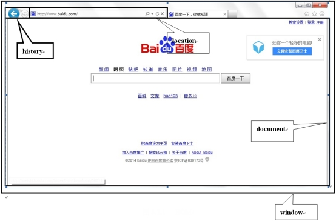
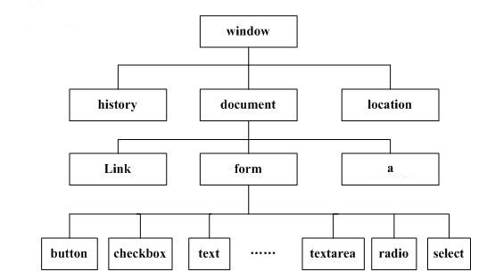
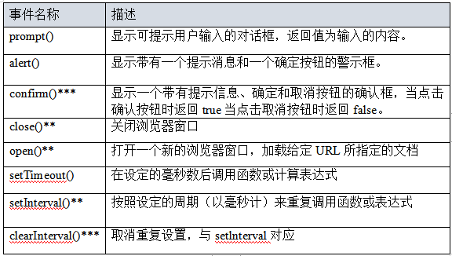

# 课程回顾

## 1 三级联动的参考代码

```html
<!DOCTYPE html>
<html>
	<head>
		<meta charset="UTF-8">
		<title></title>
	</head>
	<script type="text/javascript">
		//定义数组保存所有的省
		var province=["湖北省","河南省","湖南省","河北省"];
		//使用省份名称为key，存入该省对应的市
		province["湖北省"]=["武汉市","黄冈市","襄阳市","荆州市"];
		province["河南省"]=["郑州市","信阳市","洛阳市","驻马店"];
		province["湖南省"]=["长沙市","郴州市","岳阳市","衡阳市"];
		province["河北省"]=["石家庄市","邯郸市","秦皇岛市"];
		//一个格式，实现市和区的对应
		province["武汉市"]=["洪山区","武昌区","汉口区"];
		province["襄阳市"]=["襄州区","宜城市","谷城市"];
		province["长沙市"]=["羊区","人区"];
		
		//网页加载完毕，就加载所有的省份到select
		window.onload=function(){
			//获取省份的select
			var objParentSelect=document.getElementById("selProvince");
			//将数组中所有的省份追加到select中
			/**
			 * 1.创建option createElement()
			 * 2.创建text createTextNode(数据从何而来？？？)
			 * 3.父.appendChild(子);
			 */
			for(var i=0;i<province.length;i++){
				var strProv=province[i];//获取省份名称
				//获取省份，以option标签的形式，放在select列表显示
				//1.创建option
				var objNewOp=document.createElement("option");
				//2.设置option内部显示的数据
				var objText=document.createTextNode(strProv);
				//3.将文本对象设置到option显示
				objNewOp.appendChild(objText);
				
				//4.将设置好的option，放到select显示
				
				objParentSelect.appendChild(objNewOp);
				
			}
			
			/**
			 * 二级联动：
			 * 1.给省份下拉列表添加onchange
			 * 2.获取用户选择的省份对应的城市
			 * 3.创建option，显示城市，并将创建的option添加到市对应的select
			 */
			var objCitySel=document.getElementById("selCity");
			objParentSelect.onchange=function(){
				
				//清空，保留第一项
				var arrSon=objCitySel.getElementsByTagName("option");//获取 所有的城市
				while(arrSon.length>1){
					objCitySel.removeChild(arrSon[1]);
				}
				
				//获取用户选择的省份
//				alert("您选择的省份是："+this.value);//this指事件源  所有的表单项获取用户输入的或者选择的都是用value
				var strProv=this.value;
				//获取省份对应的城市
				var arrCities=province[strProv];
				//排除省没有对应的市的问题
				if(!arrCities){
					return;
				}
				for(var i=0;i<arrCities.length;i++){
					var strCity=arrCities[i];//获取省份名称
					//获取省份，以option标签的形式，放在select列表显示
					//1.创建option
					var objNewOp=document.createElement("option");
					//2.设置option内部显示的数据
					var objText=document.createTextNode(strCity);
					//3.将文本对象设置到option显示
					objNewOp.appendChild(objText);
					
					//4.将设置好的option，放到select显示					
					objCitySel.appendChild(objNewOp);
				
				}
				
				//县区列表数据也要发生变化
				objCitySel.onchange();//函数调用
				//省变了，市数据也会变化，县区目前应该在没有有效的市，下拉列表应该是空的
			}
		
			/**
			 * 三级联动：
			 * 1.给市下拉列表添加onchange
			 * 2.获取选中的市对应的县区
			 * 3.DOM将县区的数据追加县区的下拉列表
			 */
			objCitySel.onchange=function(){
				//1-2 父.appendChild(子节点)
				var objRegionSel=document.getElementById("selRegion");
				//清空
				var arrSon=objRegionSel.getElementsByTagName("option");
				while(arrSon.length>1){
					objRegionSel.removeChild(arrSon[1]);
				}
				//获取用户选择的市 value
				var strCity=this.value;//获取城市下拉列表用户的选中项
				
				//获取县区的数据
				var arrRegion=province[strCity];
				//undefined判断
				if(!arrRegion){
					return;
				}
				//循环，动态DOM加载
				for(var i=0;i<arrRegion.length;i++){
					//追加
					//1-1 创建
					var objOpt=document.createElement("option");
					var objText=document.createTextNode(arrRegion[i]);
					objOpt.appendChild(objText);
					
					objRegionSel.appendChild(objOpt);
				}
			}
		}
	</script>
	<body>
		省份：
		<select id="selProvince">
			<option>====请选择所在的省份====</option>
		</select><br />
		市：<select id="selCity">
			<option>====请选择所在的市====</option>
		</select><br />
		区：<select id="selRegion">
			<option>====请选择所在的县区====</option>
		</select><br />
	</body>
</html>
```

# 课程目标

## 1 RegExp对象

## 2 表单验证的思路 ====== 掌握

## 3 innerText 和 innerHTML === 掌握

## 4 BOM（window/location/history)===掌握

# 课程实施

## 1 innerText 和 innerHTML

### 1-1 innerText 和 innerHTML功能

用在双标签上面，获取开始标签和闭合标签内部的内容

### 1-2 innerText 和 innerHTML区别

innerText: 设置或获取文本部分，遇到文本中含有html代码，不会解析

innerHTML: 设置或获取html代码+文本部分，遇到文本中含有html代码，会解析

### 1-3 innerText和innerHTML的应用案例

```html
<!DO	CTYPE html>
<html>
	<head>
		<meta charset="utf-8" />
		<title></title>
	</head>
	<script type="text/javascript">
		window.onload=function(){
			//1.获取id是div1的内部的内容
			var objDiv1=document.getElementById("div1");
			//2.获取innerText innerHTML
			alert(objDiv1.innerText);//百度
			alert(objDiv1.innerHTML);//<a href="http://www.baidu.com">百度</a>
			
			//div2里面追加一个a，sina.com.cn
			var objDiv2=document.getElementById("div2");
			var strText=objDiv2.innerHTML;
			alert(strText);
			// strText="大家好"+"<a href='http:www.sina.com.cn'>新浪</a>"
			strText+="<a href='http://www.sina.com.cn'>新浪</a>";
			
			objDiv2.innerText=strText;//设置,innerText不会接下a的代码
			objDiv2.innerHTML=strText;//设置，innerHTML显示汉字，且解析a的代码
		}		
	</script>
	<body>
		<!--
			getElementById():element
			//获取标签里面的数据
			value只有表单项具有value。普通标签没有value的属性
			
			双标签，开始标签和闭合标签之间的内容：innerText innerHTML
		-->
		<div id="div1">
			<a href="http://www.baidu.com">百度</a>			
		</div>
		<div id="div2">大家好</div>
	</body>
</html>

```

### 课后作业：动态表格的实现代码

```html
<!DO	CTYPE html>
<html>
	<head>
		<meta charset="utf-8" />
		<title></title>
	</head>
	<script type="text/javascript">
		/**
		 * 简化document.getElementById(id)
		 * 位置：放在window.onload外面
		 * 执行时机，与网页是否加载完毕没有关系
		 * 作用域：
		 */
		function $(id){
			return document.getElementById(id);
		}
		window.onload=function(){
			/**
			 * 动态表格实现思路：
			 * 1.按钮注册onclick事件监听器
			 * 2.获取用户输入的行和列值（判断）
			 * 3.拼接字符串： 表格的代码
			 */
			$("btn").onclick=function(){
				var strRow=$("txtRow").value;
				var strCol=$("txtColumn").value;
				
				//动态添加table
				var str="<table border='1' cellspacing='0' cellpadding='4px'>";
				for(var i=0;i<strRow;i++){
					str+="<tr>";
					for(var j=0;j<strCol;j++){
						str+="<td>aaaaaa</td>";
					}
					str+="</tr>";
				}
				str+="</table>";
				//div2显示table
				$("div2").innerHTML=str;
//				alert(str);
			};
			
		}
		
	</script>
	<body>
		<p>
		行：<input type="text" id="txtRow" />
		
		列：<input type="text" id="txtColumn" />
		<button id="btn">生成表格</button>
		</p>
		<div id="div2">大家好</div>
	</body>
</html>

```

## 2 RegExp对象

应用场景：字符串的格式校验、字符串截取、匹配

引入案例：注册功能

要求用户输入用户名、输入密码、输入qq号码

举例：qq号码：纯数字  用户名：数字、字母、_、# %组成，长度一般要求不少于6位

如何保证用户输入的数据合法呢？

```html
String提供的方法，某一个格式验证有思考的思路，但是实施起来非常繁琐
正则表达式
```

### 2-1 定义对象

```html
//字面量方式
var 对象名=/字符串验证模板格式/验证属性;
验证属性：
i:Ignore 忽略大小写
g:global 全局
m:multiple  多次重复
```

### 2-2 RegExp常用方法

```html
test():验证字符串是否符合验证格式  true  false
exec():提取与正则格式匹配的字符串  object
```

#### 课堂案例

```html
<!DOCTYPE html>
<html>
	<head>
		<meta charset="UTF-8">
		<title></title>
	</head>
	<script type="text/javascript">
		//1.字符串
		var str="i Love you,you Love me~！！";
		//2.判断str是否有love这个词
		var reg=/love/i;
		//3.str中有love这个词语吗？
		alert(reg.test(str));//str中有没有love，有就是true  没有就是false
		
		//4.获取匹配的项
		var result=reg.exec(str);
		//了解：result包含匹配的字符串，包含字符串出现的下标起始位置、提供验证的字符串的对象
		alert(result+"在"+result.input+"出现，出现的位置是："+result.index);
	</script>
	<body>
	</body>
</html>
```

### 2-3 String中与RegExp对象相关的方法

```html
replace():替换字符串
search():查找字符串
match():雷同exec 提取匹配的字符串
```

#### 课堂案例

```html
<!DOCTYPE html>
<html>
	<head>
		<meta charset="UTF-8">
		<title></title>
	</head>
	<script type="text/javascript">
		//1.字符串
		var str="i Love1 you,you Love2 me~LOVE3！love9！";
		//2.判断str是否有love这个词
		//^:指定字符串开始的符号  $:指定字符串结束符号
		var reg=/love\d/ig;
		//替换love为*
		str=str.replace(reg,"*");//不添加g属性，reg匹配love，匹配一次，添加g属性后，匹配所有
		alert(str);//i * you,you * me~*!*!

		var index=str.search(reg);//查找匹配的字符串出现的初始位置
		alert(index);//love第一次出现的下标位置：2，

		var arr=str.match(reg);//获取正则所有的匹配项
		alert(arr);//Love1,Love2,LOVE3，love9 
	</script>
	<body>
	</body>
</html>

```

## 3 表单验证思路

### 3-1 表单验证的必要性

```html
1.用户体验度
2.安全性：非法的数据提交给后台，会有注入风险
3.服务器处理无效的客户端请求，增加服务器处理的压力
```

### 3-2 验证思路

```html
1.对用户输入的数据合法性校验
2.如果验证不通过，阻止表单提交给后台
解释：验证不通过，单击submit按钮，没有反应

难点：表单如何不提交！！submit不需要程序员写任何代码，自己本身具有提交表单功能！！
```

#### 课堂案例

```html
<!DOCTYPE html>
<html>
	<head>
		<meta charset="UTF-8">
		<title></title>
	</head>
	<script type="text/javascript">
		window.onload=function(){
			//给form添加onsubmit的监听器，验证手机号码是否正确
			document.getElementById("form1").onsubmit=function(){
				//获取用户输入的手机号
				var phone=document.getElementById("txtPhone").value;
				//正则
				var reg=/^1[35789]\d{9}$/;
				if(!reg.test(phone)){
                    //submit事件返回值的作用：true--数据提交后台  false--数据不提交
					return false;
				}
				return true;
			}
		}
	</script>
	<body>
		<!--
			阻止submit按钮默认行为：
			return false:表单提交时，如果看到提交监听器注册function的返回值是false
			onsubmit="return 验证结果;"
		-->
		<form id="form1" action="http://www.baidu.com" method="post" >
			<p>
				手机号码：<input id="txtPhone" type="text" name="phone"/>
			</p>
			<p>
				用户名：<input id="txtUserName" name="username" type="text"/>
			</p>
			<p>
				<!--
					submit单击之后不是click事件。触发form的submit事件
				-->
				<input type="submit"  value="注册" />
			</p>
		</form>
	</body>
</html>

```

### 补充：手机号码输入完毕之后，离开文本框一瞬间，验证手机号并给出提示

```html
获取焦点：focus
失去焦点：blur
```

#### 参考代码

```html
<!DOCTYPE html>
<html>
	<head>
		<meta charset="UTF-8">
		<title></title>
	</head>
	<script type="text/javascript">
		
	</script>
	<body>
		<form id="form1" action="http://www.baidu.com" method="post" >
			<p>
				手机号码：<input id="txtPhone" type="text" name="phone" onblur="alert('焦点离开了')"/>
			</p>
			<p>
				用户名：<input id="txtUserName" onfocus="alert('获取焦点了')" type="text"/>
			</p>
			<p>
				<input type="submit"  value="注册" />
			</p>
		</form>
	</body>
</html>

```

#### 使用onblur完成数据验证的实时提示

```html
<!DOCTYPE html>
<html>
	<head>
		<meta charset="UTF-8">
		<title></title>
	</head>
	<script type="text/javascript">
		/**
		 * 验证手机号码
		 */
		function checkPhone(){
			//获取用户输入的手机号
			var objText=document.getElementById("txtPhone");
			var phone=objText.value;
			//正则
			var reg=/^1[35789]\d{9}$/;
			if(!reg.test(phone)){
				//提示
//				alert("手机号码输入不正确，请重新输入！");
				document.getElementById("spanPhone").innerText="验证不通过";
				//现有手机号码全选
				objText.select();
//				objText.value='';//清空
				return false;
			}
			document.getElementById("spanPhone").innerText="验证通过";
			return true;//在表单提交的时候，
		}
		
		/**
		 * 验证表单
		 */
		function doSubmit(){
			
			return checkPhone();
		}
	</script>
	<body>
		<!--
			阻止submit按钮默认行为：
			return false:表单提交时，如果看到提交监听器注册function的返回值是false
			onsubmit="return 验证结果;"
		-->
		<form id="form1" action="http://www.baidu.com" method="post" onsubmit="return doSubmit();">
			<p>
				手机号码：<input id="txtPhone" type="text" name="phone" onblur="checkPhone()"/>
				<span id="spanPhone" style="color: red;"></span>
			</p>
			<p>
				用户名：<input id="txtUserName" type="text" name="username"/>
			</p>
			<p>
				<!--
					submit单击之后不是click事件。触发form的submit事件
				-->
				<input type="submit"  value="注册" />
			</p>
		</form>
	</body>
</html>
```

## 4 BOM

### 4-1 BOM概述

BOM：Browser(浏览器) Object Model

bom研究浏览器对象

因为浏览器商业竞争的原因，同一个对象同一属性获取的值会存在兼容性问题

window对象是整个BOM的顶层对象，处于对象模型的第一层，对于每个打开的窗口，系统都会自动将其定义为window对象。

各个对象所处位置及其关系如下图所示：



window是一个顶级对象，一般window的方法或者属性使用时，不需要写window





#### 课堂案例

##### 弹框

```html
<!DOCTYPE html>
<html>
	<head>
		<meta charset="UTF-8">
		<title></title>
	</head>
	<script type="text/javascript">
		//提示框：有一个确认按钮=true、取消按钮--false 
		var bool=window.confirm("确认退出吗？");
		alert(bool);
	</script>
	<body>
		
	</body>
</html>

```

##### open和close

```html
<!DOCTYPE html>
<html>
	<head>
		<meta charset="UTF-8">
		<title></title>
	</head>
	<body>
		<button onclick="window.open('http://www.baidu.com', 'new', 'width=500,height=300,left=200,top=200,location=no,menubar=no,toolbar=0,resizable=no');">打开百度</button>
		<button onclick="window.close();">关闭当前窗口</button>
	</body>
</html>

```


##### 定时器

```html
<!DOCTYPE html>
<html>
	<head>
		<meta charset="UTF-8">
		<title></title>
	</head>
	<script type="text/javascript">
//	alert('hello');
		function showTime(){
//			alert('hello');
			var strDate=new Date().toLocaleString();
			document.getElementById("div1").innerText="当前时间："+strDate;
		}
		var id;//保存定时器id
		window.onload=function(){
			showTime();
			//showTime不停重复执行
			id=setInterval(showTime,1000);
		}
		
		function stop(){
//			window.clearInterval("要停止的定时器的id")
			clearInterval(id);
		}
		
		//setInterval(功能,间隔时间):定时器效果
//		window.setInterval(sayHello,1000);//毫秒
	</script>
	<body>
		<div id="div1">
			当前时间：
		</div>
		<button id="btn" onclick="stop()">停止时间</button>
	</body>
</html>
```

#### 弹框方法

alert():警告确认框，只有一个按钮：确认

java中会频繁使用窗口：confirm()

confirm():弹出一个确认框，有一个取消和确认按钮

prompt(): 带有一个输入框的提示框

### 4-2 location对象

# 课程总结

# 课程总结

## 1 innerHTML innerText

## 2 重点 难点：表单验证

## 3.window常用方法：弹窗方法、open和close方法、定时器方法（setInterval() clearInterval())

# 预习安排

JQuery：选择器  DOM