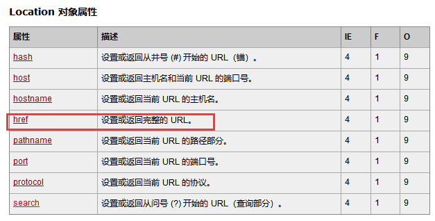
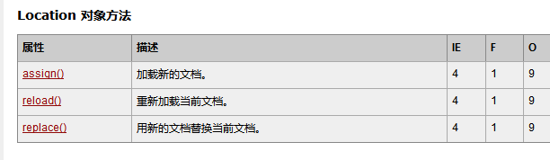
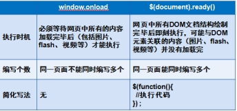
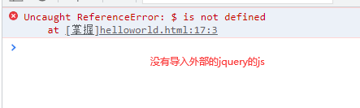

# 课程回顾

## 1 标准DOM*****

```html
**** 获取节点：getElementById()  byName()  byClassName() byTagName()

**** 新建： createElemen() createTextNode
     追加   父.appendChild()  父.insertBefore()
     替换   父.replaceChild()
     删除   父.removeChild()
     克隆   要克隆的节点.cloneNode(bool:deep):
             默认：false 表示只克隆本身，不可隆其后代
                  true:克隆自己及其后代
```

## 2 innerText和innerHTML

```html
innerText:获取双标签的文本节点
innerHTML:模拟网页节点追加、新增。。。
```

## 3 BOM

```html
window:
   弹框方法：
     alert()  prompt()  confirm():弹出一个确认框：确定和取消
   定时器：
     setInterval() clearInterval()

	 setTimeout()  clearTimeout()

   窗口开启和关闭：
     open(string url，“新窗口名称”，“新窗口特征”)
	 close():
```

# 课程目标

## 1 location和history ==== 掌握

## 2 JQuery概念

## 3 JQuery常用选择器 ==== 掌握

# 课程实施

## 1 window方法

### setTimeout应用案例

```html
<!DOCTYPE html>
<html>
	<head>
		<meta charset="utf-8" />
		<title></title>
	</head>
	<script type="text/javascript">
		function sayHi(){
			alert("hello");
			//推荐使用setTimeout模拟定时器
			setTimeout(sayHi,5000);//间隔5m后执行sayHi,然后过期
		}
//		setInterval(sayHi,5000);//每隔5m就执行一次sayHi()
		sayHi();		
	</script>
	<body>
	</body>
</html>

```

### 面试题：setInterval()和setTimeout()区别

```html
setInterval():间隔指定的时间后重复执行函数代码。即：函数会重复执行
setTimeout():间隔指定时间后执行一次函数代码，然后过期，即：不再执行代码了
```

### 时钟效果的两种实现方式

- setInterval()和clearInterval()

```html
<!DOCTYPE html>
<html>
	<head>
		<meta charset="utf-8" />
		<title></title>
	</head>
	<script type="text/javascript">		
		function showNow(){
			document.getElementById("div1").innerText=new Date().toLocaleString();
		}
		
		var id;//保存定时的编号
		function start(){
			showNow();//开始按钮一点击，就显示当前时间
			id=setInterval(showNow,1000);
		}
		
		function stop(){
//			clearInterval(停止的intervalID);
			clearInterval(id);
		}
	</script>
	<body>
		<div id="div1">
			
		</div>
		<button onclick="start()">开始</button>
		<button onclick="stop()">停止</button>
	</body>
</html>
```

- setTimeout()和clearTimeout()

```html
<!DOCTYPE html>
<html>
	<head>
		<meta charset="utf-8" />
		<title></title>
	</head>
	<script type="text/javascript">		
		function showNow(){
			document.getElementById("div1").innerText=new Date().toLocaleString();
			id=setTimeout(showNow,1000);//间隔1s，执行一次showNow()
		}
		
		var id;//保存定时的编号
		function start(){
			showNow();//开始按钮一点击，就显示当前时间
		}
		
		function stop(){
//			clearTimeout(要停止的timeoutID);
			clearTimeout(id);
		}
	</script>
	<body>
		<div id="div1">
			
		</div>
		<button onclick="start()">开始</button>
		<button onclick="stop()">停止</button>
	</body>
</html>
```

## 2 location对象





### 课堂案例

```html
<!DOCTYPE html>
<html>
	<head>
		<meta charset="utf-8" />
		<title></title>
	</head>
	<script type="text/javascript">
		function openBaiDu(){
			//href设置浏览器地址栏访问的网址
			location.href="http://www.baidu.com";//获取当前浏览器窗口的url  设置url地址
		}
		function openJingDong(){
//			location.replace(新网页的地址);//替换
            //用新的url地址替换当前url
//			location.replace("http://www.jd.com:80");
            //设置url的新地址
			location.assign("http://www.jd.com:80");//加载新的文档。
		}
		function showTime(){
			document.getElementById("div1").innerText="当前时间："+new Date().toLocaleString();
		}
	</script>
	<body onload="showTime()">
		<!--
			location
		-->
		<div id="div1">
			当前时间：
		</div>
		<button onclick="openBaiDu()">打开百度</button>
		<button onclick="openJingDong()">打开京东</button>
		<button onclick="location.reload()">刷新网页</button>
	</body>
</html>
```

### 小结：打开新网页的实现方式

```htm
1. window.open("url","","窗口特征")
2. location.href=url;
3.location.assign(url);
4.location.replace(url);
```

## 3 history对象

History 对象包含用户（在浏览器窗口中）访问过的 URL。

### 3-1 常用方法

```html
go()
back()
forward()
```

### 3-2 课堂案例

- 1.html

```html
<!DOCTYPE html>
<html>
	<head>
		<meta charset="UTF-8">
		<title>1.html</title>
	</head>
	<body>
		图书管理系统首页
		<a href="2.html">新增</a>
		<a href="3.html">修改</a>
		
		<button onclick="history.forward()">前进</button>
		<!--
			go(1):等价于forward()
		-->
		<button onclick="history.go(1)">前进修改页</button>
	</body>
</html>
```

- 2.html

```html
<!DOCTYPE html>
<html>
	<head>
		<meta charset="UTF-8">
		<title></title>
	</head>
	<body>
		新增图书信息
		<button onclick="history.back()">后退</button>
	</body>
</html>
```

- 3.html

```html
<!DOCTYPE html>
<html>
	<head>
		<meta charset="UTF-8">
		<title></title>
	</head>
	<body>
		修改图书信息
		<!--
			go(-1):等价于back()
			
		-->
		<button onclick="history.go(-1)">后退</button>
	</body>
</html>
```


## 4 补充：课后作业大侠名称显示

- 1.html

```html
<!DOCTYPE html>
<html>
	<head>
		<meta charset="UTF-8">
		<title></title>
	</head>
	<script type="text/javascript">
	//	window是一个对象
		//定义全局变量，都归属于window对象
	    var input;
		function showWindow(){
			//input是用户输入的数据，如果用户没有输入任何数据，就是默认值“大侠”
			input=prompt("大侠，请留下您的大名：","大侠");
			//打开新窗口
//			window.open("info.html");//open()打开新窗口，在新窗口通过opener属性获取当前窗口的window对象
//			location.href="info.html";
		}
	</script>
	<body>
		
		<button onclick="showWindow()">click me</button>
	</body>
</html>
```

- 2.html

```html
<!DOCTYPE html>
<html>
	<head>
		<meta charset="UTF-8">
		<title></title>
	</head>
	<script type="text/javascript">
		window.onload=function(){
			//window.open()打开新窗口，
			var objWindow=window.opener;//获取是哪个窗口打开了当前窗口
			//div1里面显示大侠的名称
			document.getElementById("div1").innerText="大侠，你的名字是："+objWindow.input;
		}
	</script>
	<body>
		<div id="div1">
			
		</div>
	</body>
</html>
```

## 5 JQuery概述

为了简化 JavaScript 的开发, 一些 JavsScript 库诞生了。JavaScript 库封装了很多预定义的对象和实用函数。能帮助使用者建立有高难度交互的 Web2.0 特性的富客户端页面, 并且兼容各大浏览器。Jquery就是这些封装的类库之一。

### 5-1 JQuery的入门案例HelloWorld的开发步骤

```html
· jquery的官方网站上面下载jquery提供的js类库文件
· 自己的项目引入jquery的js文件
<script src="jqueryjs文件url"></script>
· 按照jquery的语法格式，书写代码即可
```

#### 参考代码

```html
<!DOCTYPE html>
<html>
	<head>
		<meta charset="UTF-8">
		<title></title>
		<!--引入jquery的类库文件
			
			min:压缩版js，阅读性不好
		-->
		<script type="text/javascript" src="js/jquery-3.1.1.min.js" ></script>
	</head>
	<script type="text/javascript">
	//$(function);
		$(function(){
			alert("helloworld!");
		});
	</script>
	<body>
	</body>
</html>

```

## 6 JQueryの$详解



### 6-1 $和window.onload的区别

- window.onload绑定函数只能有一次，且以最后一次赋值为主，但是$()可以绑定多个函数

```html
<!DOCTYPE html>
<html>
	<head>
		<meta charset="UTF-8">
		<title></title>
		<!--引入jquery的类库文件
			
			min:压缩版js，阅读性不好
		-->
		<script type="text/javascript" src="js/jquery-3.1.1.min.js" >
			<!--//浏览器不识别的-->
		</script>
	</head>
	
	<script type="text/javascript">
	//$(function)：Jquery() 等价于window.onload
		$(function(){
			alert("helloworld!");//弹出helloWorld
		});
		
		$(function(){
			alert("你好Jquery!");//弹出你好JQuery
		});
	</script>
	<body>
	</body>
</html>


<!DOCTYPE html>
<html>
	<head>
		<meta charset="UTF-8">
		<title></title>
	</head>
	
	<script type="text/javascript">		
		window.onload=function(){
			alert("helloWorld");//不弹出
		}
		
		window.onload=function(){
			alert("你好JQuery");//弹出 你好JQuery
		}
	</script>
	<body>
	</body>
</html>
```

- window.onload没有简化方式，但是$()有很多书写方式，更灵活

```html
<!DOCTYPE html>
<html>
	<head>
		<meta charset="UTF-8">
		<title></title>
		<!--引入jquery的类库文件
			
			min:压缩版js，阅读性不好
		-->
		<script type="text/javascript" src="js/jquery-3.1.1.min.js" >
			<!--//浏览器不识别的-->
		</script>
	</head>
	
	<script type="text/javascript">
	//Jquery需要对上述代码进行封装
	$(document).ready(function(){
		alert("helloWorld");
	});
	//简化版本一：
	$().ready(function(){
		alert("helloWorld");
	});
	//最简化，也是最常用的格式
	$(function(){
		alert("helloWorld");
	});
	</script>
	<body>
	</body>
</html>


<!DOCTYPE html>
<html>
	<head>
		<meta charset="UTF-8">
		<title></title>
	</head>
	<script type="text/javascript">
     //没有其他的书写方式
	window.onload=function(){
		
	}
	</script>
	<body>
	</body>
</html>
```




## 7 选择器

获取html网页上一个标签的方法。等价于getElementBy。。。

### 7-1 选择器语法

```html
$("#id值")：等价于getElementById
$(".class值")：等价于getElementsByClassName
$("p")：等价于getElementsByTagName("p")
$("*")：
```

### 7-2 基本选择器

```html
ID选择器：$("#id值")
class类选择器：$(".class值")
标签选择器：$("HTML标签")
通配符选择器：$("*")
```

#### 课堂案例

- ID选择器

```html
<!DOCTYPE html>
<html>
	<head>
		<meta charset="UTF-8">
		<title></title>
		<!--引入jquery的类库文件-->
		<script type="text/javascript" src="js/jquery-3.1.1.min.js" ></script>
	</head>	
	<script type="text/javascript">
	$(function(){//当document.ready开始执行内部代码
		//处理自己的业务需求
		//1.获取id=div1的标签，内部的内容
		//1-1 获取div1对应的对象（即div）
		var objDiv=$('#div1');//JQuery对象
		//1-2 获取div里面的文字内容
		var strText=objDiv.text();//innerText学习js的dom补充属性
		//jquery获取innerText对应方法text()  innerHTML对应方法html()
		//1-3 弹框显示
		alert(strText);
	});
	</script>
	<body>
		<div id="div1">Hello JQuery</div>
		<span class="s1">你好，JQuery</span>
	</body>
</html>

```

- class选择器

```html
<!DOCTYPE html>
<html>
	<head>
		<meta charset="UTF-8">
		<title></title>
		<!--引入jquery的类库文件-->
		<script type="text/javascript" src="js/jquery-3.1.1.min.js" ></script>
	</head>	
	<script type="text/javascript">
	//class选择器
	$(function(){
		//1.获取对象 span  class=s1
		var objJQspan=$(".s1");
		//2.获取span之间的文本
		var str=objJQspan.text();
		alert(str);
		
//		console.log(str);
	});
	</script>
	<body>
		<div id="div1">Hello JQuery</div>
		<span class="s1">你好，JQuery</span>
	</body>
</html>
```

### 7-3 基本选择器的使用案例：全选

```html
<!DOCTYPE html>
<html>
	<head>
		<meta charset="UTF-8">
		<title></title>
		<!--引入jquery的类库文件-->
		<script type="text/javascript" src="js/jquery-3.1.1.min.js" ></script>
	</head>
	
	<script type="text/javascript">
		$(function(){
			//给全选添加一个click的监听器
			//jquery如何处理事件监听器 所有的on事件=function() 改成  选择器.事件(function(){})
			$("#chkAll").click(function(){
				//实现全选
				/**
				 * 1.获取所有的要选中的复选框
				 * 2.遍历设置每一个复选框，checked属性与全选一致
				 */
				var arrJQ=$(".subject");
				//jquery中循环的方式：each(),等价于foreach()
				/*for(var i=0;i<arrJQ.length;i++){
					arrJQ[i].checked=this.checked;//this是js对象
				}*/
                //each()实现数组的循环
				$(arrJQ).each(function(index,objDom){
					//this不是事件源，不能再同事件注册的对象使用
					//设置每个元素选中的状态
//					objDom.checked=$("#chkAll")[0].checked;
					//1.获取全选的值
					var vl=$("#chkAll").prop("checked");
					//2.设置全选
					$(objDom).prop("checked",vl);
				});				
			});//调用或设置方法
		});
	</script>
	<body>
		<input type="checkbox" id="chkAll"/>全选
		<input type="button" id="btnCheck" value="反选" />
		<br />
		<input type="checkbox" class="subject" />java
		<input type="checkbox" class="subject"/>html
		<input type="checkbox" class="subject"/>sql
		<input type="checkbox" class="subject"/>vue
		<input type="checkbox" class="subject"/>spring
		<input type="checkbox" class="subject"/>springboot
		<input type="checkbox" class="subject"/>springmvc
	</body>
</html>
```

## 8 JQuery对象和JavaScript对象互相转换

- JQuery-->js对象（也称为dom对象）

```html
$(选择器)[下标]
$(选择器).get(下标)
举例：
var objJQDiv=$("#div1");
//jquery--->js
var objDomDiv=objJQDiv[0]
objDomDiv.innerText;//正确
```

- js对象-->Jquery对象

```html
var objJQ=$(js对象)
```

### 8-2 课堂案例

- jquery-->dom 案例

```html
<!DOCTYPE html>
<html>
	<head>
		<meta charset="UTF-8">
		<title></title>
		<!--引入jquery的类库文件
			
			min:压缩版js，阅读性不好
		-->
		<script type="text/javascript" src="js/jquery-3.1.1.min.js" ></script>
	</head>	
	<script type="text/javascript">
	$(function(){//当document.ready开始执行内部代码
		//处理自己的业务需求
		//1.获取id=div1的标签，内部的内容
		//1-1 获取div1对应的对象（即div）
		var objDiv=$('#div1');//JQuery对象
		//1-2 获取div里面的文字内容 常见程序问题：jquery对象和js属性混用，不支持的！！！
		//jquery对象和js对象互相转换，
		var strText=objDiv[0].innerText;//innerText学习js的dom补充属性
		//jquery获取innerText对应方法text()  innerHTML对应方法html()
		//1-3 弹框显示
		alert(strText);
	});
	</script>
	<body>
		<div id="div1">Hello JQuery</div>
		<span class="s1">你好，JQuery</span>
	</body>
</html>

```

- dom-->Jquery 案例

```html
<!DOCTYPE html>
<html>
	<head>
		<meta charset="UTF-8">
		<title></title>
		<!--引入jquery的类库文件
			
			min:压缩版js，阅读性不好
		-->
		<script type="text/javascript" src="js/jquery-3.1.1.min.js" ></script>
	</head>	
	<script type="text/javascript">
	$(function(){//当document.ready开始执行内部代码
		//处理自己的业务需求
		//1.获取id=div1的标签，内部的内容
		//1-1 获取div1对应的对象（即div）
		var objDomDiv=document.getElementById("div1");
		//1-2 获取div里面的文字内容 常见程序问题：jquery对象和js属性混用，不支持的！！！
		//jquery对象和js对象互相转换，
		var strText=$(objDomDiv).text();//innerText学习js的dom补充属性
		//jquery获取innerText对应方法text()  innerHTML对应方法html()
		//1-3 弹框显示
		alert(strText);
	});
	</script>
	<body>
		<div id="div1">Hello JQuery</div>
		<span class="s1">你好，JQuery</span>
	</body>
</html>
```

# 课程总结

## 1 window(setInterval setTimeout)  location（打开新网页） history常用方法

## 2 JQuery是一个大佬提供的外部js

## 3 Jquery写代码的步骤，基本骨架

## 4 基本选择器，each()  事件监听器注册方式 prop()

# 预习安排

mysql5.7+

解压版配置


