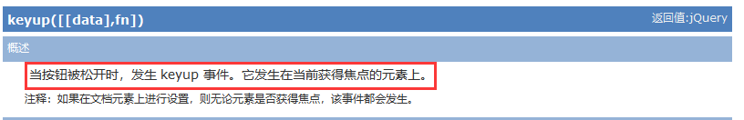

# JQuery回顾

```html
开发步骤
1.jquery提供外部js文件
2.项目引入jquery
3.jquery代码书写，要求：
$(function(){
	//代码处理
})

$()原型：
$(document).ready(function(){

});

$().ready(function(){

}
$(function(){

});

选择器：
基本选择器：
 class选择器 $(".class值")
 id选择器 $("#id值")
 通配符选择器 $("*")
 标签选择器 $("div")

 JQ对象和DOM对象互相转换：*******************
 jq-->DOM $().get(下标):Array<Element>
          $()[下标]
     
DOM-->JQ
     $(DOM对象)
     
掌握：
     事件注册：click()  focus() blur()
     数组循环方式：each(function(下标，DOM对象){})
     属性值设置或获取方式：获取  prop(属性名)  设置prop(属性名,属性值)
     获取双标签内部文本的方式：获取==text()   html()   设置==text(string) html(string)
```

# 课程目标

## 1 选择器 ============= 掌握

## 2 jquery事件 =========== 掌握

## 3  DOM方法==========掌握

# 课程实施

## 1 选择器

### 1-1 层级选择器

```html
1、后代选择器
      语法：${“ancestor descendant”}
      用法: $(“form input”) ;   返回值  集合元素
      说明: 在给定的祖先元素下匹配所有后代元素.这个要下面讲的”parent > child”区分开.
2、子选择器
语法：${“parent > child”}
用法: $(“form > input”) ;    返回值  集合元素
      说明: 在给定的父元素下匹配所有子元素.注意:要区分好后代元素与子元素
4、相邻元素选择器
      语法：${“prev + next”}
      用法: $(" h2+dl " );   返回值  集合元素
      说明: 匹配所有紧接在 prev 元素后的 next 元素，代码意思是选取紧邻<h2>元素之后的同辈元素<dl>
5、同辈元素选择器 
      语法：$(“prev ~ siblings”)
      用法: $(“form ~ input”) ;    返回值  集合元素
      说明: 匹配 prev 元素之后的所有 siblings 元素.注意:是匹配之后的元素,不包含该元素在内,并且siblings匹配的是和prev同辈的元素,其后辈元素不被匹配
```

#### 课堂案例

```html
<!DOCTYPE html>
<html>
	<head>
		<meta charset="utf-8" />
		<title></title>
		<script type="text/javascript" src="js/jquery-1.8.3.js" ></script>
	</head>
	<script type="text/javascript">
		$(function(){
			//获取ul里面春天那个汉字
			var arrA=$("ul a");
			alert(arrA.html());
			//获取ul所有的li的个数
			var arrEles=$("ul>li");
//			alert(arrEles.size());//1.8的jquery支持size()，也可以使用length
//			alert(arrEles.length);//3.0+jquery不支持size()，使用length替换使用

			//春天后面的紧邻季节是什么季节
			var arrEless=$("#li1+li");
//			alert(arrEless.text());//JQuery支持隐式迭代
			//春天的后面还有哪些季节
			var arr=$("#li1~li");
//			alert(arr.text());////JQuery支持隐式迭代，所以不用自己循环数组
		})
	</script>
	<body>
		<ul>
			<li id="li1">
				<a href="http://www.spring.io">
					春天</a></li>
			<li>夏天</li>
			<li>秋天</li>
			<li>冬天</li>
		</ul>
		<ol>
			<li>Spring</li>
			<li>Summer</li>
			<li>Autumn</li>
			<li>Winter</li>
		</ol>
	</body>
</html>
```

### 1-2 属性选择器

```html
1、[attribute]        
举例说明：$(" [href]" )选取含有href属性的元素
2、[attribute=value]    
举例说明：$(" [href ='#']" )选取href属性值为“#”的元素
3、[attribute !=value]   
举例说明：$(" [href !='#']" )选取href属性值不为“#”的元素
4、[attribute^=value]	
举例说明：$(" [href^='en']" )选取href属性值以en开头的元素
5、[attribute$=value]   
举例说明：$(" [href$='.jpg']" )选取href属性值以.jpg结尾的元素
6、[attribute*=value]   
举例说明：$(" [href* ='txt']" )选取href属性值中含有txt的元素
7、综合应用 [attributeFilter1][attributeFilter2][attributeFilterN]
举例说明: $(“input[id][name$=’man’]”)选取所有含有 id 属性,并且它的 name 属性是以 man 结尾的input元素
备注：这是一个组合属性选择器,需要同时满足多个条件时使用
```

#### 课堂案例

```html
<!DOCTYPE html>
<html>
	<head>
		<meta charset="utf-8" />
		<title></title>
		<script type="text/javascript" src="js/jquery-1.8.3.js" ></script>
	</head>
	<script type="text/javascript">
		$(function(){
			$("button").click(function(){
				//第一步：获取所有的复选框 js:getElementsByName()
				var arrHobbies=$("input[name='hobby']");
				
//				第二步：选中的复选框有一个属性：checked=checked
				var content='';
				arrHobbies.each(function(i,dom){
					if($(dom).prop("checked")){
						//val()等价于js中value
						content+=$(dom).val();
					}
				})
				
				//显示结果
				$("#div1").text(content);
				
			});
		})
	</script>
	<body>
		<input type="checkbox" name="hobby" value="音乐1"/>音乐1
		<input type="checkbox" name="hobby" value="音乐2"/>音乐2
		<input type="checkbox" name="hobby" value="音乐3"/>音乐3<br />
		<input type="checkbox" name="hobby" value="音乐4"/>音乐4
		<input type="checkbox" name="hobby" value="音乐5"/>音乐5
		<input type="checkbox" name="hobby" value="音乐6"/>音乐6<br />
		<input type="checkbox" name="hobby" value="音乐7"/>音乐7
		
		<button>获取选中的爱好</button>
		<div id="div1">
			
		</div>
	</body>
</html>
```

### 1-3 基本过滤选择器


#### 课堂案例

```html
<!DOCTYPE html>
<html>
	<head>
		<meta charset="utf-8" />
		<title></title>
		<script type="text/javascript" src="js/jquery-3.1.1.min.js" ></script>
	</head>	
	<script type="text/javascript">
		$(function(){
			//获取第一个ul中第三个li的内容
			var objLi=$("ul:first>li:eq(2)");
//			alert(objLi.text());
			
			//获取ol中下标是偶数的li的内容*****
			var arrEvenLi=$("ol li:even");//even是偶数
			//设置li的背景色 设置与外观样式相关的属性，都可以使用css() 链式编程
			arrEvenLi.css("background-color","pink").css("color","darkblue").css("font-size",12);
			//获取ol中下标是奇数的li的内容
			var arrOddLi=$("ol li:odd");//odd是奇数
			arrOddLi.css("background-color","greenyellow");
			
			//ul找li，排除id是li1
			var arrLi=$("ul li:not('#li1')");
			alert(arrLi.text());
		})
	</script>
	<body>
		<ul>
			<li id="li1">
				<a href="http://www.spring.io">
					春天</a></li>
			<li>夏天</li>
			<li>秋天</li>
			<li>冬天</li>
		</ul>
		<ol>
			<li>Spring</li>
			<li>Summer</li>
			<li>Autumn</li>
			<li>Winter</li>
		</ol>
	</body>
</html>
```

#### 表格奇偶行交替背景色

```html
<!DOCTYPE html>
<html>
	<head>
		<meta charset="UTF-8">
		<title></title>
		<script type="text/javascript" src="js/jquery-3.1.1.min.js" ></script>
	</head>
	
	<script type="text/javascript">
	$(function(){
		//获取表格的奇数行
		$("table tbody>tr:odd").css("background-color","pink");
		
		//表格偶数行
		$("table tbody>tr:even").css("background-color","lightblue");
	})
	</script>
	<body>
		<table border="1" cellspacing="0" cellpadding="4">
			<thead>
			<tr>
				<th>编号</th>
				<th>姓名</th>
				<th>年龄</th>
			</tr>
			</thead>
			<tbody>
			<tr>
				<td>1</td>
				<td>张三</td>
				<td>24</td>
			</tr>
			<tr>
				<td><p id="mini">2</p></td>
				<td>jack</td>
				<td>29</td>
			</tr>
			<tr>
				<td>3</td>
				<td>lily熊</td>
				<td>14</td>
			</tr>
			<tr>
				<td>3</td>
				<td>lily熊</td>
				<td>14</td>
			</tr>
			</tbody>
			<tfoot>
			<tr>
				<td colspan="3">
					<a href="#">首页</a>
					<a href="#">上一页</a>
					<a href="#">下一页</a>
					<a href="#">尾页</a>
				</td>
			</tr>
			</tfoot>
		</table>
	</body>
</html>
```

### 1-4 内容过滤选择器

```html
内容过滤选择器的过滤规则主要体现在它所包含的子元素和文本内容上
1、:contains(text)
用法: $(“div:contains(‘John’)”)    返回值  集合元素
      说明: 匹配包含给定文本的元素.这个选择器比较有用，当我们要选择的不是dom标签元素时,它就派上了用场了,它的作用是查找被标签”” 围起来的文本内容是否符合指定的内容的.
2、:empty
用法: $(“td:empty”)   返回值  集合元素
      说明: 匹配所有不包含子元素或者文本的空元素
3、:has(selector)
      用法:  $("div:has('.mini')")返回值  集合元素
      说明: 匹配含有选择器所匹配的元素的元素
4、:parent
用法: $(“td:parent”)   返回值  集合元素
      说明: 匹配含有子元素或者文本的元素.注意:这里是”:parent”,可不是”.parent”!可以理解与上面讲的”:empty”形成反义词.
```

#### 课堂案例

```html
<!DOCTYPE html>
<html>

	<head>
		<meta charset="UTF-8">
		<title></title>
		<script type="text/javascript" src="js/jquery-1.8.3.js"></script>
	</head>
	<script type="text/javascript">
		$(function() {
			//1.按钮注册click事件监听器
			$("#sear").click(function(){
				//1.获取用户的搜索条件
				var strSearch=$("#find").val();
				//2.table里面包含搜索条件的td显示
				//标签：显示show()  隐藏：hide()
				//2-1 隐藏所有的数据
				$("table tr:gt(0)").hide();
				//2-2 将匹配的行显示
				$("table tr:contains('"+strSearch+"')").show();
			});
			
			//文本框的键盘弹起事件
			$("#find").keyup(function(){
				//1.获取用户的搜索条件
				var strSearch=$(this).val();//("#find").val();
				//2.table里面包含搜索条件的td显示
				//标签：显示show()  隐藏：hide()
				//2-1 隐藏所有的数据
				$("table tr:gt(0)").hide();
				//2-2 将匹配的行显示
				if(!strSearch){
					//显示所有
					$("table tr:gt(0)").show();
				}else{
					$("table tr:contains('"+strSearch+"')").show();
				}
			});
		});
	</script>

	<body>
		<input type="text" id="find" />
		<input type="button" value="search" id="sear"/>
		<table border="1" cellspacing="0" cellpadding="4">
			<thead>
			<tr>
				<th>编号</th>
				<th>姓名</th>
				<th>年龄</th>
			</tr>
			</thead>
			<tbody>
			<tr>
				<td>1</td>
				<td>张三</td>
				<td>24</td>
			</tr>
			<tr>
				<td><p id="mini">2</p></td>
				<td>jack</td>
				<td>29</td>
			</tr>
			<tr>
				<td>3</td>
				<td>lily熊</td>
				<td>14</td>
			</tr>
			<tr>
				<td>3</td>
				<td>lily熊</td>
				<td>14</td>
			</tr>
			</tbody>
		</table>
	</body>
</html>
```

### 1-5 表单选择器【重点】

```html
表单项：input，这一类标签选择器语法：
$(":type属性值")

select:
  $("select[name='aaa']")
textarea:
  $("textarea")
```

#### 表单属性过滤选择器【重点】

```html
选中的复选框、选中的单选按钮
$(":checkbox:checked")
$(":radio:checked")

获取select中用户选中的option：
$("select option:selected")

理解：
选择所有的不可用的表单项
$(":disable")

选择所有的不可用的表单项
$(":enable")
```

#### 课堂案例

```html
<!DOCTYPE html>
<html>
	<head>
		<meta charset="UTF-8">
		<title></title>
		<script type="text/javascript" src="js/jquery-1.8.3.js" ></script>
	</head>
	<script type="text/javascript">
		$(function(){
			$(":button").click(function(){
				//1.获取用户名
				var usrName=$(":text").val();
				//2.密码
				var usrPwd=$(":password").val();
				
				//3.单选按钮
				var sex=$(":radio:checked").val();
				
				//4.学历
				var level=$("select option:selected").val();
				
				//5.爱好
				var checkedBox=$(":checkbox:checked");
				
				var hobby='';//没有隐式迭代
				checkedBox.each(function(i,dom){
					hobby+=$(dom).val();
				});
				
				//6.备注
				var remark=$("textarea").val();
				
				//7.头像
				var face=$(":file").val();
				
				//8.隐藏信息 :hidden与可见性选择器重复了，
				var info=$("input:hidden").val();
				
				alert(usrName+","+usrPwd+","+sex+","+level+","+hobby+","+remark+","+face+","+info);
			});
		});
	</script>
	<body>
		<form action="http://www.baidu.com" method="get">
			<!--
				表单项中用户选择的或者输入的值统一按照value属性获取
			-->
			<p>用户名：<input type="text" name="uname" /></p>
			<p>密码：<input type="password" name="upwd"/></p>
			<p>性别：<input type="radio" name="sex" value="男"/>男<input type="radio" name="sex" value="女"/>女</p>
			<p>学历：<select name="level">
					<option value="本科">本科</option>
					<option value="大专">大专</option>
					<option value="高中">高中</option>
					<option value="文盲">文盲</option>
					</select>
			</p>
			<p>爱好：
			<input type="checkbox" name="hobby" value="绘画">绘画
			<input type="checkbox" name="hobby" value="舞蹈">舞蹈
			<input type="checkbox" name="hobby" value="拳击">拳击
			<input type="checkbox" name="hobby" value="唱歌">唱歌
			</p>
			<p>备注：<textarea cols="50" name="remark" rows="10"></textarea></p>
			<p>头像：<input type="file" name="face"/></p>
			<p>看不见：<input type="hidden" name="hid" value="HelloWorld"/></p>
			<p><input type="button" value="注册"/></p>
		</form>
	</body>
</html>
```

## 2 事件

```html
引入键盘事件：keyup--键盘弹起 keydown--键盘按下  keypress--键盘按下并释放
```

### 2-1 keydown


### 2-2  keyup



### 2-3 keypress


## 3 DOMのCRUD

### 3-1 创建节点

createElement() createTextNode()

```html
$(标签拼接str)
```

### 3-2 内部添加

特点：父节点

```html
append(标签拼接str或$(标签拼接str))
prepend()
apppenTo()
prependTo()
```

### 3-3 替换

js:replaceChild()

```html
获取要替换你的节点.replaceWith(新节点)
```

### 3-4 删除

```html
删除一个：
获取要删除的节点.remove()
清空：
获取要删除的节点.empty();
```

### 3-5 外部追加

同级元素操作

```html
after()
before()
insertAfter()
insertBefore()
```

### 课堂案例

```html
<!DOCTYPE html>
<html>
	<head>
		<meta charset="UTF-8">
		<title></title>
		<script src="js/jquery-1.8.3.js" type="text/javascript"></script>
		<script type="text/javascript">
			$(function(){
				//下标指定按钮
				//1.获取所有的按钮
				var arrButtons=$(":button");
				//2.获取单个按钮，做click事件注册
//				arrButtons.eq(0);//下标从0开始
				$(":button:eq(0)").click(function(){
					//prepend将新节点放在ul的第一个
					$("ul").prepend("<li><input type='checkbox' />aaaaaa</li>")
				});
				$(":button:eq(1)").click(function(){
					//append:尾部追加，等价于appendChild()
					//ul里面追加一个li，li的内容“aaaaa"
					//1.创建节点
//					var ob=$("<input type='checkbox' /><li>aaaaaa</li>");
					//2.追加节点
					$("ul").append("<li><input type='checkbox' />aaaaaa</li>")
				});
				$(":button:eq(2)").click(function(){
					//prependTo:子节点.prependTo(ul)
					$("<li><input type='checkbox' />aaaaaa</li>").prependTo("ul");
				});
				$(":button:eq(3)").click(function(){
					//appendTo:子节点.appendTo(ul)
					$("<li><input type='checkbox' />aaaaaa</li>").appendTo("ul");
				});
				
				$(":button:eq(4)").click(function(){
					//after:同级节点.prependTo(ul)
					//获取沉鱼节点
					var objLi=$("ul li:nth-child(3)");
					
					//沉鱼后面添加bbbbb
					objLi.after("<li><input type='checkbox' />bbbbbb</li>")
				});
				
				$(":button:eq(5)").click(function(){
					//before:同级节点.prependTo(ul)
					$("<li><input type='checkbox' />aaaaaa</li>").prependTo("ul");
				});
				$(":button:eq(6)").click(function(){
					//insertAfter:新增节点.insertAfter(沉鱼)
					$("<li><input type='checkbox' />bbbbbb</li>").insertAfter($("ul li:nth-child(3)"))
				});
				
				$(":button:eq(7)").click(function(){
					//insertBefore:同级节点.prependTo(ul)
					$("<li><input type='checkbox' />aaaaaa</li>").prependTo("ul");
				});
				
				$(":button:eq(8)").click(function(){
					//克隆
				});
				
				$(":button:eq(9)").click(function(){
					//替换
					/*
					 * 要替换的节点.replaceWith(新节点)
					 * 扩展：基于选中的节点实现替换
					 */
					//1.获取选中的复选框,所在li替换新的li
					var obj=$(":checkbox:checked").parent();
//					alert(obj.html());
					//替换所有匹配的节点
					obj.replaceWith("<li><input type='checkbox' />ccccc</li>")
				});
				
				$(":button:eq(10)").click(function(){
					//删除
					/*
					 * 删除所有的匹配项
					 * 删除：自己.remove()
					 */
					$(":checkbox:checked").parent().remove();
				});
				
				
				$(":button:eq(11)").click(function(){
					//清空 匹配的元素.empty()
					if(confirm("确认清空吗？")){
						$("ul li").empty();
					}
				});
			});
		</script>
	</head>
	<body>
		<ul>
			<li class="li1"><input type="checkbox" />闭月</li>
			<li><input type="checkbox" />羞花</li>
			<li class="li1"><input type="checkbox" />沉鱼</li>
			<li><input type="checkbox" />落雁</li>
		</ul>
		<fieldset>
			<legend>添加节点的方法</legend>
		<input type="button" name="" id="" value="prepend" />
		<input type="button" name="" id="" value="append" />
		<input type="button" name="" id="" value="prependTo" />
		<input type="button" name="" id="" value="appendTo" />
		<input type="button" name="" id="" value="after" />
		<input type="button" name="" id="" value="before" />
		<input type="button" name="" id="" value="insertAfter" />
		<input type="button" name="" id="" value="insertBefore" />
		</fieldset>
		<input type="button" name="" id="" value="克隆" />
		<input type="button" name="" id="" value="替换" />
		<input type="button" name="" id="" value="删除" />
		<input type="button" name="" id="" value="清空" />
	</body>
</html>
```

# 课程总结

## 1 选择器：层级选择器 属性选择器 过滤选择器 表单选择器以及表单属性过滤选择

## 2 DOM：创建、追加、插入、删除、清空、替换


# 预习安排

XML解析：DOM获取xml保存的数据   XML约束===了解

MYSQL:配置版本（手动创建，本质记事本修改后缀名  my.ini)

