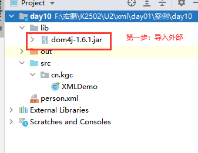
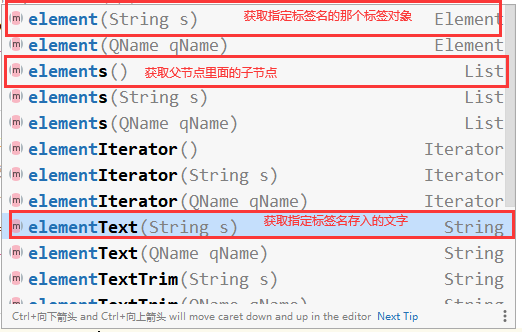

# 课程回顾

## 1 选择器

```html
层级选择器：
  子级选择器 父>子
  后代选择器 祖先 后代
  相邻选择器 前面节点+紧挨着后面的一个节点
  同辈选择器 前面节点~后面所有的同辈节点

属性选择器：[属性名=,!=,^=,$=,*='值']
过滤选择器：:关键字
 奇数 :odd
 偶数 :even
 :eq
 :lt
 :gt
 :first
 :last 
 :nth-child
。。。。
重点：
表单选择器
表单项的标签名input 选择器写法，统一语法：
:type的值

下拉列表：select
$("select")

多行文本：textarea
$("textarea").val()

表单属性过滤选择器
获取选中的列表项： :selected
  $("select option:selected")

单选按钮、复选框获取选中项：:checked
$(":radio:checked")
$(":checkbox:checked")
```

## 2 DOM

```html
查：表示获取功能  jquery中已经通过选择器可以实现
增：append（） prepend  appendTo prependTo after before insertAfter insertBefore
删：
 删除一个或一些：remove()
 清空选中父节点内部的子节点：父.empty()
改：
 replaceWith()
创建节点：$(拼接好的标签字符串)
```

## 3 课后作业：三级联动


### 参考代码

```html
<!DOCTYPE html>
<html>
	<head>
		<meta charset="UTF-8">
		<title></title>
		<script type="text/javascript" src="js/jquery-1.8.3.js" ></script>
	</head>
	<script type="text/javascript">
		//定义数组保存所有的省
		var province=["湖北省","河南省","湖南省","河北省"];
		//使用省份名称为key，存入该省对应的市
		province["湖北省"]=["武汉市","黄冈市","襄阳市","荆州市"];
		province["河南省"]=["郑州市","信阳市","洛阳市","驻马店"];
		province["湖南省"]=["长沙市","郴州市","岳阳市","衡阳市"];
		province["河北省"]=["石家庄市","邯郸市","秦皇岛市"];
		//一个格式，实现市和区的对应
		province["武汉市"]=["洪山区","武昌区","汉口区"];
		province["襄阳市"]=["襄州区","宜城市","谷城市"];
		province["长沙市"]=["羊区","人区"];
		
		$(function(){
			//省份循环，并添加到省份下拉列表中
			$(province).each(function(i,domEle){
				//将数组每一个元素添加到省份下拉列表中
				$('#selProvince').append("<option>"+domEle+"</option>");
			});
			//根据选择省份添加对应的城市
			/**
			 * 1.selProvince的下拉列表的change
			 * 2.获取province[省份]对应的市
			 * 3.selCity添加数组每一个城市数据
			 */
			$("#selProvince").change(function(){
				//清空列表
				/**
				 * option.empty()清空option的文本，理解empty()清空的选中项的后代
				 */
				$("#selCity option:gt(0)").remove();
				//1.清空县区
//				$("#selRegion option:gt(0)").remove();
				//调用城市change事件
				$("#selCity").change();//事件对应函数的执行
				//1.用户选择的省份
				  var prov=$(this).val();//this.value;//$("#selProvince option:selected").val();
				//2.获取province[省份]对应的市
				  var arrCities=province[prov];
				//3.遍历城市，并追加到selCity下拉列表中
				$(arrCities).each(function(i,ele){
					//1.创建一个新节点
					var objNewOption=$("<option></option>");
					//1-1 设置选项中的数据
					objNewOption.text(ele);
					//2.新节点放到父节点中
					$("#selCity").append(objNewOption);
				});
			});
			//根据选择城市添加对应的县区
			/**
			 * 1.selCity的下拉列表的change
			 * 2.获取province[城市名称]对应的县区数组
			 * 3.selRegion添加数组每一个城市数据
			 */
			$("#selCity").change(function(){
				//1.清空
				$("#selRegion option:gt(0)").remove();
				//2.获取数据并循环加载到selRegion的列表中
				var arrRegions=province[$(this).val()];
				
				$(arrRegions).each(function(i,ele){
					$("#selRegion").append("<option>"+ele+"</option>");
				});
			});
			
			$(":button").click(function(){
				var address='';
				address+=$("#selProvince option:selected").val();
				address+=$("#selCity option:selected").val();
				address+=$("#selRegion option:selected").val();
				address+=$(":text").val();
				alert(address);
			});
		});
	</script>
	<body>
		省份：
		<select id="selProvince" name="province">
			<option>====请选择所在的省份====</option>
		</select><br />
		市：<select id="selCity" name="city">
			<option>====请选择所在的市====</option>
		</select><br />
		区：<select id="selRegion" name="region">
			<option>====请选择所在的县区====</option>
		</select><br />
		详细地址：<input type="text" name="detail" /><input type="button" value="保存地址" />
	</body>
</html>
```

# 课程目标

## 1 DOM补充 === 掌握

## 2 XML解析（侧重xml数据获取）=== 理解

## 3 XML约束文档 == 了解

### DTD文档

### schema文档

# 课程实施

## 1 DOMの补充

### 1-1 css操作方法

```html
css():设置或获取匹配项的指定属性的值
举例：
css("background-color","pink")：设置背景色功能
css("background-color"):获取背景色
支持类样式
addClass():追加样式
removeClass():移除样式
toggleClass():交替样式
hasClass():判断是否有指定的样式，有true  没有false
```

#### 课堂练习

- 添加单个样式

```html
<!DOCTYPE html>
<html>
	<head>
		<meta charset="UTF-8">
		<title></title>
		<!--导入js文件-->
		<script type="text/javascript" src="js/jquery-1.8.3.js" ></script>
	</head>
	<script type="text/javascript">
		//给div添加边框样式：border粗细、border颜色、border外观
		//给div添加背景色，用green
		//给div添加字体样式：字体粗体 倾斜 字号34px 颜色 红色
		$(function(){
			//给div1添加样式
			$("#div1").css("background-color","green").css("font-weight","bolder").css("color","red");
		})
	</script>
	<body>
		<div id="div1">
			Hello JQuery
		</div>
	</body>
</html>
```

- css添加多个样式

```html
<!DOCTYPE html>
<html>
	<head>
		<meta charset="UTF-8">
		<title></title>
		<!--导入js文件-->
		<script type="text/javascript" src="js/jquery-1.8.3.js" ></script>
	</head>
	<script type="text/javascript">
		//给div添加边框样式：border粗细、border颜色、border外观
		//给div添加背景色，用green
		//给div添加字体样式：字体粗体 倾斜 字号34px 颜色 红色
		$(function(){
			//给div1添加样式
			//css({属性名:属性值,属性名:属性值,...,属性名:属性值}):设置多个样式
			$("#div1").css({"background-color":"green","font-weight":"bolder",
							"color":"red","font-size":"34px","font-style":"italic",
							"border":"1px solid black"});
		})
	</script>
	<body>
		<div id="div1">
			Hello JQuery
		</div>
	</body>
</html>

```

- addClass() removeClass() hasClass()

```html
<!DOCTYPE html>
<html>
	<head>
		<meta charset="UTF-8">
		<title></title>
		<!--导入js文件-->
		<script type="text/javascript" src="js/jquery-1.8.3.js" ></script>
	</head>
	<!--css-->
	<style type="text/css">
		.divaa{
			background-color: pink;
			font-style: italic;
			font-weight: bolder;
			border: dashed 2px green;
			width:200px;
			height: 200px;
		}
	</style>
	<script type="text/javascript">
		//给div添加边框样式：border粗细、border颜色、border外观
		//给div添加背景色，用green
		//给div添加字体样式：字体粗体 倾斜 字号34px 颜色 红色
		$(function(){
			$("#div1").click(function(){
				//如果没有divaa的样式，就加上这个样式
				if(!$(this).hasClass("divaa")){
					$(this).addClass("divaa");
				}else{
					//如果有divaa的样式，移除该样式
					$(this).removeClass("divaa");
				}
			});
		})
	</script>
	<body>
		<div id="div1">
			Hello JQuery
		</div>
	</body>
</html>

```

- toggleClass()

```html
<!DOCTYPE html>
<html>
	<head>
		<meta charset="UTF-8">
		<title></title>
		<!--导入js文件-->
		<script type="text/javascript" src="js/jquery-1.8.3.js" ></script>
	</head>
	<!--css-->
	<style type="text/css">
		.divaa{
			background-color: pink;
			font-style: italic;
			font-weight: bolder;
			border: dashed 2px green;
			width:200px;
			height: 200px;
		}
	</style>
	<script type="text/javascript">
		//给div添加边框样式：border粗细、border颜色、border外观
		//给div添加背景色，用green
		//给div添加字体样式：字体粗体 倾斜 字号34px 颜色 红色
		$(function(){
			$("#div1").click(function(){
				//toggleClass()：div上有divaa这个样式，就移除，没有就添加
				$(this).toggleClass("divaa");//toggler交替
			});
		})
	</script>
	<body>
		<div id="div1">
			Hello JQuery
		</div>
	</body>
</html>

```

### 1-2 jquery复合事件

```html
click:单击
keyup:键盘弹起
mouseover:鼠标停留
mouseleave:鼠标离开
mouseout:鼠标离开
```

#### 课堂案例

##### 表格高亮


```html
<!DOCTYPE html>
<html>
	<head>
		<meta charset="UTF-8">
		<title></title>
		<script type="text/javascript" src="js/jquery-1.8.3.js" ></script>
	</head>
	<style type="text/css">
		.high{
			background-color: yellow;
		}
		
	</style>
	<script type="text/javascript">
	$(function(){
		//鼠标停留在tbody的哪一个tr上，就是用high
		$("tbody tr").mouseover(function(){
			//添加样式
			$(this).addClass("high");
		}).mouseleave(function(){
			//移除样式
			$(this).removeClass("high");
		});
	})
	</script>
	<body>
		<table border="1" cellspacing="0" cellpadding="4">
			<thead>
			<tr>
				<th>编号</th>
				<th>姓名</th>
				<th>年龄</th>
			</tr>
			</thead>
			<tbody>
			<tr>
				<td>1</td>
				<td>张三</td>
				<td>24</td>
			</tr>
			<tr>
				<td><p id="mini">2</p></td>
				<td>jack</td>
				<td>29</td>
			</tr>
			<tr>
				<td>3</td>
				<td>lily熊</td>
				<td>14</td>
			</tr>
			<tr>
				<td>3</td>
				<td>lily熊</td>
				<td>14</td>
			</tr>
			</tbody>
			<tfoot>
			<tr>
				<td colspan="3">
					<a href="#">首页</a>
					<a href="#">上一页</a>
					<a href="#">下一页</a>
					<a href="#">尾页</a>
				</td>
			</tr>
			</tfoot>
		</table>
	</body>
</html>
```

##### 表格奇偶行+高亮

```html
<!DOCTYPE html>
<html>
	<head>
		<meta charset="UTF-8">
		<title></title>
		<script type="text/javascript" src="js/jquery-1.8.3.js" ></script>
	</head>
	<style type="text/css">

		.odd{
			background-color: pink;
		}
		.even{
			background-color: lightblue;
		}
		.high{
			background-color: yellow;
		}
	</style>
	<script type="text/javascript">
	$(function(){
		//文档加载完毕，表格奇偶行交替背景色
		$("tbody tr:odd").addClass("odd");
		$("tbody tr:even").addClass("even");
		//鼠标停留在tbody的哪一个tr上，就是用high
		$("tbody tr").mouseover(function(){
			if($(this).hasClass("even")){
				//移除
				$(this).removeClass("even");
			}else if($(this).hasClass("odd")){
				$(this).removeClass("odd");
			}
			//添加样式
			//tr上有两个类样式：even-ligthblue high-yellow  按照css里面定义顺序来的
			$(this).addClass("high");
		}).mouseleave(function(){
			//移除样式
			$(this).removeClass("high");
			//文档加载完毕，表格奇偶行交替背景色
			$("tbody tr:odd").addClass("odd");
			$("tbody tr:even").addClass("even");
		});
	})
	</script>
	<body>
		<table border="1" cellspacing="0" cellpadding="4">
			<thead>
			<tr>
				<th>编号</th>
				<th>姓名</th>
				<th>年龄</th>
			</tr>
			</thead>
			<tbody>
			<tr>
				<td>1</td>
				<td>张三</td>
				<td>24</td>
			</tr>
			<tr>
				<td><p id="mini">2</p></td>
				<td>jack</td>
				<td>29</td>
			</tr>
			<tr>
				<td>3</td>
				<td>lily熊</td>
				<td>14</td>
			</tr>
			<tr>
				<td>3</td>
				<td>lily熊</td>
				<td>14</td>
			</tr>
			</tbody>
			<tfoot>
			<tr>
				<td colspan="3">
					<a href="#">首页</a>
					<a href="#">上一页</a>
					<a href="#">下一页</a>
					<a href="#">尾页</a>
				</td>
			</tr>
			</tfoot>
		</table>
	</body>
</html>
```

##### hover

```html
<!DOCTYPE html>
<html>
	<head>
		<meta charset="UTF-8">
		<title></title>
		<script type="text/javascript" src="js/jquery-1.8.3.js" ></script>
	</head>
	<style type="text/css">
		#div1{
			border: 1px green double;
			width: 200px;
			height: 200px;
		}
	</style>
	<script type="text/javascript">
		$(function(){
			//模拟鼠标停留mouseover和鼠标离开mouseleave复合事件
			//div在鼠标停留添加背景色  鼠标离开移除背景
			//hover(mouseover(),mouseleave)
			$("#div1").hover(function(){
				$(this).css("background-color","pink");
			},function(){
				$(this).css("background-color","white");
			});//模拟鼠标停留和离开
		})
	</script>
	<body>
		<div id="div1">HelloWorld</div>
	</body>
</html>

```

##### toggle

```html
<!DOCTYPE html>
<html>
	<head>
		<meta charset="UTF-8">
		<title></title>
		<script type="text/javascript" src="js/jquery-1.8.3.js" ></script>
	</head>
	<style type="text/css">
		#div1{
			border: 1px green double;
			width: 200px;
			height: 200px;
		}
	</style>
	<script type="text/javascript">
		//div1点击一次，就在现在的字体大小+4
		$(function(){
			//toggle(fn1,fn2,....)：模拟鼠标点击在fn1 fn2交替执行
			$("#div1").toggle(function(){
				$(this).css("font-size","18px");
			},function(){
				$(this).css("font-size","24px");
			},function(){
				$(this).css("font-size","36px");
			});//模拟鼠标在div上面的多次单击
		})
	</script>
	<body>
		<div id="div1">HelloWorld</div>
	</body>
</html>

```

### 1-3 事件注册方式

```html
bind("事件名",事件处理函数)
unbind("事件名")
one("事件名",事件处理函数)
delegate("委派节点选择器","事件名",事件处理函数)
undelegate("委派节点选择器","事件名")
```


#### 课堂案例：


#### bind one unbind实现事件绑定

```html
<!DOCTYPE html>
<html>
	<head>
		<meta charset="UTF-8">
		<title></title>
		<!--导入js文件-->
		<script type="text/javascript" src="js/jquery-1.8.3.js" ></script>
	</head>
	<script type="text/javascript">
		$(function(){
			//div1添加单击事件
//			$("#div1").click(function(){});
			//jquery:补充方式一 bind(事件名，事件处理函数)
			/*$("#div1").bind("click",function(){
				alert(this.innerText);//div1里面的文本
				//移除click
				$(this).unbind("click");//div的click事件移除
			});*/
			
			//jquery:补充方式二 one(事件名，事件处理函数)事件绑定时，事件有且只会执行一次
			$("#div1").one("click",function(){
				alert(this.innerText);//div1里面的文本
			});			
		})
	</script>
	<body>
		<div id="div1">
			Hello JQuery
		</div>
	</body>
</html>

```

#### delegate实现事件绑定

```html
<!DOCTYPE html>
<html>
	<head>
		<meta charset="UTF-8">
		<title></title>
		<script src="js/jquery-1.8.3.js" type="text/javascript"></script>
		<script type="text/javascript">
			$(function(){
				//给ul里面每一个li添加单击事件，单击任意一个li，alert(li里面显示文字)
				/*$("ul li").click(function(){
					alert($(this).text());
				});*/
				
				/* bind click事件注册时，只对当前html现有li有效果，代码添加的li就没有效果
				 * $("ul li").bind("click",function(){
					alert($(this).text());
				});*/
				
				//厉害：delegate不仅可以给html当前节点注册事件，还可以对未来代码创建的节点添加事件
				$("body").delegate("li","click",function(){
					alert($(this).text());
				})
				
				//下标指定按钮
				//1.获取所有的按钮
				var arrButtons=$(":button");
				//2.获取单个按钮，做click事件注册
//				arrButtons.eq(0);//下标从0开始
				$(":button:eq(0)").click(function(){
					$("ul").append("<li><input type='checkbox' />aaaaaa</li>")
				});
                				
				$(":button:eq(1)").click(function(){
					//after:同级节点.prependTo(ul)
					//获取沉鱼节点
					var objLi=$("ul li:nth-child(3)");					
					//沉鱼后面添加bbbbb
					objLi.after("<li><input type='checkbox' />bbbbbb</li>")
				});
			});
		</script>
	</head>
	<body>
		<ul>
			<li class="li1"><input type="checkbox" />闭月</li>
			<li><input type="checkbox" />羞花</li>
			<li class="li1"><input type="checkbox" />沉鱼</li>
			<li><input type="checkbox" />落雁</li>
		</ul>
		<fieldset>
			<legend>添加节点的方法</legend>
		<input type="button" name="" id="" value="append" />
		<input type="button" name="" id="" value="after" />
		</fieldset>
	</body>
</html>

```

## 3 XML

### 3-1 概念

xml：Extensible Markup Language **可扩展标记语言**

### 3-2 xml和html有什么区别？

```html
xml:SSM框架、JavaEE配置servlet filter  listener使用xml完成
xml:侧重数据存储，提供给ssm自行解析  程序员xml文档内容copy保存xml中

html:网页，用户看html展示和数据提交
html:侧重数据展示和提交后台使用  程序员总是要操作html
```

### 3-3 xml优势

```html
xml优势：
相比较数据存储的文件格式：
        U1学习IO，.txt  .doc .class
阅读性好。简单易操作

缺点：标签名自定义，团队开发不便于管理。所以需要XML约束！！！
        
```

### 3-4 xml的书写要求

#### xml基本语法和格式

```html
Xml必须有关闭标签
区分大小写（在xml中html和HTML两个标签）
属性需要有引号
标签必须正确的嵌套
必须有根元素（xml文档必须有一个根节点，类似html中<html>）

Xml是标签语言，标签可以自己随便写！！！
html的标签必须按照提供的单词写，自己不能发明创造的
    
格式
    xml的文档声明
文档声明:	通常出现在xml的第一行第一列的位置!!!
写法:	
<?xml	属性名=”属性值”	属性名=”属性值”	...>
version:	版本号,必须的	默认值1.0
encoding:		编码字符集,是使用浏览器打开的时候采用的默认的字符集的编码.
standalone:	描述xml文档是否需要依赖其他的文件.
```

#### xml标签名的书写规范


#### xml文档案例参考

````xml
<?xml version="1.0" encoding="UTF-8"?>
<!--数据存储和传输-->
<!--people理解成是xml的根节点，根节点有且只有一个，类似html的<html>
 xml标签都是自定义的，遵循命名规则即可：
-->
<people>
    <!--
        xml优势：阅读性好。简单易操作
        缺点：标签名自定义，团队开发不便于管理
        XML约束！！！
        相比较数据存储的文件格式：
        U1学习IO，.txt  .doc .class
    -->
    <person id="p001">
        <name>张无忌</name>
        <age>24&gt;12</age>
        <sex>男</sex>
        <!--        。。。。-->
    </person>
    <person id="p002">
        <name>周芷若</name>
        <age>22</age>
        <sex>女</sex>
        <!--        。。。。-->
    </person>
    <person id="p003">
        <name>金毛狮王</name>
        <age>42</age>
        <sex>男</sex>
        <!--        。。。。-->
    </person>
    <person id="p004">
        <name>杨逍</name>
        <age>36</age>
        <sex>男</sex>
        <!--        。。。。-->
    </person>
</people>
````

### 3-5 xml书写时常见错误


## 4 xml 解析

读取一个xml保存的所有的数据

### 4-1 xml解析步骤

```html
1.准备一个xml文档（xml文档要求格式良好）
2.引用第三方jar包 ****DOM4J
3.写代码实现数据读取
```

### 4-2 XML解析技术


#### DOM解析


#### SAX解析


### 4-3 dom4j实现xml解析



#### 参考代码

- 获取属性ID的值

```java
package cn.kgc;

import org.dom4j.Document;
import org.dom4j.Element;
import org.dom4j.io.SAXReader;
import org.junit.Test;

import java.util.List;

/**
 * @Author: lc
 * @Date: 2022/4/27
 * @Description: 实现xml文档的解析
 * @Version: 1.0
 */
public class XMLDemo {
	@Test
	public void getXmlInfo() throws Exception{
		/**
		 * dom4j实现xml文档解析
		 * 实现思路：
		 * 1.SAXReader对象是DOM4J提供的将xml文件一次性加载到内存中，html的dom是一个意思
		 * 返回一个document对象
		 * 2.使用document.获取方法()节点
		 */
		//创建一个加载xml文档对象
		SAXReader reader=new SAXReader();
		//实现将person.xml转换为dom模型
		Document document = reader.read("person.xml");
		// 获取数据
		/**
		 * document获取数据的步骤：
		 * 1.获取xml的根节点
		 * 2.根节点找子节点
		 * 3.子节点找孙节点
		 */
		//获取根节点：people
		Element root = document.getRootElement();
		//找子节点：person  四个
		List<Element> elements = root.elements();
		System.out.println("子节点的数量："+elements.size());

		//获取第一个Person的数据
		Element firstPerson = elements.get(0);
		//获取id的属性值
		//String id=firstPerson.attribute("id").getValue();
		String id=firstPerson.attributeValue("id");
		System.out.println("id="+id);
	}
}
```



- 获取第一个person子标签name、age、sex的值

```java
package cn.kgc;

import org.dom4j.Document;
import org.dom4j.Element;
import org.dom4j.io.SAXReader;
import org.junit.Test;

import java.util.List;

/**
 * @Author: lc
 * @Date: 2022/4/27
 * @Description: 实现xml文档的解析
 * @Version: 1.0
 */
public class XMLDemo {
	@Test
	public void getXmlInfo() throws Exception{
		/**
		 * dom4j实现xml文档解析
		 * 实现思路：
		 * 1.SAXReader对象是DOM4J提供的将xml文件一次性加载到内存中，html的dom是一个意思
		 * 返回一个document对象
		 * 2.使用document.获取方法()节点
		 */
		//创建一个加载xml文档对象
		SAXReader reader=new SAXReader();
		//实现将person.xml转换为dom模型
		Document document = reader.read("person.xml");
		// 获取数据
		/**
		 * document获取数据的步骤：
		 * 1.获取xml的根节点
		 * 2.根节点找子节点
		 * 3.子节点找孙节点
		 */
		//获取根节点：people
		Element root = document.getRootElement();
		//找子节点：person  四个
		List<Element> elements = root.elements();
		System.out.println("子节点的数量："+elements.size());

		//获取第一个Person的数据
		Element firstPerson = elements.get(0);
		//获取第一个Person里面的name标签值、age标签的值、sex标签的值
		//elementText(name):获取name标签里面的文本，类似js的innerText
		/*String name = firstPerson.elementText("name");
		System.out.println(name);

		//element(age):获取age标签对象
		Element ageEle = firstPerson.element("age");
		String age=ageEle.getText();
		System.out.println(age);

		//elementTextTrim(sex):获取sex标签内部的文本，并去掉文本首尾空格
		String sex = firstPerson.elementTextTrim("sex");
		System.out.println(sex);*/
		//循环方式：
		//1.获取person里面的子节点
		List<Element> sonEles = firstPerson.elements();
		for(Element e:sonEles){
			String text = e.getText();
			System.out.println(text);
		}
	}
}
```

### 4-4 XPath结合DOM4J实现xml解析

传统的dom4j的方式解析xml文档，必须遵循根节点找子节点，再通过子节点找下一次子节点.....xml文件节点嵌套级别较多，解析一个xml代码就会非常冗繁。优化节点查找的方式，dom4j提供新的节点查找的方式：XPath

#### 4-4-1 xpath优点

dom模型中，使用特殊的路径写法，更快做节点的定位。

#### 4-4-2 xpath获取ID是p003的人的信息


```java
	@Test
	public void getXmlInfo2() throws Exception{
		/**
		 * 1.加载person.xml获取Document对象
		 * 2.使用document对象根据xpath指定的路径获取对应的节点
		 */
		SAXReader reader=new SAXReader();
		Document document = reader.read("person.xml");
		//2.区别来了
		//ID是p003的人的信息  只想找一个person标签？！
		//Node是Element Attribute  Text的父接口
		//xpath //标签名[@属性名=属性值]
		Node node = document.selectSingleNode("//person[@id='p003']");
		//获取p003对应的name age sex
		if(node!=null){//非空验证，排除NULLPointerException
			if(node instanceof Element){//node父接口保存的变量向下转型实际类型Element
				//向下转型
				Element p003Person=(Element)node;
				System.out.println("id="+p003Person.attributeValue("id"));
				System.out.println("name="+p003Person.elementText("name"));
				System.out.println("age="+p003Person.elementText("age"));
				System.out.println("sex="+p003Person.elementText("sex"));
			}
		}
	}
```

## 5 XML约束

### 5-1 xml约束

- dtd约束
- schema约束


### 5-2 DTD约束书写

#### dtd文档定义

```xml-dtd
<?xml version="1.0" encoding="UTF-8"?>
<!--定义当前xml能书写标签以及属性、标签顺序-->
<!ELEMENT people (person*)>
<!ELEMENT person (name,age,sex)>
<!--        PCDATA表示文本 -->
<!ELEMENT name    (#PCDATA)>
<!ELEMENT age (#PCDATA)>
<!ELEMENT sex    (#PCDATA)>

<!--person标签上得有一个id的属性，且属性值不能重复
ID:dtd的数据类型，表示id属性值不能重复
-->
<!ATTLIST person id ID #REQUIRED>
```

#### xml引入dtd

```xml
<?xml version="1.0" encoding="UTF-8"?>
<!--导入本地外部的dtd文件-->
<!DOCTYPE people SYSTEM "person.dtd">
<!--数据存储和传输-->
<!--people理解成是xml的根节点，根节点有且只有一个，类似html的<html>
 xml标签都是自定义的，遵循命名规则即可：
-->
<people>
    <!--
        xml优势：阅读性好。简单易操作
        缺点：标签名自定义，团队开发不便于管理
        XML约束！！！
        相比较数据存储的文件格式：
        U1学习IO，.txt  .doc .class
    -->
    <person id="p001">
        <name>张无忌</name>
        <age>24</age>
        <sex>男</sex>
        <!--        。。。。-->
    </person>
    <person id="p002">
        <name>周芷若</name>
        <age>22</age>
        <sex>女</sex>
        <!--        。。。。-->
    </person>
    <person id="p003">
        <name>金毛狮王</name>
        <age>42</age>
        <sex>男</sex>
        <!--        。。。。-->
    </person>
    <person id="p004">
        <name>杨逍</name>
        <age>36</age>
        <sex>男</sex>
        <!--        。。。。-->
    </person>
</people>
```

### 5-3 Schema约束书写

#### xsd文档定义

```xml
<?xml version="1.0"?>
<!--
xmlns:xs:设置当前xsd文件遵循的约束文档
targetNamespace：为当前文档定义引用url地址
targetNamespace="http://www.kgc.com/person"提供给xml引用使用
url地址自己编的，随便写
elementFormDefault：约束文档使用时约束
-->
<xs:schema xmlns:xs="http://www.w3.org/2001/XMLSchema"
           targetNamespace="http://www.kgc.com/person"
           elementFormDefault="qualified">
    <!--  根标签的名称  -->
    <xs:element name="people">
    <!--  complexType：people标签是一个复合标签，有子标签      -->
    <xs:complexType>
        <!--  sequence people子标签出现的顺序      -->
        <xs:sequence>
<!--            minOccurs:设置person出现的最少次数   maxOccurs：设置person出现的最多次数-->
            <xs:element name="person" minOccurs="1" maxOccurs="unbounded">
                <xs:complexType>
                    <xs:sequence>
                        <xs:element name="name" type="xs:string"/>
                        <xs:element name="age" type="xs:integer"/>
                        <xs:element name="sex" type="xs:string"/>
                    </xs:sequence>
                    <!-- 设置person上面的属性-->
                    <xs:attribute name="id" type="xs:ID" use="required"/>
                </xs:complexType>
            </xs:element>
        </xs:sequence>
    </xs:complexType>
    </xs:element>
</xs:schema>
```

#### xml引入schema文件

```xml
<?xml version="1.0" encoding="UTF-8"?>
<!--
xmlns="http://www.w3.org/2001/XMLSchema-instance" xml文件要引用schema
xmlns="http://www.kgc.com/person"设置了引用schema url地址
 xs:schemaLocation="http://www.kgc.com/person person.xsd" url地址中具体schema文件的名称
-->
<people xmlns:xs="http://www.w3.org/2001/XMLSchema-instance"
        xmlns="http://www.kgc.com/person"
        xs:schemaLocation="http://www.kgc.com/person person.xsd">
    <person id="p001">
        <name>张无忌</name>
        <age>34</age>
        <sex>男</sex>
    </person>
    <person id="p002">
        <name>周芷若</name>
        <age>22</age>
        <sex>女</sex>
    </person>
    <person id="p003">
        <name>金毛狮王</name>
        <age>42</age>
        <sex>男</sex>
    </person>
    <person id="p004">
        <name>杨逍</name>
        <age>36</age>
        <sex>男</sex>
    </person>
</people>
```


# 课程总结

   1.重点：掌握选择器+dom动态添加节点、删除节点

2. 理解：addClass removeClass()
3. 了解：bind unbind delegate one hover toggle

4. 掌握：xml书写格式
5. 理解：xml解析的方式
6. 了解：xml约束

# 预习安排

***mysql服务器安装**

mysql数据库