# 课程回顾

1. xml书写格式要求、

2. xml文件解析有基本思路

# 课程目标

## 1 数据库概述 === 了解

## 2 DBMS数据库管理系统和数据库客户端 === 理解

## 3 创建数据库和数据表 === 掌握

## 4 数据的添加、修改和删除 === 掌握

## 5 mysql常用的数据类型 === 掌握

# 课程实施

## 1 数据库概述

### 1-1 数据库概念

​          保存数据的仓库。

### 1-2 数据库优点

​         

## 2 安装开发环境

```html
· mysql5.7.0软件
  作用：搭建一台数据库管理系统，简单理解：数据库服务器
· sqlyog软件
  作用：写SQL代码的工具，简单理解：数据库客户端
```

### 2-1数据库管理系统（RDBMS)

RDBMS:Relationship(关系) DB(DataBase) Management(管理)System(系统) 即“关系型数据库管理系统”

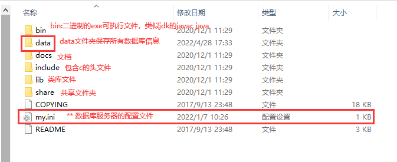

### 2-2 怎么启动数据库服务器？

鼠标操作：

  找到数据库服务，右键服务，选择启动即可


dos命令操作：

 启动cmd窗口，“net start 服务名"

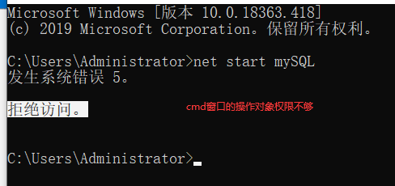

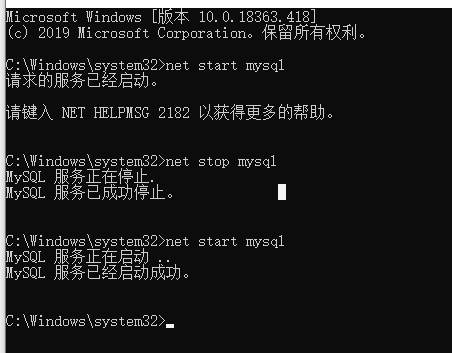

### 2-3 配置mysql的环境变量

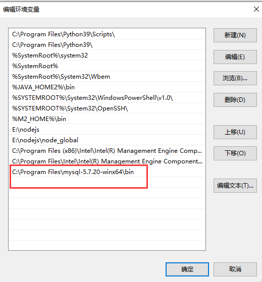

## 3 连接数据库服务器

### 3-1 DOS命令完成

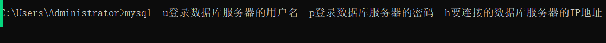

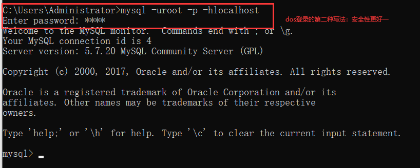

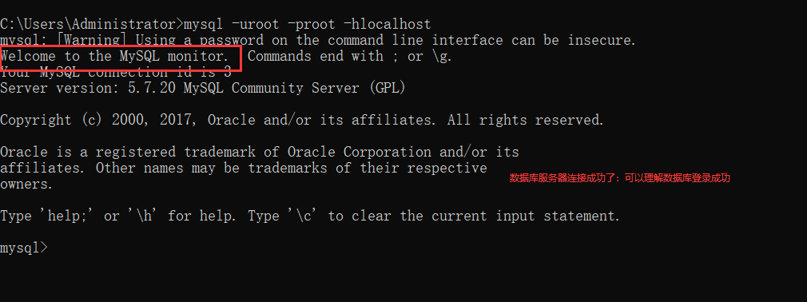

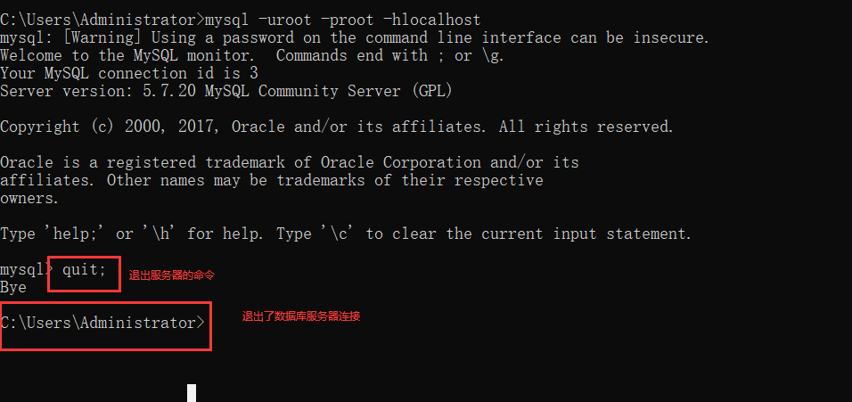

- 启动运行窗口 win+r 输入cmd命令
- 基于数据库服务器提供的exe命令，连接指定IP地址的数据库服务器

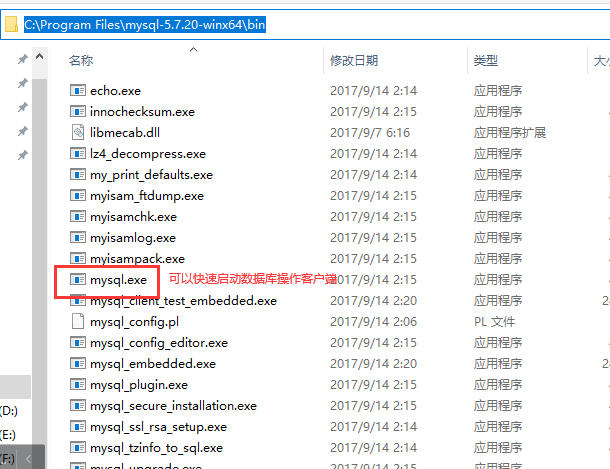


### 3-2 集成开发环境

写代码工具


#### 安装sqlyog方式：免安装

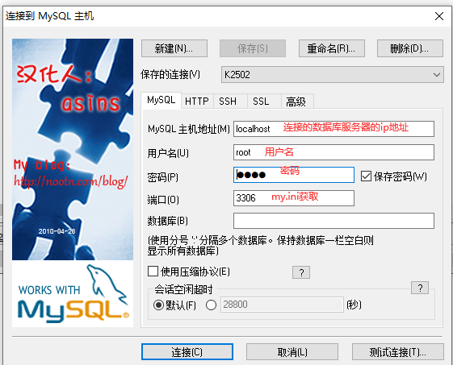

## 4 数据库操作

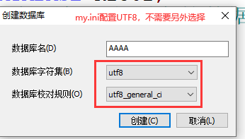

#### 数据库注释

```mysql
# 单行注释
-- 单行注释
/*多行注释*/
```

#### 创建数据库

```mysql
-- 创建数据库 k2502 
CREATE DATABASE K2502;
```

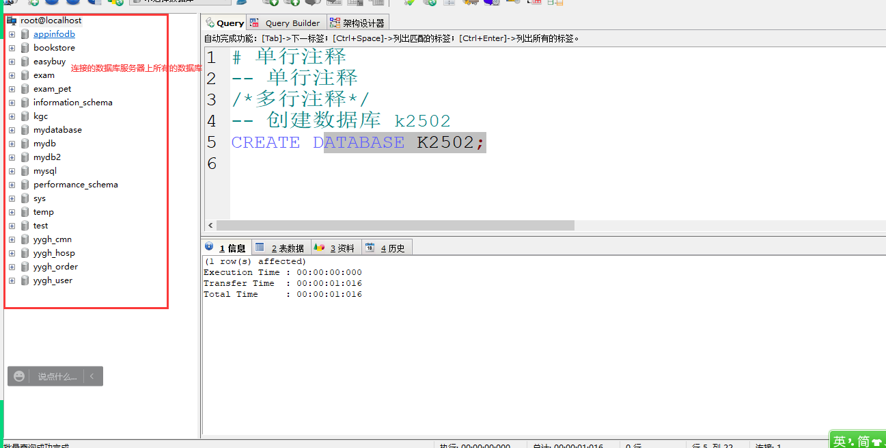

#### 显示所有的数据库

```mysql
show databases;
```

#### 删除数据库

```mysql
drop database 要删除的数据库名;
```

## 5 创建数据表

数据库不能直接保存数据：便于数据管理

数据库依赖数据表进行数据的存储和管理。

### 数据库常用的数据类型

```html
数值类型：
  整数：int short long byte 
  浮点数：float double decimal...
文本类型：其实就是字符串，char varchar保存字符的长度最大：255个字符
  固定长度的文本类型：char(字符个数)
char使用场景：保存的数据长度永恒不变，优先使用char
  举例：手机号 邮编  性别

  可变长度的文本类型：varchar(字符个数)***
举例：保存手机号码。固定是11位！！
char(11)保存成功。char(12)可以存储11位手机号码。可以！！
char遇到数据不够12位，多余的没有占用的空间使用空格填充

varchar(11)可以保存11位手机号。varchar(12)可以存储11位手机号码。可以！！
varchar遇到数据不够12位，多余的空间释放掉

日期类型：
date:年月日
time:时分秒
datetime:年月日 时分秒
扩展：时间戳类型  timestamp保存年月日时分秒，不同timestamp具有默认值，当前时间

扩展：
 text:保存大篇幅文字   mysql特有的
 blob:保存二进制数据  类似 图片  音频
```

### 数据表创建语法

```mysql
create table 表名(
   -- 定义表中列
   列名 数据类型 约束, 
   列名 数据类型 约束, 
   ...
   列名 数据类型 约束
);
解读语法：
坚决杜绝使用中文表名、列名
表名：就是java中类名
列名：就是java中类里面属性名，变量名
```

#### 课堂案例

```html
保存K2502班所有的学生信息
表名：StudentInfo
列名：
 学号：int
 姓名：varchar(名字最多的长度10)  学生姓名字符个数一样多就用char，不是就用varchar
 生日：date
 性别：男  女 char(1)
 手机号码：char(11)
 家庭住址：text 或 varchar(255)
```

##### 参考代码

```mysql
/*
保存K2502班所有的学生信息
表名：StudentInfo
列名：
 学号：int
 姓名：varchar(名字最多的长度10)  学生姓名字符个数一样多就用char，不是就用varchar
 生日：date
 性别：男  女 char(1)
 手机号码：char(11)
 家庭住址：text 或 varchar(255)
*/
-- 选择创建数据表所在的库
USE k2502;
-- 创建数据表
CREATE TABLE StudentInfo(
    -- 学号
    id INT,
    -- 列名与sql中的关键字 冲突了
    -- 可以将冲突的列名使用``括起来
    `name` VARCHAR(10),
    birthday DATE,
    sex CHAR(1),
    phone CHAR(11),
    address VARCHAR(255)
);
-- 查看studentinfo
SHOW TABLES;-- 查看当前库所以的表
-- 查看表表结构
-- 表结构：没有数据，只有列和列约束、列类型的空表
DESC studentinfo;
```

## 6 DML操作 ****

DML操作一定要谨慎！！！DML操作会对数据表里面的数据发生改变（数据变多了，数据变化，数据变少了）

### 新增（添加）

```mysql
insert into 表名 (列名,列名,....,列名) values (值1,值2,....,值n);
强调：
  · 列名与值必须遵循一一对应的关系：类型一致、顺序一致、个数一致
  · into省略
  · 默认给一张表所有的列添加数据，表名后面的()可以省略
```

#### 课堂案例演示

```mysql
-- 添加一些数据
INSERT INTO studentinfo(id,`name`,sex,address) 
                 VALUES (1,'王嘉毅','男','湖北武汉');
                 
-- 简化：into可以省略
INSERT studentinfo(id,`name`,birthday,sex,phone,address) 
           VALUES (2,'孙悟空','2000-12-25','男','18990900909','花果山水帘洞');
           
-- 再简化：如果默认给一张表所有的列添加数据，列名可以省略
INSERT studentinfo VALUES (3,'猪八戒','2005-12-25','男','18900900909','高老庄');
  
-- select * from 要看表名;
SELECT * FROM studentinfo;
```

#### 批量添加

```mysql
insert into 表名 (列名,列名,....,列名) values (值1,值2,....,值n),
               (值1,值2,....,值n),...,(值1,值2,....,值n);
```

##### 参考代码

```mysql
-- 添加四个学生信息
-- null这个学生没有手机号 NULL：表示数据不存在
INSERT studentinfo VALUES (4,'贾元春','1990-12-25','女',NULL,'大观园'),-- ()一行数据
			  (5,'贾迎春','1993-12-25','女','18700900909','大观园'),
			  (6,'贾探春','1995-12-25','女','15900900909','大观园'),
			  (7,'贾惜春','1999-12-25','女','13900900909','大观园');
```


## 7 SQL

### 7-1 SQL概述

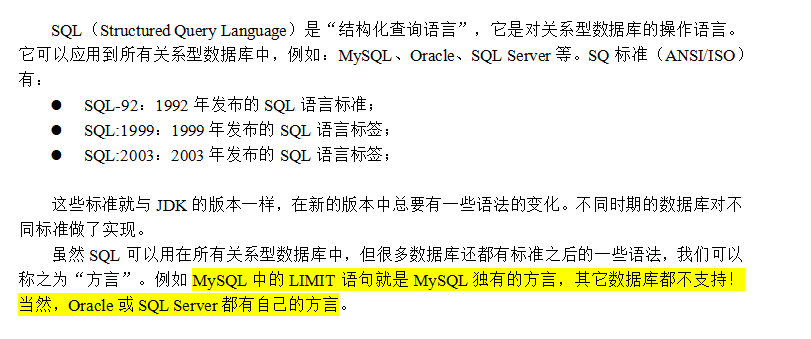

### 7-2 分类

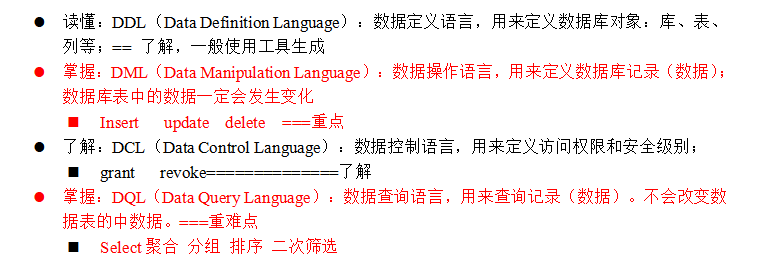

### 7-3 书写要求


## 8 SQL常见错误分析

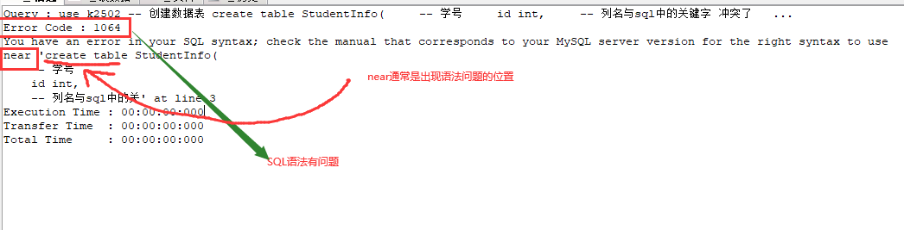

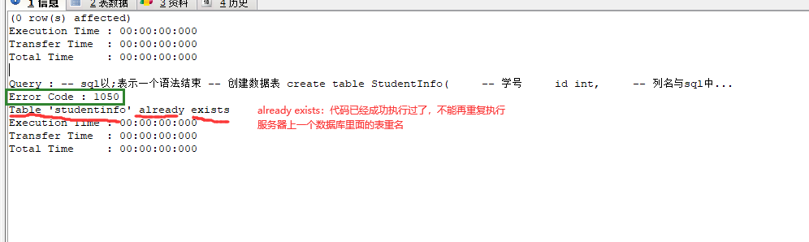

## 常用DOS命令补充：

- 如何快速的进入服务列表：win+r启动运行窗口，输入“services.msc"回车即可

- 如何快速启动服务：win+r启动运行窗口，输入“cmd"进入dos命令行窗口，在命令行窗口中输入”net start 服务名“就可以启动服务了

- 如何快速关闭服务：win+r启动运行窗口，输入“cmd"进入dos命令行窗口，在命令行窗口中输入”net stop 服务名“就可以关闭服务了


# 课程总结

## 1 掌握：create database  table  drop 

##                建表语法   数据类型关键字

## 2 *** insert语句  

  

## 3 理解：RDBMS 关系型数据库管理系统，就是数据库服务器

##       sqlyog客户端工具，写代码

##       连接数据库服务器：mysql -u -p -h


# 预习安排

mysql的DQL（分组 排序 limit 聚合函数  连接查询 。。。）

数据库约束：实体关系 ==== 理解