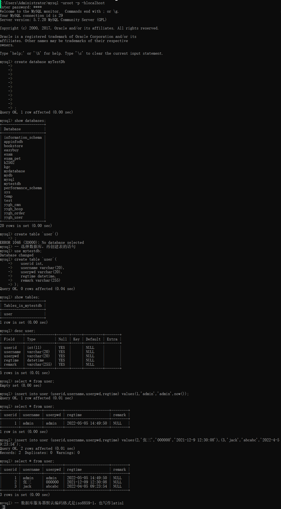
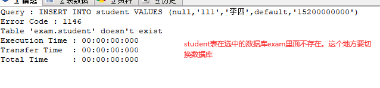
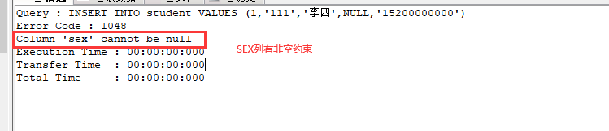
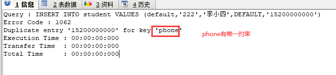

# 课程回顾

## 1 RDBMS概念

```html
数据库服务器，Relationship DataBase Management System 关系型数据库管理系统
```

## 2 SQL

```html
结构化查询语言 
要求：
1.所有的关键字不区分大小写
2.每一个语句使用;结束

分类：
DDL：数据定义语言  建库建表 删除数据库数据表 修改数据库 修改数据表
举例：create  drop  alter。。。

**DML:数据管理语言  增加  删除  修改数据
掌握：insert  update  delete


**DQL:数据查询语言  数据表数据的查询
掌握：select  group by  order by。。。。


DCL:数据控制语言  数据库操作权限
了解
举例：grant revoke。。。。
```

## 3 建库建表

```html
create database/table 库名/表名;
drop database/table 库名/表名;

show databases;
show tables;
-- 查看表结构（列名、列数据类型、列约束、编码格式...)
desc 表名;
```

## 4 添加

```html
-- 新增
insert into 表名(列名,...,列名) values (列值,,,,列值);
-- 简化1
insert 表名(列名,...,列名) values (列值,,,,列值);
-- 简化2：必须基于给一张表所有的列添加数据，添加列值顺序必须和创建表时列顺序一致
insert 表名 values (列值,,,,列值);
-- 简化3：批量新增
insert 表名 values (列值,,,,列值),(列值,,,,列值),...,(列值,,,,列值);

-- 查看表中的数据
select * from 表名;
```

## 5 mysql数据类型

```html
数值类型：
  int
  long
  byte
  bit
  double
  float
  decimal:精度更高一种浮点类型 用在货币使用 decimal(数据总长度，小数点保留位数)
举例 decimal(5,2):保存的最大值：999.99
字符类型：
  char(字符个数):固定长度
  varchar(字符个数):可变长度字符
举例 varchar(20) 实际存入3个字符
日期类型：
  date
  time
  datetime
时间戳：timestamp
```

## 6 回顾案例

```html
1.创建数据库：myTestDb
2.在myTestDb中添加一张表：
  user表名,
userID编号 int 
username varchar(10) 
userPwd  varchar(10)
regTime  datetime/timestamp
remark varchar(255)

-- 新增三个用户
1 admin admin 当前时间（'2022-'
2 张三 000000  。。
3 jack abcabc 。。
```

### 参考代码



# 课程目标

## 1 update和delete语法 === 掌握

## 2 运算符 === 掌握

## 3 数据库约束 ==== 理解

## 4 实体关系映射 ==== 理解，难点

# 课程实施

## 1 update语法

概念：修改数据现有的数据

### 修改语法

```mysql
-- 全表修改
update 表名 set 列名=新的列值,列名=新的列值,....,列名=新的列值
-- 带条件修改************************
update 表名 set 列名=新的列值,列名=新的列值,....,列名=新的列值 where 条件

```

### 课堂案例

```mysql
-- update 
SELECT * FROM studentinfo;
-- 修改性别男，且id是1的学生信息，手机号码修改为110
UPDATE studentinfo SET phone='110' WHERE sex='男' AND id=1;

-- 修改家庭注释是高老庄的学生，或者生日是1990-12-25，性别统一改为女
UPDATE studentinfo SET sex='女' WHERE address='高老庄' OR birthday='1990-12-25';

-- 将贾元春....家庭住址改为贾老庄
UPDATE studentinfo SET address='贾老庄' WHERE NAME='贾元春' OR NAME='贾迎春' OR NAME='贾探春' OR NAME='贾惜春'
-- 简化
UPDATE studentinfo SET address='大观园' WHERE NAME IN('贾元春','贾迎春','贾探春','贾惜春');
-- 修改birthday是null的学生生日修改为1999-9-9
-- null判断不能使用关系运算符， 表达是null is null 表达不是null   is not  null
UPDATE studentinfo SET birthday='1999-9-9' WHERE birthday IS NULL


```

### 模糊匹配like的案例演示

```mysql
-- 修改将1990年出生的学生，性别改成null
UPDATE studentinfo SET sex=NULL WHERE birthday BETWEEN '1990-1-1' AND '1990-12-31'
-- 修改将1990年出生的学生，性别改成女
UPDATE studentinfo SET sex='女' WHERE YEAR(birthday)=1990
UPDATE studentinfo SET sex=NULL  WHERE birthday LIKE '1990%'
-- 修改将1990年出生的学生，性别改成null
UPDATE studentinfo SET sex=NULL WHERE birthday BETWEEN '1990-1-1' AND '1990-12-31'
-- 修改名字最后一个字春的学生信息，手机号码120
UPDATE studentinfo SET phone='120' WHERE NAME LIKE '%春'
-- 修改姓名一共三个字，且中间字是元，手机号码null
UPDATE studentinfo SET phone=NULL WHERE NAME LIKE '_元_'

-- 1.修改家庭住址在湖北的，生日置为NULL
UPDATE studentinfo SET birthday=NULL WHERE address LIKE '湖北%'

-- 2.修改生日是null的且姓名两个字，家庭住址修改湖北武汉
-- where 列名 is null 
UPDATE studentinfo SET address='湖北咸宁' WHERE birthday IS NULL AND NAME LIKE '___'
```

## 2 运算符

### 算术运算符：

```mysql
+ - * / %
```

### 关系运算符

```mysql
=（读作相等)  !=(读作不等于)  <>(读作不等于)   > < >= <=
```


### 逻辑运算符

```mysql
and -- 与   or-- 或   not--非
```


### 模糊匹配运算符

```mysql
in: 等值判断，等价于=

举例：where id in (1,2,3)

翻译：id=1 or id=2 or id=3

not in:不等于判断

举例：where id not in(1,2,3)

翻译：id<>1 and id<>2 and id<>3


between ... and：范围判断

举例：where id>=1 and id<=10

简化：where id between 1 and 10
```

### NULL判断

```mysql
is null
is not null
```

### 模糊条件书写

like 条件，用在where后面，通常在字符列或日期列

```html
%:匹配多个字符（多个：0个或N个）
举例： where name like '张%';
where birthday like '1990%'
_：匹配1个字符
举例： where name like '张_';-- name是姓张，且姓名只有两字
where birthday like '1990_'
```


## 3 delete 语句

作用：删除数据表数据。

### 语法

```mysql
-- 清空表
delete from 表名;

-- 带条件删除
delete from 表名 where 条件;
```

### 课堂案例

```mysql
-- 删除学生编号在1到300之间
DELETE FROM studentinfo WHERE id>=1 AND id<=3
-- 简化 范围限制
DELETE FROM studentinfo WHERE id BETWEEN 1 AND 3

-- 删除性别不是男也不是女
DELETE FROM studentinfo WHERE sex!='男' AND sex<>'女'

SELECT * FROM studentinfo;
```


## 4 数据库约束

### 4-1 约束意义

约束建立在数据库保存数据时一些规则！！

保证用户保存在数据库上的数据准确的！！有意义！

举例：性别- 男女

  学号、身份证号--不能为空 不能重复

 手机号码--可以空，但是不为空，手机号码不能重复

### 4-2 关系型数据常见的约束分类

```html
主键约束：primary key
作用：保证该列值不能为空，且列值不能重复
唯一约束：unique key
作用：保证该列值不能重复。与主键约束最大的区别：唯一约束不要求非空
非空约束：not null
作用：保证该列不能 为NULL
检查约束：mysql不支持检查约束
默认值约束:default 默认值
作用：保证该列在程序员不给值的情况下，有值填充
自增长约束：auto_increment
特点：从序号1开始，每次在上一个序号基础上+1
作用：保证该列自动生成的列值。用在数值列。

外键约束****
```

### 4-3 约束使用位置

约束用在数据表的列上

```mysql
create table 表名(
  列名 数据类型 约束,
  列名 数据类型 约束,
  列名 数据类型 约束
)
```

### 4-4 课堂案例

```mysql
-- 约束：规则
CREATE DATABASE AA;
-- 基于aa创建带有约束的数据表
USE AA;
-- 创建表
-- 一张表，必须有一个主键，主键可以没有意义
CREATE TABLE student(
 -- 学号 int 主键：非空且不重复  自增长
 stuNo INT PRIMARY KEY AUTO_INCREMENT,
 -- 密码 非空
 stuPwd VARCHAR(20) NOT NULL,
 -- 姓名 非空
 stuName VARCHAR(25) NOT NULL,
 -- 性别 非空  默认值：不给我值，默认填充指定的值，缺省
 sex CHAR(1) NOT NULL DEFAULT '男',
 -- 手机号码  可以没有 但是如果有，不能重复
 phone CHAR(11) UNIQUE
);
-- 测试约束
INSERT INTO student(stuPwd,stuname) VALUES ('123','admin');
INSERT INTO student(stuPwd,stuname) VALUES ('1456','张三');
-- default:表示使用默认值
-- 主键：default，走自增长值，null和default是一样的效果
INSERT INTO student VALUES (NULL,'111','李四',DEFAULT,'15200000000');

INSERT INTO student VALUES (DEFAULT,'222','李小四',DEFAULT,'15210000000');

```

## 补充：修改mysql服务器root的账号密码

```mysql
-- 用户名是root的账户密码修改，密码修改：越简单越好
-- mysql服务器上，所有的系统数据都在mysql库中
-- 切换数据库
USE mysql;
-- 修改root的密码
-- password():对设置密码进行加密
-- 密码修改完毕之后，必须重启服务器
UPDATE USER SET authentication_string=PASSWORD('自己写') WHERE USER='root'
```








# 课程总结

1.update delete 写条件

2.修改mysql服务器root账号的密码

3.数据库约束意义、常见约束类型、约束使用语法

# 预习安排

DQL：单表查询、两表连接查询、子查询


