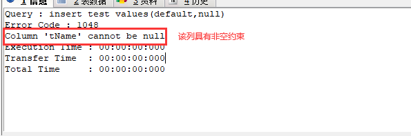
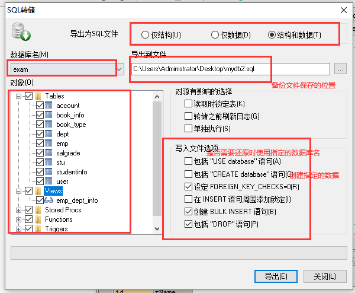
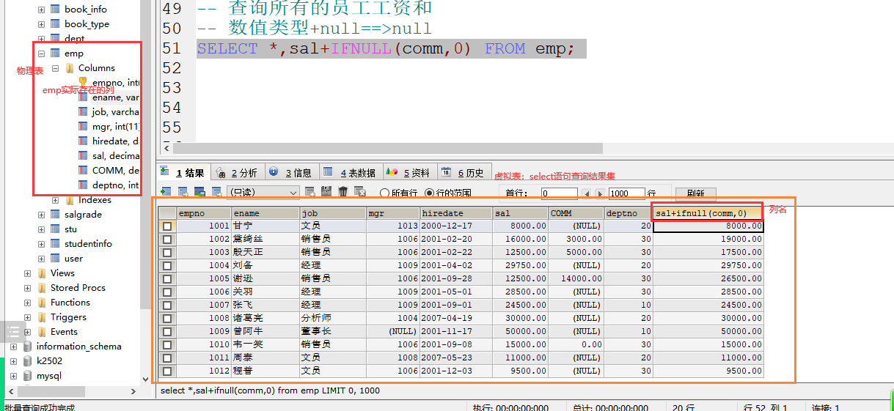
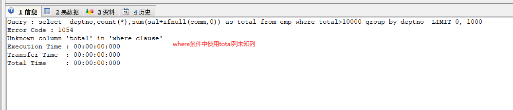

# 课程回顾

```mysql
1.update语句
update 表名 set 列名=新的值,列名=新的值,..,列名=新的值 where 条件;

条件中运算符：
算术运算符：+ - * / %
关系运算符：= != <> > >= < <=
逻辑运算符：and or not

模糊匹配：
between 最小值  and  最大值

in：
not in:

is null:
is not null:

like '% _'

2.delete语句
-- 清空一张表所有的数据
delete from 表名; -- 推荐优先使用delete

-- 截断表
truncate table 表名; -- 非法操作方式

-- 带条件删除
delete from 表名 where 条件

3. 约束
主键约束：primary key
唯一约束：unique
非空约束：not null
默认值约束： default
自增长约束:auto_increment

检查约束：mysql不支持！！！
外键约束：
```

## 2




# 课程目标

## 1 数据库备份和还原

## 2  单表查询 ======== 重点

## 3  两表连接查询 ======== 重点

## 4  外键约束和实体映射关系  ======== 理解

## 5 子查询 ======== 重点

# 课程实施

## 1 数据库备份和还原

### 数据库备份意义：

方便数据的共享和移动

数据因为失误丢失，可以通过备份快速恢复数据

### 备份实现方式：

mysql启动客户端

mysqld安装服务器

mysqldump数据备份

```html
mysqldump –u用户名 –p密码 数据库名>生成的脚本文件路径
```



## 2 单表查询

查询语句：不会改变数据表中的数据。获取数据。

### 2-1 DQL语法

```mysql
select 列名，....,列名 
from 表名
where 条件
group by 分组条件
having 筛选条件
order by 排序条件
limit 限制查询结果显示的行数
```

### 2-2 课堂案例

#### 查看一张表所有的数据

```mysql
select 列名,....,列名 from 表名;

简写：
如果查询一张表所有的列的数据，可以使用*表示所有列
```



#### 案例1：查询指定列、列起别名以及过滤列的重复值

```mysql
USE k2502;
CREATE TABLE test(
  -- 一张表必须有主键，列名可以没有意义
  id INT PRIMARY KEY AUTO_INCREMENT,
  tName VARCHAR(20) NOT NULL 
);

-- insert 1000
INSERT test VALUES(NULL,'aa'),(NULL,'bb'),(DEFAULT,'cc')

INSERT test VALUES(NULL,'dd')
-- select
SELECT * FROM test;

-- delete 
-- 自增长：删除的id，自动作废了
DELETE FROM test WHERE id=1002;

-- 表清空，重头开始
DELETE FROM test;

-- 截断表：自增长值，重置开始
-- 谨慎使用：底层不走数据库日志，数据删除“黑客”操作 无法还原
-- 底层实现：先删除表：drop  再创建：create
TRUNCATE TABLE test;


USE exam;
-- 查看所有的员工
-- *影响sql查询的性能，一般实际开发中，不推荐使用*
SELECT * FROM emp;
-- 查询所有
SELECT  empno,ename,emp.job,emp.sal,emp.COMM,emp.mgr,
emp.hiredate,emp.deptno
FROM emp

-- 查看所有的部门
SELECT * FROM dept;

-- 查看所有的薪资等级
SELECT * FROM salgrade;


-- 查看所有的员工姓名和岗位
SELECT emp.ename,emp.job
FROM emp;

-- 起别名
-- 查询所有的员工工资和
-- 数值类型+null==>null
-- as 别名
SELECT *,sal+IFNULL(comm,0) AS 薪资和 FROM emp;
-- 简化方式 as省略
SELECT *,sal+IFNULL(comm,0) 'aaa' FROM emp;

-- 查询emp有哪些工作岗位
-- DISTINCT 过滤指定列的重复值
SELECT DISTINCT job FROM emp;
```

#### 案例2：多条件查询

```mysql
USE exam;

-- 查询底薪sal大于10000 小于15000
SELECT * FROM emp WHERE sal>10000 AND sal<15000;

-- 查询没有奖金的员工信息
SELECT * FROM emp WHERE comm IS NULL;

-- 查询有奖金的员工信息
SELECT * FROM emp WHERE comm IS NOT NULL;

-- 查询哪些员工是文员或经理
SELECT * FROM emp WHERE job='文员' OR job='经理'
-- 变形
SELECT * FROM emp WHERE job IN('文员','经理')

-- 查询员工信息，条件员工的姓名第二字'飞'
SELECT * FROM emp WHERE ename LIKE '_飞%';

-- 查询入职时间晚于2001年的员工信息
SELECT * FROM emp WHERE emp.hiredate > '2001-12-31'
-- year(列名)获取列值中年份部分值
SELECT * FROM emp WHERE YEAR(hiredate)> 2001;
```

#### 案例3：分组查询

概念：将查询结果集按照指定列，列值相同的数据为一组，实现数据统计

分组应用场景：结合聚合函数

```mysql
-- 统计：各个部门有几个员工
-- group by 归类，分析，聚合
-- group by 结合聚合函数使用，跟单独列放在一起查询，查询结果有歧义
-- 分组编写：select 聚合函数，分组依据 from 
SELECT deptno,COUNT(*),MAX(sal),MIN(sal),AVG(sal) 
FROM emp GROUP BY deptno

-- 查询公司各个岗位人数
SELECT job,COUNT(*)
FROM emp
GROUP BY job

-- 查询每年入职的员工人数
SELECT YEAR(hiredate),COUNT(*)
FROM emp
GROUP BY YEAR(hiredate)
```

#### 案例4：排序查询

```mysql
order by 排序列名  排序规则（ASC-升序   DESC-降序），如果没有指定排序规则，默认ASC

-- 3.6 查看雇员信息以及员工的月薪与佣金之和，并根据薪资和降序排列
SELECT *,sal+IFNULL(comm,0) total FROM emp ORDER BY total DESC

-- order by 列名 排序规则,列名 排序规则,....,列名 排序规则
-- order by 对查询结果的虚拟表列进行排序。
-- order by后面可以有多个排序列，但是排序原则：优先第一个列，第一个列相同的情况，
-- 才会使用第二个列进行排序，以此类推
-- 优先按照薪资降序排，如果薪资相同，再按照入职时间升序排序
SELECT *,sal+IFNULL(comm,0) total FROM emp ORDER BY total DESC,hiredate ASC,ename ASC
```

#### 案例5：having二次筛选

##### having和where有什么区别

where：对分组前的列进行条件筛选，通常都是单列（没有被聚合函数包含的列）

having: 对分组后的查询结果中的列条件二次筛选。having通常跟聚合函数生成的列



```mysql
-- 查询每个部门的部门编号以及每个部门工资和大于10000的部门人数
-- 1. 根据部门分组，查询各个部门部门人数、工资和
SELECT 
deptno,COUNT(*) cnt,SUM(sal+IFNULL(comm,0)) AS total
FROM emp
-- where total>10000
GROUP BY deptno
HAVING total>10000
-- 排序：部门总人数降序
ORDER BY cnt DESC
-- 限制，只要一条
LIMIT 0,1
```

#### 案例6：限制查询结果行数

```mysql
-- mysql特有的关键字，分页核心实现方式
limit  开始显示的行对应下标,显示几行
-- 下标起始值从0开始，从第一行开始显示 对应下标0，以此类推

-- 查看所有的员工信息
-- 查询结果按照指定的行数显示
-- 从第一行开始显示，一共显示3行记录
SELECT * FROM emp LIMIT  0,3;

-- 第二页 3,3
SELECT * -- ③
FROM emp -- ①
WHERE -- ②
ORDER BY -- ④
LIMIT 3,3 -- ⑤

-- 第N页，  从第几行开始显示,3
SELECT * FROM emp LIMIT (N-1)*3,3

SELECT * FROM EMP LIMIT 6,3

SELECT * FROM EMP LIMIT 9,3
```

### DQL关键字的执行顺序

select和from必备关键字，其他关键字酌情出现

```mysql
SELECT  普通列,COUNT() -- 查询 ③出普通列的值   ⑤出聚合结果的值
FROM  -- 来自   ①
WHERE -- 条件   ②
GROUP BY  -- 分组 ④
HAVING -- 二次筛选 ⑥
ORDER BY -- 排序 ⑦
LIMIT -- 限制 ⑧
```

## 3 聚合函数

作用：对select查询结果集进行聚合分析。

```mysql
count():统计查询结果集的总行数
sum(列名):统计查询结果指定列的值求和
AVG(列名):统计查询结果指定列的值平均值
MAX(列名):统计查询结果指定列的值最大值
MIN(列名):统计查询结果指定列的值最小值
```

#### 补充：

```mysql
now():获取当前时间
year():获取列值的年份
ifnull():如果指定列是null，设置默认值
```

### 课堂案例

```mysql
-- 统计emp表有几个员工
-- 统计一个结果集有几行，使用count()
-- count(*)统计select * from emp查询结果的行数
-- count(10)统计select 10 from emp查询结果的行数
SELECT COUNT(*) FROM emp;

-- 统计这个公司一共有几位经理
-- 1.查询这个公司所有的经理的信息
-- 2.结果集上使用count()
SELECT COUNT(*) FROM emp WHERE job='经理'

-- 查询有提成的员工总数
-- SELECT * FROM emp WHERE comm IS NOT NULL;
SELECT COUNT(*) FROM emp WHERE comm IS NOT NULL;
-- 简化形式
-- count(列名):统计时忽略NULL值行
SELECT COUNT(comm) FROM emp;
SELECT comm FROM emp;

-- sum(列名): 列所有的值求和
-- 1.查询所有的员工，薪资sal和
SELECT sal FROM emp;

SELECT SUM(sal) FROM emp;

-- 2.提成
-- sum():求和忽略NULL值
SELECT SUM(sal) 底薪和,SUM(comm) 提成和 FROM emp;

-- 3.查询这个公司所有员工平均薪资
SELECT SUM(sal)/COUNT(sal) FROM emp;

-- 求平均值运行
SELECT AVG(sal) FROM emp;

-- 最低工资  最高工资，经理里面
SELECT MAX(sal),MIN(sal) FROM emp WHERE job='经理'
```

## 4 外键约束

作用：外键保证实体引用完整性

分析外键，引入E(entity 实体)-R(Relationship 关系)图例

### 外键概述

主表：主键所在的表就是主表

从表（子表）：外键所在的表

外键的特点：

  1、外键列的值必须引用自主表的主键值

   2、外键列的值可以为空

   3、外键值可以重复

主外键是构成表与表关联的唯一途径，有了这个途径才能实现多表的连接查询！

注意：外键其实就是另一张表的主键！例如员工表与部门表之间就存在关联关系，其中员工表中的部门编号字段就是外键，是相对部门表的外键。

### 演示案例

```mysql
CREATE DATABASE testDb;
USE testDb;
-- 主表：一般是1的一方
CREATE TABLE grade(
  gId INT  PRIMARY KEY AUTO_INCREMENT,
  gName VARCHAR(20)
);

-- 外键所在的表，称为子表 从表
CREATE TABLE student(
 sId INT PRIMARY KEY AUTO_INCREMENT,
 -- gid表示学生所属的班级编号，班级编号必须在班级表中实际存在
 gId INT,
 -- 约束 stu_fk给外键起的名称 外键(外键名称) 引用自 主表(主键)
 CONSTRAINT stu_fk FOREIGN KEY(gid) REFERENCES grade(gid),
 sname VARCHAR(10) NOT NULL
);
-- DDL修改表
ALTER TABLE student ADD CONSTRAINT stu_fk FOREIGN KEY(gid) REFERENCES grade(gid);

-- 外键的作用：保证数据引用完整性（理解：正确的数据）
-- 添加数据添加顺序的要求：先有父  再有子表
INSERT grade VALUES(1,'k2502'),(2,'k2503')
-- 外键约束：学生添加数据库中时，所在的班级编号是实际存在的，
INSERT student VALUES(NULL,10,'张健');
```

## 5 实体映射关系

emp：保存员工对象的表

dept:  保存部门对象的表

### 一对一

丈夫信息和妻子信息：一个丈夫只能有一个合法妻子，一个妻子只能有一个合法的丈夫

国家和最高领导人：

```mysql
两张表的主键互为对方的外键
```

### **一对多***

员工信息和部门信息：一对多关系（解读：一个部门中可以有多个员工）

班级信息和学生信息：一对多关系（一个班级可以有多个学生）

```mysql
外键创建在多的一方表中
```

### 多对多

学生信息和科目信息

```mysql
必须创建一个独立表，管理学生和科目之间的外键关系
```


# 课程总结

## DQL内容

```html
1.查询所有
2.起别名
3.过滤指定列重复值  distinct
4.多条件查询 where 
5.排序 order by
6.限制  limit
7.聚合函数 count() sum() avg() max() min()
8.分组 group by
9.二次筛选 having
```

## 理解外键的作用


## 了解：实体关系（1对多）


