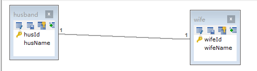
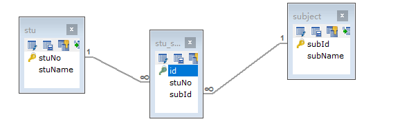
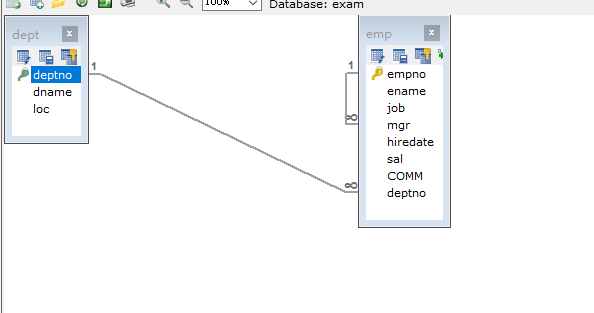
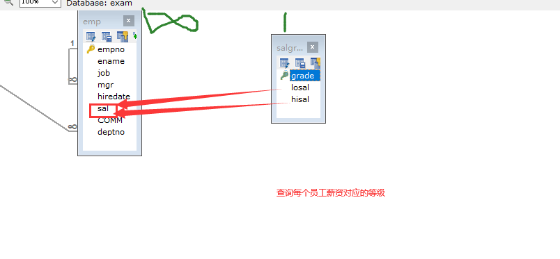
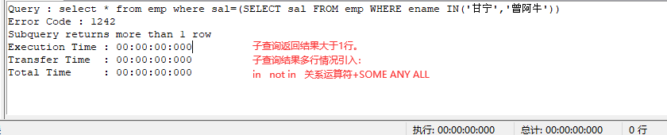
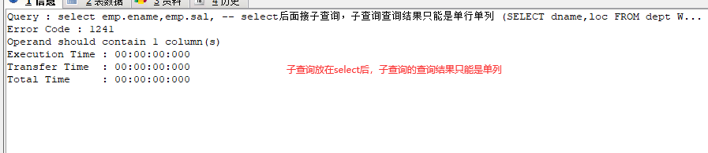
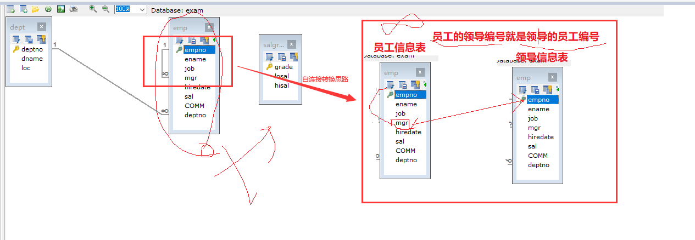

# 课程回顾

```mysql
1.DQL使用：
select  聚合函数
from 表名
where 条件
group by
having 
order by 
limit

-- DQL关键字中，select和from必须出现。其他单词可以有也可以没有
where:条件
group by:分组
having：二次筛选，针对（虚拟表)聚合计算结果筛选
where：针对（物理表）原表中数据进行筛选，
order by:升序 asc  降序DESC
limit:分页的主要实现
limit 开始显示数据行的下标（从0开始）,显示结果集行数


2.外键意义：保证两个表实体引用时一致
  外键创建思路，E-R实体关系：
  1对1：两个表的主键互为对方的外键。并不推荐使用外键创建约束。逻辑外键
  
  一对多：
  	一的这方作为主表：外键引用的主键所在的表
 	多的一方作为从表：外键所在表
  
  多对多：
    学生和科目之间：一个学生可以学多个科目，一个科目也可以被多个学生学习 
    创建一个专门用来维护学生和科目引用关系的表
    
 外键创建：foreign key
 create table 表名(
    -- 外键(通常与引用主表的主键同名、同类型)
    列名  数据类型  约束，
     constraint 外键约束名 foreign key(外键列名) references 主表(主键列)
 );
 
 -- DDL：数据定义语言  提供创建数据库、表  删除数据库、表、修改数据库、表
 -- 使用场景：表已经存在，添加外键约束
 alter table 表名 add constraint 外键约束名 foreign key(外键列名) references 主表(主键列)
 
 外键：两张表产生关联，其中一张表子表有一个外键列引用主表的主键值！！！
```

# 课程目标

## 1 实体关系下如何创建外键

## 2 连接查询：*内连接、*左外连接、*右外连接、自然连接（了解）

## 3 子查询

## 4 数据库事务 === 理解

# 课程实施

## 1 实体映射关系

### 1-1 1对1关系

```mysql
夫妻（男和女）

国家和总统
```




### 1-2 多对多

```mysql
学生和科目：1个学生学习多门课程  一个科目可以被多个学生学习

```



## 2 连接查询

DQL最重要的一个技能点。连接查询是后续课程使用的非常重要的技能点。

要求：掌握两张表连接查询。理解 三张表连接

### 2-1 MySQL特有方法

```mysql
select  表名1.列名,...,表2.列名

from 表名1,表名2
```

笛卡尔积结果：emp表的中数据和dept表中的数据：总行数乘积作为查询结果

emp表：20条*5条=100条

### 筛选笛卡尔积的结果

```mysql
select  表名1.列名,...,表2.列名

from 表名1,表名2

where 表1.外键=表2.主键
```

### 课堂案例



```mysql
USE exam;
-- 查询员工姓名、岗位及所在的部门名称和部门位置
SELECT emp.ename,emp.job,emp.deptno,dept.deptno,dept.dname,dept.loc
FROM emp,dept
-- 基于主外键去掉重复多余的数据
WHERE dept.deptno=emp.deptno
```



### 2-2 关系型数据库通用的方法

#### 内连接：等价于from后面接表名1，表名2

内连接特点：只能查询出两张表基于主外键相等时，同时存在的数据

```mysql
select  表名1.列名,...,表2.列名

from 表名1 inner join 表名2

on 表1.外键=表2.主键
```

#### 外连接

外连接特点：以一张表的数据为主，全部查询出来，另外一张表基于主外键相等的关系，有则显示数据，没有填充NULL

##### 左外连接

```mysql
select  表名1.列名,...,表2.列名

from 表名1 left [outer] join 表名2

on 表1.外键=表2.主键
```

##### 右外连接

```mysql
select  表名1.列名,...,表2.列名

from 表名1 right [outer] join 表名2

on 表1.外键=表2.主键
```

#### 课堂案例

```mysql
-- 查询员工信息及所在的部门信息
-- 内连接只能显示有部门编号的员工信息
SELECT emp.*,dept.dname,dept.loc
FROM emp INNER JOIN dept
ON emp.deptno=dept.deptno;


-- 查询所有的员工信息，部门信息有就显示，没有null
SELECT emp.*,dept.dname,dept.loc
FROM emp LEFT OUTER JOIN dept
ON emp.deptno=dept.deptno;

-- 同样的效果使用右外连接也可以实现
SELECT emp.*,dept.dname,dept.loc
FROM dept RIGHT JOIN emp
ON emp.deptno=dept.deptno;


-- 查询所有的部门信息，以及部门有的员工信息，如果该部门没有员工，员工信息填充NULL

```

#### 自然连接==== 了解

“佛系”，不需要指定主外键关系，sql根据指定表存在的同名同类型列自己关联

自然连接实现的前提是：连接查询的两张表必须存在同名同类型的列，否则自然连接会有问题

```mysql
-- 自然连接实现内连接效果
select  表名1.列名,...,表2.列名 from 表名1 natural join 表名2

-- 自然连接实现左外连接效果
select  表名1.列名,...,表2.列名 from 表名1 natural left join 表名2

-- 自然连接实现右外连接效果
select  表名1.列名,...,表2.列名 from 表名1 natural right join 表名2
```

##### 课堂案例

```mysql
-- 自然连接实现内连接效果
SELECT emp.*,dept.*
FROM dept NATURAL JOIN emp
-- 自主根据两张表同名同类型的列进行关联

-- 自然连接实现外连接效果
SELECT emp.*,dept.*
FROM dept NATURAL LEFT JOIN emp


SELECT emp.*,dept.*
FROM emp NATURAL RIGHT JOIN dept
```

## 3 子查询

### 3-1 子查询结果：单行单列 *****

通常where后面，使用关系运算符

```mysql
USE exam;
-- 子查询查询的结果是一个单行单列的结果，这种子查询用于where后面，通常结合关系运算符带入
-- 1.查询比黛绮丝工资更高员工信息
SELECT *
FROM emp
-- 子查询的执行顺序：先执行内部子查询，子查询结果带入外部select查询结果
WHERE sal>(SELECT sal FROM emp WHERE ename='黛绮丝')黛绮丝的工资

-- 2.查询跟谢逊同部门的员工信息
-- 2.1 知道谢逊的部门编号
-- 2.2 查询跟2.1执行结果一样的部门员工的信息
SELECT emp.*
FROM emp
--  谢逊的部门编号
WHERE  deptno=(SELECT deptno FROM emp WHERE ename='谢逊') AND ename<>'谢逊'

-- 3.查询与甘宁同岗位job的员工信息
SELECT *
FROM emp
WHERE emp.job=(SELECT job FROM emp WHERE ename='甘宁')
```

### 3-2 子查询结果：多行单列

子查询一般用在where后面，引入in not in，关系运算符+any some all



```mysql

-- 二.工资高于30部门所有人的员工信息
-- 方案一
-- 查询30部门最高工资
SELECT * FROM emp WHERE sal>(
	SELECT MAX(sal) FROM emp WHERE deptno=30
)

-- 方案二:子查询结果：多行单列,一般用在where后面，引入方式in not in，也可以关系运算符+some/any/all引入
-- 查询30部门所有的员工薪资
-- SOME/ANY:some和any是一个作用  ALL：所有
SELECT * FROM emp WHERE sal > ALL(
	SELECT sal FROM emp WHERE deptno=30
)

-- 练习：查询与黛绮丝或曾阿牛任意一个员工同部门的员工
-- 黛绮丝或曾阿牛所属部门编号
SELECT deptno FROM emp WHERE ename IN('黛绮丝','曾阿牛');

-- 查询与黛绮丝或曾阿牛任意一个员工同部门的员工
SELECT * FROM emp WHERE deptno=ANY(
	SELECT deptno FROM emp WHERE ename IN('黛绮丝','曾阿牛')
   )

-- 方案三：
SELECT * FROM emp WHERE deptno IN(
	SELECT deptno FROM emp WHERE ename IN('黛绮丝','曾阿牛')
   )
```

### 3-3 子查询结果：单行多列

子查询放在where后面，引入方式in not in  = !=



```mysql
   
-- 3. 查询工作和工资与殷天正完全相同的员工信息
-- 3.1 殷天正工作和工资
SELECT job,sal FROM emp WHERE ename='殷天正'
-- 3.2 完全相同
SELECT * FROM emp WHERE job=(SELECT job FROM emp WHERE ename='殷天正')
  AND sal=(SELECT sal FROM emp WHERE ename='殷天正')
  
-- 子查询返回结果是单行多列，一般放在where后面，引入方式in  not in 关系运算符= !=
SELECT * FROM emp WHERE (job,sal) = (SELECT job,sal FROM emp WHERE ename='殷天正')
```

### 3-4 子查询结果：多行多列

子查询放在from后面，一般作为虚拟表使用，通常虚拟表需要起别名

```mysql
-- 查询员工编号为1006的员工名称、员工工资、部门名称
SELECT emp.ename,emp.sal,t.dname
-- 子查询返回结果是多行多列，子查询一般用在from后面，
-- 当做虚拟表与其他的表组合查询,虚拟表必须有别名
FROM emp ,(SELECT deptno,dname,loc FROM dept)t
WHERE emp.empno=1006 AND emp.deptno=t.deptno
```

#### 补充该案例的其他解决方案

```mysql
-- 解决方案一：
SELECT emp.ename,emp.sal,dept.dname
FROM emp INNER JOIN dept
ON emp.deptno=dept.deptno
WHERE emp.empno=1006


-- 解决方案二：
-- 1.3 1006员工姓名、工资以及部门名称
SELECT emp.ename,emp.sal,
-- select后面接子查询，子查询查询结果只能是单列
(SELECT dname FROM dept WHERE deptno=emp.deptno) -- ③
FROM emp -- ①
WHERE empno=1006  -- ②

-- 解决方案二的执行步骤是：
-- 第一步1006的emp信息
SELECT * FROM emp WHERE empno=1006
-- 第二步将外层查询结果中的每一个deptno带入子查询使用
(SELECT dname,loc FROM dept WHERE deptno=emp.deptno) 
```

## 4 扩展练习

### 三表连接查询案例

```mysql
-- 1.查询员工姓名、岗位、所属部门、以及薪资等级信息
SELECT emp.ename,emp.job,dept.dname,salgrade.*
FROM emp,dept,salgrade
WHERE emp.deptno=dept.deptno AND emp.sal BETWEEN salgrade.losal AND salgrade.hisal
-- 通用sql里面的内连接查询
SELECT emp.ename,emp.job,dept.dname ,salgrade.*
FROM emp INNER JOIN dept
ON emp.deptno=dept.deptno 
INNER JOIN salgrade
ON emp.sal BETWEEN salgrade.losal AND salgrade.hisal
```

### 自连接案例



```mysql
-- 查询所有的员工信息及所属领导的姓名  扩展思路
-- 自连接，同一张存储不同的实体信息，所以需要起别名
SELECT empinfo.*,mgrinfo.ename
FROM emp AS mgrinfo RIGHT JOIN emp AS empinfo
ON empinfo.mgr=mgrinfo.empno
```


# 课程总结

## 1 掌握 内连接 外连接  mysql特有内连接实现方式（from 多个表名）

## 2 理解：1对多  多对多 1对1

## 3 掌握：子查询常规应用（子查询做where条件）

## 4 理解：自连接实现连接查询的思路！


# 预习安排

## JDBC： Driver  Connection Statement ResultSet四大对象

## 反射：反射概念和作用！！Class  Field  Method  Constructor对象

