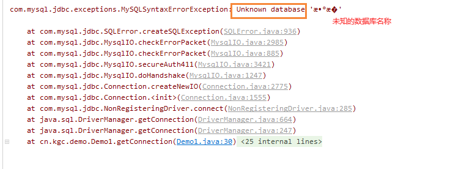
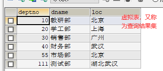
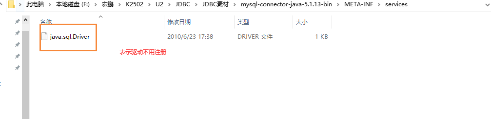
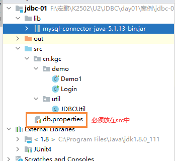

# 课程回顾

```mysql
1.重点技能：
 DML:INSERT UPDATE DELETE
 
 DQL:SELECT FROM WHERE GROPU BY HAVING ORDER BY LIMIT
 
 连接查询：
 内连接、左外连接、右外连接
 内连接和外连接：
 内连接特点：只查询两张表主外键同时存在的数据
 外连接特点：一张表数据全部显示，另外一张表，基于主外键数据显示，如果自动填充NULL
 
 子查询：where子句引入子查询 
 where 列名关系运算符 (子查询)
 
2.理解：
外键的概念和作用
实体关系：1对1 1对多  多对多

模糊匹配：
in not in  like  between...and

聚合函数

约束：
主键、自增长、唯一、非空、默认约束、外键
```

# 课程目标

## 1 JDBC概念和作用 ========== 理解

## 2 DriverManager对象 ==== 掌握

## 3 Connection对象 ==== 掌握

## 4 Statement对象 ==== 掌握

## 5 ResultSet对象 ==== 掌握

## 6 JDBCUtil工具类抽取 ==== 掌握

# 课程实施

## 1 JDBC概述

### 1-1 概念

java DataBase Connective: java连接数据库的技术

### 1-2 作用

使用java提供的类或对象完成对数据的操作（获取、新增、修改和删除）

### 1-3 使用

SUN只封装JDBC使用接口，并没有提供接口具体实现。哪个数据库想被java操作，就由该数据库的厂商提供java接口的具体实现。

**数据库驱动**：各大数据库厂商提供的JDBC接口得实现类。

#### 使用步骤

```html
1.下载驱动
2.使用驱动提供的实现类，完成数据库连接
3.基于数据库连接，实现数据库的数据的CRUD
```

### 连接数据库的代码

```java
@Test
	public void getConnection() throws Exception{
		/**
		 * 步骤：
		 * 1.连接数据库
		 * 1-1 注册驱动 new 驱动()
		 * 1-2 通过驱动管理器获取数据库连接对象
		 */
		//注册驱动写法2：不推荐  会让驱动注册两次！重复注册
		//new Driver();
		//注册驱动1：反射方式
		Class.forName("com.mysql.jdbc.Driver");
		//url必须是java能够识别的数据库连接url
		/**
		 * url:连接数据库服务器的url地址，格式必须与老师的格式一模一样
		 * user:root登录这个服务器的用户名
		 * passwor:登录这个服务器的密码
		 */
		Connection connection=DriverManager.getConnection("jdbc:mysql://localhost:3306/exam",
				"root","root");//获取数据库连接
		System.out.println(connection);
	}
```

#### 常见异常



## 2 JDBC操作DML

### 2-1 操作步骤

```html
1. 注册驱动
2. 获取数据库连接
3. 定义sql语句，发送给数据库执行
4. 释放资源
```

#### 参考代码

```java
	@Test
	public void insertDept() throws Exception{
		/*
		* 1. 注册驱动
		* 2. 获取数据库连接
		* 3. 定义sql语句，发送给数据库执行
		* 4. 释放资源
		 */
		Class.forName("com.mysql.jdbc.Driver");
		//url：localhost:3306是默认配置，可以省略
		Connection con = DriverManager.getConnection("jdbc:mysql:///exam", "root", "root");
		//定义sql语句:sql语句必须是sqlyog能够正常执行的代码，sql不区分大小写
		String sql="INSERT dept(deptno,dname,loc) VALUES(111,'k2502','湖北武汉');";
		//执行sql
		//JDBC专门执行sql的对象statement
		Statement statement = con.createStatement();
		//sql执行成功后，受影响的行数1
		int row = statement.executeUpdate(sql);
		System.out.println("受影响的行数是："+row);

		//释放资源
		statement.close();
		con.close();
	}

	@Test
	public void updateDept() throws Exception{
		/**
		 * 1.注册驱动
		 * 2.获取数据库连接
		 * 3.定义sql语句
		 * 4.获取sql执行对象，执行sql
		 * 5.释放资源
		 */
		Class.forName("com.mysql.jdbc.Driver");
		//url：localhost:3306是默认配置，可以省略
		Connection con = DriverManager.getConnection("jdbc:mysql:///exam", "root", "root");
		//定义sql语句:sql语句必须是sqlyog能够正常执行的代码，sql不区分大小写
		String sql="update dept set dname='测试部' where deptno=111 ";
		//执行sql
		//JDBC专门执行sql的对象statement
		Statement statement = con.createStatement();
		//sql执行成功后，受影响的行数1
		int row = statement.executeUpdate(sql);
		System.out.println("受影响的行数是："+row);

		//释放资源
		statement.close();
		con.close();
	}
```

## 3 JDBC操作DQL



### 操作步骤

```html
1.注册驱动
2.获取数据库连接Connection
3.定义sql=“select"
4.获取Statement对象，使用executeQuery()执行sql
5.获取ResultSet对象
6.遍历ResultSet获取结果数据，sout()输出
7.释放资源：先开后关
```

#### 参考代码

```java
	@Test
	public void selectDept() throws Exception{
		//1.注册驱动
		Class.forName("com.mysql.jdbc.Driver");
		//2.获取数据库连接Connection
		Connection conn = DriverManager.getConnection("jdbc:mysql:///exam?useUnicode=yes&characterEncoding=utf-8",
				"root", "root");
		//3.定义sql=“select"
		String sql="SELECT `deptno`, `dname`, `loc` FROM `dept`;";
		//4.获取Statement对象，使用executeQuery()执行sql
		Statement stmt = conn.createStatement();
		//5.获取ResultSet对象
		ResultSet rs = stmt.executeQuery(sql);
		//6.遍历ResultSet获取结果数据，sout()输出
		while(rs.next()){//next()判断是否有下一行可以获取，如果有，进入循环 同时调用next()游标会移动一次
			//游标指向一行数据
			int deptno = rs.getInt("deptno");
			String dname = rs.getString(2);
			String loc = rs.getString("loc");//
			System.out.println(deptno+"\t\t\t"+dname+"\t\t\t"+loc);
		}
		//7.释放资源：先开后关
		rs.close();
		stmt.close();
		conn.close();
	}
```

## 4 JDBC小结

### Driver对象



#### 小细节：JDBC4.0以后，Class.forName()可以省略不写！！！

```html
driver就是mysql提供的驱动对象。
Class.forName("Driver的完整引用名：包名.类名")
```

### DriverManager对象

```html
DriverManager驱动管理器对象，作用获取数据库服务器的连接对象Connection
DriverManager.getConnection(url,user,password):
异常情况，基于java的Connection对象发送给数据的insert、update语句，如果有中文，中文在数据库是乱码！！！
解决方案：URL地址附带编码格式
jdbc:mysql://localhost:3306/自己数据库名称?useUnicode=yes&characterEncoding=UTF-8
```

### Connection对象

```html
概念：表示数据库连接对象。
作用：获取数据库执行sql的对象
connection的createStatement();
```

### Statement对象

```html
概念：表示数据库服务器执行sql的对象
作用：执行sql！！！！！
方法名称：
executeUpdate():只能执行DML操作
```

### ResultSet对象

```html
概念：结果集
使用方法：
while(结果集.next()){
   结果集.getXXX(列名或列序号);
}
```

## 5 SQL注入

需求：实现登录

```html
1.获取用户输入的用户名和密码
2.用户名和密码拼接sql语句，在数据库的user表查询
SELECT count(*) FROM `user` WHERE username='admin' AND `password`='admin'
3.查询结果存在该用户，登录成功，否则登录失败
ResultSet.next() 判断登录是否成功！！
```

### 登录代码的实现方案一

```java
package cn.kgc.demo;

import java.sql.*;
import java.util.Objects;
import java.util.Scanner;

/**
 * @Author: lc
 * @Date: 2022/5/9
 * @Description: cn.kgc.demo
 * @Version: 1.0
 */
public class Login {
	public static void main(String[] args) {
		//1.收集数据
		Scanner input=new Scanner(System.in);
		System.out.print("用户名：");
		String userName = input.nextLine();
		System.out.print("密码：");
		String userPwd = input.nextLine();

		//2.处理业务逻辑
		Connection connection = null;
		Statement stmt = null;
		ResultSet rs = null;
		try {
			Class.forName("com.mysql.jdbc.Driver");
			connection = DriverManager.getConnection("jdbc:mysql:///exam?useUnicode=yes&characterEncoding=utf-8","root","root");
			String loginSql="SELECT * FROM `user` WHERE username='"+userName+"' AND `password`='"+userPwd+"'";
			stmt = connection.createStatement();
			rs = stmt.executeQuery(loginSql);
			rs=stmt.executeQuery();
			//3.输出结果
			System.out.println(rs.next()?"登录成功":"登录失败");
		} catch (ClassNotFoundException e) {
			e.printStackTrace();
		} catch (SQLException throwables) {
			throwables.printStackTrace();
		} finally {
			try {
				//释放资源
				if (!Objects.isNull(rs)) {
					rs.close();
				}
				if (!Objects.isNull(stmt)) {
					stmt.close();
				}
				if (!Objects.isNull(connection)) {
					connection.close();
				}
			} catch (SQLException throwables) {
				throwables.printStackTrace();
			}
		}

	}
}
//测试时，输入以下用户名密码会有一些神奇的效果
用户名：aa' or 1=1;-- 
密码：bb
登录成功
```

### 5-1 SQL注入的现象

借助sql里面一些特殊符号，比如or 1=1 -- ，绕过sql验证，直接操作数据库！！

这种行为非常危险！！！必须避免！！

### 5-2 防范sql注入

```html
1. 查询结果进行校验！！！
select * from 查询一个用户信息
应该校验用户结果集的行数：查询结果集有且只有1行

遍历结果集，取出用户名和密码，再一次与用户输入的值进行比对

2.对于表单提交的用户输入值，应该进行校验
用户名或密码不能够出现 -- # '' ;

3.jdbc将参数带入数据库，应该对参数类型、数据格式进行校验
解决方案：JDBC防范sql注入，preparedStatement可以实现参数值的格式和类型校验！！
```

## 6 preparedStatement*****

```html
概念：preparedStatement是statement的子类。相较于父类statement，preparedstatement优点：
1.防范sql注入
2.性能比父类更好（预编译对象）
preparedStatement执行sql时，对于sql的语法只检验一次，以后就不再校验语法，只是带入参数做执行。性能会更好
作用：执行sql！
不再使用statement，因为有sql注入的风险。
```

### 6-1 使用步骤

```html
1.sql使用?占位符
2.connection.preparedStatement(sql)
3.PreparedStatement.setXX(第几个？，什么实参值)
4.executeQuery() executeUpdate()
5.释放资源
```

### 课堂案例

```java
package cn.kgc.demo;

import java.sql.*;
import java.util.Objects;
import java.util.Scanner;

/**
 * @Author: lc
 * @Date: 2022/5/9
 * @Description: cn.kgc.demo
 * @Version: 1.0
 */
public class Login {
	public static void main(String[] args) {
		//1.收集数据
		Scanner input=new Scanner(System.in);
		System.out.print("用户名：");
		String userName = input.nextLine();
		System.out.print("密码：");
		String userPwd = input.nextLine();

		//2.处理业务逻辑
		Connection connection = null;
		PreparedStatement stmt=null;
		ResultSet rs = null;
		try {
			Class.forName("com.mysql.jdbc.Driver");
			connection = DriverManager.getConnection("jdbc:mysql:///exam?useUnicode=yes&characterEncoding=utf-8","root","root");
			//preparedStatement使用步骤
			//1.sql中带入参数部分，统一使用?占位
			String loginSql="SELECT count(*) FROM `user` WHERE username=? AND `password`=?";
			//2.获取PreparedStatement对象
			stmt = connection.prepareStatement(loginSql);//校验sql语法

			//3.将实参与？进行一一映射
			stmt.setString(1,userName);
			stmt.setString(2,userPwd);

			rs=stmt.executeQuery();
			if(rs.next()){
				int row = rs.getInt(1);
				//3.输出结果
				System.out.println(row==1?"登录成功":"登录失败");
			}

		} catch (ClassNotFoundException e) {
			e.printStackTrace();
		} catch (SQLException throwables) {
			throwables.printStackTrace();
		} finally {
			try {
				//释放资源
				if (!Objects.isNull(rs)) {
					rs.close();
				}
				if (!Objects.isNull(stmt)) {
					stmt.close();
				}
				if (!Objects.isNull(connection)) {
					connection.close();
				}
			} catch (SQLException throwables) {
				throwables.printStackTrace();
			}
		}

	}
}

```

## 7 JDBC封装



### 7-1 抽取数据库配置文件,db.properties

```properties
# key=value
# 驱动
driverName=com.mysql.jdbc.Driver
# url
url=jdbc:mysql:///exam?useUnicode=yes&characterEncoding=utf-8
# 用户名
username=root
# 密码
password=root
```

### 7-2 工具类代码实现

```java
package cn.kgc.util;

import java.sql.*;
import java.util.Objects;
import java.util.ResourceBundle;

/**
 * @Author: lc
 * @Date: 2022/5/9
 * @Description: 减少重复的数据库驱动注册、连接对象的获取以及资源释放重复代码
 * @Version: 1.0
 */
public class JDBCUtil {
	private static String driverName;
	private static String url;
	private static String username;
	private static String password;
	//加载配置文件中的信息
	static{
		//读取配置文件
		//bundle本质就是map集合
		ResourceBundle bundle = ResourceBundle.getBundle("db");
		driverName=bundle.getString("driverName");
		url=bundle.getString("url");
		username=bundle.getString("username");
		password=bundle.getString("password");
	}
	/**
	 * 注册驱动
	 * 思考：数据库mysql，注册驱动是否需要每次执行sql都注册一遍驱动？？
	 * 没必要。数据库驱动注册代码，项目的生命周期有且只需要执行一次
	 */
	static{//静态代码块，类加载就会执行一次，以后都不会再执行
		//1.注册驱动
		try {
			Class.forName(driverName);
		} catch (ClassNotFoundException e) {
			//所有编译期异常转化运行时异常
			throw new RuntimeException(e);
		}
	}

	/**
	 * 获取数据库连接
	 */
	public static Connection getConnection(){
		try {
			return DriverManager.getConnection(url,username,password );
		} catch (SQLException e) {
			throw  new RuntimeException(e);
		}
	}

	/**
	 * 释放资源，针对DQL操作
	 * @param connection 数据库连接对象
	 * @param stmt sql执行对象
	 * @param rs 结果集对象
	 */
	public static void release(Connection connection, Statement stmt, ResultSet rs){
		try {
			//释放资源
			if (!Objects.isNull(rs)) {
				rs.close();
			}
			if (!Objects.isNull(stmt)) {
				stmt.close();
			}
			if (!Objects.isNull(connection)) {
				connection.close();
			}
		} catch (SQLException throwables) {
			throwables.printStackTrace();
		}
	}
	/**
	 * 释放资源，针对DML操作
	 * @param connection 数据库连接对象
	 * @param stmt sql执行对象
	 */
	public static void release(Connection connection, Statement stmt){
		try {
			//释放资源
			if (!Objects.isNull(stmt)) {
				stmt.close();
			}
			if (!Objects.isNull(connection)) {
				connection.close();
			}
		} catch (SQLException throwables) {
			throwables.printStackTrace();
		}
	}
}
```


# 课程总结

重点：JDBC几个对象的概念和作用

理解：JDBCUtil简化开发


# 课程预习

反射思想：

 Class获取方式

 Constructor获取方式

 Method获取方式

 Field获取方式

三层架构+数据库连接池+DBUtils工具类的引入