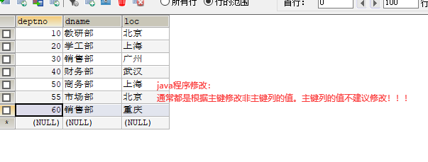
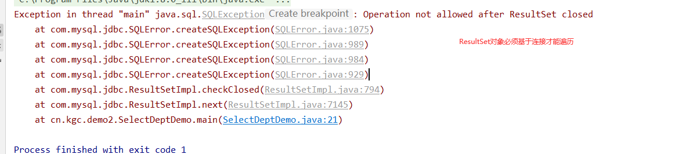
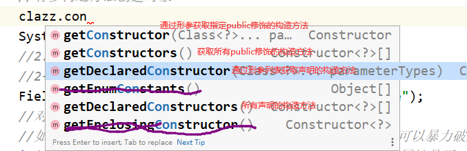
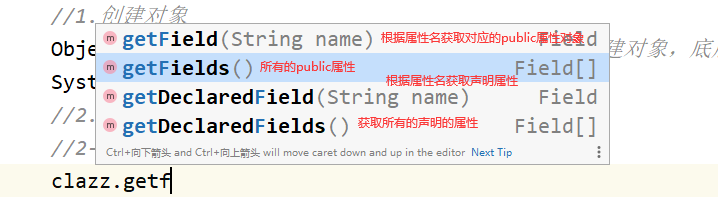
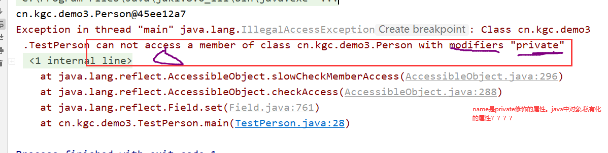
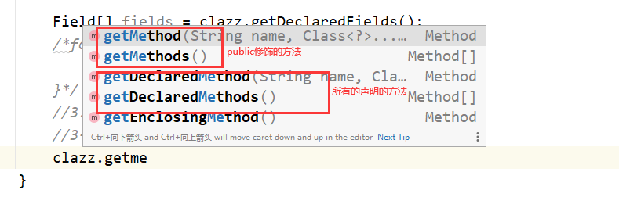
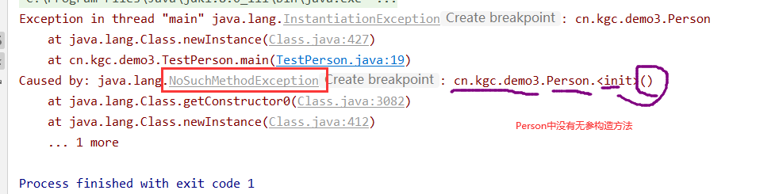
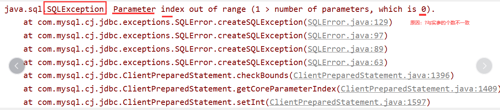

# 课程回顾

```html
1.JDBC提供五个对象实现数据库单表的CRUD
DriverManager.getConnection():获取数据库连接
Connection.preparedStatement():执行sql语句的预编译执行对象
PreparedStatement.executeQuery():ResultSet查询结果集对象
```

# 课程目标

## 1 JDBC的CRUD封装：执行sql的两个方法

## 2 反射机制 ============ 理解

## 3 DBUtils工具类

# 课程实施

## 1 案例实现：实现Dept的CRUD

```HTML
分析：
1.Scanner接收用户输入部门信息
2.JDBC代码完成用户提交信息的添加
  实现思路：
   · 获取要添加的数据
   · 定义String的sql：insert语句
   · PreparedStatement指定insert语句
   · 数据添加成功！
   · 显示添加成功后，数据库所有的dept信息

3.Scanner提示用户输入要修改或删除的部门编号
4.根据部门编号查询对应的部门信息，部门信息如果存在，则可以修改或删除
实现删除的思路：
  · 提示用户输入要删除的部门编号  Scanner  90
  · 使用select查询用户输入的部门编号是否存在 select * from dept where deptno=?

  · 如果编号存在的，就执行删除 delete from dept where deptno=?
实现修改的思路：
  · 提示用户输入要修改的部门编号  Scanner  90
  · 使用select查询用户输入的部门编号是否存在 select * from dept where deptno=?

  · 如果编号存在的，就执行修改 update dept set 列=新的值,列=值 where deptno=?
```

### 1-1 新增代码实现

```java
package cn.kgc.demo2;

import cn.kgc.util.JDBCUtil;

import java.sql.Connection;
import java.sql.PreparedStatement;
import java.sql.ResultSet;
import java.sql.SQLException;
import java.util.Scanner;

/**
 * @Author: lc
 * @Date: 2022/5/10
 * @Description: 部门信息的新增
 * @Version: 1.0
 */
public class InsertDemo {
	public static void main(String[] args) {
		/*实现思路：
		   · 获取要添加的数据
		   · 定义String的sql：insert语句
		   · PreparedStatement指定insert语句
		   · 数据添加成功！
		   · 显示添加成功后，数据库所有的dept信息
		   */
		Scanner input = new Scanner(System.in);
		//部门编号：主键（唯一、非空）  主键不是自增长
		System.out.print("部门编号：");
		int deptNo=input.nextInt();
		System.out.print("部门名称：");
		String deptName = input.next();
		System.out.print("所在位置：");
		String location = input.next();

		//定义sql，插入数据库的dept表
		String sql="insert dept values(?,?,?);";
		//JDBC五大对象
		Connection conn = JDBCUtil.getConnection();
		PreparedStatement pstm = null;//1.防范sql注入  2.预编译对象
		try {
			pstm = conn.prepareStatement(sql);

			//将?与实际接收用户输入的数据做对应
			//setXXX(?的序号,?对应的实参变量名)
			pstm.setInt(1,deptNo);
			pstm.setString(2,deptName);
			pstm.setString(3,location);

			//执行
			int row = pstm.executeUpdate();//程序就会报错！！！！
			System.out.println(row==1?"执行成功":"执行失败");
		} catch (SQLException throwables) {
			throwables.printStackTrace();
		} finally {
			//释放资源
			JDBCUtil.release(conn,pstm);
		}
	}
}

```

### 1-2 查询所有代码实现

```java
package cn.kgc.demo2;

import cn.kgc.util.JDBCUtil;

import java.sql.Connection;
import java.sql.PreparedStatement;
import java.sql.ResultSet;
import java.sql.SQLException;
import java.util.Scanner;

/**
 * @Author: lc
 * @Date: 2022/5/10
 * @Description: 部门信息的新增
 * @Version: 1.0
 */
public class InsertDemo {
	public static void main(String[] args) {
		//JDBC五大对象
		Connection conn = JDBCUtil.getConnection();
		PreparedStatement pstm2=null;
		ResultSet rs=null;
		try {
			//显示所有的dept信息
			String querySql="select deptno,dname,loc from dept;";
			pstm2= conn.prepareStatement(querySql);
			rs= pstm2.executeQuery();
			System.out.println("编号\t\t\t部门名称\t\t\t位置");
			while(rs.next()){
				System.out.println(rs.getInt(1)+"\t\t\t"+rs.getString(2)+"\t\t\t"+rs.getString("loc"));
			}
		} catch (SQLException throwables) {
			throwables.printStackTrace();
		} finally {
			//释放资源
			JDBCUtil.release(conn,pstm2,rs);
		}
	}
}

```

### 1-3 删除代码实现

```java
package cn.kgc.demo2;

import cn.kgc.util.JDBCUtil;

import java.sql.Connection;
import java.sql.PreparedStatement;
import java.sql.ResultSet;
import java.util.Scanner;

/**
 * @Author: lc
 * @Date: 2022/5/10
 * @Description: cn.kgc.demo2
 * @Version: 1.0
 */
public class DeleteDemo {
	public static void main(String[] args) throws Exception{
		//1.获取部门编号
		Scanner input = new Scanner(System.in);
		System.out.print("要删除的部门编号：");
		int deptno = input.nextInt();
		//2.校验部门编号是存在
		String sql="select deptno,dname,loc from dept where deptno=?;";
		//3.执行sql，获取结果
		Connection conn = JDBCUtil.getConnection();
		PreparedStatement pstm = conn.prepareStatement(sql);
		pstm.setInt(1,deptno);
		ResultSet rs = pstm.executeQuery();
		if(!rs.next()){
			//用户输入的编号不存，不删除
			System.out.println("您要删除的部门不存在！");
			return;
		}
		//执行删除
		String sql2="delete from dept where deptno=?";
		pstm=conn.prepareStatement(sql2);
		pstm.setInt(1,deptno);
		int row = pstm.executeUpdate();
		System.out.println(row==1?"删除成功":"删除失败");

		JDBCUtil.release(conn,pstm,rs);
	}
}
```

### 1-4 修改代码实现



```java
package cn.kgc.demo2;

import cn.kgc.util.JDBCUtil;

import java.sql.Connection;
import java.sql.PreparedStatement;
import java.sql.ResultSet;
import java.util.Scanner;

/**
 * @Author: lc
 * @Date: 2022/5/10
 * @Description: cn.kgc.demo2
 * @Version: 1.0
 */
public class UpdateDemo {
	public static void main(String[] args) throws Exception{
		//1.输入要修改的部门编号
		Scanner input = new Scanner(System.in);
		System.out.print("要修改的部门编号：");
		int deptno = input.nextInt();

		//2.基于存在才修改
		//2.校验部门编号是存在
		String sql="select deptno,dname,loc from dept where deptno=?;";
		//3.执行sql，获取结果
		Connection conn = JDBCUtil.getConnection();
		PreparedStatement pstm = conn.prepareStatement(sql);
		pstm.setInt(1,deptno);
		ResultSet rs = pstm.executeQuery();
		if(!rs.next()){
			//用户输入的编号不存，不删除
			System.out.println("您要删除的部门不存在！");
			return;
		}
		//可以进行修改
		String sql2="update dept set dname=?,loc=? where deptno=?";
		System.out.print("修改后的部门名称：");
		String newDname = input.next();

		System.out.print("修改后的部门所在位置：");
		String newLoc = input.next();

		pstm=conn.prepareStatement(sql2);
		pstm.setString(1,newDname);
		pstm.setString(2,newLoc);
		pstm.setInt(3,deptno);
		int row = pstm.executeUpdate();
		System.out.println(row==1?"修改成功":"修改失败");

		JDBCUtil.release(conn,pstm,rs);
	}
}
```

## 2 Detp进行JDBC执行代码的封装

### 2-1 DML操作封装成一个方法

```java
package cn.kgc.demo2;

import cn.kgc.util.JDBCUtil;

import java.sql.Connection;
import java.sql.PreparedStatement;
import java.sql.SQLException;

/**
 * @Author: lc
 * @Date: 2022/5/10
 * @Description: cn.kgc.demo2
 * @Version: 1.0
 */
public class ExecuteHandler {
	/**
	 * 处理insert、update、delete的sql
	 * @param sql 要执行的DML语句
	 * @param params sql语句?对应的参数列表
	 * @return DML操作受影响的行数
	 */
	public int executeDML(String sql,Object... params){
		Connection conn = JDBCUtil.getConnection();
		PreparedStatement pstm = null;
		try {
			pstm = conn.prepareStatement(sql);
			//有几个实参，就要做几次？的参数映射
			for(int i=0;i<params.length;i++){
				pstm.setObject(i+1,params[i]);
			}
			return pstm.executeUpdate();
		} catch (SQLException e) {
			throw new RuntimeException(e);
		} finally {
			JDBCUtil.release(conn,pstm);
		}
	}
}
```

### 2-2 DQL操作封装成一个方法



```java
   /**
	 * 处理SELECT的sql
	 * @param sql 要执行的DQL语句
	 * @param params sql语句?对应的参数列表
	 * @return
	 */
	//sql:查询dept表，resultSet保存所有的部门信息  List<部门信息>
	//sql:查询emp表，resultSet保存所有的员工信息  List<员工信息>
	public List<T> executeDQLX(String sql,Class<T> clazz, Object... params){
		Connection conn = JDBCUtil.getConnection();
		PreparedStatement pstm = null;
		try {
			pstm = conn.prepareStatement(sql);
			//有几个实参，就要做几次？的参数映射
			for(int i=0;i<params.length;i++){
				pstm.setObject(i+1,params[i]);
			}
			ResultSet rs= pstm.executeQuery();
			//遍历rs
			//rs==>List<>
			List<T> list=new ArrayList<>();
			while(rs.next()){
				//new对象
				T obj = clazz.newInstance();//底层基于无参构造方法
				//获取所有定义的属性对象 其实字段，设计与表列名同名、同类型
				Field[] fields = clazz.getDeclaredFields();
				for(Field f:fields){
					String colName = f.getName();//f.getName():获取属性对应的变量名，变量名与表列同名、同类型
					Object value = rs.getObject(colName);
					if(!f.isAccessible()){
						f.setAccessible(true);
					}
					f.set(obj,value);//赋值
				}
				//obj对象设置属性值
				list.add(obj);
			}
			return list;
		} catch (Exception e) {
			throw new RuntimeException(e);
		} finally {
			//ResultSet必须基于连接才能数据遍历
			JDBCUtil.release(conn,pstm,rs);
		}
	}
```

## 3 反射

### 3-1 概念

java一种编程机制：可以通过java代码动态获取一个类中每个组成部分对应的对象类型。

### 3-2 作用

分析一个类的组成部分。很多高级框架的底层实现。理解了反射，就更容易理解很多框架底层实现思想

### 3-3 使用

#### 获取一个class文件对应的字节码对象*******

java将字节码文件对应的对象抽取成一个类，类名：Class

```java
1.对象.getClass():Class对象
    
2.类名.class:Class对象
    
3.Class.forName():Class对象   推荐使用方式
  优点：对于未来产生的类做预见性的对象获取
```

##### 课堂案例

```java
package cn.kgc.demo3;

/**
 * @Author: lc
 * @Date: 2022/5/10
 * @Description: cn.kgc.demo3
 * @Version: 1.0
 */
public class TestPerson {
	public static void main(String[] args) throws Exception{
		//获取Person这个字节码对象
		//Class clazz = Person.class;
		//Class.forName("类完整限定名：包名.类名");
		Class clazz = Class.forName("cn.kgc.demo3.Person");
		//获取Class的方式三
		/*Person p = new Person();
		Class clazz = p.getClass();*/
		//1.创建对象
		Object obj=clazz.newInstance();//newInstance创建对象，底层基于无参构造方法
		System.out.println(obj);
	}
}
//输出结果
cn.kgc.demo3.Person@45ee12a7
```

#### 获取构造方法对象

##### 获取constructor对象的方法



```java
构造方法：Constructor
方法：newInstance()
```

##### 课堂案例

```java
package cn.kgc.demo3;

import java.lang.reflect.Constructor;
import java.lang.reflect.Field;
import java.lang.reflect.Method;

/**
 * @Author: lc
 * @Date: 2022/5/10
 * @Description: cn.kgc.demo3
 * @Version: 1.0
 */
public class TestPerson {
	public static void main(String[] args) throws Exception{
		//获取Class的方式三：Class.forName("类完整限定名：包名.类名");
		Class clazz = Class.forName("cn.kgc.demo3.Person");
		//1.创建对象
		//Object obj=clazz.newInstance();//newInstance创建对象，底层基于无参构造方法
		//有参构造方法创建对象
		Constructor constructor = clazz.getConstructor(String.class, int.class);//构造方法可以重载，指定构造方法的形参列表
		Object obj=constructor.newInstance("李四",54);
		System.out.println(obj);//obj.toString()
	}
}
```

#### 获取属性对象

##### 常见异常



```java
属性对象：Field
方法：set(对象,值)  get(对象)
```




##### 课堂案例

```java
package cn.kgc.demo3;

import java.lang.reflect.Field;

/**
 * @Author: lc
 * @Date: 2022/5/10
 * @Description: cn.kgc.demo3
 * @Version: 1.0
 */
public class TestPerson {
	public static void main(String[] args) throws Exception{
		//获取Class的方式一：获取Person这个字节码对象
		//Class clazz = Person.class;

		//获取Class的方式二
		/*Person p = new Person();
		Class clazz = p.getClass();*/

		//获取Class的方式三：Class.forName("类完整限定名：包名.类名");
		Class clazz = Class.forName("cn.kgc.demo3.Person");
		//1.创建对象
		Object obj=clazz.newInstance();//newInstance创建对象，底层基于无参构造方法
		System.out.println(obj);
		//2.对象属性赋值
		//2-1 Class对象指定的属性对象
		Field objName = clazz.getDeclaredField("name");
		//对属性值进行设置或获取
		//如果属性是非public修饰的，但是又希望对属性进行操作，可以暴力破解
		if(!objName.isAccessible()) { //isAccessible()name属性是否可访问，true：可访问  false：不可访问
			//破解
			objName.setAccessible(true);//设置name可访问
		}
		//2-1 给name赋值
		//objName.set(要赋值的对象,属性值)
		objName.set(obj,"张三");//传统代码：对象.name=值;
		//2-2 name的值显示
		//objName.get(要获取属性值的对象)
		System.out.println("name="+objName.get(obj));//传统代码：对象.name
		//3.对象调用方法
	}
}
```

#### 获取方法对象

##### 获取方法的常用方式



```java
方法对象：Method
方法：invoke(对象,实参列表)   执行静态方法：invoke(null,实参列表)
```

##### 课堂案例

```java
package cn.kgc.demo3;

import java.lang.reflect.Field;
import java.lang.reflect.Method;

/**
 * @Author: lc
 * @Date: 2022/5/10
 * @Description: cn.kgc.demo3
 * @Version: 1.0
 */
public class TestPerson {
	public static void main(String[] args) throws Exception{
		//获取Class的方式一：获取Person这个字节码对象
		//获取Class的方式三：Class.forName("类完整限定名：包名.类名");
		Class clazz = Class.forName("cn.kgc.demo3.Person");
		//1.创建对象
		Object obj=clazz.newInstance();//newInstance创建对象，底层基于无参构造方法
		System.out.println(obj);
		//3.对象调用方法
		//3-1 获取方法对象
		//Method[] methods = clazz.getMethods();
		//getMethod(方法名,形参的class类型)
		Method objSayMethod = clazz.getMethod("say", int.class);
		//调用方法
		//传统方法，调用静态方法：返回值=类名.方法名
		Object returnValue=objSayMethod.invoke(null,3);//invoke(指定对象，实参)执行当前方法对象
		System.out.println(returnValue);
	}
}
```

## 4 基于封装后ExecuteHandler类实现JDBC代码的步骤

### 将表转换为对应的java类

特点：类名与表名相同    类中的属性与表中的列名相同、属性的数据类型与列的数据类型相同

```java
package cn.kgc.demo2;

/**
 * @Author: lc
 * @Date: 2022/5/10
 * @Description: 将数据库查询的表转换为java对象的过渡结果
 * 该类中只能定义与表列同名、同类型的属性名
 * @Version: 1.0
 */
public class Dept {
	private Integer deptNo;
	private String dname;
	private String loc;

	public Integer getDeptNo() {
		return deptNo;
	}

	public void setDeptNo(Integer deptNo) {
		this.deptNo = deptNo;
	}

	public String getDname() {
		return dname;
	}

	public void setDname(String dname) {
		this.dname = dname;
	}

	public String getLoc() {
		return loc;
	}

	public void setLoc(String loc) {
		this.loc = loc;
	}

	@Override
	public String toString() {
		final StringBuilder sb = new StringBuilder("Dept{");
		sb.append("deptNo=").append(deptNo);
		sb.append(", dname='").append(dname).append('\'');
		sb.append(", loc='").append(loc).append('\'');
		sb.append('}');
		return sb.toString();
	}
}
```

### 定义SQL执行即可

```java
package cn.kgc.demo2;

import java.util.List;

/**
 * @Author: lc
 * @Date: 2022/5/10
 * @Description: 查询dept表并显示结果
 * @Version: 1.0
 */
public class SelectDeptDemo {
	public static void main(String[] args)throws Exception {
		//1.定义sql
		String sql="select * from dept";
		//2.执行sql
		ExecuteHandler<Dept> handler=new ExecuteHandler<Dept>();
		List<Dept> depts = handler.executeDQLX(sql,Dept.class);
		//循环集合
		System.out.println(depts);
	}
}
```

### 案例2：演示user表的查询

#### 1 将User表转换为User类：属性与列同名、同类型

```java
package cn.kgc.demo2;

/**
 * @Author: lc
 * @Date: 2022/5/10
 * @Description: cn.kgc.demo2
 * @Version: 1.0
 */
public class User {
	private String uid;
	private String username;
	private String password;

	public String getUid() {
		return uid;
	}

	public void setUid(String uid) {
		this.uid = uid;
	}

	public String getUsername() {
		return username;
	}

	public void setUsername(String username) {
		this.username = username;
	}

	public String getPassword() {
		return password;
	}

	public void setPassword(String password) {
		this.password = password;
	}

	@Override
	public String toString() {
		final StringBuilder sb = new StringBuilder("User{");
		sb.append("uid='").append(uid).append('\'');
		sb.append(", username='").append(username).append('\'');
		sb.append(", password='").append(password).append('\'');
		sb.append('}');
		return sb.toString();
	}
}
```

#### 2 定义sql执行并输出结果

```java
package cn.kgc.demo2;

import java.util.List;

/**
 * @Author: lc
 * @Date: 2022/5/10
 * @Description: cn.kgc.demo2
 * @Version: 1.0
 */
public class SelectDeptDemo {
	public static void main(String[] args)throws Exception {
		//查询emp表
		String sql="select * from user";
		ExecuteHandler<User> hander = new ExecuteHandler<>();
		List<User> users = hander.executeDQL(sql, User.class);
		System.out.println(users);
	}
}
```

## 常见异常





# 课程总结

```html
1.掌握PreparedStatement使用方式 掌握
2.封装ExecuteHandler执行类   基于提供代码，应用即可
3.反射： 掌握
  3-1 获取class对象
  3-2 获取constructor对象
  3-3 获取field对象
  3-4 获取method对象
```


# 预习安排

三层架构

数据库连接池：C3P0

DBUtils工具类：


