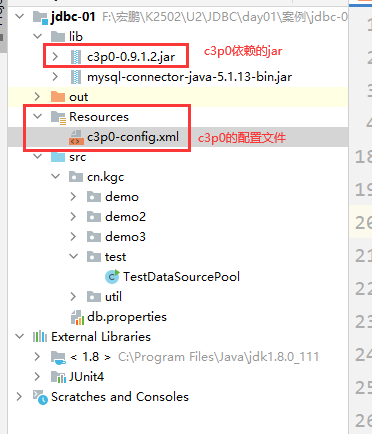
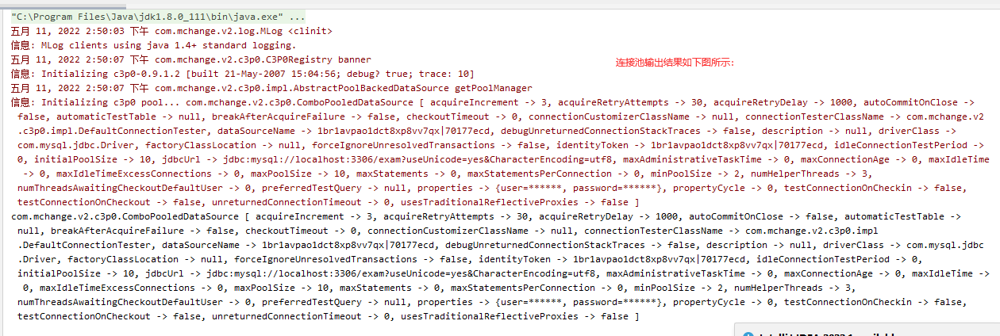
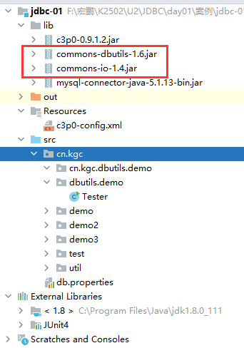
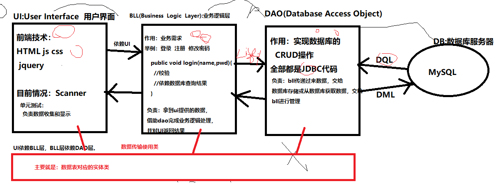
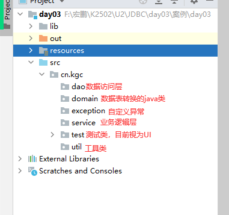
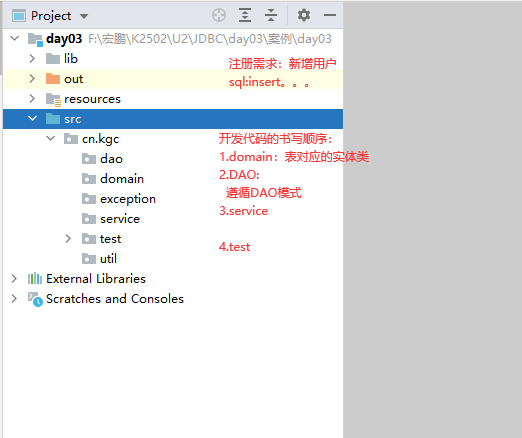
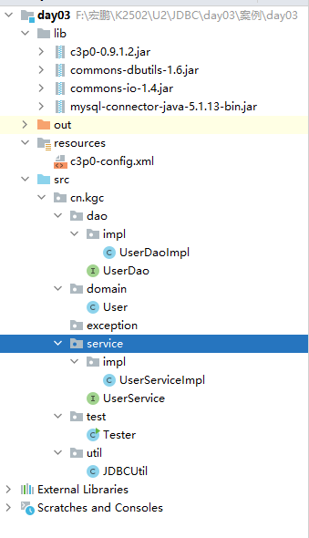
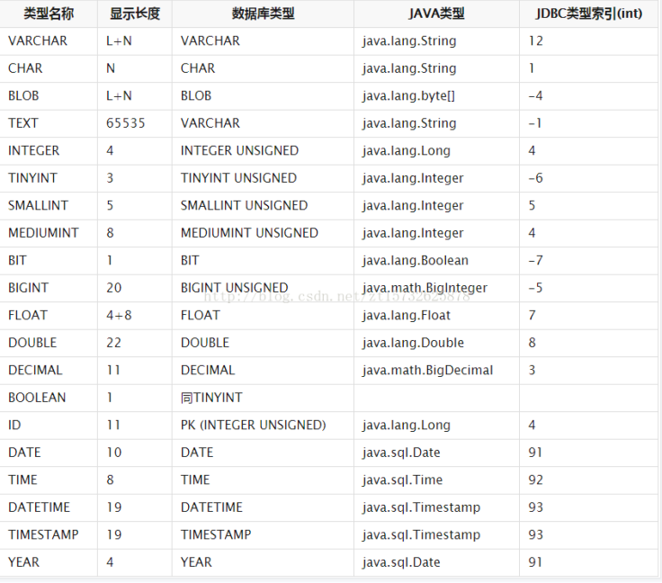
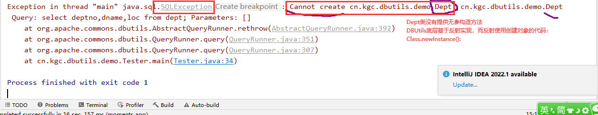

# 课程回顾

## 1 JDBC原生态实现Dept的CRUD

```html
DriverManager
Connection
PreparedStatement
ResultSet
```

## 2 JDBCUtil工具类

```html
1.驱动注册
2.获取数据库连接对象
3.释放资源
```

## 3 ExecuteHandler专门执行SQL语句类

```html
executeDML():负责执行DML（insert update delete）操作
executeDQL():负责执行DQL（Select 聚合函数）操作
```

## 4 反射

```html
1.获取Class对象
Class.forName("包名.类名")
类名.class;
对象.getClass()

Class里面提供newInstance() 基于无参构造方法创建对象

2. 获取所有的Field对象
getField(String Name) public修饰的属性
getFields()

getDeclaredField(String Name) 所有声明的属性
getDeclaredFields()

暴力破解
isAccesiable()
setAccesiable()

Field类型：
 属性赋值：属性对象.set(对象,属性值)
 属性取值：属性对象.get(对象)

3. 获取Constructor对象
getConstructors()
getConstructor(Class... 形参类型列表 )

Constructor对象提供的方法：new Instance(实参列表):创建对象

4.获取其他的方法（static、实例）Method对象
getMethod(String Name,Class... 形参类型列表) public修饰的属性
getMethods()

getDeclaredMethod(String Name,Class... 形参类型列表) 所有声明的属性
getDeclaredMethods()
Method方法：  
静态方法：
Object 返回值=方法对象.invoke(null,实参列表)

实例方法：
Object 返回值=方法对象.invoke(对象,实参列表)
```

# 课程目标

## 1 三层架构使用

## 2 DBUtils使用 

## 3 数据库连接池使用

# 课程实施

## 1 数据库连接池

### 1-1 概念

一个存放数据库连接的容器

### 1-2 好处


### 1-3 使用步骤

#### 创建C3P0配置文件的目录，并引入C3P0配置文件

```xml
<?xml version="1.0" encoding="UTF-8"?>
<c3p0-config>
	<!-- 默认连接池配置	-->
	<default-config>
		<property name="jdbcUrl">jdbc:mysql://localhost:3306/exam?useUnicode=yes&amp;CharacterEncoding=utf8</property>
		<property name="driverClass">com.mysql.jdbc.Driver</property>
		<property name="user">root</property>
		<property name="password">root</property>
		<!-- 数据库连接池连接全部使用后，一次递增量 -->
		<property name="acquireIncrement">3</property>
		<!-- 第一次数据库连接池获取的数据库连接的个数 -->
		<property name="initialPoolSize">10</property>
		<!-- 最低连接个数 -->
		<property name="minPoolSize">2</property>
		<!-- 最多保有连接个数 -->
		<property name="maxPoolSize">10</property>
	</default-config>
</c3p0-config>
```

#### 导入C3P0依赖的jar



#### 编写测试代码，获取数据库连接池对象

```java
package cn.kgc.test;

import com.mchange.v2.c3p0.ComboPooledDataSource;

/**
 * @Author: lc
 * @Date: 2022/5/11
 * @Description: cn.kgc.test
 * @Version: 1.0
 */
public class TestDataSourcePool {
	public static void main(String[] args) {
		//1.获取数据库连接池对象
		/**
		 * 1.导入C3P0的依赖：jar
		 * 2.new C3P0连接池对象即可
		 */
		ComboPooledDataSource datasource = new ComboPooledDataSource();//默认配置连接池
//创建命名的，且name名称oracle-config的连接池配置
		//new ComboPooledDataSource("oracle-config");
		System.out.println(datasource);
		//datasource.getConnection();
	}
}
```

#### 配置成功后，代码运行的结果如下所示：




## 2 DBUtils使用 

### 2-1 概述

DBUtils是Apache Commons组件中的一员，开源免费！

DBUtils是对JDBC的简单封装，但是它还是被很多公司使用！

DBUtils的Jar包：dbutils.jar

学习的目的：就是为了后面的学习编码方便，否则会学后面的时候对数据库的操作花很多的精力写没有挑战的工作。

### 2-2 使用步骤

#### 导入DBUtils的jar包



#### 创建QueryRunner对象

```java
//将我们自己的C3P0连接池交给QueryRunner，由QueryRunner自己去连接池拿连接使用
QueryRunner qr = new QueryRunner(JDBCUtil2.datasource);
```

#### 定义要执行的SQL语句

```java
String sql="insert into dept(deptno,dname,loc) values(?,?,?)";
String sql="update dept set dname=?,loc=? where deptno=?";
String sql="delete from dept where deptno=?";
```

#### 调用QueryRunner方法，执行SQL并获取方法返回值

##### update()

```java
int row=qr.update(sql,sql中?对应的实参值);//update()只能执行DML语句,返回sql语句执行后，受影响的行数
```

##### query()

```java
//结果集处理器对象不同，query()返回的结果也不一样，结合代码案例整理
qr.query(sql,结果集处理器对象,sql中?对应的实参值);
```

## 3 DBUtils中对于查询语句执行结果的三种处理器类型

### 3-1 多行多列结果集处理器

````html
BeanListHandler：多行处理器！把结果集转换成List<Bean>；
使用语法：new BeanListHandler(查询的表对应的实体类的class)
````

### 3-2 单行单列结果集处理器

```html
ScalarHandler：单行单列处理器！把结果集转换成Object。一般用于聚集查询，例如select count(*) from tab_student。
使用语法：new ScalarHandler()
```

### 3-3 单行多列结果集处理器

```html
BeanHandler：单行多列处理器！把结果集转换成Bean，该处理器需要Class参数，即Bean的类型；
使用时特点：new BeanHandler(查询的表对应的实体类的class)
```

### 课堂案例

#### 多行多列处理器的使用

```java
//将我们自己的C3P0连接池交给QueryRunner，由QueryRunner自己去连接池拿连接使用
QueryRunner qr = new QueryRunner(JDBCUtil2.datasource);
String sql="select deptno,dname,loc from dept;";//返回一个多行多列的结果集
//查询的表转换为类（称为实体类，属性名称、数据类型必须与表的列名、列数据类型一样、同时，必须提供无参构造方法）
List<Dept> list = qr.query(sql, new BeanListHandler<Dept>(Dept.class));
for(Dept d:list){
    System.out.println(d);
}
```

#### 单行单列处理器的使用

```java
//将我们自己的C3P0连接池交给QueryRunner，由QueryRunner自己去连接池拿连接使用
QueryRunner qr = new QueryRunner(JDBCUtil2.datasource);
String sql="select count(*) from dept;";
Object result = qr.query(sql, new ScalarHandler<>());
System.out.println(result);
```

#### 单行多列处理器的使用

```java
//将我们自己的C3P0连接池交给QueryRunner，由QueryRunner自己去连接池拿连接使用
QueryRunner qr = new QueryRunner(JDBCUtil2.datasource);
//根据主键查询，查询结果一行数据
String sql="select deptno,dname,loc from dept where deptno=?";
//sql查询结果有，ResultSet有行可以转换，对象存在。
//sql查询结果没有，ResultSet是没有行，对象不存在 null
Dept dept = qr.query(sql, new BeanHandler<Dept>(Dept.class), 1);
System.out.println(dept);
```

## 4 三层结构

### 4-1 三层结构目标

项目越来越多的类，为了方便管理，提出一种项目结构搭建的方式。称为三层结构。

### 4-2 三层结构分析



### 4-3 搭建三层结构项目目录

必备的包：

test（Scanner和sout()）、

domain（domain存放的都是数据表转换后对应的实体类）、

dao（JDBC代码）、

service（if-else while for 业务逻辑代码）

util和exception根据项目情况，酌情创建




### 4-4 三层结构的开发顺序




## 5 基于数据库连接池修改JDBCUtil代码

```java
package cn.kgc.util;

import com.mchange.v2.c3p0.ComboPooledDataSource;

import javax.sql.DataSource;
import java.sql.Connection;
import java.sql.ResultSet;
import java.sql.SQLException;
import java.sql.Statement;
import java.util.Objects;

/**
 * @Author: lc
 * @Date: 2022/5/11
 * @Description: 引入C3P0数据库连接池，所以不用再自己加装配置文件、创建连接对象，
 * 所有的连接都是通过C3P0数据库连接池获取
 * @Version: 1.0
 */
public class JDBCUtil2 {
	//1.获取数据库连接池对象：一个java项目只要一个连接池对象
	public final static DataSource datasource=new ComboPooledDataSource();
	/**
	 * 释放资源，针对DQL操作
	 * @param connection 数据库连接对象
	 * @param stmt sql执行对象
	 * @param rs 结果集对象
	 */
	public static void release(Connection connection, Statement stmt, ResultSet rs){
		try {
			//释放资源
			if (!Objects.isNull(rs)) {
				rs.close();
			}
			if (!Objects.isNull(stmt)) {
				stmt.close();
			}
			if (!Objects.isNull(connection)) {
				//释放资源的代码，并没有真正关闭连接，而是将连接对象归还给连接池
				connection.close();
			}
		} catch (SQLException throwables) {
			throwables.printStackTrace();
		}
	}
	/**
	 * 释放资源，针对DML操作
	 * @param connection 数据库连接对象
	 * @param stmt sql执行对象
	 */
	public static void release(Connection connection, Statement stmt){
		try {
			//释放资源
			if (!Objects.isNull(stmt)) {
				stmt.close();
			}
			if (!Objects.isNull(connection)) {
				connection.close();
			}
		} catch (SQLException throwables) {
			throwables.printStackTrace();
		}
	}
}
```

## 整合案例：注册功能

### 项目搭建三层的结构如下图所示：



### 三层结构的开发顺序：

#### domain：表名转实体类

- User类

```java
package cn.kgc.domain;

/**
 * @Author: lc
 * @Date: 2022/5/11
 * @Description: 实体类，主要用作在层与层之间数据传输
 * 书写有特点：
 * 1.类名与表名一样的，遵循帕斯卡命名
 * 2.属性名与表中列名、数据类型一样，遵循驼峰命名
 * 3.一定要有无参构造方法
 * 4.建议：重写toString()
 * @Version: 1.0
 */
public class User {
	private String uId;
	private String userName;
	private String password;

	public String getuId() {
		return uId;
	}

	public void setuId(String uId) {
		this.uId = uId;
	}

	public String getUserName() {
		return userName;
	}

	public void setUserName(String userName) {
		this.userName = userName;
	}

	public String getPassword() {
		return password;
	}

	public void setPassword(String password) {
		this.password = password;
	}

	public User() {
	}

	public User(String uId, String userName, String password) {
		this.uId = uId;
		this.userName = userName;
		this.password = password;
	}

	@Override
	public String toString() {
		final StringBuilder sb = new StringBuilder("User{");
		sb.append("uId='").append(uId).append('\'');
		sb.append(", userName='").append(userName).append('\'');
		sb.append(", password='").append(password).append('\'');
		sb.append('}');
		return sb.toString();
	}
}
```

#### dao：基于DAO模式创建接口和实现类

- UserDao

```java
package cn.kgc.dao;

import cn.kgc.domain.User;

/**
 * @Author: lc
 * @Date: 2022/5/11
 * @Description: dao层接口中定义哪些方法：
 * select()
 * selectById(主键查询)
 * .......
 * insert()
 * update()
 * delete()
 * @Version: 1.0
 */
public interface UserDao {
	/**
	 * 实现用户信息的新增
	 * @param user 要新增的用户的信息
	 * @return 新增语句执行后受影响的行数
	 */
	int insert(User user);
}
```

- UserDaoImpl

```java
package cn.kgc.dao.impl;

import cn.kgc.dao.UserDao;
import cn.kgc.domain.User;
import cn.kgc.util.JDBCUtil;
import org.apache.commons.dbutils.QueryRunner;

import java.sql.SQLException;

/**
 * @Author: lc
 * @Date: 2022/5/11
 * @Description: dao实现类中，主要是使用DBUtils+C3P0实现crud操作
 * @Version: 1.0
 */
public class UserDaoImpl implements UserDao {
	//1.创建QueryRunner对象
	private QueryRunner qr=new QueryRunner(JDBCUtil.datasource);
	@Override
	public int insert(User user) {
		try {
			//1.sql
			String sql="INSERT USER (uid,username,`password`) VALUES(?,?,?)";
			//2.执行
			return qr.update(sql,user.getuId(),user.getUserName(),user.getPassword());
		} catch (SQLException e) {
			throw new RuntimeException(e);
		}
	}
}
```

#### service：创建接口和实现类

- UserService

```java
package cn.kgc.service;

import cn.kgc.domain.User;

/**
 * @Author: lc
 * @Date: 2022/5/11
 * @Description: 业务逻辑层，类名：表名+service
 * @Version: 1.0
 */
public interface UserService {
	/**
	 * 注册
	 */
	boolean regist(User user);
}
```

- UserServiceImpl

```java
package cn.kgc.service.impl;

import cn.kgc.dao.UserDao;
import cn.kgc.dao.impl.UserDaoImpl;
import cn.kgc.domain.User;
import cn.kgc.service.UserService;

/**
 * @Author: lc
 * @Date: 2022/5/11
 * @Description: cn.kgc.service
 * @Version: 1.0
 */
public class UserServiceImpl implements UserService {
	//业务逻辑层真正实现功能，其实依靠DAO
	private UserDao dao=new UserDaoImpl();
	@Override
	public boolean regist(User user) {
		int row = dao.insert(user);
		return row==1;
	}
}

```

#### test：创建测试类

```java
package cn.kgc.test;

import cn.kgc.domain.User;
import cn.kgc.service.UserService;
import cn.kgc.service.impl.UserServiceImpl;

import java.util.Scanner;

/**
 * @Author: lc
 * @Date: 2022/5/11
 * @Description: test包放都是测试类，目前暂时将测试类当做UI层
 * @Version: 1.0
 */
public class Tester {
	public static void main(String[] args) {
		//ui:获取用户的数据
		Scanner input = new Scanner(System.in);
		System.out.print("用户编号：");
		String uid = input.next();
		System.out.print("用户名：");
		String uname= input.next();
		System.out.print("用户密码：");
		String upwd = input.next();

		//ui层依赖service层，创建service层代码，实现结果的过去
		UserService service=new UserServiceImpl();

		//封装参数
		User u=new User(uid,uname,upwd);
		boolean bool = service.regist(u);

		//显示数据处理的结果
		System.out.println(bool?"注册成功":"注册失败");
	}
}
```

## 附录：mysql数据类型与java数据类型的对应表



## 常见异常：



# 预习安排

JavaEE安装一台web服务器：Tomcat

Http协议

Web项目搭建

Servlet创建、代码基本结构