# 课程回顾

```html
基于三层结构，完成一个多条件的查询语句，并处理结果
查询条件是：Scanner接收用户输入：员工姓名和岗位，

按照员工姓名和员工岗位的模糊查询
select * from emp where ename like '%a%' and job='销售员'

最后在测试类中，使用sout输出符合条件的员工信息，输入结果如下所示：
员工姓名    岗位    薪资    comm  部门编号
。。。。。。。。。。。。。。。。。。。。

需求分析：
1.C3P0数据库连接池：负责数据库连接对象获取和管理
2.DBUtils：第三方开源组织提供一套用来处理JDBC的封装类：执行DML DQL语句
3.三层架构


实现功能：
三层架构开发顺序：
1.domain:数据表转换后对应的实体类
简单粗暴：将一个数据库中所有的表一次性全部转换domain中
2.dao层：DAO模式-为了解耦，
	要求dao层，
    一个表对应的一个接口   接口名： 表名+Dao
	一个接口对应一个实现类  接口实现类名：表名+Dao+Impl
public interface 接口{
    //四种方法
    List<> selectBy();
    实体类类型  selectByPK(int 主键);
    Object selectScalar(...);//select后+count() max()聚合函数

    int insert(实体类类型  对象);
    int update(实体类类型  对象);
    int delete(主键...  参数);
}
3.service层：
  一个表对应的一个接口，接口命名：表名+service
  一个接口对应的一个实现，实现类命名：表名+service+Impl
public interface  接口{
//四种方法
    List<> getBy();
    实体类类型 getByPK(int 主键);
    Object getScalar(...);//select后+count() max()聚合函数

    int save(实体类类型  对象);
    int edit/modify(实体类类型  对象);
    int remove(主键...  参数);

}
public interface 实现类 implements 接口{
  //创建该表对应的dao的对象
//四种方法
    List<> getBy(){
		return dao对象.select。。。（）
	}
    实体类类型 getByPK(int 主键);
    Object getScalar(...);//select后+count() max()聚合函数

    int save(实体类类型  对象);
    int edit/modify(实体类类型  对象);
    int remove(主键...  参数);

}

4.测试类：
4-1 Scanner获取用户输入的数据
4-2 new Service层对象，调用service的方法，并接受返回值
4-3 使用sout()输出结果
```

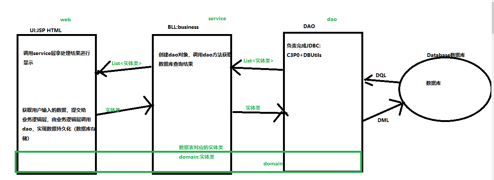

# 课程目标

## 1 三层结构实现：多条件查询 ========== 掌握

## 2 安装tomcat服务器 ===== 掌握

## 3 IDEA创建并运行WEB项目 ==== 掌握

# 课程实施

## 1 三层结构实现：多条件查询

### domain层

```java
package cn.kgc.domain;

import java.math.BigDecimal;
import java.util.Date;

/**
 * @Author: lc
 * @Date: 2022/5/13
 * @Description: 实体类：
 * 存在的代码：
 * 1. 与表列同名、同类型的属性
 * 2. 无参构造方法
 * 3. 建议：重写toString() 一般为了方便测试！！
 * @Version: 1.0
 */
public class Emp {
	/**
	 * 兼容NULL
	 * 数据表中遇到int float double，转换java类时，要求使用对应包装类类型
	 */
	private Integer empNo;
	private String eName;
	private String job;
	private Integer mgr;
	private Date hireDate;
	private BigDecimal sal;
	private BigDecimal comm;
	private Integer deptNo;

	public Integer getEmpNo() {
		return empNo;
	}

	public void setEmpNo(Integer empNo) {
		this.empNo = empNo;
	}

	public String geteName() {
		return eName;
	}

	public void seteName(String eName) {
		this.eName = eName;
	}

	public String getJob() {
		return job;
	}

	public void setJob(String job) {
		this.job = job;
	}

	public Integer getMgr() {
		return mgr;
	}

	public void setMgr(Integer mgr) {
		this.mgr = mgr;
	}

	public Date getHireDate() {
		return hireDate;
	}

	public void setHireDate(Date hireDate) {
		this.hireDate = hireDate;
	}

	public BigDecimal getSal() {
		return sal;
	}

	public void setSal(BigDecimal sal) {
		this.sal = sal;
	}

	public BigDecimal getComm() {
		return comm;
	}

	public void setComm(BigDecimal comm) {
		this.comm = comm;
	}

	public Integer getDeptNo() {
		return deptNo;
	}

	public void setDeptNo(Integer deptNo) {
		this.deptNo = deptNo;
	}

	/**
	 * 一个类，不写构造方法，默认就是无参构造方法
	 */
	public Emp() {
	}

	@Override
	public String toString() {
		final StringBuilder sb = new StringBuilder("Emp{");
		sb.append("empNo=").append(empNo);
		sb.append(", eName='").append(eName).append('\'');
		sb.append(", job='").append(job).append('\'');
		sb.append(", mgr=").append(mgr);
		sb.append(", hireDate=").append(hireDate);
		sb.append(", sal=").append(sal);
		sb.append(", comm=").append(comm);
		sb.append(", deptNo=").append(deptNo);
		sb.append('}');
		return sb.toString();
	}
}
```

### dao层の接口

```java
package cn.kgc.dao;

import cn.kgc.domain.Emp;

import java.util.List;

/**
 * @Author: lc
 * @Date: 2022/5/13
 * @Description: dao层都是数据库操作：新增、删除、修改、查询
 * @Version: 1.0
 */
public interface EmpDao {
	//抽象方法
	/**
	 * 查询功能：方法一定有返回值
	 * 根据主键查询：实体类对象
	 * 多条件或无条件查询：集合，集合泛型domain中表对应实体类
	 * 聚合函数查询：Object
	 * @param eName 查询条件：员工姓名，支持模糊查询
	 * @param job 查询条件：岗位 不支持模糊查询
	 */
	List<Emp> selectBy(String eName,String job);
}
```

### dao层の实现类

```java
package cn.kgc.dao.impl;

import cn.kgc.dao.EmpDao;
import cn.kgc.domain.Emp;
import cn.kgc.util.JDBCUtil;
import org.apache.commons.dbutils.QueryRunner;
import org.apache.commons.dbutils.handlers.BeanListHandler;

import java.sql.SQLException;
import java.util.ArrayList;
import java.util.List;
import java.util.Objects;

/**
 * @Author: lc
 * @Date: 2022/5/13
 * @Description: dao的实现类包，写代码有什么套路？
 * 1.创建一个QueryRunner对象，并将你的数据库连接池交给它
 * 2.定义sql语句，
 *    设置参数前，需要对形参是否null进行非空校验
 * 3.使用QueryRunner中的方法：
 *   update():DML
 *   query():DQL
 * @Version: 1.0
 */
public class EmpDaoImpl implements EmpDao {
	//QueryRunner会被多个方法使用，建议定义全局变量
	private QueryRunner qr=new QueryRunner(JDBCUtil.datasource);
	@Override
	public List<Emp> selectBy(String eName, String job) {
		//where ename like '%_%'
		//多条件模糊查询，要求：给的查询条件是NULL的情况，就不要带着条件查询
		//1=1解决逻辑运算符拼接问题
		StringBuilder sql=new StringBuilder("select * from emp where 1=1 ");
		try {
			//selectBy(null,"销售员")
			//需要对sql中？的实参值进行非空判断 排除空字符串“”
			//引入集合，保存参数的对应关系
			List params=new ArrayList();
			if(!Objects.isNull(eName)&&!eName.isEmpty()){
				//当eName条件不是nul的情况下，根据员工姓名模糊查询
				sql.append(" and ename like ? ");
				params.add("%"+eName+"%");
			}

			if(!Objects.isNull(job)&&!job.isEmpty()){
				sql.append(" and job = ?");
				params.add(job);
			}
			//qr.query(sql语句,resultset结果集处理方式，Object... paramsql中有几个？就应该给几个实参)
			/**
			 * sql：select 结果分为三种情况
			 * 1. 查询结果是多行多列  BeanListHandler<表对应的java类型>
			 * 2. 查询结果是单行多列  BeanHandler<表对应的java类型>
			 * 3. 查询结果是单行单列，一般是聚合函数 select count() from  sum() max() min() avg() ScalarHandler===>Object
			 */
			return qr.query(sql.toString(),new BeanListHandler<>(Emp.class),params.toArray());
		} catch (SQLException e) {
			throw new RuntimeException(e);
		}
	}
}
```

### service层の接口

```java
package cn.kgc.service;

import cn.kgc.domain.Emp;

import java.util.List;

/**
 * @Author: lc
 * @Date: 2022/5/13
 * @Description: service写代码：
 * DAO的方法名copy过来，修改方法名：业务逻辑单词
 * service依赖dao实现数据处理
 * @Version: 1.0
 */
public interface EmpService {
	/**
	 * 根据员工姓名和岗位获取员工信息
	 * @param eName
	 * @param job
	 * @return
	 */
	List<Emp> getBy(String eName, String job);
}
```

### service层の实现类

```java
package cn.kgc.service.impl;

import cn.kgc.dao.EmpDao;
import cn.kgc.dao.impl.EmpDaoImpl;
import cn.kgc.domain.Emp;
import cn.kgc.service.EmpService;

import java.util.List;

/**
 * @Author: lc
 * @Date: 2022/5/13
 * @Description: service的实现类只写三行代码：
 * 1.创建dao对象，根据接口第一个单词去找
 * EmpDao
 *
 * 2. 调用dao层方法
 *
 * 3. 处理返回值
 * @Version: 1.0
 */
public class EmpServiceImpl implements EmpService {
	private EmpDao empDao=new EmpDaoImpl();
	@Override
	public List<Emp> getBy(String eName, String job) {
		//List<Emp> emps = empDao.selectBy(eName, job);
		return empDao.selectBy(eName, job);
	}
}
```

### UI层の测试类

```java
package cn.kgc.test;

import cn.kgc.domain.Emp;
import cn.kgc.service.impl.EmpServiceImpl;

import java.util.List;
import java.util.Scanner;

/**
 * @Author: lc
 * @Date: 2022/5/13
 * @Description: cn.kgc.test
 * @Version: 1.0
 */
public class EmpTester {
	public static void main(String[] args) {
		Scanner input = new Scanner(System.in);
		//1.获取数据，交给业务逻辑层，由业务逻辑层提交给dao，实现数据库交互
		System.out.print("员工姓名：");
		String ename = input.next();
		System.out.print("岗位：");
		String job = input.next();

		//找一个对象，做一件事
		List<Emp> emps = new EmpServiceImpl().getBy(ename, job);

		//2.获取业务逻辑层处理结果，使用sout显示
		System.out.println(emps);

	}
}
```

## 2 安装tomcat服务器

### 2-1 注意事项

```html
1.tomcat解压目录不能有中文
2.tomcat的启动必须保证环境变量中有java_home环境变量
3.tomcat版本必须与jdk匹配
```

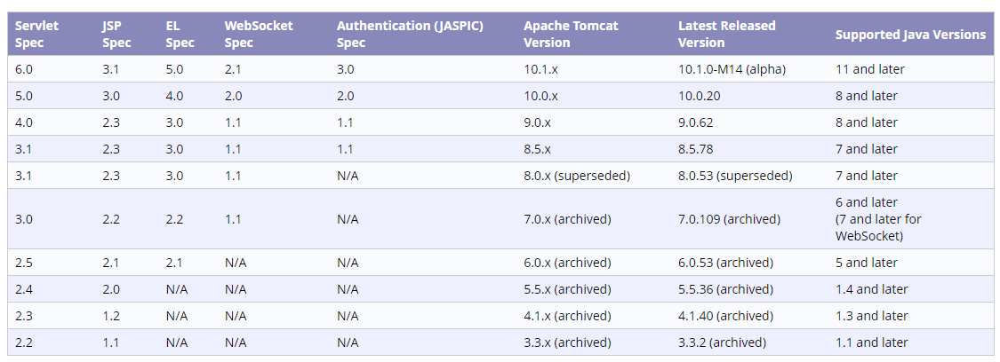

### 2-2 tomcat安装目录

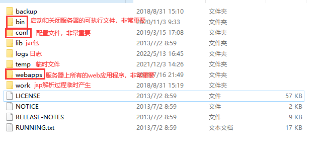

#### bin目录：启动和关闭tomcat的可执行命令

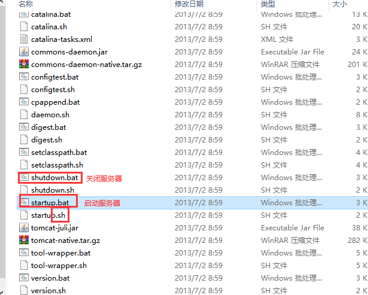

#### conf: 服务器配置文件所在目录

##### 修改服务器的端口号:server.xml

```xml
 <Connector connectionTimeout="20000" port="8080" protocol="HTTP/1.1" redirectPort="8443"/>
```

##### 获取服务器登录账号：tomcat-users.xml

```xml
 <user username="tomcat" password="tomcat" roles="tomcat,manager-gui"/>
```

#### webapp: 服务器上发布项目的目录

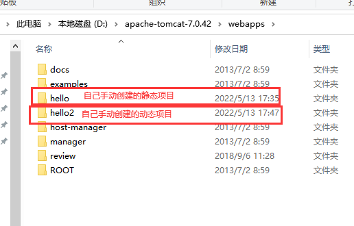

#### Tomcat创建项目成功以后，运行方式

```html
1.启动浏览器
2.输入访问的网址： 
网址的写法遵循：
协议名://域名:端口/路径，例如：http://www.baidu.com:80/index.html
例如：
http://localhost:8080/发布项目的名称/要查看的项目资源名称
```

### 补充：Tomcat服务器上静态项目和动态项目的区别

#### 静态项目：网页不能跟数据库交互，比如常见的 html+css+js+jquery

```html
创建方式：
1 在webapps目录下创建一个目录（命名必须不包含中文和空格），这个目录称之为项目目录；
2 在项目目录下创建一个html文件；
```

#### 动态项目：能与数据库交互的项目，都可以理解为动态项目，比如（java的jsp  C#的aspx)

```html
创建方式：
1 在webpass目录下创建一个项目目录；
2 在项目目录下创建如下内容：
  WEB-INF目录；
  在WEB-INF目录下创建web.xml文件
3 创建静态或动态页面
```

## 3 IDEA创建并运行WEB项目

### 3-1 创建JavaWeb项目的步骤

#### 创建一个普通java项目

#### 添加web模块

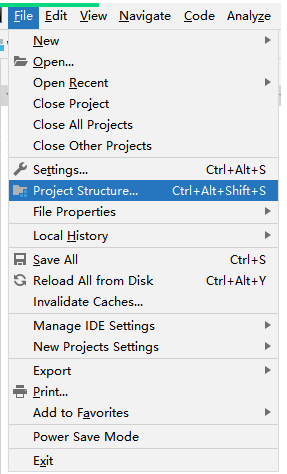

#### 设置web版本

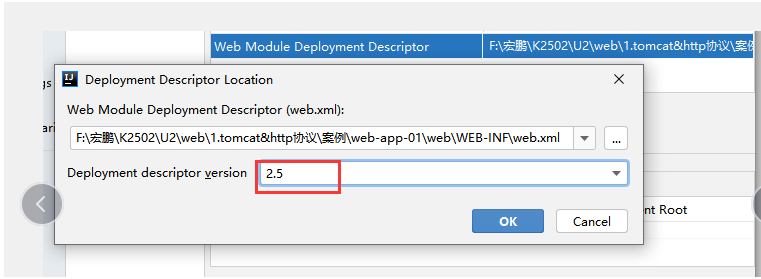


### 3-2 Idea配置服务器的步骤

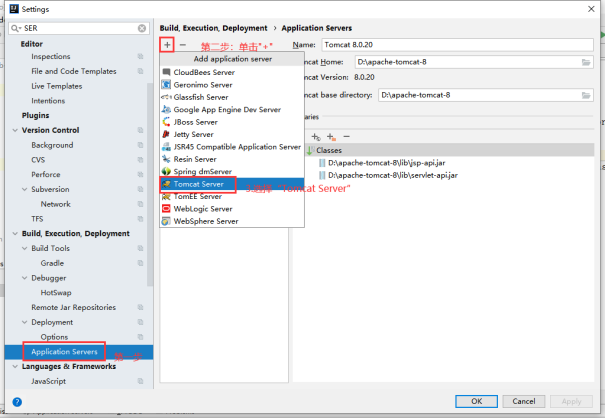

或

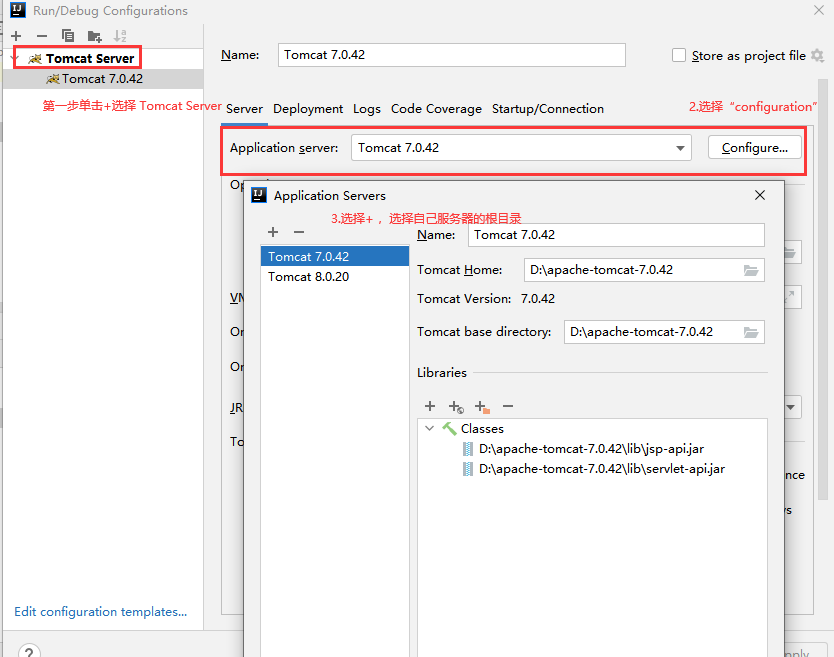

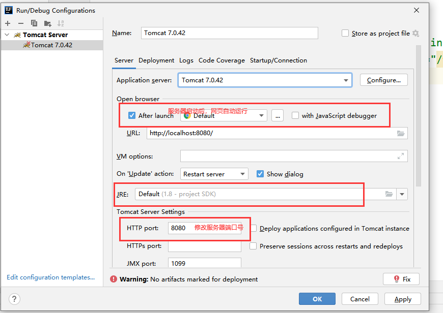

### 3-3 Idea发布项目的步骤

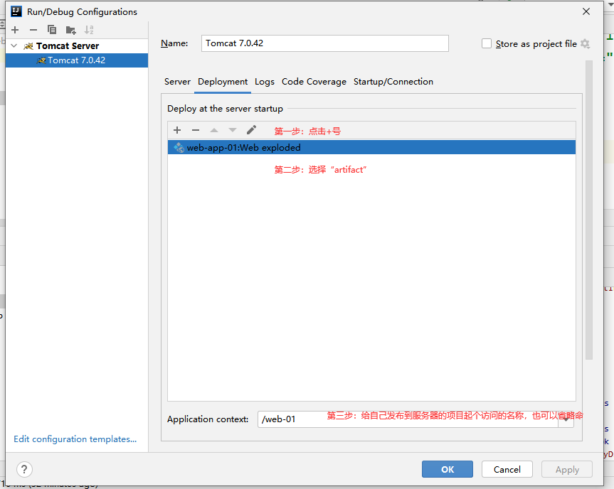


### 3-4 Idea启动服务器的步骤

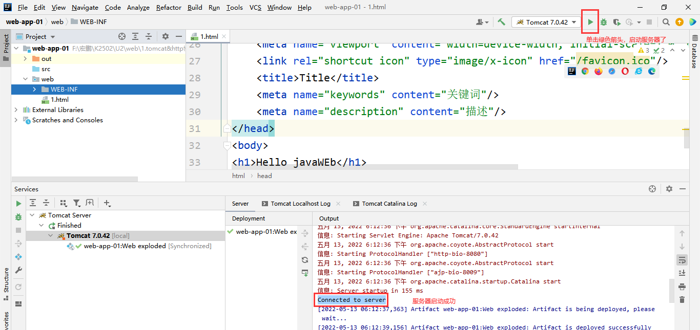


### 3-5 Idea项目的访问方式

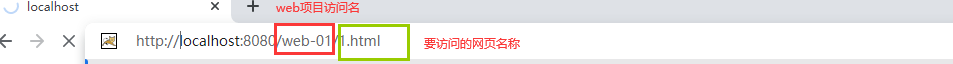

# 课程总结

## 1 完成三层架构

## 2 idea集成tomcat

## 3 JavaWeb项目的创建及部署

# 预习

Servlet使用

HTTP协议