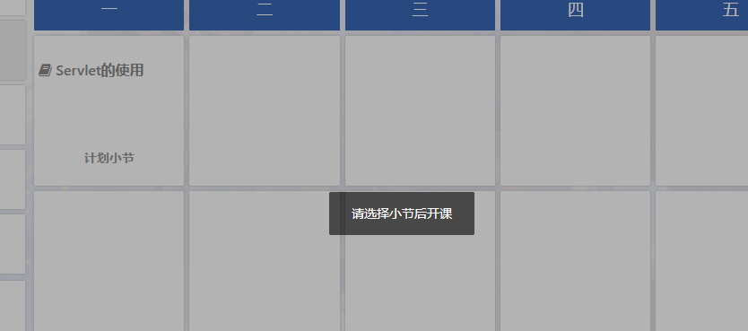
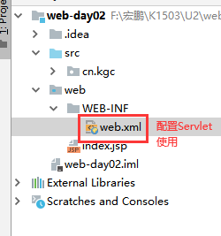
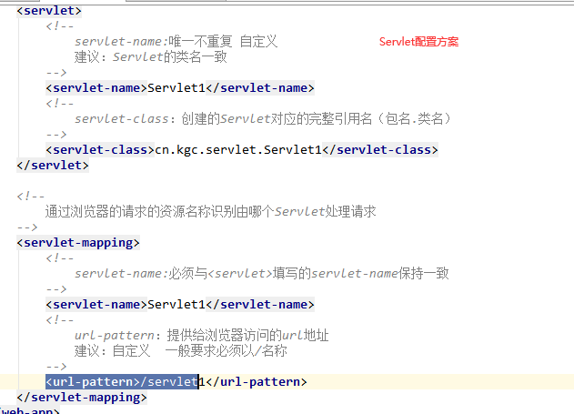
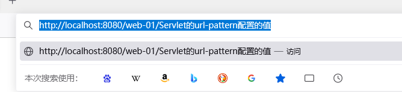
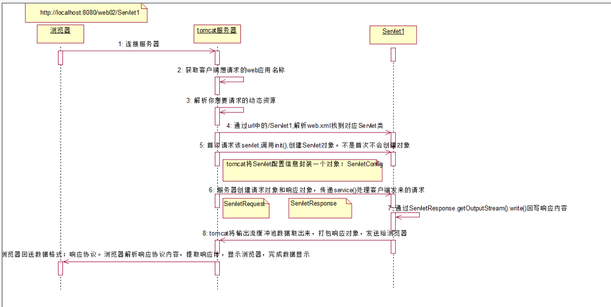
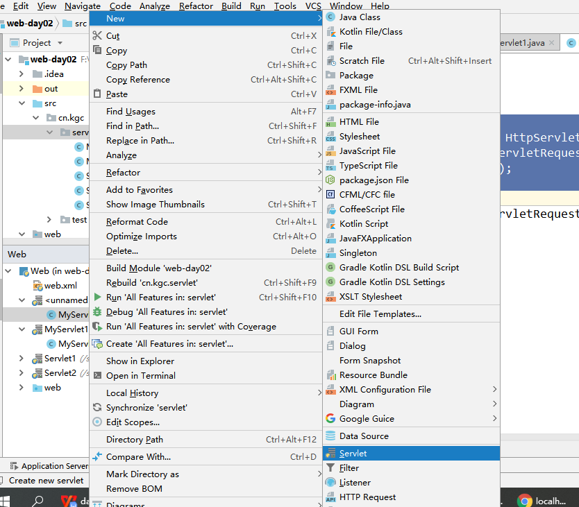
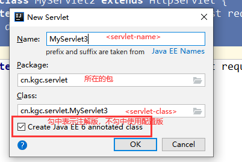
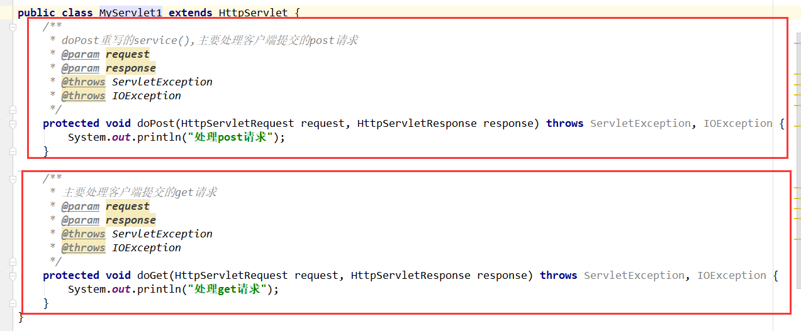
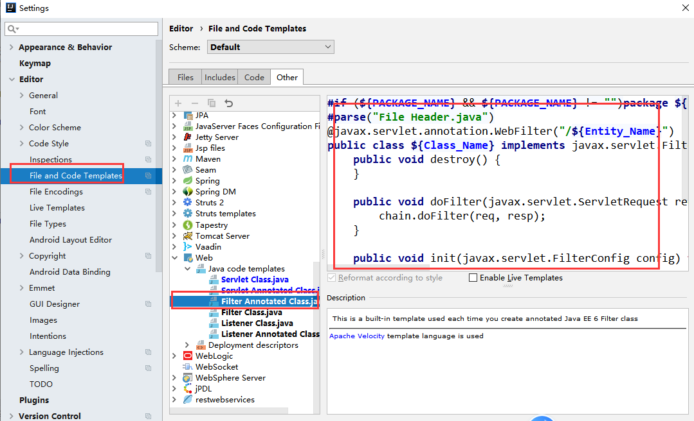

# 课程回顾

````html
1 Tomcat服务器的作用：B/S架构的程序必须部署在服务器上，才能提供给浏览器进行访问
2 Idea集成Tomcat程序搭建、部署、配置和启动、运行
3 HTTP协议：
	3-1 浏览器（即客户端）和服务器（即Tomcat）之间数据交互的一种规范
    3-2 HTTP协议分类：
		请求协议：GET请求协议  POST请求协议
        响应协议
    3-3 HTTP协议格式：
		请求协议：
			一个请求首行    资源URL?表单提交的数据name=value&name=value HTTP协议的版本
			多个请求头      描述客户端的信息
			一个空白行
			GET请求没有请求体
			post请求体    POST提交表单，请求体表单提交的数据，表单项的name属性=value表单输入的内容
		响应协议：
			一个响应首行   状态码 状态描述 HTTP协议版本
 			多个响应头     描述服务器的信息，以及服务器本次发送给浏览器的一些信息解析
			一个空白行
			响应体		   例如：HTML文档
````

# 课程目标

## 1 Servlet的概念 =========== 理解

## 2 Servlet的生命周期 =========== 理解 

## 3 Servlet的使用 ============== 重点

## 4 Request对象和Response对象基本操作 ========= 使用

# 课程实施

## 1 Servlet的概述

### 1-1 Servlet的概念

````html
Servlet是运行在Web服务器上的java小程序。
Servlet是JAVAEE三大组件之一，过滤器Filter   监听器 Listener
````

### 1-2 Servlet的作用

````html
基于HTTP协议，处理客户端发送给服务器的请求，并响应客户端
````

### 1-3 Servlet的使用

````html
使用步骤：
1.写一个类实现Servlet接口（或 继承 GenericServlet 或继承HTTPServlet)
2.重写Servlet接口定义方法
3.配置Servlet的访问
4.启动Tomcat服务器
5.使用浏览器访问Servlet，Servlet对象就会由服务器自动创建，并自动调用方法
````







### 1-4 ServletのHelloWorld

#### 创建类实现Servlet接口

````java
package cn.kgc.servlet;

import javax.servlet.*;
import java.io.IOException;

/**
 * 处理用户的请求，并对请求进行响应
 */
public class Servlet1 implements Servlet {

}

````

#### 重写所有的抽象方法

````java
package cn.kgc.servlet;

import javax.servlet.*;
import java.io.IOException;

/**
 * 处理用户的请求，并对请求进行响应
 */
public class Servlet1 implements Servlet {
    @Override
    public void init(ServletConfig servletConfig) throws ServletException {
        /**
         * 负责对Servlet进行初始化
         */
        System.out.println("调用init实现Servlet进行初始化");
    }

    @Override
    public ServletConfig getServletConfig() {
        /**
         * 获取Servlet的配置信息
         */
        return null;
    }

    @Override
    public void service(ServletRequest servletRequest, ServletResponse servletResponse) throws ServletException, IOException {
        /**
         * 处理客户端请求的
         */
        System.out.println("调用service处理客户端请求");
    }

    @Override
    public String getServletInfo() {
        /**
         * 获取Servlet的自身信息：版本  版权  作者
         */
        return null;
    }

    @Override
    public void destroy() {
        /**
         * 负责销毁Servlet
         * 销毁Servlet前：临终遗憾
         */
        System.out.println("调用destroy实现Servlet1即将被销毁");
    }
}

````

#### web.xml配置Servlet

````xml
<?xml version="1.0" encoding="UTF-8"?>
<web-app xmlns="http://java.sun.com/xml/ns/javaee"
           xmlns:xsi="http://www.w3.org/2001/XMLSchema-instance"
           xsi:schemaLocation="http://java.sun.com/xml/ns/javaee
		  http://java.sun.com/xml/ns/javaee/web-app_2_5.xsd"
           version="2.5">
    <!--配置Servlet1-->
    <servlet>
        <!--
            servlet-name:唯一不重复 自定义
            建议：Servlet的类名一致
        -->
        <servlet-name>Servlet1</servlet-name>
        <!--
            servlet-class：创建的Servlet对应的完整引用名（包名.类名）
        -->
        <servlet-class>cn.kgc.servlet.Servlet1</servlet-class>
    </servlet>

    <!--
        通过浏览器的请求的资源名称识别由哪个Servlet处理请求
    -->
    <servlet-mapping>
        <!--
            servlet-name:必须与<servlet>填写的servlet-name保持一致
        -->
        <servlet-name>Servlet1</servlet-name>
        <!--
            url-pattern：提供给浏览器访问的url地址
            建议：自定义  一般要求必须以/名称
        -->
        <url-pattern>/servlet1</url-pattern>
    </servlet-mapping>
</web-app>

````

#### 启动Tomcat服务器

#### 打开浏览器，输入请求地址

````html
http://localhost:8080/web-02/servlet1
````

### 1-5 Servlet的生命周期

生命周期：Servlet对象在Tomcat服务器上从创建到使用到销毁的整个过程




````html
通过生命周期的描述，可以得出以下结论：
1. Servlet对象在Tomcat服务器有且只有1个，遵循单例模式。
2. Servlet注意问题：线程不安全，但是Servlet的性能比较好的
3. Servlet对象的创建由Tomcat服务器完成，且整个生命周期中，只会创建一次，那么init()就只会调用一次完成Servlet的初始化
4.Servlet对象在Tomcat上，只要没有被销毁，就可以重复调用service()方法来处理客户端请求并响应客户
5.Servlet对象在调用service()之前，会将请求协议封装为Request对象，响应协议封装为Response对象
6.Servlet对象的destroy()由Tomcat调用。Tomcat服务器关闭前。destroy()方法体经常资源释放的代码
````

### 1-6 Servlet的最佳实现

#### 创建Servlet



#### 填写配置信息



#### 处理doGet()或doPost()方法

**Tips: 一个Servlet只处理一个功能  建议不要在doGet和doPost写不同的代码**



#### 启动服务器

#### 启动浏览器，地址栏输入以下内容

````html
http://localhost:8080/web-02/servlet配置的url-pattern的内容
注意：
url地址严格区分大小写
````

## 2 Request

````html
1.request对象由Tomcat服务器创建，程序员直接用
本次课使用的方法
  String value=request.getParameter("name");

````

## 3 Response

````html
1.response对象由Tomcat服务器创建，程序员直接用.response是空的
本次课使用的方法
  response.getWriter()/getOutputStream().write(响应体)

````

## 4 ServletConfig

````html
暂时未讲
````

## 5 整合案例

需求：注册用户

分析：

````html
1.JDBC的dao层，完成user表的方法insert定义和实现
	1-1 建议 dao层功能写完，先单元测试
2.设计html网页，提供用户注册的表单信息
	2-1 用户信息注册，需要填写哪些信息？参考数据库表User 有几个列，你就要求用户填写多少信息
3.创建Servlet，处理用户保存用户信息的请求，并且对于事情处理结果向浏览器进行响应
	3-1 基于配置版 UserServlet  dopost()和doget代码一样的

````

### 参考代码

#### domain包のUser类

````java
package cn.kgc.domain;

public class User {
    private String uid;
    private String userName;
    private String password;

    public String getUid() {
        return uid;
    }

    public void setUid(String uid) {
        this.uid = uid;
    }

    public String getUserName() {
        return userName;
    }

    public void setUserName(String userName) {
        this.userName = userName;
    }

    public String getPassword() {
        return password;
    }

    public void setPassword(String password) {
        this.password = password;
    }

    public User() {
    }

    public User(String uid, String userName, String password) {
        this.uid = uid;
        this.userName = userName;
        this.password = password;
    }

    @Override
    public String toString() {
        final StringBuilder sb = new StringBuilder("User{");
        sb.append("uid='").append(uid).append('\'');
        sb.append(", userName='").append(userName).append('\'');
        sb.append(", password='").append(password).append('\'');
        sb.append('}');
        return sb.toString();
    }
}

````

#### dao包のUserDao接口

````java
package cn.kgc.dao;

import cn.kgc.domain.User;

public interface UserDao {
    int insert(User user);
}

````

#### dao.impl包のUserDaoImpl实现类

````java
package cn.kgc.dao.impl;

import cn.kgc.dao.UserDao;
import cn.kgc.domain.User;
import cn.kgc.util.JDBCUtil;
import org.apache.commons.dbutils.QueryRunner;

import java.sql.SQLException;

public class UserDaoImpl implements UserDao {
    QueryRunner qr=new QueryRunner(JDBCUtil.getDataSource());

    @Override
    public int insert(User user) {
        try {
            return qr.update("insert user values (?,?,?)",
                    user.getUid(),user.getUserName(),user.getPassword());
        } catch (SQLException e) {
            throw new RuntimeException(e);
        }
    }
}

````

#### test包の单元测试

````java
package cn.kgc.test;

import cn.kgc.dao.impl.UserDaoImpl;
import cn.kgc.domain.User;
import org.junit.Test;

/**
 * 使用单元测试，测试dao方法是否有问题
 */
public class MyTester {
    @Test
    public void testInsert(){
        //单元测试，硬性编码实现
        User u=new User();
        u.setUid("10001");
        u.setUserName("李四");
        u.setPassword("90909");
        int rows = new UserDaoImpl().insert(u);
        System.out.println(rows);
    }
}

````

#### service包のUserService接口

````java
package cn.kgc.service;

import cn.kgc.domain.User;

public interface UserService {
    /**
     * 注册用户
     * @param user 注册用户的信息
     * @return true 注册成功 false 注册失败
     */
    boolean regist(User user);
}

````

#### service.impl包のUserServiceImpl接口

````java
package cn.kgc.service.impl;

import cn.kgc.dao.UserDao;
import cn.kgc.dao.impl.UserDaoImpl;
import cn.kgc.domain.User;
import cn.kgc.service.UserService;

public class UserServiceImpl implements UserService {
    UserDao dao=new UserDaoImpl();
    @Override
    public boolean regist(User user) {
        return dao.insert(user)==1;
    }
}

````

#### Html页面のregist.html

````java
<!DOCTYPE html>
<html lang="en">
<head>
    <meta charset="UTF-8">
    <title>用户信息注册页面</title>
</head>
<body>
    <!--
        action:/虚拟路径名称/servlet配置的url-pattern
    -->
    <form action="/web-02/regist" method="post">
        <p>
            用户编号：<input type="text" name="uid">
        </p>
        <p>
            用户名：<input type="text" name="userName">
        </p>
        <p>
            密码：<input type="password" name="password">
        </p>
        <p>
            确认密码：<input type="password" name="repassword">
        </p>
        <p>
            <input type="submit" value="注册用户">
            <input type="reset" value="重置信息">
        </p>
    </form>
</body>
</html>
````

#### servletのUserServlet小程序

````java
package cn.kgc.servlet;

import cn.kgc.domain.User;
import cn.kgc.service.UserService;
import cn.kgc.service.impl.UserServiceImpl;

import javax.servlet.ServletException;
import javax.servlet.http.HttpServlet;
import javax.servlet.http.HttpServletRequest;
import javax.servlet.http.HttpServletResponse;
import java.io.IOException;
import java.io.PrintWriter;

public class UserServlet extends HttpServlet {
    protected void doPost(HttpServletRequest request, HttpServletResponse response) throws ServletException, IOException {
        doGet(request, response);
    }

    protected void doGet(HttpServletRequest request, HttpServletResponse response) throws ServletException, IOException {
        /**
         * 处理请求并响应：
         * 1.获取用户提交的数据 取：从request中取
         * 2.创建UserService的对象，调用regist(User u) 调操作表名Service接口的实现类
         * 3.将方法执行结果通知浏览器的用户，自己的操作成功还是失败 存 将事情处理的结果存储到响应协议对象response
         */
//        String 表单项的name指向的value = request.getParameter("表单项的name属性值");
        //String==>其他类型 包装类.parse目标类型()

        String uid = request.getParameter("uid");
        String userName = request.getParameter("userName");
        String password = request.getParameter("password");

        /*System.out.println("uid="+uid);
        System.out.println("username="+userName);
        System.out.println("pwd="+password);*/
        UserService service=new UserServiceImpl();
        //创建User对象，保存用户提交的数据
        User u=new User(uid,userName,password);
        boolean bool = service.regist(u);

        //回信：响应协议
        PrintWriter writer = response.getWriter();
//        writer.write(bool+"");
        writer.write("<script type='text/javascript'>alert('"+bool+"');</script>");

    }
}

````

#### web.xml配置のUserServlet接口

````java
<servlet>
        <servlet-name>UserServlet</servlet-name>
        <servlet-class>cn.kgc.servlet.UserServlet</servlet-class>
    </servlet>

    <servlet-mapping>
        <servlet-name>UserServlet</servlet-name>
        <url-pattern>/regist</url-pattern>
    </servlet-mapping>
````


## 6 扩展：

````java
在web.xml中<servlet></servlet>设置load-on-startup决定Servlet的对象的创建时机。load-on-startup中设置>=0就是服务器启动，Servlet对象就创建；load-on-startup中设置<0就是服务器启动，客户端第一次请求Servlet是Tomcat才会创建Servlet对象。
````

````html
修改Idea中的Servlet模板
````



# 课程总结

## 1 Servlet梳理：概念  作用 生命周期

## 2 Servlet的使用：如何创建  如何配置  如何访问

## 3 扩展：load-on-startup  如何配置idea的servlet代码模板

## 4 整合案例：用户信息注册（梳理：1.取  2.调 3.存)


# 预习安排

Request对象和Response对象基本操作

Cookie和Session会话对象

