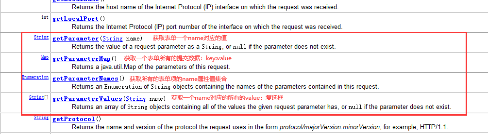
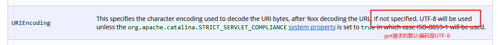

# 课程回顾

## 1 HTTP协议

```html
概念：HTTP用在浏览器和服务器之间的一个约定。
作用：约束浏览器和服务器交互的数据格式
浏览器遵循请求协议：
post请求协议：
一个请求首行      post /web项目名称/资源名称   HTTP1.1
多个请求头        遵循key：value   user-agent  accept accet-language
一个空白行
一个请求体        form提交给后台的数据：name属性值：用户输入或选择值

get请求协议：
一个请求首行      get /web项目名称/资源名称   HTTP1.1
多个请求头        遵循key：value   user-agent  accept accet-language
一个空白行
GET没有请求体


服务器遵循响应协议：
响应协议                  
一个响应首行  HTTP1.1  200   ok    响应码（200 404-not found  307--重定向  500---服务器错误）
多个响应头    遵循key：value   host  time content-type content-length
一个空白行
响应体       html
```


## 2 Servlet生命周期

```html
1.Tomcat负责创建Servlet对象，调用init(),初始化Servlet
2.Tomcat调用service()执行处理请求代码，响应浏览器

。。。。

3.Tomcat关闭之前，调用destroy()销毁所有servlet,释放资源
```


## 3 Servlet使用步骤 *****************

特点：Servlet由Tomcat服务器根据用户的请求，来自主完成对象的创建

```html
1.创建一个类xxxServlet，实现Servlet接口
  重写接口所有的方法：
    init()
    service()
    destroy()
2.WEB-INF里面web.xml配置实现类
 <serlvet>
    <servlet-name>随便写</servlet-name>
    <servlet-class></servlet-class>
 </serlvet>
 <servlet-mapping>
    <servlet-name>serlvet配置servlet-name一样</servlet-name>
     <!-- url-pattern浏览器请求servlet时使用的url地址  -->
     <url-pattern>/路径名，随便写，建议与Servlet类名一样的</url-pattern>
  </servlet-mapping>

3.form的action设置为配置Servlet的url-pattern
3-1 打开浏览器，浏览器地址栏：http://服务器ip地址:端口/web项目名/url-pattern配置
```

## 4 idea自带模板实现Servlet创建

```html
1.创建一个类，继承javax提供一个HttpServlet
  doGet():处理get请求
  doPost()：处理Post请求


HttpServlet特点：已经实现了Servlet接口，程序里面因为只关注请求的处理，不再关注init destroy()

```

# 课程目标

## 1 请求协议对象HttpServletRequest

## 2 响应协议对象HttpServletResponse

## 3 总结javaWeb书写路径的套路

# 课程实施

## 1 HttpServletRequest

### 1-1 HttpServletRequest概念

```html
HttpServletRequest:一个请求协议对象
```

### 1-2 HttpServletRequest作用

```html
HttpServletRequest封装哪些方法？
1.获取请求首行信息
  getHeader()
2.获取请求头

3.获取请求体


```

#### 1-2-1 如何通过request对象获取表单提交的数据




### 1-3 解决request获取中文乱码问题？

#### 1-3-1 POST方式

```html
POST提交数据，走post请求协议，提交的数据都在请求体，
因此解决中文乱码，设置请求体的编码格式就可以，GET不适用
```


#### 1-3-2 GET方式

```html
Tomcat默认的编码格式配置：URIEncoding除了TOMCAT8.0,其他的TomcatURIEncoding的编码格式ISO8859-1
TOMCAT8.0默认配置URIEncoding都是UTF-8

URL:地址
URI：是url的父
//这个代码针对get乱码使用，如果get没有乱码，就不要写这行代码
String username=new String(username.getBytes("iso8859-1"),"utf-8");
```

### 1-4 课堂案例

```java
package cn.kgc.servlet;

import javax.servlet.ServletException;
import javax.servlet.http.HttpServlet;
import javax.servlet.http.HttpServletRequest;
import javax.servlet.http.HttpServletResponse;
import java.io.IOException;

/**
 * @Author: lc
 * @Date: 2022/5/16
 * @Description: 建议：一个Servlet中处理一个请求
 * LoginServlet处理登录，通常doGet或doPost其中一个方法中写代码即可
 * @Version: 1.0
 */
public class LoginServlet extends HttpServlet {
	//专门处理get请求协议
	@Override
	protected void doGet(HttpServletRequest request, HttpServletResponse resp) throws ServletException, IOException {
		//设置请求体的编码格式，POST请求提交的数据解决中文乱码
		request.setCharacterEncoding("UTF-8");//请求体的编码格式，只要支持中文即可
		//登录
		//1.获取数据
		//数据从什么地方提交给Tomcat服务器？？请求协议
		//掌握单个key-value获取
		String username = request.getParameter("username");//获取username表单项用户输入的值
		//username获取?????
		/*byte[] bytes = username.getBytes("iso8859-1");
		username = new String(bytes, "utf-8");*/
		username=new String(username.getBytes("iso8859-1"),"utf-8");
		System.out.println("username="+username);

		//一次性获取所有  理解，BeanUtils使用到
		//Map<form上name的值,name对应的用户输入的或选择的值>
		Map<String, String[]> map = request.getParameterMap();
		//如何循环
		Set<Map.Entry<String, String[]>> entries = map.entrySet();
		for(Map.Entry<String, String[]> e:entries){
			System.out.println(e.getKey()+": "+ Arrays.toString(e.getValue()));
		}

		//方式三：了解
		//Enumeration就是迭代器的前身
		Enumeration<String> names = request.getParameterNames();//form表单所有的name属性的值
		while (names.hasMoreElements()){
			String name = names.nextElement();
			System.out.println(name+":"+request.getParameter(name));
		}
		//方式四：掌握
		//getParameterValues:获取复选框的选中
		String[] hobbies = request.getParameterValues("hobby");//form提交的用户输入的值
		System.out.println(Arrays.toString(hobbies));
//2.创建依赖的Service对象

		//3.将方法执行结果使用响应协议回送给浏览器显示
	}

	//专门处理post请求协议
	@Override
	protected void doPost(HttpServletRequest req, HttpServletResponse resp) throws ServletException, IOException {
		//登录
		doGet(req,resp);
	}
}

```


## 2 HttpServletResponse

### 2-1 HttpServletResponse概念

```html
HttpServletResponse:就是服务器回送给浏览器的响应协议
```

### 2-2 HttpServletResponse作用

```html
HttpServletResponse提供方法：
1 设置响应首行
setStatus(int 状态码);//状态码在定义常量，自己找
2 设置响应头

3 设置响应体
getOutputStream()
getWriter();

```


### 2-3 设置响应体中文乱码问题


```html
setContentType(),setCharactorEncoding就会按照setContentType()设置的编码设置响应体
```

### 2-4 课堂案例

```java
package cn.kgc.servlet;

import javax.servlet.ServletException;
import javax.servlet.http.HttpServlet;
import javax.servlet.http.HttpServletRequest;
import javax.servlet.http.HttpServletResponse;
import java.io.IOException;
import java.io.PrintWriter;

/**
 * @Author: lc
 * @Date: 2022/5/16
 * @Description: 建议：一个Servlet中处理一个请求
 * LoginServlet处理登录，通常doGet或doPost其中一个方法中写代码即可
 * @Version: 1.0
 */
public class LoginServlet extends HttpServlet {
	//专门处理get请求协议
	@Override
	protected void doGet(HttpServletRequest request, HttpServletResponse response) throws ServletException, IOException {
		//设置请求体的编码格式，POST请求提交的数据解决中文乱码
		request.setCharacterEncoding("UTF-8");//请求体的编码格式，只要支持中文即可
		//登录
		//1.获取数据
		//数据从什么地方提交给Tomcat服务器？？请求协议
		//掌握单个key-value获取
		String username = request.getParameter("username");//获取username表单项用户输入的值
		//username获取?????
		/*byte[] bytes = username.getBytes("iso8859-1");
		username = new String(bytes, "utf-8");*/
		username=new String(username.getBytes("iso8859-1"),"utf-8");
		System.out.println("username="+username);

		//2.创建依赖的Service对象
		//假设方法执行完毕，返回boolean  bool-true 登录成功  false-登录失败
		boolean bool=true;
		//3.将方法执行结果使用响应协议回送给浏览器显示
		//resp.setStatus(HttpServletResponse.SC_INTERNAL_SERVER_ERROR);//500
		//浏览器发送请求，服务器接收到之后，404响应它
		//response.setStatus(HttpServletResponse.SC_INTERNAL_SERVER_ERROR);//SC_NOT_FOUND 404
		//封装响应协议
		//response.setStatus(200);//ok 一般自己可以不写
		//response.设置响应头 //没有特殊响应设置需求，响应头默认即可
		//response.设置响应体// 要不要程序员设置？？？需要！！
		//设置响应协议编码格式
		//response.setCharacterEncoding("utf-8");//设置响应体
		response.setContentType("text/html;charset=utf-8");//设置浏览器
		//设置文本，使用字符流
		PrintWriter writer = response.getWriter();
		writer.print(bool?"登录成功":"登录失败");//不换行

		//writer.println();//换行
		//设置非文本，使用字节流
	}

	//专门处理post请求协议
	@Override
	protected void doPost(HttpServletRequest req, HttpServletResponse resp) throws ServletException, IOException {
		//登录
		doGet(req,resp);
	}
}

```


## 3 总结javaWeb书写路径的套路

```html
form表单中action:/web项目名/servlet的url-pattern名称

浏览器地址栏：http://localhost:8080/web项目名/servlet的url-pattern名称
```

## 补充：idea2021中如何出现Servlet的创建模板


## 补充：如何配置Tomcat在修改html和jsp后不重启


## 补充：如何区分Tomcat对于GET请求的编码设置



# 课程总结

1. Request获取表单数据的方法

   getParameter()

   getParameterMap()

   getParameterNames()

   getParameterValues()

2. 请求提交中文乱码问题

   post: request.setCharacterEncoding()

   get:new String(.getBytes("iso8859-1"),"utf-8")

3.response设置状态码和响应体

setStatus()

getWriter().print()

4.响应乱码问题

response.setContentType("text/html;charset=utf-8");

# 预习安排

request的转发

response的重定向

response实现文件下载