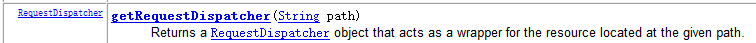
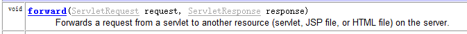
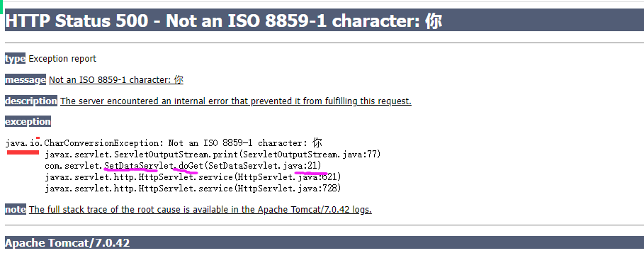
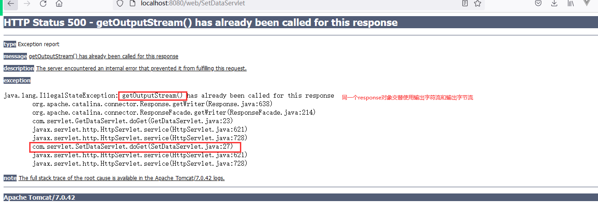
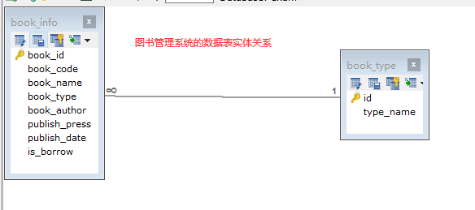
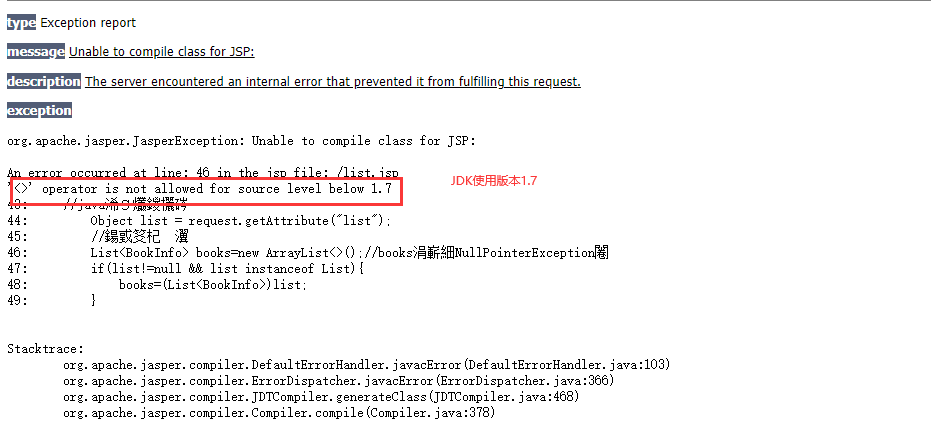

# 回顾课程

## 1 Servlet创建过程

```html
1.创建类继承HttpServlet类，重写doGet和doPost
public void doPost(HttpServletRequest req,HttpServletResponse resp){
	//post处理请求
}

public void doGet(){
	doPost()
}

2.配置web.xml文件，交给Tomcat服务器进行创建
Tomcat按照生命周期，依次调用init  service   destroy()

3.浏览器或form引用配置的Servlet的url-pattern
```


## 2 HttpServletRequest对象

```html
getParameter("name的属性值")
getParameterMap()
getParameterNames();
getParameterValues("复选框的name");

解决中文乱码问题：
POST:
 request.setCharacterEncoding("Utf-8")
GET:
 new String(字符串.getBytes("iso-8859-1"),"utf-8")
```

## 3 HttpServletResponse对象

```html
设置状态码：response.setStatus(500);
设置响应头：下载
***设置响应体：
   字符流： getWriter()
   字节流：getOutpuStream()
解决中文乱码：
  response.setCharacterEncoding("Utf-8");
//  response.setHeader(“ContentType”，“text/html;charset=utf-8”);
  response.setContentType("text/html;charset=utf-8");
```

# 课程目标

## 1 域对象和转发 ===== 掌握

## 2 重定向 ===== 掌握

## 3 转发和重定向的区别 ==== 理解

## 4 JSP显示 ==== 掌握

# 课程实施

## 1 域对象

用来存储数据，在整个项目实现数据共享的对象。

### 1-1 域对象分类

ServletContext对象

HttpSession 对象

HttpServletRequest对象：request域对象，

共享访问：同一个请求中所有的资源可以数据共享

PageContext对象

### 1-2 域对象通用方法

域对象：底层就是Map。

```html
setAttribute(Object key,Object value)
getAttribute(Object key)：Object
removeAttribute(Object key):Object
```

### 1-3 课堂案例

```html
1.Servlet1存入数据：userName:jack

2.Servlet2取出username的值，并使用sout输出
```

## 2 转发机制

转发：一定是基于request域对象存取数据前提。

特点：浏览器不会出现新的请求

### 2-1 代码

```java
//url地址不需要项目名
request.getRequestDisparcher(转发给哪个servlet的url-pattern).forward(request,response);
```





### 2-2 特点

```html
1 浏览器不知道服务器内部有转发，所以浏览器的地址栏地址不会变化
2 转发多个Servlet或jsp的请求始终一个对象
3 多个Servlet之间代码的互相调用
```


## 3 域对象和转发的案例


```java
package com.servlet; /**
 * @Author: lc
 * @Date: 2022/5/17
 * @Description: ${PACKAGE_NAME}
 * @Version: 1.0
 */

import javax.servlet.*;
import javax.servlet.http.*;
import javax.servlet.annotation.*;
import java.io.IOException;

@WebServlet("/SetDataServlet")//配置Servlet的url-pattern
public class SetDataServlet extends HttpServlet {
	@Override
	protected void doGet(HttpServletRequest request, HttpServletResponse response) throws ServletException, IOException {
        //存入数据
        request.setAttribute("username","张三丰");
        //转发给GetDataServlet获取
		request.getRequestDispatcher("/GetDataServlet").forward(request,response);
	}

	@Override
	protected void doPost(HttpServletRequest request, HttpServletResponse response) throws ServletException, IOException {
		doGet(request, response);
	}
}

```


```java
package com.servlet; /**
 * @Author: lc
 * @Date: 2022/5/17
 * @Description: ${PACKAGE_NAME}
 * @Version: 1.0
 */

import javax.servlet.*;
import javax.servlet.http.*;
import javax.servlet.annotation.*;
import java.io.IOException;

@WebServlet("/GetDataServlet")
public class GetDataServlet extends HttpServlet {
	@Override
	protected void doGet(HttpServletRequest request, HttpServletResponse response) throws ServletException, IOException {
        //1.获取Request对象保存的数据，并显示
        Object username = request.getAttribute("username");
        //System.out.println();
        response.setContentType("text/html;charset=utf-8");
        response.getWriter().print(username);
    }

	@Override
	protected void doPost(HttpServletRequest request, HttpServletResponse response) throws ServletException, IOException {
		doGet(request, response);
	}
}

```

## 4 重定向 

用在：servlet或jsp处理完请求之后，希望请求提交到其他资源且浏览器的地址栏要发生变化时。

常见使用场景：

登录成功后，重定向转向网站首页

注册成功后，重定向登录页

### 4-1 代码

```java
response.sendRedirect("jsp/servlet");//jsp或servlet的地址必须包含项目名
```

### 4-2 转发和重定向的区别

```html
1.重定向地址栏会发生变化
2.重定向会产生新的请求，
3.跨域访问使用重定向，转发不能跨域
跨域：其他网站发出请求

```

### 4-3 重定向的实现原理

```html
响应码：302
响应头：Location
```

## 重定向和转发的案例：实现登录成功后调整到首页

### 转发实现

```java
package com.servlet; /**
 * @Author: lc
 * @Date: 2022/5/17
 * @Description: ${PACKAGE_NAME}
 * @Version: 1.0
 */

import javax.servlet.*;
import javax.servlet.http.*;
import javax.servlet.annotation.*;
import java.io.IOException;

@WebServlet(name = "ServletA",urlPatterns = {"/A"})
public class ServletA extends HttpServlet {
	@Override
	protected void doGet(HttpServletRequest request, HttpServletResponse response) throws ServletException, IOException {
        //登录
        //登录成功
        //跳转到首页显示
        if(true){
            //1.转发
            request.getRequestDispatcher("/main.html").forward(request,response);
        }
	}

	@Override
	protected void doPost(HttpServletRequest request, HttpServletResponse response) throws ServletException, IOException {
		doGet(request, response);
	}
}

```

### 重定向实现

```java
package com.servlet; /**
 * @Author: lc
 * @Date: 2022/5/17
 * @Description: ${PACKAGE_NAME}
 * @Version: 1.0
 */

import javax.servlet.*;
import javax.servlet.http.*;
import javax.servlet.annotation.*;
import java.io.IOException;

@WebServlet(name = "ServletA",urlPatterns = {"/A"})
public class ServletA extends HttpServlet {
	@Override
	protected void doGet(HttpServletRequest request, HttpServletResponse response) throws ServletException, IOException {
        //登录
        //登录成功
        //跳转到首页显示
        if(true){
			//2.重定向 302
			//response.sendRedirect("/web/main.html");//url地址
            //重定向原生代码
			response.setStatus(HttpServletResponse.SC_FOUND);
			response.setHeader("Location","/web/main.html");
        }
	}

	@Override
	protected void doPost(HttpServletRequest request, HttpServletResponse response) throws ServletException, IOException {
		doGet(request, response);
	}
}
```






## 5 整合案例

### 需求：图书信息的显示

#### 需求分析：



````html
1.分析dao层的SQL语句
USE exam;
SELECT * FROM book_type;
SELECT * FROM book_info;

-- 显示所有的图书信息,图书分类（图书分类有则显示，没有显示NULL）
SELECT book_info.book_id id,book_info.book_code,
book_info.book_name,book_info.book_type,
book_info.book_author,book_info.publish_press,
book_info.publish_date,book_info.is_borrow,
book_type.type_name FROM book_info 
LEFT JOIN book_type ON book_info.book_type=book_type.id

2.JDBC开发顺序：
2-1 确定sql之后，先将数据表转换为domain的表
注意：两表连接查询后，book_info表对应的实体类中，要出现关联表的字段名称
2-2 开发dao层：一个接口 一个实现类

2-3 开发service层：一个接口 一个实现类

2-4 测试JDBC代码，确认dao层代码没有任何问题，
再开发前端的：jsp或servlet
先做HTML或JSP
创建Servlet，Servlet只有四行代码：
取请求体数据--request.getParameter() 
调用service层的方法-service对象  
存入request域-request.setAttribute(key,调方法执行结果)  
转发JSP/HTML-request.getRequestDispatcher().forward(request,response)


2-5 jsp主要的代码处理：
<%!
    jsp注释
%>
<% java处理代码：流程控制 %>
<%=网页上输出变量值%>
html显示数据的设计
<% 从域对象取数据，建议null非空验证 %>
<%= for或if 数据显示 %>
````

### 参考代码：

#### domainのBookInfo

```java
package cn.kgc.domain;

import java.util.Date;

/**
 * @Author: lc
 * @Date: 2022/5/17
 * @Description: 实体类列名和列类型与select查询结果集类型、列名一致
 * @Version: 1.0
 */
public class BookInfo {
	private Integer id;//数据库sql起别名
	private String book_code;
	private String book_name;
	private String book_author;
	private Integer book_type;
	private String publish_press;
	private Date publish_date;
	private boolean is_borrow;

	//连接查询，需要补充主表的信息
	private String type_name;

	public Integer getId() {
		return id;
	}

	public void setId(Integer id) {
		this.id = id;
	}

	public String getBook_code() {
		return book_code;
	}

	public void setBook_code(String book_code) {
		this.book_code = book_code;
	}

	public String getBook_name() {
		return book_name;
	}

	public void setBook_name(String book_name) {
		this.book_name = book_name;
	}

	public String getBook_author() {
		return book_author;
	}

	public void setBook_author(String book_author) {
		this.book_author = book_author;
	}

	public Integer getBook_type() {
		return book_type;
	}

	public void setBook_type(Integer book_type) {
		this.book_type = book_type;
	}

	public String getPublish_press() {
		return publish_press;
	}

	public void setPublish_press(String publish_press) {
		this.publish_press = publish_press;
	}

	public Date getPublish_date() {
		return publish_date;
	}

	public void setPublish_date(Date publish_date) {
		this.publish_date = publish_date;
	}

	public boolean isIs_borrow() {
		return is_borrow;
	}

	public void setIs_borrow(boolean is_borrow) {
		this.is_borrow = is_borrow;
	}

	public String getType_name() {
		return type_name;
	}

	public void setType_name(String type_name) {
		this.type_name = type_name;
	}

	@Override
	public String toString() {
		final StringBuilder sb = new StringBuilder("BookInfo{");
		sb.append("id=").append(id);
		sb.append(", book_code='").append(book_code).append('\'');
		sb.append(", book_name='").append(book_name).append('\'');
		sb.append(", book_author='").append(book_author).append('\'');
		sb.append(", book_type=").append(book_type);
		sb.append(", publish_press='").append(publish_press).append('\'');
		sb.append(", publish_date=").append(publish_date);
		sb.append(", is_borrow=").append(is_borrow);
		sb.append(", type_name='").append(type_name).append('\'');
		sb.append('}');
		return sb.toString();
	}
}
```

#### daoのBookInfoDao

```java
package cn.kgc.dao;

import cn.kgc.domain.BookInfo;

import java.util.List;

/**
 * @Author: lc
 * @Date: 2022/5/17
 * @Description: 查询、修改、删除和新增
 * @Version: 1.0
 */
public interface BookInfoDao {
	/**
	 * 查询所有的图书信息
	 * @return
	 */
	List<BookInfo> selectAll();

	/**
	 * 新增图书信息
	 * @param book
	 * @return
	 */
	int insert(BookInfo book);
	int update(BookInfo book);

	/**
	 * 删除一条或多条数据
	 * @param pkIds
	 * @return
	 */
	int delete(Integer... pkIds);
}
```

#### daoのBookInfoDaoImpl

```java
package cn.kgc.dao.impl;

import cn.kgc.dao.BookInfoDao;
import cn.kgc.domain.BookInfo;
import cn.kgc.util.JDBCUtil;
import org.apache.commons.dbutils.QueryRunner;
import org.apache.commons.dbutils.handlers.BeanListHandler;

import java.sql.SQLException;
import java.util.List;

/**
 * @Author: lc
 * @Date: 2022/5/17
 * @Description: cn.kgc.dao.impl
 * @Version: 1.0
 */
public class BookInfoDaoImpl implements BookInfoDao {
	private QueryRunner qr=new QueryRunner(JDBCUtil.datasource);
	@Override
	public List<BookInfo> selectAll() {
		StringBuilder sb=new StringBuilder();
		sb.append("SELECT book_info.book_id id,book_info.book_code,");
		sb.append("book_info.book_name,book_info.book_type,");
		sb.append("book_info.book_author,book_info.publish_press,");
		sb.append("book_info.publish_date,book_info.is_borrow,");
		sb.append("book_type.type_name FROM book_info ");
		sb.append("LEFT JOIN book_type ON book_info.book_type=book_type.id");
		//拼接查询条件

		//拼接排序

		//拼接limit 分页

		try {
			return qr.query(sb.toString(),new BeanListHandler<>(BookInfo.class));
		} catch (SQLException e) {
			throw new RuntimeException(e);
		}
	}

	@Override
	public int insert(BookInfo book) {
		return 0;
	}

	@Override
	public int update(BookInfo book) {
		return 0;
	}

	@Override
	public int delete(Integer... pkIds) {
		return 0;
	}
}
```

#### serviceのBookInfoService

```java
package cn.kgc.service;

import cn.kgc.domain.BookInfo;

import java.util.List;

/**
 * @Author: lc
 * @Date: 2022/5/17
 * @Description: cn.kgc.service
 * @Version: 1.0
 */
public interface BookInfoService {
	/**
	 * 获取所有的图书信息
	 * @return
	 */
	List<BookInfo> getAll();

	/**
	 * 添加图书信息
	 * @param book
	 * @return
	 */
	int add(BookInfo book);
	int modify(BookInfo book);

	/**
	 * 删除一条或多条数据
	 * @param pkIds
	 * @return
	 */
	int remove(Integer... pkIds);
}
```

#### serviceのBookInfoServiceImpl

```java
package cn.kgc.service.impl;

import cn.kgc.dao.BookInfoDao;
import cn.kgc.dao.impl.BookInfoDaoImpl;
import cn.kgc.domain.BookInfo;
import cn.kgc.service.BookInfoService;

import java.util.List;

/**
 * @Author: lc
 * @Date: 2022/5/17
 * @Description: cn.kgc.service.impl
 * @Version: 1.0
 */
public class BookInfoServiceImpl implements BookInfoService {
	private BookInfoDao dao=new BookInfoDaoImpl();
	@Override
	public List<BookInfo> getAll() {
		return dao.selectAll();
	}

	@Override
	public int add(BookInfo book) {
		return dao.insert(book);
	}

	@Override
	public int modify(BookInfo book) {
		return dao.update(book);
	}

	@Override
	public int remove(Integer... pkIds) {
		return dao.delete(pkIds);
	}
}
```

#### Servlet

```java
package cn.kgc.servlet; /**
 * @Author: lc
 * @Date: 2022/5/17
 * @Description: ${PACKAGE_NAME}
 * @Version: 1.0
 */

import cn.kgc.domain.BookInfo;
import cn.kgc.service.BookInfoService;
import cn.kgc.service.impl.BookInfoServiceImpl;

import javax.servlet.ServletException;
import javax.servlet.annotation.WebServlet;
import javax.servlet.http.HttpServlet;
import javax.servlet.http.HttpServletRequest;
import javax.servlet.http.HttpServletResponse;
import java.io.IOException;
import java.util.List;

@WebServlet("/BookInfoServlet")
public class BookInfoServlet extends HttpServlet {
	@Override
	protected void doGet(HttpServletRequest request, HttpServletResponse response) throws ServletException, IOException {
        //取 请求体或url地址传输的表单数据？略
        //调 service层
        BookInfoService service = new BookInfoServiceImpl();
        List<BookInfo> books = service.getAll();

        //存 共享
        request.setAttribute("list",books);

        //转
        //jsp本质就是一个servlet
        request.getRequestDispatcher("/list.jsp").forward(request,response);

	}

	@Override
	protected void doPost(HttpServletRequest request, HttpServletResponse response) throws ServletException, IOException {
		doGet(request, response);
	}
}
```

#### Jsp

##### 主页

```jsp
<!DOCTYPE html>
<html lang="zh">
<head>
    <meta charset="utf-8"/>
    <title>图书管理系统</title>
</head>
<body>
<h1>欢迎进入图书管理系统</h1>
<a href="/web/BookInfoServlet">查看所有的图书信息</a>
</body>
</html>
```

##### 图书列表页

```jsp
<%@ page import="java.util.List" %>
<%@ page import="cn.kgc.domain.BookInfo" %>
<%@ page import="java.util.ArrayList" %>
<%@ page import="java.awt.print.Book" %>
<%--
JSP注释：浏览器上使用右键查看源代码，浏览器上看不到jsp注释
JSP:Java  Server Page java服务器上的网页
JSP组成：html+css+js+jq+java代码
//Servlet:java代码
//jsp:倾向数据显示
JSP extends HttpServlet{

}
--%>
<!--

  html注释：浏览器上使用右键查看源代码，会显示
-->
<%@ page contentType="text/html;charset=UTF-8" language="java" %>
<html>
<head>
    <title>Title</title>
</head>
<body>
<%-- dreamwearver --%>
<table width="100%" border="1" cellspacing="0" cellpadding="0">
    <caption>
        图书信息一览表
    </caption>
    <tr>
        <th>编号</th>
        <th>图书编号</th>
        <th>图书名称</th>
        <th>图书分类</th>
        <th>图书作者</th>
        <th>出版社</th>
        <th>出版日期</th>
        <th>借阅状态</th>
        <th>查看详情</th>
        <th>操作</th>
    </tr>
    <%-- 数据从哪儿来？Servlet来--%>
    <%
        //java代码写法
        Object list = request.getAttribute("list");
        //向下转型 JDK基于1.7编译，不支持集合的泛型菱形语法
        List<BookInfo> books=new ArrayList<BookInfo>();//books不会NullPointerException问题
        if(list!=null && list instanceof List){
        	books=(List<BookInfo>)list;
        }
        for(BookInfo book:books){
    %>
    <tr>
        <%-- 获取数据显示  --%>
        <td><%=book.getId() %></td>
        <td><%=book.getBook_code()%>></td>
        <td>&nbsp;</td>
        <td>&nbsp;</td>
        <td>&nbsp;</td>
        <td>&nbsp;</td>
        <td>&nbsp;</td>
        <td>&nbsp;</td>
        <td>&nbsp;</td>
        <td>&nbsp;</td>
    </tr>
    <%
        }
    %>
</table>
</body>
</html>

```


## jsp运行异常



# 预习安排

图书管理系统：

图书查询

图书添加

图书修改

图书删除


分页查询+多条件模糊查询


