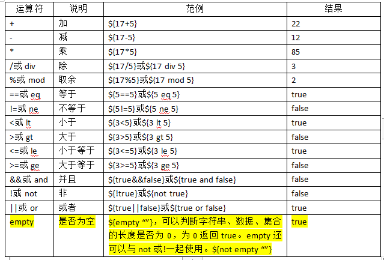
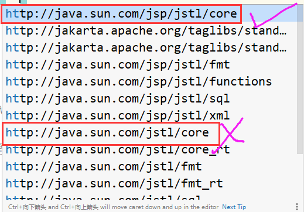
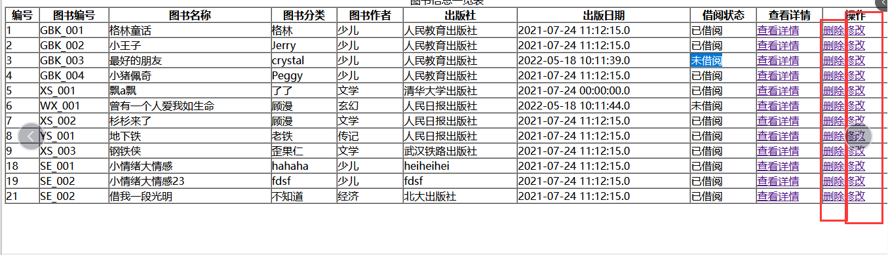
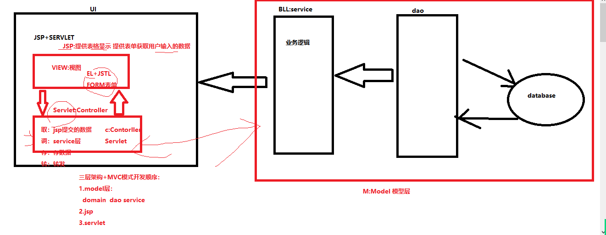
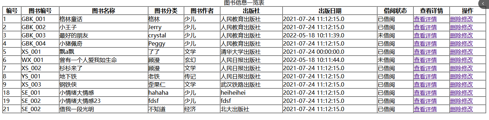

# 课程回顾

## 1 Request的转发

```html
代码实现：
request.getRequestDispatcher().forward(requet,response)
转发：
服务器内部完成跳转，浏览器地址栏的地址不会发生变化。
浏览器在整个转发过程中，始终只有一个请求和一个响应

适用场景：
	Request域对象存数据，可以使用转发
```

## 2 Response的重定向

```html
代码：response.sendredirct("/web项目名称/url");
//重定向实现原理
response.setStatus(302);
response.setHeader("location","/web项目名称/url")
特点：
服务器向浏览器返回302状态码，浏览器看到302找location，再一次向服务器发出请求，浏览器地址发生变化
一次重定向会产生两个请求和两次响应。

适用场景：
 跨域访问其他项目
 浏览器地址发生变化的需求
```

## 3 Request实现数据共享，域对象

```html
域对象：实现一定范围内，数据存储，便于其他资源进行数据获取并使用
Request域对象范围：一个请求内，所有资源都可以访问
所有的域对象，方法统共三个：
setAttribute(Object key,Object value)
getAttribute(Object key):Object
removeAttribute(Object key)
```

## 4 jsp使用

```html
jsp是java服务器端的page，所以jsp可以出现html css js jq Java代码
html+java融合在一起，控制起来阅读性差，而且修改也不是很方便

<%%>
<%=%>
```

# 课程目标

## 1 图书管理系统

### 1-1 新增

### 1-2 修改

### 1-3 删除

## 4 MVC设计模式

## 5 EL+JSTL

# 课程实施

## 1 EL+JSTL

### 1-1 EL表达式

EL表达式作用：**获取**域对象中存入的数据

EL：Expression  Language  表达式语言

#### 1-2 语法

```jsp
${域对象存入值时使用key名称}
举例：
request.setAttribute("a","hello")
jsp:
${a}
```

#### 1-3 EL特点

```html
语法更简洁，支持很多运算符，不再出现null
```

#### 1-4 EL常用的运算符

 

#### 1-5 EL使用案例

##### 使用Servlet在域对象中存入数据

```java
package cn.kgc.servlet; /**
 * @Author: lc
 * @Date: 2022/5/17
 * @Description: ${PACKAGE_NAME}
 * @Version: 1.0
 */

import cn.kgc.domain.BookInfo;
import cn.kgc.service.BookInfoService;
import cn.kgc.service.impl.BookInfoServiceImpl;

import javax.servlet.ServletException;
import javax.servlet.annotation.WebServlet;
import javax.servlet.http.HttpServlet;
import javax.servlet.http.HttpServletRequest;
import javax.servlet.http.HttpServletResponse;
import java.io.IOException;
import java.util.List;

@WebServlet("/BookInfoServlet")
public class BookInfoServlet extends HttpServlet {
	@Override
	protected void doGet(HttpServletRequest request, HttpServletResponse response) throws ServletException, IOException {
        //存 共享
        request.setAttribute("test","测试el表达式");
        //转
        request.getRequestDispatcher("/booklist.jsp").forward(request,response);
	}
}
```

##### jsp上使用EL获取数据

```jsp
<%@ page contentType="text/html;charset=UTF-8" language="java" %>
<html>
<head>
    <title>图书列表页</title>
</head>
<body>
<%--使用el获取reqeust域存入的数据
el获取数据，没有null
el数据获取和显示，没有任何逻辑（if switch while for...)

    
<%--  获取request域中test键对应的值  --%>
${test}
<%--  获取request域中list键对应的值  --%>
${list}
</body>
</html>

```


### 1-2 JSTL使用

JSTL:Java Stardard Tag Lib java提供一套标准标签库

JSTL作用：提供jsp使用标签实现java代码的逻辑控制

#### 1-2-1 JSTL使用步骤

```html
1.项目导入jstl  jar包
2.jsp页面使用指令<%@taglib prefix="" uri="" %>
3.在jsp里面使用定义的标签名称，控制代码即可
    
```




#### 1-2-1 JSTL常用流程控制语句的案例演示

```jsp
<%--使用el获取reqeust域存入的数据
el获取数据，没有null
el数据获取和显示，没有任何逻辑（if switch while for...)
--%>
${test}
<%--${list}--%>
<%--
JSTL:书写规范遵循html标签的书写规范
--%>
<%-- if语法
 if(12>0){
   HelloWorld
 }
choose语句
 if(){
 }
 else{

 }

 if(){

 }else if(){

 }else if(){

 }
 --%>
<c:if test="${12>0}">
   Helloworld
</c:if>

<c:choose>
<%--    if(1==1){

}else{
 1!=1
}
--%>
    <c:when test="${1==1}">
        1==1
    </c:when>
<%--    else if()--%>
    <c:when test="${1>1}">
        1>1
    </c:when>
<%--    else{} --%>
    <c:otherwise>
        1!=1
    </c:otherwise>
</c:choose>
<%--
for(int a=1;a<=10;i++){
循环体
}
--%>
<c:forEach var="a" begin="1" end="10" step="1">
    ${a}
</c:forEach>
<%--
for(Object book:集合或数组）
--%>
<c:forEach var="book" items="${list}">
    ${book}<br>
</c:forEach>
```

### 1-3 JSLT+EL完成图书信息的列表显示



#### 参考jsp代码

```jsp
<%@ page contentType="text/html;charset=UTF-8" language="java" %>
<%--导入jstl依赖
prefix设置值 自定义，一般建议以导入库单词首字母
uri: 使用标签官方提供的一个访问路径
--%>
<%@ taglib prefix="c" uri="http://java.sun.com/jsp/jstl/core" %>
<html>
<head>
    <title>Title</title>
</head>
<body>
<%-- dreamwearver --%>
<table width="100%" border="1" cellspacing="0" cellpadding="0">
    <caption>
        图书信息一览表
    </caption>
    <tr>
        <th>编号</th>
        <th>图书编号</th>
        <th>图书名称</th>
        <th>图书分类</th>
        <th>图书作者</th>
        <th>出版社</th>
        <th>出版日期</th>
        <th>借阅状态</th>
        <th>查看详情</th>
        <th>操作</th>
    </tr>
    <c:forEach items="${list}" var="book">
        <tr>
            <%-- el 使用属性名必须与类中定义属性名大小写一样 --%>
            <td>${book.id}</td>
            <td>${book.book_code}</td>
            <td>${book.book_name}</td>
            <td>${book.book_author}</td>
            <td>${book.type_name}</td>
            <td>${book.publish_press}</td>
            <td>${book.publish_date}</td>
            <td>${book.is_borrow?"已借阅":"未借阅"}</td>
            <td><a href="">查看详情</a></td>
            <td><a href="">删除</a><a href="">修改</a></td>
        </tr>
    </c:forEach>
</table>
</body>
</html>
```

## 2 MVC设计模式

用在JavaWeb项目中，不是三层架构。

### 2-1 MVC设计模式优点

​		JSP Model2适合多人合作开发大型的Web项目，各司其职，互不干涉，有利于开发中的分工，有利于组件的重用。但是，Web项目的开发难度加大，同时对开发人员的技术要求也提高了。




## 3 基于MVC改造图书关系的页面显示方式

### 3-1 修改web.xml设置默认欢迎页

```xml
<?xml version="1.0" encoding="UTF-8"?>
<web-app xmlns="http://java.sun.com/xml/ns/javaee"
           xmlns:xsi="http://www.w3.org/2001/XMLSchema-instance"
           xsi:schemaLocation="http://java.sun.com/xml/ns/javaee
		  http://java.sun.com/xml/ns/javaee/web-app_2_5.xsd"
           version="2.5">
    <!--    配置当前项目，默认显示页面-->
    <welcome-file-list>
<!--
    浏览器输入网址：http://localhost:8080/,访问资源会冲下面的welcome-file自动匹配
-->
        <welcome-file>index.jsp</welcome-file>
        <welcome-file>main.html</welcome-file>
        <welcome-file>index.html</welcome-file>
    </welcome-file-list>
</web-app>
```

### 3-2 添加index.jsp，使用jsp指令实现页面请求的转发

```jsp
<%--
  Created by IntelliJ IDEA.
  User: Administrator
  Date: 2022/5/18
  Time: 11:08
  To change this template use File | Settings | File Templates.
--%>
<%@ page contentType="text/html;charset=UTF-8" language="java" %>
<html>
<head>
    <title>图书管理系统</title>
</head>
<body>
<%-- 想看所有的数据的请求，偷偷偷转发给控制器--%>
<%-- JSP指令
request.getReq(Url地址).forward()
jsp:forward page="servlet的url">
--%>
<jsp:forward page="/BookInfoServlet"></jsp:forward>
</body>
</html>
```

### 3-3 启动服务器，在浏览器地址输入项目网址即可看到图书信息

```html
http://localhost:8080/回车即可看到图书列表
```



## 4 图书管理系统

### 4-1 删除

#### domain层のBookInfo

```java
package cn.kgc.domain;

import java.util.Date;

/**
 * @Author: lc
 * @Date: 2022/5/17
 * @Description: 实体类列名和列类型与select查询结果集类型、列名一致
 * @Version: 1.0
 */
public class BookInfo {
	private Integer id;//数据库sql起别名
	private String book_code;
	private String book_name;
	private String book_author;
	private Integer book_type;
	private String publish_press;
	private Date publish_date;
	private boolean is_borrow;

	//连接查询，需要补充主表的信息
	private String type_name;

	public Integer getId() {
		return id;
	}

	public void setId(Integer id) {
		this.id = id;
	}

	public String getBook_code() {
		return book_code;
	}

	public void setBook_code(String book_code) {
		this.book_code = book_code;
	}

	public String getBook_name() {
		return book_name;
	}

	public void setBook_name(String book_name) {
		this.book_name = book_name;
	}

	public String getBook_author() {
		return book_author;
	}

	public void setBook_author(String book_author) {
		this.book_author = book_author;
	}

	public Integer getBook_type() {
		return book_type;
	}

	public void setBook_type(Integer book_type) {
		this.book_type = book_type;
	}

	public String getPublish_press() {
		return publish_press;
	}

	public void setPublish_press(String publish_press) {
		this.publish_press = publish_press;
	}

	public Date getPublish_date() {
		return publish_date;
	}

	public void setPublish_date(Date publish_date) {
		this.publish_date = publish_date;
	}

	public boolean isIs_borrow() {
		return is_borrow;
	}

	public void setIs_borrow(boolean is_borrow) {
		this.is_borrow = is_borrow;
	}

	public String getType_name() {
		return type_name;
	}

	public void setType_name(String type_name) {
		this.type_name = type_name;
	}

	@Override
	public String toString() {
		final StringBuilder sb = new StringBuilder("BookInfo{");
		sb.append("id=").append(id);
		sb.append(", book_code='").append(book_code).append('\'');
		sb.append(", book_name='").append(book_name).append('\'');
		sb.append(", book_author='").append(book_author).append('\'');
		sb.append(", book_type=").append(book_type);
		sb.append(", publish_press='").append(publish_press).append('\'');
		sb.append(", publish_date=").append(publish_date);
		sb.append(", is_borrow=").append(is_borrow);
		sb.append(", type_name='").append(type_name).append('\'');
		sb.append('}');
		return sb.toString();
	}
}
```

#### dao层のBookInfoDao

```java
package cn.kgc.dao;

import cn.kgc.domain.BookInfo;

import java.util.List;

/**
 * @Author: lc
 * @Date: 2022/5/17
 * @Description: 查询、修改、删除和新增
 * @Version: 1.0
 */
public interface BookInfoDao {
	/**
	 * 查询所有的图书信息
	 * @return
	 */
	List<BookInfo> selectAll();

	/**
	 * 新增图书信息
	 * @param book
	 * @return
	 */
	int insert(BookInfo book);
	int update(BookInfo book);

	/**
	 * 删除一条或多条数据
	 * @param pkIds
	 * @return
	 */
	int delete(Integer pkIds);
}
```

#### dao层のBookInfoDaoImpl

```java
package cn.kgc.dao.impl;

import cn.kgc.dao.BookInfoDao;
import cn.kgc.domain.BookInfo;
import cn.kgc.util.JDBCUtil;
import org.apache.commons.dbutils.QueryRunner;
import org.apache.commons.dbutils.handlers.BeanListHandler;

import java.sql.SQLException;
import java.util.List;

/**
 * @Author: lc
 * @Date: 2022/5/17
 * @Description: cn.kgc.dao.impl
 * @Version: 1.0
 */
public class BookInfoDaoImpl implements BookInfoDao {
	private QueryRunner qr=new QueryRunner(JDBCUtil.datasource);
	@Override
	public List<BookInfo> selectAll() {
		StringBuilder sb=new StringBuilder();
		sb.append("SELECT book_info.book_id id,book_info.book_code,");
		sb.append("book_info.book_name,book_info.book_type,");
		sb.append("book_info.book_author,book_info.publish_press,");
		sb.append("book_info.publish_date,book_info.is_borrow,");
		sb.append("book_type.type_name FROM book_info ");
		sb.append("LEFT JOIN book_type ON book_info.book_type=book_type.id");
		//拼接查询条件

		//拼接排序

		//拼接limit 分页

		try {
			return qr.query(sb.toString(),new BeanListHandler<>(BookInfo.class));
		} catch (SQLException e) {
			throw new RuntimeException(e);
		}
	}

	@Override
	public int insert(BookInfo book) {
		return 0;
	}

	@Override
	public int update(BookInfo book) {
		return 0;
	}

	@Override
	public int delete(Integer pkIds) {
		/*StringBuilder sb=new StringBuilder();
		sb.append("delete from book_info where book_id in (");
		for(Integer id:pkIds) {
			sb.append("?,");
		}
		//最后一个？不需要,，去除
		sb.deleteCharAt(sb.length()-1);
		sb.append(")");*/
		try {
			return qr.update("delete from book_info where book_id=?",pkIds);
		} catch (SQLException e) {
			throw new RuntimeException(e);
		}
	}
}
```

#### service层のBookInfoService

```java
package cn.kgc.service;

import cn.kgc.domain.BookInfo;

import java.util.List;

/**
 * @Author: lc
 * @Date: 2022/5/17
 * @Description: cn.kgc.service
 * @Version: 1.0
 */
public interface BookInfoService {
	/**
	 * 获取所有的图书信息
	 * @return
	 */
	List<BookInfo> getAll();

	/**
	 * 添加图书信息
	 * @param book
	 * @return
	 */
	int add(BookInfo book);
	int modify(BookInfo book);

	/**
	 * 删除一条或多条数据
	 * @param pkIds
	 * @return
	 */
	int remove(Integer pkIds);
}
```

#### service层のBookInfoServiceImpl

```java
package cn.kgc.service.impl;

import cn.kgc.dao.BookInfoDao;
import cn.kgc.dao.impl.BookInfoDaoImpl;
import cn.kgc.domain.BookInfo;
import cn.kgc.service.BookInfoService;

import java.util.List;

/**
 * @Author: lc
 * @Date: 2022/5/17
 * @Description: cn.kgc.service.impl
 * @Version: 1.0
 */
public class BookInfoServiceImpl implements BookInfoService {
	private BookInfoDao dao=new BookInfoDaoImpl();
	@Override
	public List<BookInfo> getAll() {
		return dao.selectAll();
	}

	@Override
	public int add(BookInfo book) {
		return dao.insert(book);
	}

	@Override
	public int modify(BookInfo book) {
		return dao.update(book);
	}

	@Override
	public int remove(Integer pkIds) {
		return dao.delete(pkIds);
	}
}
```

#### view层のJSP页面设计

```jsp
<%@ page contentType="text/html;charset=UTF-8" language="java" %>
<%--导入jstl依赖
prefix设置值 自定义，一般建议以导入库单词首字母
uri: 使用标签官方提供的一个访问路径
--%>
<%@ taglib prefix="c" uri="http://java.sun.com/jsp/jstl/core" %>
<html>
<head>
    <title>Title</title>
</head>
<body>
<%-- dreamwearver --%>
<table width="100%" border="1" cellspacing="0" cellpadding="0">
    <caption>
        图书信息一览表
    </caption>
    <tr>
        <th>编号</th>
        <th>图书编号</th>
        <th>图书名称</th>
        <th>图书分类</th>
        <th>图书作者</th>
        <th>出版社</th>
        <th>出版日期</th>
        <th>借阅状态</th>
        <th>查看详情</th>
        <th>操作</th>
    </tr>
    <%
    //java
        //for
    %>
    <c:forEach items="${list}" var="book">
        <tr>
            <%-- el 使用属性名必须与类中定义属性名大小写一样 --%>
            <td>${book.id}</td>
            <td>${book.book_code}</td>
            <td>${book.book_name}</td>
            <td>${book.book_author}</td>
            <td>${book.type_name}</td>
            <td>${book.publish_press}</td>
            <td>${book.publish_date}</td>
            <td>${book.is_borrow?"已借阅":"未借阅"}</td>
            <td><a href="">查看详情</a></td>
            <td>
                <%--
                  浏览器的地址会发生变化：地址里面就必须出现/项目
                  浏览器地址不变化：地址就一定不要/项目
                  ${pageContext.servletContext.contextPath}
                  自动获取发布时配置的项目访问名称

                  jsp或html中，数据提交的方式：GET协议走url地址  POST协议，走的请求体
                  GET请求提交参数格式：
                  url?name=value&name2=value2&....&namen=valuen

                --%>
                <a href="${pageContext.servletContext.contextPath}/RemoveServlet?id=${book.id}" onclick="return confirm('确认删除么？');">删除</a>
                    &nbsp;&nbsp;&nbsp;&nbsp;<a href="">修改</a></td>
        </tr>
    </c:forEach>
</table>
</body>
</html>
```

#### controller层のBookInfoController

```java
package cn.kgc.controller; /**
 * @Author: lc
 * @Date: 2022/5/18
 * @Description: ${PACKAGE_NAME}
 * @Version: 1.0
 */

import cn.kgc.service.BookInfoService;
import cn.kgc.service.impl.BookInfoServiceImpl;

import javax.servlet.*;
import javax.servlet.http.*;
import javax.servlet.annotation.*;
import java.io.IOException;
import java.io.PrintWriter;

@WebServlet("/RemoveServlet")
public class RemoveServlet extends HttpServlet {
	@Override
	protected void doGet(HttpServletRequest request, HttpServletResponse response) throws ServletException, IOException {
        //取  提交数据Servlet？？需要！！删除图书的主键ID
		//需要吗？就看调用service有没有参数，service提供方法有形参
		String idStr = request.getParameter("id");
		//请求协议发送来的数据，获取默认类型都是String
		//String==>int/Integer
		Integer id = Integer.valueOf(idStr);
		//调
		BookInfoService service =new BookInfoServiceImpl();
		//row是delete执行成功之后受影响行数
		int row = service.remove(id);
		//row===>删除成功或删除失败
		response.setContentType("text/html;charset=utf-8");
		PrintWriter writer = response.getWriter();
		//封装一段响应体：js
		writer.print("<script type='text/javascript'>alert('"+(row==1?"删除成功":"删除失败")+"');location.href='/index.jsp';</script>");
	}

	@Override
	protected void doPost(HttpServletRequest request, HttpServletResponse response) throws ServletException, IOException {
		doGet(request, response);
	}
}
```

# 课程总结

## 1 EL+JSTL

## 2 MVC处理请求的流程：

浏览器发请求给jsp，jsp将数据收集之后发送控制器eServlet,Servlet调用service处理结果，结果转发个ijsp显示

## 3 删除图书信息


